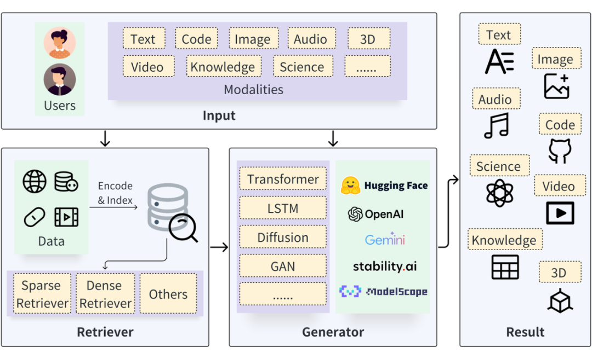
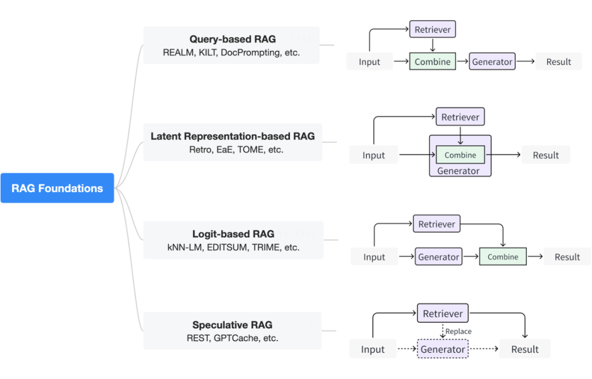
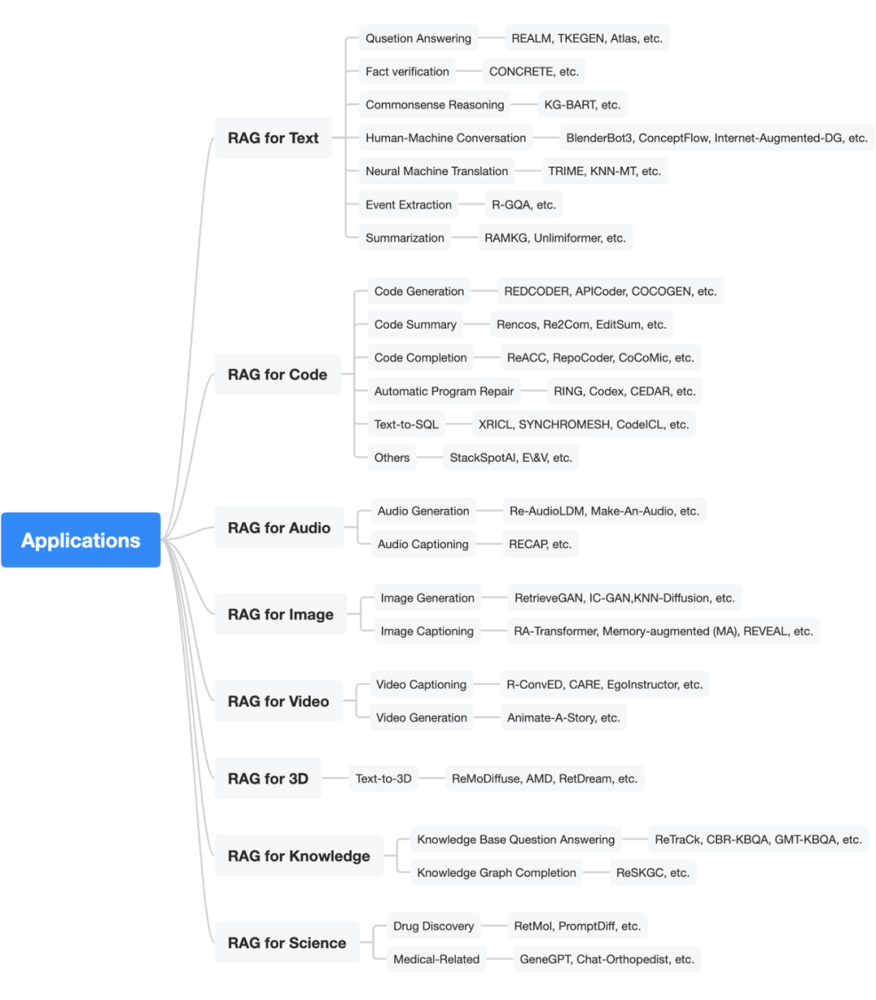

# 1. 简介

来自北京大学崔斌教授带领的数据与智能实验室（PKU-DAIR）系统调研现有 RAG 技术，
覆盖了近 300 篇相关论文，
发布综述（Retrieval-Augmented Generation for AI-Generated Content: A Survey）

文章链接：
https://arxiv.org/pdf/2402.19473.pdf

GitHub链接：
https://github.com/hymie122/RAG-Survey

当前问题：难以更新维护知识、不易掌握长尾知识、以及泄露私人训练数据的风险。

为了应对这些问题，检索增强生成技术（RAG）应运而生。它运用信息检索
（Information Retrieval, IR），在庞杂的外部数据中精准地找到相关的现有信息。
这些外部存储的数据便于修改，能够涵盖更广泛的长尾知识，同时还可以支持敏感数据编码。
此外，在特定场景下，RAG 还能为长文本提供支持，降低模型成本并提高响应速度。

如上图所示，一个典型的 RAG 流程包括以下步骤：首先，面对一个输入查询，
检索器会定位并提取相关的数据源。接着，这些检索到的结果将与生成器相互作用，
从而提升生成内容的质量和相关性。检索到的信息可以通过多种方式与生成过程互动，
这些具体的互动机制将在后续部分详细阐述。

# 2. 原理

## 2.1 基础方法

1. 基于查询的 RAG 方法：该方法也称为提示扩充。它将用户的查询与检索过程中提取的内容直接集成到生成模型输入的初始阶段。
   这种范式是 RAG 应用程序中最广泛采用的方法。

   一旦检索到相关信息，它们的内容就会与原始用户查询合并，以创建一个复合输入序列。该增强序列随后被送到生成模型中以生成响应。
   对于常见的基于大型语言模型（LLM）的文本生成任务而言，该方法实际上根据检索到的内容构建了输入的提示词（prompt），
   可以直接与提示词工程、少样本学习相结合。

2. 基于隐空间表达的 RAG 方法：在该方法中，检索器得到的内容将与生成模型在内部以隐空间表达（latent representation）
   的方式进行交互，这种边生成边交互的方式可以有效的提升生成模型的理解能力以及最终生成内容的质量。
   这里常见的交互方法包括简单的拼接以及设计注意力机制等等。

3. 基于概率表示的 RAG 方法：在采用概率表示（logit）的 RAG 系统中，生成模型在解码阶段会利用概率方法来融合检索到的信息。
   通常情况下，模型会对检索结果的概率分布进行求和或融合，以此计算出逐步生成文本的概率。这种方法允许模型在生成响应时，
   权衡不同检索信息的相关性和可信度。

4. 投机 RAG 方法：投机 RAG 方法是利用检索过程替代部分或全部的生成过程。当检索器的成本低于生成器的生成成本时，
   这种方法具有很大的应用潜力。例如，在投机推理中，可以使用检索方式替代小型模型的生成，
   然后将用户查询和检索到的内容一起送入大型模型进行验证。此外，在使用类似 ChatGPT 
   接口作为生成器的场景下，调用次数越多意味着成本越高，因此可以搜索过往的相同或极度相似的问题来直接得到回答。

## 2.2 RAG 提升方法

RAG提升方法分类

很多工作使用了一系列提升方法来提高基本 RAG 系统的效果。我们根据提升方法的目标将现有方法分为 5 类：
对输入的提升、对检索过程的提升、对生成过程的提升、对结果的提升、以及对整个 RAG 流程的优化。

1. 输入提升：输入指的是用户的查询，该查询最初被输入到检索器中。输入的质量显著影响检索阶段的最终结果，
   因此对输入优化变得至关重要。在这里，我们将介绍两种方法：查询改写和数据增强。

   - 查询改写（Query Transformation）可以通过修改输入查询来提高检索结果。
   - 数据增强（Data Augmentation） 
     是指在检索之前提前对数据进行改进，如去除无关信息、消除歧义、更新过时文档、合成新数据等，可以有效提高最终 RAG 系统的性能。

2. 检索器提升：在 RAG 系统中，检索过程对结果影响很大。一般来说，内容质量越好，就越容易激发 LLM 
   的上下文学习能力（in-context learning）以及其他生成模型的能力；内容质量越差，就越有可能导致模型幻觉。

   - 递归检索（Recursive Retrieve）是在检索之前拆分查询，并执行多次搜索以检索更多、更高质量的内容的过程。 
   - 块优化（Chunk Optimization）技术是指调整块的大小以获得更好的检索结果。
   - 检索器微调（Finetune Retriever）是对检索器的优化，一般是对嵌入模型能力的提升。检索器的能力越强，
     就可以为后续生成器提供更多有用的信息，从而提高 RAG 系统的有效性。
     一个好的嵌入模型可以使语义相似的内容在向量空间中更紧密地结合在一起；此外，
     对于已经具有良好表达能力的嵌入模型，我们仍然可以使用高质量的领域数据或任务相关数据对其进行微调，以提高其在特定领域或任务中的性能。
   - 混合检索（Hybrid Retrieve）是指同时使用多种类型的检索器，如同时使用统计词频的方式和计算向量相似性的方式来得到检索结果。
   - 重排序（Re-ranking）技术是指对检索到的内容进行重新排序，以实现更大的多样性和更好的结果。
   - 元数据过滤（Meta-data Filtering）则是处理检索到的文档的另一种方法，
     它使用元数据（如时间、目的等）来对检索回的文件进行过滤筛选以获得更合适的内容。

3. 生成器提升：在 RAG 系统中，生成器的质量通常决定最终输出结果的质量。在这里，我们将介绍如下一些提升生成器能力的技术。

   - 提示词工程（Prompt Engineering）是一种专注于提高 LLM 输出质量的技术，其中包括提示词压缩、
     回退提示、主动提示、思维链提示等等，以上这些同时也都适用于使用 LLM 生成器的 RAG 系统中。

   - 解码过程控制、调整（Decoding Tuning）是指在生成器处理过程中添加额外的控制，
     可以通过调整超参数来实现更大的多样性或者以某种形式限制输出词汇表等等。

   - 生成器微调（Finetune Generator）可以使生成模型具有更精确的领域知识或更好地与检索器匹配的能力。

4. 结果提升：在许多情况下，RAG 的最终结果可能无法达到预期效果，一些结果提升方法可以帮助缓解这一问题。

   结果改写（Rewrite Output）是在生成结果的基础上，使用另一个生成模型作为编辑器、改写器，以使生成结果更好的符合生成目标或者结果的规则。

5. RAG 流程提升：我们将对整个 RAG 流程上的优化分为如下两大类：自适应检索和迭代 RAG。

   自适应检索（Adaptive Retrieval）是基于一个观察：很多 RAG 的研究和实践表明，
   检索并不总是有利于最终生成的结果。当模型本身的参数化知识足以回答相关问题时，过度检索会造成资源浪费，
   并可能增加模型的混乱。因此，一些工作提出了基于规则和基于模型的自适应检索方法。

   基于规则等方法指的是通过判断某些与模型生成高度相关的指标来确定是否进行搜索，具体而言，
   这个变量可以是模型生成过程中当前 token 的生成概率，也可以是模型的困惑度（PPL）等等。
   基于模型的方法则指的是借助模型能力来判断是否进行搜索，这里的模型可以是生成模型本身也可以是借助外部模型。

   迭代 RAG（Iterative RAG）则指的是迭代的进行检索和生成。生成器的当前轮次输出可以在一定程度上反映其仍然缺乏的知识，
   并且检索器可以检索缺失的信息作为下一轮的上下文信息，这有助于提高下一轮生成内容的质量。如此循环迭代，直到生成内容达到标准。

# 3. RAG应用

RAG在多模态，多任务中的应用分类

如上图所示，我们在文中分别介绍了 RAG 在文本、代码、音频、图像、视频、3D，结构化知识、
以及 AI4S 等多个不同模态中不同具体任务上的具体应用，并对每类应用中的方法进行了分析和解读。更多详细内容，请参考原论文。

# 4. 基准测试

RAG 的主要评判标准包括忠实性、答案相关性和上下文相关性。忠实性衡量从检索内容中推断正确答案的能力；
答案相关性评估生成结果是否解决了问题；上下文相关性判断检索内容是否包含足够知识回答查询，同时减少无关信息。

此外，还有其他评判指标，如噪声稳健性、拒绝回答能力、信息整合能力和反事实稳健性。噪声稳健性评估从噪声文档中提取信息的能力；
拒绝回答能力测量在内容不足时是否拒绝响应查询；信息整合能力评估通过整合多个检索内容获取知识并响应的能力；
反事实稳健性衡量识别检索内容中反事实错误的能力。

# 5. 讨论

1. 局限性
 
   尽管 RAG 在各种应用中被广泛采用，但在有效性和效率方面仍存在一些局限性。

   检索结果中的噪声：信息检索系统在将信息编码为向量时不可避免地会遭受信息丢失。同时，近似最近邻搜索（ANN）只能提供近似匹配而非精确匹配，导致检索结果中含有一定程度的噪声，如不相关或误导性信息，这可能对 RAG 系统的输出质量产生负面影响。

   虽然直觉上提高检索准确性似乎有利于提升 RAG 的效果，但最新研究出人意料地发现，带有噪声的检索结果有时反而能增强生成内容的质量。这可能是因为检索结果的多样性在某些情况下对于生成过程是有益的。因此，噪声对检索结果的具体影响仍然是一个开放的问题，这也引发了关于如何选择合适的检索度量和如何优化检索器与生成器之间交互的讨论。未来的研究有望为这些问题提供更清晰的答案。

   额外开销：尽管检索在某些情况下能够降低文本生成的成本，但将检索与生成结合使用有时会引入显著的额外开销。鉴于 RAG 的主要目的是增强现有生成模型的能力，引入额外的检索和交互步骤可能会导致处理延迟。特别是当结合使用更为复杂的方法，如递归检索或迭代 RAG 时，这些开销会更加突出。

   此外，随着检索规模的扩大，数据存储和访问的复杂性也会增加。在目前的技术实现中，RAG 系统需要在成本和性能之间做出权衡。未来，我们期待进一步的系统优化来降低这些额外开销。

   检索与生成之间的复杂交互：为了实现检索和生成组件之间的无缝集成，研究员和工程师需要精心设计和优化。鉴于检索器和生成器可能有不同的目标，并且它们可能不在同一潜在空间中操作，协调这两个组件的交互是一项挑战。

   正如之前提到的，研究人员已经开发了多种 RAG 的基础方法，这些方法或是将检索和生成过程分离，或是在中间阶段进行集成。尽管分离方法更具模块化特性，但集成方法可能从联合训练中获益。目前，不同互动方式在不同应用场景下的比较研究还不够充分。

   此外，RAG 系统的提升也面临挑战，包括度量选择和超参数调整等方面的相互作用尚未被充分研究。因此，为了最大化 RAG 系统的潜力，有必要在算法设计和系统部署方面进行进一步的完善。

   长上下文生成的挑战：早期 RAG 系统面临的一个主要挑战是生成器的上下文长度限制，这限制了它们能够处理的提示词的数量和长度。尽管随着研究进展，如提示词压缩技术和系统优化对长上下文的支持，这个问题已经在一定程度上得到缓解，但这些解决方案往往需要在准确性和成本之间做出一些折衷。

   近来，有一种观点提出，长上下文模型如 Gemini 1.5 可能会取代 RAG。然而，这种看法忽视了 RAG 在处理动态信息，尤其是最新和长尾知识方面的灵活性优势。我们认为，未来的 RAG 系统将利用长上下文生成的能力，以提升最终性能，而不是被新模型所取代。

2. 未来潜在的研究方向 

   尝试探索更多关于 RAG 基础方法、提升方法、和应用的研究：未来的研究方向将关注开发更先进的方法来提升和应用 RAG。由于检索器和生成器的优化目标不同，实际的增强过程对生成结果有很大影响。通过研究更先进的基础方法和提升方法，RAG 的潜力有望被充分挖掘和利用。

   更加高效的运行、部署 RAG 系统：目前已有几种基于查询的针对 LLM 的 RAG 部署解决方案，如 LangChain 和 LLAMA-Index。但其他类型的 RAG 和生成任务，目前尚缺乏现成的解决方案。考虑到检索带来的额外开销，以及检索器和生成器复杂性的不断增加，实现高效运行、部署 RAG 仍是一个挑战，需要专门的系统优化。

   更好的发挥 RAG 系统结合长尾和实时知识的能力：RAG 的一个关键目标是利用实时和长尾知识，但如何更新和扩展知识库尚未得到充分研究。许多现有研究仅将生成器的训练数据作为检索源，忽视了检索信息源可以更加灵活动态的优势。

   因此，一个有前景的研究方向使设计一个能够不断更新知识或使用灵活知识源的 RAG 系统，并进行相应的系统优化。鉴于 RAG 能够利用长尾知识，我们期待它能够整合个性化信息和功能，以更好地适应当今的网络服务。

   将 RAG 技术与其他先进 AIGC 技术结合使用：RAG 技术与旨在提高 AIGC 有效性的其他技术（如微调、强化学习、思想链、基于 Agent 的生成和其他优化方法）是互补的。目前将 RAG 与这些技术结合的尝试还处于初期阶段，我们期待未来有更多研究来探索算法设计并最大化这些技术的潜力。

# 参考

[1] 最新RAG综述来了！北京大学发布AIGC的检索增强技术综述， https://mp.weixin.qq.com/s/o8oTN06UsQSlb5BNyJH23w