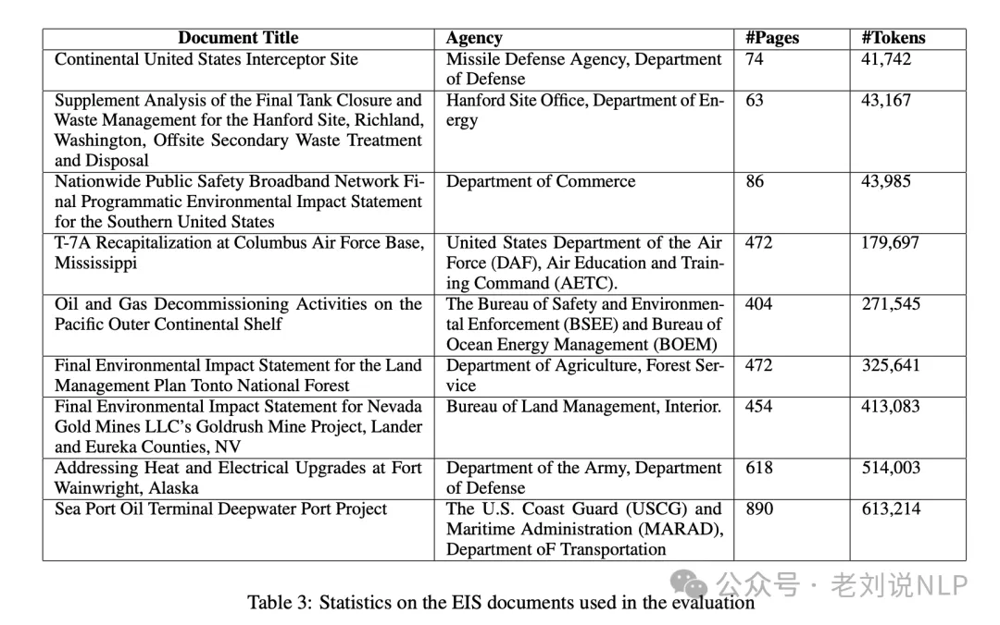
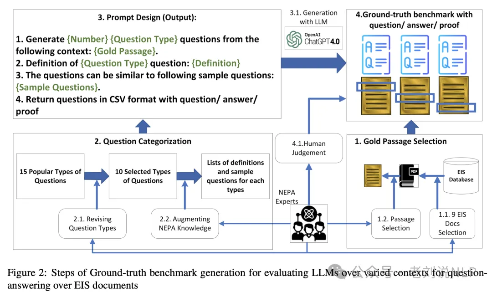
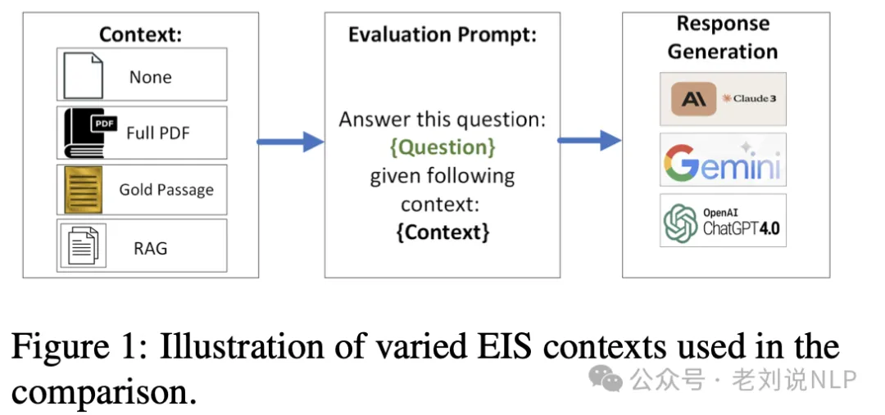
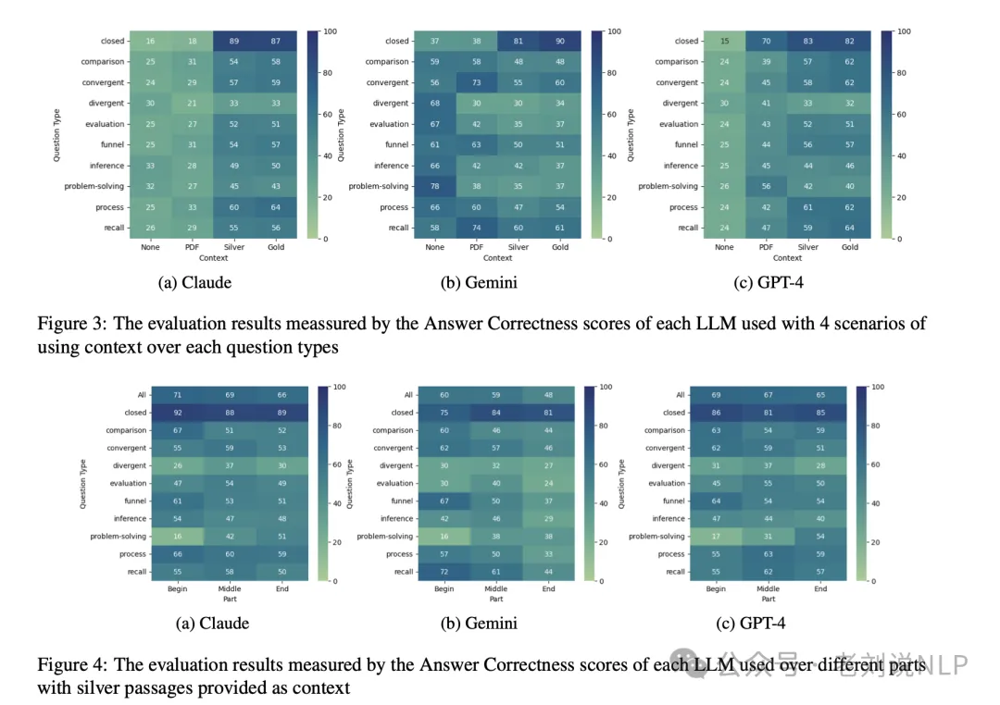

# 1. 资源

《RAG vs. Long Context: Examining Frontier Large Language Models for Environmental Review Document Comprehension》(https://arxiv.org/pdf/2407.07321)

在研究目的上，其构建了一个名为NEPAQuAD1.0的基准测试，用以评估三款前沿LLMs（Claude Sonnet、Gemini和GPT-4）在回答源自NEPA文件的问题时的性能。

# 2. 方法

在研究方法上，通过半监督方法使用GPT-4生成问题和答案，创建了包含问题、答案和证明（即与答案直接相关的文本）的三元组基准。选择了9个代表性的EIS文档。

并从中提取了重要的段落作为评估的上下文，并设计了10种不同类型的问题，并使用GPT-4根据选定的上下文生成问题和答案对。

1）封闭问题（Closed questions）：这类问题通常有两种可能的答案，即“是”或“否”或者“真”或“假”。

示例：Are there any federally recognized Tribes in a 50-mile radius of [PROJECT]?

示例：在[项目]方圆50英里内是否有任何联邦认可的部落？

2）比较问题（Comparison questions）：比较问题是较高阶的问题，要求听众比较两个事物，如对象、人、观点、故事或理论。

示例：Which Tribes were consulted in [PROJECT 1] and not [PROJECT 2] and vice-versa?

示例：在[项目1]和[项目2]中，哪些部落被咨询了，而另一个项目没有？反之亦然？

3）收敛问题（Convergent questions）：收敛问题旨在帮助找到问题解决方案，或对问题给出单一回应。

示例：Which other species of concern could logically be within the 50-mile radius around the [PROJECT]?

示例：在[项目]方圆50英里内，可能还有哪些其他值得关注的物种？

4）发散问题（Divergent questions）：发散问题没有正确或错误的答案，而是鼓励开放性讨论。虽然它们与开放问题类似，但发散问题的不同之处在于它们邀请听众分享意见，尤其是与未来可能性相关的意见。

示例：What considerations should the [AGENCY] addressed in the document but didn’t?

示例：[机构]在文件中应该考虑但未考虑哪些问题？

5）评估问题（Evaluation questions）：评估问题有时被称为关键评估问题（KEQs），是用于指导评估的高阶问题。好的评估问题将深入探讨你想了解的关于你的项目、政策或服务的核心内容。

示例：Based on NEPA evaluations done in the vicinity of [PROJECT], does the conclusion of the Historical and Cultural resources section appropriately weigh the concerns of Tribal leaders?

示例：基于在[项目]附近进行的NEPA评估，历史和文化资源部分的结论是否适当地权衡了部落领袖的关切？

6）漏斗问题（Funnel questions）：漏斗问题总是一系列问题。它们的序列模仿了漏斗结构，从开放性问题开始，然后过渡到封闭问题。

示例：Which federally recognized Tribes are in a 50-mile radius of [PROJECT]? Which Tribes participated in this EIS? What were the concerns of participating Tribes? What mitigations were made?

示例：哪些联邦认可的部落位于[项目]方圆50英里内？哪些部落参与了这个EIS？参与部落的关注点是什么？采取了哪些缓解措施？

7）推理问题（Inference questions）：推理问题要求学习者使用归纳或演绎推理来排除回答或批判性地评估一个陈述。

示例：If the federally recognized [TRIBE] has land in the vicinity of [PROJECT 1] like it does in the vicinity of [PROJECT 2], what concerns might [TRIBE] have with [PROJECT 1]?

示例：如果联邦认可的[部落]在[项目1]附近拥有土地，就像它在[项目2]附近一样，那么[部落]对[项目1]可能有哪些关切？

8）解决问题（Problem-solving questions）：解决问题向学生呈现一个场景或问题，并要求他们发展出一个解决方案。

示例：Given the location of the [PROJECT], create a list of aquatic species likely present in a 50-mile radius.

示例：鉴于[项目]的位置，列出可能在方圆50英里内出现的水生物种列表。

9）过程问题（Process questions）：过程问题允许说话者更详细地评估听众的知识。

示例：How does this document define the NEPA process for consultation with Tribes?

示例：本文件如何定义与部落协商的NEPA流程？

10）回忆问题（Recall questions）：回忆问题要求听众回忆一个具体的事实。

示例：What references did [AGENCY] use in evaluating the effect of the applicant’s proposed action on [SPECIES]?

示例：[机构]在评估申请人提出的行动对[物种]的影响时使用了哪些参考文献？

# 3. 实验

其试验设置也很有意思，实验涉及四种不同的上下文设置：无上下文、完整PDF文档作为上下文、RAG模型检索的相关段落（银段落）以及实际生成问题的上下文（段落）。

其中：

无上下文(None)：直接向模型提问，不提供任何额外的上下文信息，这块直接用的是llm裸模型；

完整PDF作为上下文(Complete PDF)：除了问题，还提供了从问题中提取上下文的PDF文档。模型需要从大量文本中找出正确答案；

RAG上下文(带噪声段落，Silver Passages)：在RAG模型中，输入问题后，会从EIS文档中检索相关的上下文段落。使用BGE嵌入模型编码问题和检索到的段落，并通过余弦相似度评分来评估问题和上下文的相似度；

真实段落作为上下文(Gold Passage)：在这种配置中，将生成问题的实际上下文与问题内容一起包含在提示中。这种设置模拟了如果能够以非常高的准确度提取相关段落，LLMs的表现如何。

在评估指标方面，使用RAGAs分数来评估答案的正确性，该分数结合了事实上的正确性和语义上的正确性。具体地，使用BGE嵌入模型来计算语义正确性，而事实正确性则通过比较生成答案和真实答案之间的事实重叠来量化。

3、试验结论

在研究结论上，结果表明：

RAG增强的模型在答案准确性方面显著优于仅提供长上下文的模型。RAG模型在处理领域特定问题时表现出显著的性能优势，与仅依赖零样本知识或完整PDF作为上下文的模型相比，RAG模型的表现更佳。

LLMs在回答封闭问题时表现更好，而在回答发散性和解决问题类型的问题时表现较差。

此外，其提到一个观点，很赞同，对于领域特定LLMs的评估，即：评估特定领域的LLMs需要使用无监督或半监督方法来生成评估基准。尽管研究者的方法满足了这个领域自动化方法的需求，但它仍然面临挑战，特别是选定的问题类型可能无法代表其他研究领域。

# 参考

[1] RAG vs Long Context赏析：简看其任务设计思路、试验设定及对比结论，https://mp.weixin.qq.com/s/il0U1FIaCcBNV65I-fMbDg