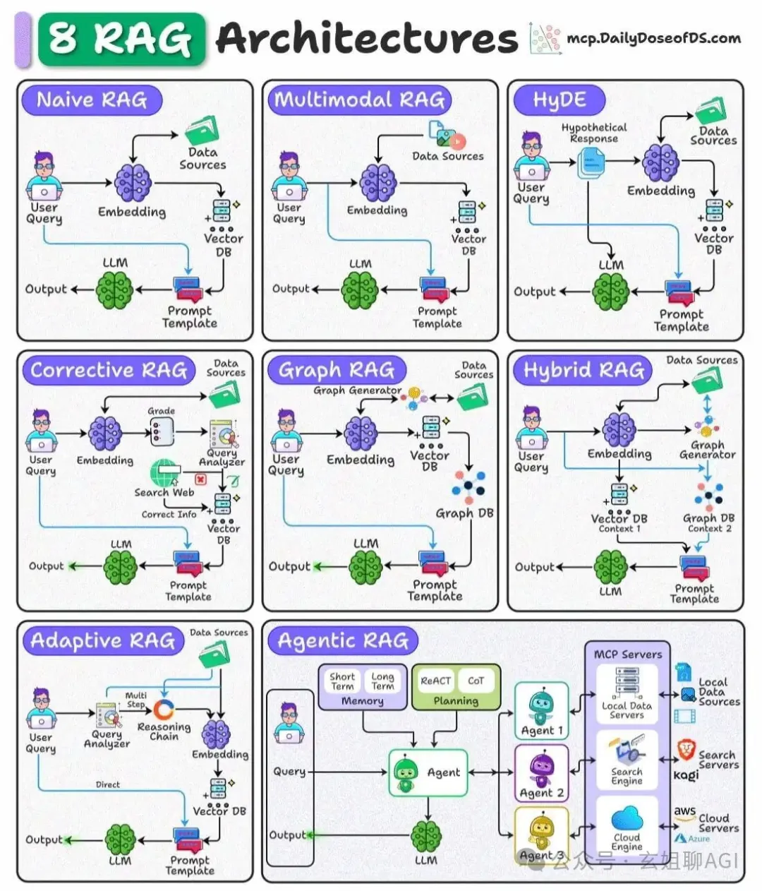

1）简单 RAG 架构设计『Naive RAG』

根据查询向量与存储向量之间的向量相似度检索文档。

最适合简单的、基于事实的查询，直接语义匹配就足够了。

2）多模态 RAG 架构设计『Multimodal RAG』

通过跨模态嵌入和检索来处理多种数据类型（文本、图像、音频等）。

非常适合跨模态检索任务，比如：用文本查询来获取既有文本又有图像上下文的答案。

3）HyDE 假设文档嵌入架构设计『Hypothetical Document Embeddings』

查询与文档在语义上并不相似。

这种技术会在检索之前从查询中生成一个假设的答案文档。

利用这个生成文档的嵌入来找到更相关的实际文档。

4）校正型 RAG 架构设计『Corrective RAG』

通过与可信来源（比如：网络搜索）进行比较来验证检索结果。

确保信息是最新的并且准确的，在传递给大语言模型之前会过滤或纠正检索到的内容。

5）图 RAG 架构设计『Graph RAG』

将检索到的内容转换为知识图谱，以捕捉关系和实体。

通过为大语言模型提供结构化的上下文以及原始文本，增强推理能力。

6）混合 RAG 架构设计『Hybrid RAG』

在一个流程中结合密集向量检索和基于图的检索。

当任务需要同时使用非结构化文本和结构化关系数据以获得更丰富的答案时非常有用。

7）自适应 RAG 架构设计『Adaptive RAG』

动态决定查询是需要简单的直接检索，还是需要多步推理链。

将复杂的查询分解为更小的子查询，以提高覆盖范围和准确性。

8）智能体型 RAG 架构设计『Agentic RAG』

使用具有规划、推理（ReAct、CoT）和记忆能力的 AI 智能体来协调从多个来源的检索。

最适合需要使用工具、外部 API 或结合多种 RAG 技术的复杂工作流程。

# 参考

[1] 图解8种 RAG 架构设计, https://mp.weixin.qq.com/s/XuIncXmGxCMwdjVGnrtVUg?scene=1