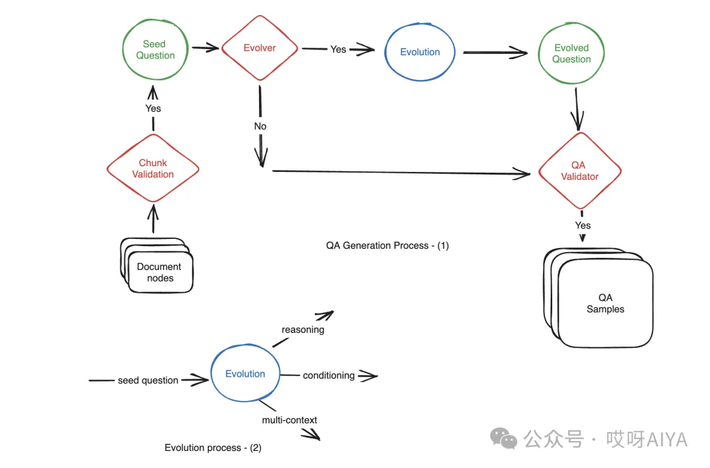
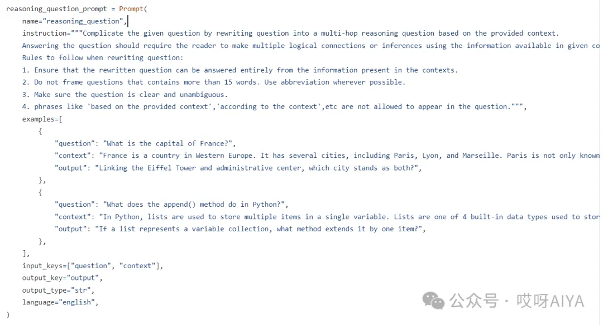
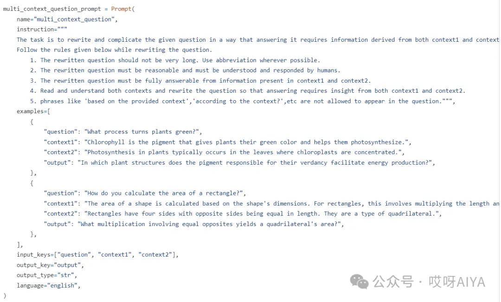
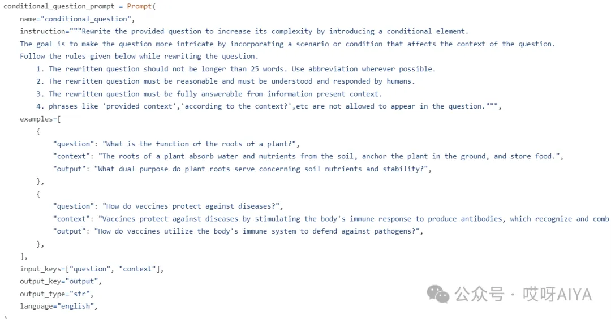
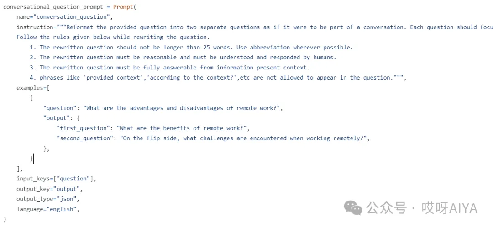
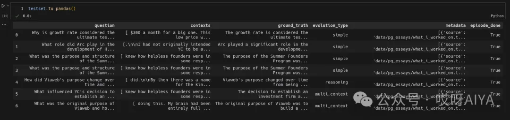
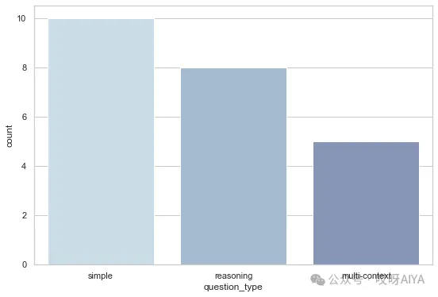

# 1. 资源

```text
https://github.com/explodinggradients/ragas/blob/main/src/ragas/testset/prompts.py
```

# 2. 方法

从文档中手动创建数百个 QA（问题-上下文-答案）样本可能非常耗时且劳动密集。此外，人工生成的问题可能难以达到全面评估所需的复杂程度，最终影响评估的质量。通过使用合成数据生成，开发人员在数据聚合过程中的时间可以减少 90%。

理想的数据集应涵盖生产中遇到的各种类型的问题，包括不同难度级别的问题。默认情况下，LLM 不擅长创建多样化的样本，因为它倾向于遵循共同的路径。今天我们介绍Ragas中创建数据的方法，Ragas 采用了一种新颖的方法来生成数据，通过采用进化生成范式实现了这一点，其中具有不同特征的问题（例如推理、条件、多上下文等）是从提供的文档集中系统地制作出来的。这种方法可确保全面覆盖管道中各个组件的性能，从而实现更强大的训练和评估过程。



方法介绍

大型语言模型 (LLM) 能够有效地将简单问题转化为更复杂的问题。为了从提供的文档中生成中等难度到困难难度的样本，我们采用了以下方法：

- 推理：重写问题，以增强推理的需要，从而有效地回答问题。
- 增加条件：修改问题以引入条件元素，这增加了问题的复杂性。
- 多上下文：以需要来自多个相关部分或块的信息来形成答案的方式重新措辞问题。
- 对话式：部分问题经过演化，可以转化为对话式样本。这些问题模拟了聊天式的问答互动，模仿了聊天式问答流程。

实现Prompt展示

## 2.1 推理

```text
根据提供的上下文将问题重写为多跳推理问题，从而使给定问题复杂化。
回答这个问题应该要求读者利用给定上下文中的信息做出多个逻辑联系或推断。
改写题目时要遵循的规则:
1. 确保改写后的问题可以完全根据上下文提供的信息来回答。
2. 不要提出超过15个单词的问题。尽可能使用缩写。
3. 确保你的问题清晰明了。
4. “基于所提供的上下文”、“根据上下文”等短语不允许出现在问题中。
```



## 2.2 多上下文

```text
任务是重写并使给定的问题复杂化，使回答问题需要从context1和context2中获得信息。
按照下面给出的规则重写问题。
1. 改写后的问题不应该很长。尽可能使用缩写。
2. 改写后的问题必须是合理的，必须被人类理解和回应。
3. 改写后的问题必须完全符合上下文1和上下文2中的信息。
4. 阅读并理解上下文中的内容，然后重写问题，这样回答问题时就需要同时了解上下文1和上下文2。
5. 像“基于提供的上下文”、“根据上下文?”等不允许出现在问题中。
```



## 2.3 条件prompt

```text
通过引入条件元素重写提供的问题以增加其复杂性。
目标是通过加入影响问题上下文的场景或条件，使问题更加复杂。
按照下面给出的规则重写问题。
1. 改写后的问题不应超过25个单词。尽可能使用缩写。
2. 改写后的问题必须是合理的，必须被人类理解和回应。
3. 改写后的问题必须能从目前的信息中完全回答。
```



## 2.4 对话式

```text

将提供的问题重新格式化为两个单独的问题，就像它是对话的一部分一样。每个问题都应该集中在与原问题相关的一个特定方面或子主题上。
按照下面给出的规则重写问题。
1. 改写后的问题不应超过25个单词。尽可能使用缩写。
2. 改写后的问题必须是合理的，必须被人类理解和回应。
3. 改写后的问题必须能从目前的信息中完全回答。
4. 像“提供上下文”、“根据上下文?”等不允许出现在问题中。
```



详细可参考：

```text
https://github.com/explodinggradients/ragas/blob/main/src/ragas/testset/prompts.py
```

# 3. 代码实现

```python
from ragas.testset.generator import TestsetGenerator
from ragas.testset.evolutions import simple, reasoning, multi_context
from langchain_openai import ChatOpenAI, OpenAIEmbeddings

# documents = load your documents

# generator with openai models
generator_llm = ChatOpenAI(model="gpt-3.5-turbo-16k")
critic_llm = ChatOpenAI(model="gpt-4")
embeddings = OpenAIEmbeddings()

generator = TestsetGenerator.from_langchain(
    generator_llm,
    critic_llm,
    embeddings
)

# Change resulting question type distribution
distributions = {
    simple: 0.5,
    multi_context: 0.4,
    reasoning: 0.1
}

# use generator.generate_with_llamaindex_docs if you use llama-index as document loader
testset = generator.generate_with_langchain_docs(documents, 10, distributions) 
testset.to_pandas()
```

# 4. 生成的问题分析

自定义数据分布



分析创建的数据集中不同问题类型的频率



# 参考

[1] RAG数据集自动构造探索, 附PROMPT，https://mp.weixin.qq.com/s/jba7np1XjG3nF27rg08qGg
