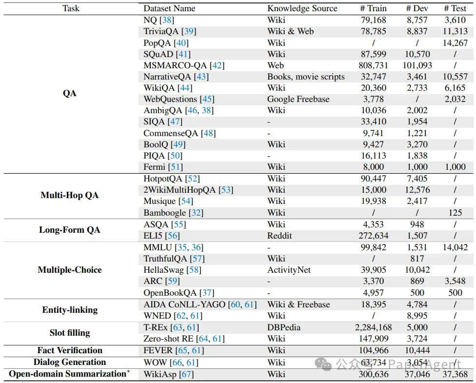

1. FinanceBench SEC 财务文件数据集

2. FlashRAG汇总各类主流训练和评测集
    - Github (282 stars): https://github.com/RUC-NLPIR/FlashRAG
    - 论文：2024.05.22，Renmin University of China
      - FlashRAG: A Modular Toolkit for Efficient Retrieval-Augmented Generation Research
      - https://arxiv.org/abs/2405.13576
    - FlashRAG 是一个用于再现和开发检索增强生成 (RAG) 研究的 Python 工具包。工具包包括 32 个预处理的基准 RAG 数据集和 12 个最先进的 RAG 算法。
    - 32个数据集总结。FlashRAG目前包含了不同任务的多种数据集。每个数据集的样本大小以及答案的知识来源被列出作为参考。"-"表示知识来源是常识。星号(∗)表示这个数据集的任务已经被修改以适应RAG场景。
    - 

# 参考

[1] FlashRAG：5大组件、12种RAG技术、32个数据集的开源框架，比LangChain轻量！，https://mp.weixin.qq.com/s/rrq0fnu77J6gVvv5gHO4YA