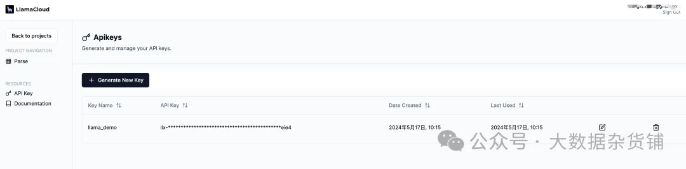
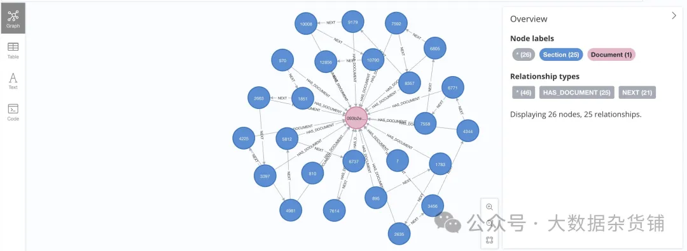
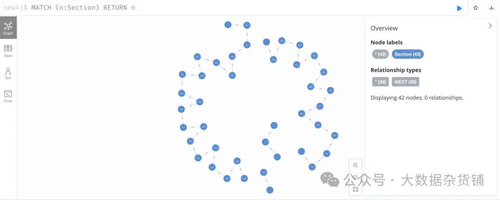

# 1. 简介

LlamaParse 是由 LlamaIndex 创建的一项技术，专门用于高效地解析和表示PDF文件，以便通过 LlamaIndex 框架进行高效检索和上下文增强，特别适用于复杂的PDF文档。它基于RAG（Rule-based Approach with Grammar）技术，能够准确地提取文本、图像、表格等元素，同时保持良好的性能。这项技术的设计初衷是为了处理那些包含嵌入式对象（如表格和图形）的复杂文档，这类文档的处理在以往往往是个挑战。

LlamaParse 默认将 PDF 转换为 Markdown，文档的内容可以准确的解析出来。但LlamaCloud 官网因为不能设置解析文档的语言，默认只能识别英文的文档，中文的解析识别需要在 Python 代码中指定。

# 2. 示例流程

设置环境：逐步说明如何设置 Python 环境，包括安装必要的库和工具，例如 LlamaParse 和 Neo4j 数据库驱动程序。

PDF 文档处理：演示如何使用 LlamaParse 读取 PDF 文档，提取相关信息（例如文本、表格和图像），并将这些信息转换为适合数据库插入的结构化格式。

文档图模型：设计有效图模型的指南，该模型表示从 PDF 文档中提取的关系和实体，确保查询和分析的最佳结构。

在 Neo4j 中存储提取的数据：详细的代码示例展示了如何从 Python 连接到 Neo4j 数据库，根据提取的数据创建节点和关系，以及执行 Cypher 查询来填充数据库。

生成和存储文本嵌入：使用过去创建的程序通过 OpenAI API 调用生成文本嵌入，并将嵌入存储为 Neo4j 中的向量。

查询和分析数据：用于检索和分析存储数据的 Cypher 查询示例，说明 Neo4j 如何发现隐藏在 PDF 内容中的见解和关系。

结论：有关处理 PDF、设计图形模式和优化 Neo4j 查询的最佳实践的提示，以及针对在此过程中遇到的潜在问题的常见故障排除建议。

# 2. 环境设置

```bash
pip install -qU llama-index llama-index-core llama-index-embeddings-mistralai llama-parse neo4j
```

LlamaParse API 密钥免费。



配置密钥

```python
# llama-parse is async-first, running the async code in a notebook requires the use of nest_asyncio
import nest_asyncio
nest_asyncio.apply()

import os
# API access to llama-cloud
os.environ["LLAMA_CLOUD_API_KEY"] = "llx-Pd9FqzqbITfp7KXpB0YHWngqXK4GWZvB5BSAf9IoiNDBeie4"

# Using OpenAI API for embeddings/llms
#os.environ["OPENAI_API_KEY"] = "sk-OK5mvOSKVeRokboDB1eHrIuifAcUc6wAqU82ZgRVJMAg4tJ3"
os.environ["MISTRAL_API_KEY"] = "q9ebyLLL3KoZTLAeb8I81doRLZK5SXNO"
```

```bash
pip install -qU llama-index-llms-mistralai llama-index-embeddings-mistralai
```

```python
from llama_index.llms.mistralai import MistralAI
from llama_index.embeddings.mistralai import MistralAIEmbedding
from llama_index.core import  VectorStoreIndex
from llama_index.core import Settings

EMBEDDING_MODEL  = "mistral-embed"
GENERATION_MODEL = "open-mistral-7b"

llm = MistralAI(model=GENERATION_MODEL)

Settings.llm = llm
```

# 3. 文档解析

- result_type 选项仅限于 "text" 和 "markdown" 。 这里我们选择 Markdown 格式输出，因为它将很好地保留结构化信息。
- num_workers 设置工作线程的数量。一般来说，我们可以根据需要解析的文件数量来设定工作线程的数量。 （最大值为 10 ）
  - 配置工作线程的数量：你可以根据需要解析的文件数量来设定工作线程的数量。这样做可以让你根据任务的规模来优化资源的使用和提高处理效率。
  - 根据文件数量设定：通常，你会希望设置的工作线程数量与你打算解析的文件数量相匹配。例如，如果你有5个文件需要解析，那么设置5个工作线程可能是合理的，这样可以确保每个文件都有一个专门的线程来处理。
  - 最大限制：LlamaParse对于工作线程的数量有一个最大限制，这里是设置为10。这意味着你最多可以同时设置10个工作线程来并行处理解析任务。这个限制可能是为了确保系统的稳定性和防止资源过度消耗。

```python
from llama_parse import LlamaParse
from llama_parse.base import ResultType, Language
pdf_file_name = './chinese_pdf.pdf'

parser= LlamaParse(
    result_type=ResultType.MD,
    language=Language.SIMPLIFIED_CHINESE,
    verbose=True,
    num_workers=1,
)

documents = parser.load_data(pdf_file_name)
```

Started parsing the file under job_id 2bd5a318-08f2-4b12-b9f3-424b8238bd96
执行以上代码，会启动一个PDF解析的异步任务。

解析完我们查看一下解析后的结果，这里分别输出文档中的两部分内容。从结果可以看到，质量还是比较高的。

```python
# Check loaded documents

print(f"Number of documents: {len(documents)}")

for doc in documents:
    print(doc.doc_id)
    print(doc.text[:500] + '...')
```

```python
# Parse the documents using MarkdownElementNodeParser

from llama_index.core.node_parser import MarkdownElementNodeParser

node_parser = MarkdownElementNodeParser(llm=llm, num_workers=8)

nodes = node_parser.get_nodes_from_documents(documents)
```

```python
# Convert nodes into objects

base_nodes, objects = node_parser.get_nodes_and_objects(nodes)
```

```python
import json


# Check parsed node objects 

print(f"Number of nodes: {len(base_nodes)}")
```

```python
TABLE_REF_SUFFIX = '_table_ref'
TABLE_ID_SUFFIX  = '_table'

# Check parsed objects 

print(f"Number of objects: {len(objects)}")

for node in objects: 
    print(f"id:{node.node_id}")
    print(f"hash:{node.hash}")
    print(f"parent:{node.parent_node}")
    print(f"prev:{node.prev_node}")
    print(f"next:{node.next_node}")

    # Object is a Table
    if node.node_id[-1 * len(TABLE_REF_SUFFIX):] == TABLE_REF_SUFFIX:

        if node.next_node is not None:
            next_node = node.next_node
        
            print(f"next_node metadata:{next_node.metadata}")
            print(f"next_next_node:{next_next_nod_id}")

            obj_metadata = json.loads(str(next_node.json()))

            print(str(obj_metadata))

            print(f"def:{obj_metadata['metadata']['table_df']}")
            print(f"summary:{obj_metadata['metadata']['table_summary']}")


    print(f"next:{node.next_node}")
    print(f"type:{node.get_type()}")
    print(f"class:{node.class_name()}")
    print(f"content:{node.get_content()[:200]}")
    print(f"metadata:{node.metadata}")
    print(f"extra:{node.extra_info}")
    
    node_json = json.loads(node.json())

    print(f"start_idx:{node_json.get('start_char_idx')}")
    print(f"end_idx:{node_json['end_char_idx']}")

    if 'table_summary' in node_json: 
        print(f"summary:{node_json['table_summary']}")

    print("=====================================")   
```

```text
Number of objects: 3
id:1ace071a-4177-4395-ae42-d520095421ff
hash:e593799944034ed3ff7d2361c0f597cd67f0ee6c43234151c7d80f84407d4c5f
parent:None
prev:node_id='9694e60e-6988-493b-89c3-2533ff1adcd2' node_type=<ObjectType.TEXT: '1'> metadata={} hash='898f4b8eb4de2dbfafa9062f479df61668c6a7604f2bea5b9937b70e234ba746'
next:node_id='9c71f897-f510-4b8c-a876-d0d8ab55e004' node_type=<ObjectType.TEXT: '1'> metadata={'table_df': "{'一、数据要素再认识': {0: '（一）国家战略全方位布局数据要素发展', 1: '（二）人工智能发展对数据供给提出更高要求', 2: '（三）数据要素概念聚焦于数据价值释放', 3: '二、资源：分类推进数据要素探索已成为共识', 4: '（一）不同类别数据资源面临不同关键问题', 5: '（二）授权运营促进公共数据供给提质增效', 6: '（三）会计入表推动企业数据价值“显性化”', 7: '（四）权益保护仍是个人数据开发利用主线', 8: '三、主体：企业政府双向发力推进可持续探索', 9: '（一）企业侧：数据管理与应用能力是前提', 10: '（二）政府侧：建立公平高效的机制是关键', 11: '四、市场：场内外结合推动数据资源最优配置', 12: '（一）数据流通存在多层次多样化形态', 13: '（二）场外交易活跃，场内交易多点突破', 14: '（三）多措并举破除数据流通障碍', 15: '五、技术：基于业务需求加速创新与体系重构', 16: '（一）数据技术随业务要求不断演进', 17: '（二）数据要素时代新技术不断涌现', 18: '（三）数据要素技术体系重构加速', 19: '六、趋势与展望', 20: '参考文献'}, '1': {0: 1, 1: 3, 2: 5, 3: 7, 4: 7, 5: 11, 6: 15, 7: 18, 8: 21, 9: 21, 10: 26, 11: 29, 12: 30, 13: 33, 14: 35, 15: 37, 16: 37, 17: 38, 18: 42, 19: 42, 20: 46}}", 'table_summary': 'Title: Data Element Development and Utilization in National Strategic Perspective\n\nSummary: This table discusses various aspects of data element development and utilization, including strategic layout, resource classification, subject involvement, market dynamics, technological advancements, and trends. It also highlights key issues in different categories of data resources, the role of authorization and operation in improving public data supply, the importance of data management and application capabilities for enterprises, the need for a fair and efficient mechanism on the government side, and the significance of equity protection in personal data development and utilization. The table concludes with a section on market and technological trends.\n\nTable ID: Not provided in the context.\n\nThe table should be kept as it provides valuable insights into the development and utilization of data elements from a national strategic perspective.,\nwith the following columns:\n'} hash='48055467b0febd41fcce52d02d72730f8ea97c7a7905749afb557b0dcecef7c2'
next:node_id='9c71f897-f510-4b8c-a876-d0d8ab55e004' node_type=<ObjectType.TEXT: '1'> metadata={'table_df': "{'一、数据要素再认识': {0: '（一）国家战略全方位布局数据要素发展', 1: '（二）人工智能发展对数据供给提出更高要求', 2: '（三）数据要素概念聚焦于数据价值释放', 3: '二、资源：分类推进数据要素探索已成为共识', 4: '（一）不同类别数据资源面临不同关键问题', 5: '（二）授权运营促进公共数据供给提质增效', 6: '（三）会计入表推动企业数据价值“显性化”', 7: '（四）权益保护仍是个人数据开发利用主线', 8: '三、主体：企业政府双向发力推进可持续探索', 9: '（一）企业侧：数据管理与应用能力是前提', 10: '（二）政府侧：建立公平高效的机制是关键', 11: '四、市场：场内外结合推动数据资源最优配置', 12: '（一）数据流通存在多层次多样化形态', 13: '（二）场外交易活跃，场内交易多点突破', 14: '（三）多措并举破除数据流通障碍', 15: '五、技术：基于业务需求加速创新与体系重构', 16: '（一）数据技术随业务要求不断演进', 17: '（二）数据要素时代新技术不断涌现', 18: '（三）数据要素技术体系重构加速', 19: '六、趋势与展望', 20: '参考文献'}, '1': {0: 1, 1: 3, 2: 5, 3: 7, 4: 7, 5: 11, 6: 15, 7: 18, 8: 21, 9: 21, 10: 26, 11: 29, 12: 30, 13: 33, 14: 35, 15: 37, 16: 37, 17: 38, 18: 42, 19: 42, 20: 46}}", 'table_summary': 'Title: Data Element Development and Utilization in National Strategic Perspective\n\nSummary: This table discusses various aspects of data element development and utilization, including strategic layout, resource classification, subject involvement, market dynamics, technological advancements, and trends. It also highlights key issues in different categories of data resources, the role of authorization and operation in improving public data supply, the importance of data management and application capabilities for enterprises, the need for a fair and efficient mechanism on the government side, and the significance of equity protection in personal data development and utilization. The table concludes with a section on market and technological trends.\n\nTable ID: Not provided in the context.\n\nThe table should be kept as it provides valuable insights into the development and utilization of data elements from a national strategic perspective.,\nwith the following columns:\n'} hash='48055467b0febd41fcce52d02d72730f8ea97c7a7905749afb557b0dcecef7c2'
type:3
class:IndexNode
content:Title: Data Element Development and Utilization in National Strategic Perspective

Summary: This table discusses various aspects of data element development and utilization, including strategic layout
metadata:{'col_schema': ''}
extra:{'col_schema': ''}
start_idx:816
end_idx:1319
=====================================
```

# 4. 解析文档的图模型

## 4.1 创建neo4j数据库


在本项目中，将使用类似的图模型。让我们从图数据库模式定义开始：

- 关键属性的唯一性约束
- 嵌入向量索引

```python
from neo4j import GraphDatabase

# Local Neo4j instance
NEO4J_URL = "bolt://localhost:7687"
# Remote Neo4j instance on AuraDB
#NEO4J_URL = "http://localhost:7474"
NEO4J_USER = "neo4j"
NEO4J_PASSWORD = "langchain"
NEO4J_DATABASE = "neo4j"

def initialiseNeo4jSchema():
    cypher_schema = [
        "CREATE CONSTRAINT sectionKey IF NOT EXISTS FOR (c:Section) REQUIRE (c.key) IS UNIQUE;",
        "CREATE CONSTRAINT chunkKey IF NOT EXISTS FOR (c:Chunk) REQUIRE (c.key) IS UNIQUE;",
        "CREATE CONSTRAINT documentKey IF NOT EXISTS FOR (c:Document) REQUIRE (c.url_hash) IS UNIQUE;",
        "CREATE VECTOR INDEX `chunkVectorIndex` IF NOT EXISTS FOR (e:Embedding) ON (e.value) OPTIONS { indexConfig: {`vector.dimensions`: 1536, `vector.similarity_function`: 'cosine'}};"
    ]

    driver = GraphDatabase.driver(NEO4J_URL, database=NEO4J_DATABASE, auth=(NEO4J_USER, NEO4J_PASSWORD))

    with driver.session() as session:
        for cypher in cypher_schema:
            session.run(cypher)
    driver.close()

    
# create constraints and indexes

initialiseNeo4jSchema()
```

## 4.2 在 Neo4j 中存储提取的数据

```python
driver = GraphDatabase.driver(NEO4J_URL, database=NEO4J_DATABASE, auth=(NEO4J_USER, NEO4J_PASSWORD))

# ================================================
# 1) Save documents

print("Start saving documents to Neo4j...")
i = 0
with driver.session() as session:
    for doc in documents:
        cypher = "MERGE (d:Document {url_hash: $doc_id}) ON CREATE SET d.url=$url;"
        session.run(cypher, doc_id=doc.doc_id, url=doc.doc_id)
        i = i + 1
    session.close()

print(f"{i} documents saved.")

# ================================================
# 2) Save nodes

print("Start saving nodes to Neo4j...")

i = 0
with driver.session() as session:
    for node in base_nodes: 

        # >>1 Create Section node
        cypher  = "MERGE (c:Section {key: $node_id})\n"
        cypher += " FOREACH (ignoreMe IN CASE WHEN c.type IS NULL THEN [1] ELSE [] END |\n"
        cypher += "     SET c.hash = $hash, c.text=$content, c.type=$type, c.class=$class_name, c.start_idx=$start_idx, c.end_idx=$end_idx )\n"
        cypher += " WITH c\n"
        cypher += " MATCH (d:Document {url_hash: $doc_id})\n"
        cypher += " MERGE (d)<-[:HAS_DOCUMENT]-(c);"

        node_json = json.loads(node.json())

        session.run(cypher, node_id=node.node_id, hash=node.hash, content=node.get_content(), type='TEXT', class_name=node.class_name()
                          , start_idx=node_json['start_char_idx'], end_idx=node_json['end_char_idx'], doc_id=node.ref_doc_id)

        # >>2 Link node using NEXT relationship

        if node.next_node is not None: # and node.next_node.node_id[-1*len(TABLE_REF_SUFFIX):] != TABLE_REF_SUFFIX:
            cypher  = "MATCH (c:Section {key: $node_id})\n"    # current node should exist
            cypher += "MERGE (p:Section {key: $next_id})\n"    # previous node may not exist
            cypher += "MERGE (p)<-[:NEXT]-(c);"

            session.run(cypher, node_id=node.node_id, next_id=node.next_node.node_id)

        if node.prev_node is not None:  # Because tables are in objects list, so we need to link from the opposite direction
            cypher  = "MATCH (c:Section {key: $node_id})\n"    # current node should exist
            cypher += "MERGE (p:Section {key: $prev_id})\n"    # previous node may not exist
            cypher += "MERGE (p)-[:NEXT]->(c);"

            if node.prev_node.node_id[-1 * len(TABLE_ID_SUFFIX):] == TABLE_ID_SUFFIX:
                prev_id = node.prev_node.node_id + '_ref'
            else:
                prev_id = node.prev_node.node_id

            session.run(cypher, node_id=node.node_id, prev_id=prev_id)

        i = i + 1
    session.close()

print(f"{i} nodes saved.")

# ================================================
# 3) Save objects

print("Start saving objects to Neo4j...")

i = 0
with driver.session() as session:
    for node in objects:               
        node_json = json.loads(node.json())

        # Object is a Table, then the ????_ref_table object is created as a Section, and the table object is Chunk
        if node.node_id[-1 * len(TABLE_REF_SUFFIX):] == TABLE_REF_SUFFIX:
            if node.next_node is not None:  # here is where actual table object is loaded
                next_node = node.next_node

                obj_metadata = json.loads(str(next_node.json()))

                cypher  = "MERGE (s:Section {key: $node_id})\n"
                cypher += "WITH s MERGE (c:Chunk {key: $table_id})\n"
                cypher += " FOREACH (ignoreMe IN CASE WHEN c.type IS NULL THEN [1] ELSE [] END |\n"
                cypher += "     SET c.hash = $hash, c.definition=$content, c.text=$table_summary, c.type=$type, c.start_idx=$start_idx, c.end_idx=$end_idx )\n"
                cypher += " WITH s, c\n"
                cypher += " MERGE (s) <-[:UNDER_SECTION]- (c)\n"
                cypher += " WITH s MATCH (d:Document {url_hash: $doc_id})\n"
                cypher += " MERGE (d)<-[:HAS_DOCUMENT]-(s);"

                session.run(cypher, node_id=node.node_id, hash=next_node.hash, content=obj_metadata['metadata']['table_df'], type='TABLE'
                                  , start_idx=node_json['start_char_idx'], end_idx=node_json['end_char_idx']
                                  , doc_id=node.ref_doc_id, table_summary=obj_metadata['metadata']['table_summary'], table_id=next_node.node_id)
                
            if node.prev_node is not None:
                cypher  = "MATCH (c:Section {key: $node_id})\n"    # current node should exist
                cypher += "MERGE (p:Section {key: $prev_id})\n"    # previous node may not exist
                cypher += "MERGE (p)-[:NEXT]->(c);"

                if node.prev_node.node_id[-1 * len(TABLE_ID_SUFFIX):] == TABLE_ID_SUFFIX:
                    prev_id = node.prev_node.node_id + '_ref'
                else:
                    prev_id = node.prev_node.node_id
                
                session.run(cypher, node_id=node.node_id, prev_id=prev_id)
                
        i = i + 1
    session.close()

# ================================================
# 4) Create Chunks for each Section object of type TEXT
# If there are changes to the content of TEXT section, the Section node needs to be recreated

print("Start creating chunks for each TEXT Section...")

with driver.session() as session:

    cypher  = "MATCH (s:Section) WHERE s.type='TEXT' \n"
    cypher += "WITH s CALL {\n"
    cypher += "WITH s WITH s, split(s.text, '\n') AS para\n"
    cypher += "WITH s, para, range(0, size(para)-1) AS iterator\n"
    cypher += "UNWIND iterator AS i WITH s, trim(para[i]) AS chunk, i WHERE size(chunk) > 0\n"
    cypher += "CREATE (c:Chunk {key: s.key + '_' + i}) SET c.type='TEXT', c.text = chunk, c.seq = i \n"
    cypher += "CREATE (s) <-[:UNDER_SECTION]-(c) } IN TRANSACTIONS OF 500 ROWS ;"
    
    session.run(cypher)
    
    session.close()


print(f"{i} objects saved.")

print("=================DONE====================")

driver.close()
```

```text
Start saving documents to Neo4j...
1 documents saved.
Start saving nodes to Neo4j...
36 nodes saved.
Start saving objects to Neo4j...
Start creating chunks for each TEXT Section...
3 objects saved.
=================DONE====================
```

## 4.3 生成和存储文本嵌入

```python
from mistralai.client import MistralClient


def get_embedding(client, text, model):
    response = client.embeddings.create(
                    input=text,
                    model=model,
                )
    return response.data[0].embedding

def LoadEmbedding(label, property):
    driver = GraphDatabase.driver(NEO4J_URL, auth=(NEO4J_USER, NEO4J_PASSWORD), database=NEO4J_DATABASE)
    mistralai_client = MistralClient (api_key = os.environ["MISTRAL_API_KEY"])

    with driver.session() as session:
        # get chunks in document, together with their section titles
        result = session.run(f"MATCH (ch:{label}) RETURN id(ch) AS id, ch.{property} AS text")
        # call OpenAI embedding API to generate embeddings for each proporty of node
        # for each node, update the embedding property
        count = 0
        for record in result:
            id = record["id"]
            text = record["text"]
            
            # For better performance, text can be batched
            embedding_batch_response = mistralai_client.embeddings(model=EMBEDDING_MODEL,input=text, )
            #print(embedding_batch_response.data[0])
            #print(embedding_batch_response.data[0].embedding)
            # key property of Embedding node differentiates different embeddings
            cypher = "CREATE (e:Embedding) SET e.key=$key, e.value=$embedding, e.model=$model"
            cypher = cypher + " WITH e MATCH (n) WHERE id(n) = $id CREATE (n) -[:HAS_EMBEDDING]-> (e)"
            session.run(cypher,key=property, embedding=embedding_batch_response.data[0].embedding, id=id, model=EMBEDDING_MODEL) 
            count = count + 1

        session.close()
        
        print("Processed " + str(count) + " " + label + " nodes for property @" + property + ".")
        return count

# For smaller amount (<2000) of text data to embed
LoadEmbedding("Chunk", "text")
```

```text
Processed 368 Chunk nodes for property @text.

368
```

## 4.4 查询文档知识图谱

让我们打开 Neo4j 浏览器来检查加载的文档图。

在文本框中输入MATCH (n:Section) RETURN n并运行它，我们将看到文档的一系列部分。通过点击并展开一个Section节点，我们可以看到它所连接的Chunk节点。



如果“Section”节点的类型为“type” TEXT，则它具有一组“Chunk”节点，每个节点在“text”属性中存储一个段落。


如果一个Section节点的类型为TABLE，那么它只有一个Chunk节点，其中text属性存储表内容的摘要，definition属性存储表的内容。

每个Chunk节点都连接一个Embedding节点，该节点存储Chunk节点文本内容的嵌入。在这个项目的开始，我们定义了一个向量索引，以便我们能够更有效地执行相似性搜索。

由于部分节点的文本内容可能超出嵌入模型强制执行的标记长度限制（8k，~ 5k 个单词），因此通过将内容拆分为段落可以帮助纠正此限制，并且嵌入更相关的文本，因为它们出现在相同的文本中段落。

# 5. 结论

LlamaParse 是一款功能强大的 PDF 文档解析工具，擅长以卓越的效率处理复杂的结构化和非结构化数据。其先进的算法和直观的 API 有助于从 PDF 中无缝提取文本、表格、图像和元数据，将通常具有挑战性的任务转变为简化的流程。

在 Neo4j 中将提取的数据存储为图表进一步放大了优势。通过在图形数据库中表示数据实体及其关系，用户可以发现使用传统关系数据库很难（如果不是不可能）检测到的模式和连接。 Neo4j 的图形模型提供了一种自然直观的方式来可视化复杂关系，增强了进行复杂分析和得出可行见解的能力。

一致的文档知识图模式使得与下游任务的其他工具集成变得更加容易，例如使用GenAI Stack（LangChain 和 Streamlit）构建检索增强生成。

LlamaParse 的提取功能与 Neo4j 基于图形的存储和分析相结合，为数据驱动决策开辟了新的可能性。它允许更细致地理解数据关系、高效的数据查询以及随着数据集规模和复杂性不断增长而扩展的能力。这种协同作用不仅加速了提取和分析过程，还有助于采用更明智和更具战略性的数据管理方法。

目前还没有办法把文件中的内容作为节点准确识别，这是后续要研究的方向。


# 参考

[1] 使用 LlamaParse 进行 PDF 解析并创建知识图谱， https://mp.weixin.qq.com/s/Gma4teEJMgWdHW9ePmuxTQ