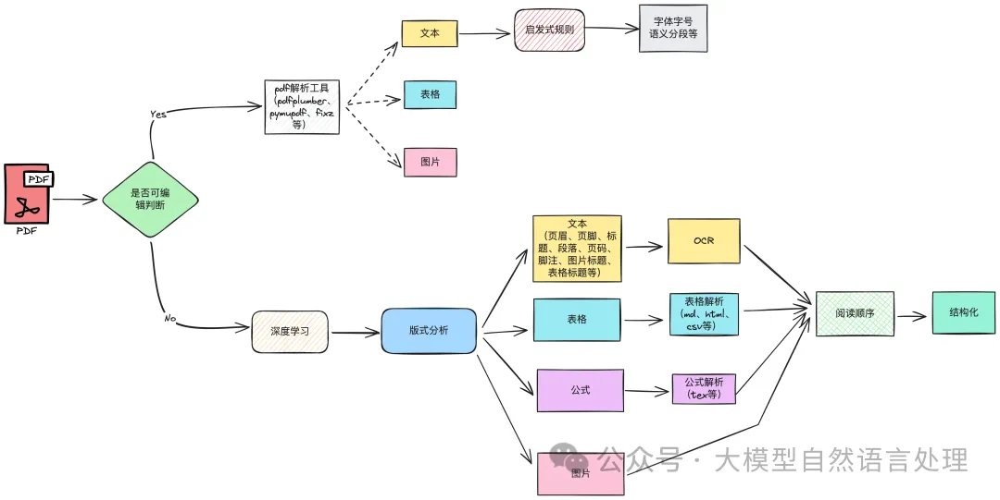
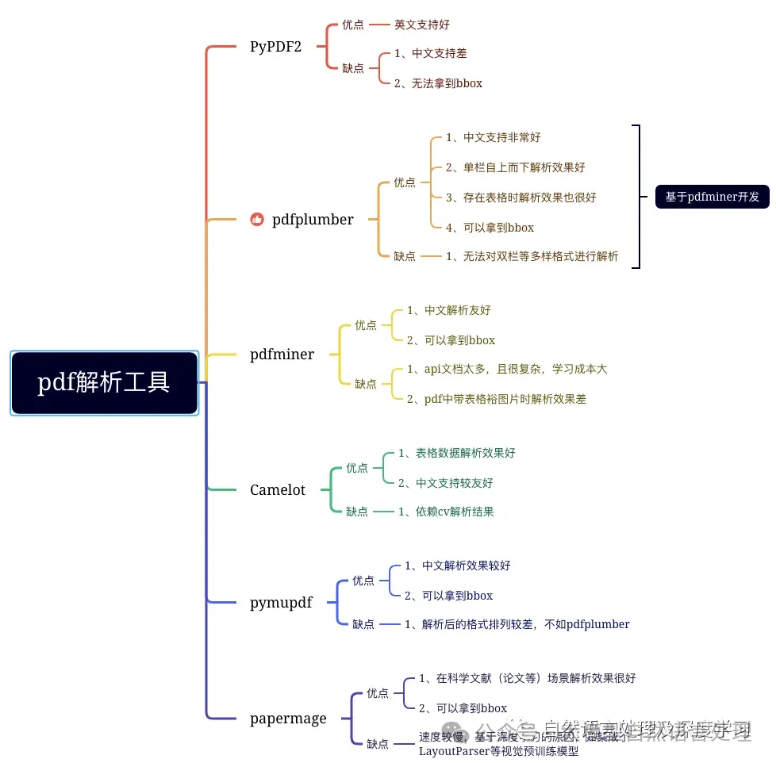
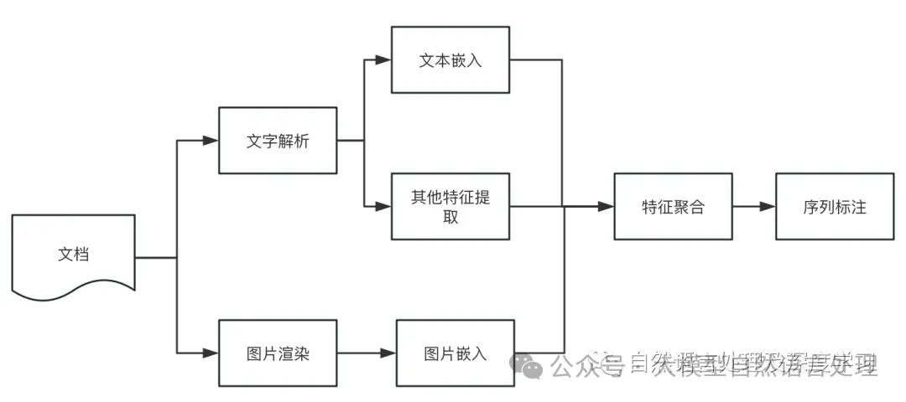
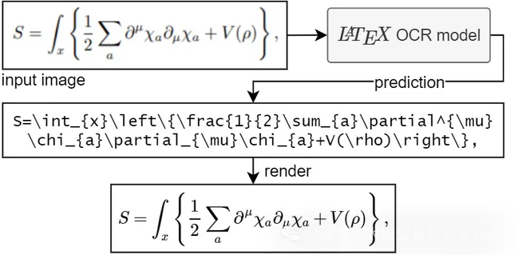
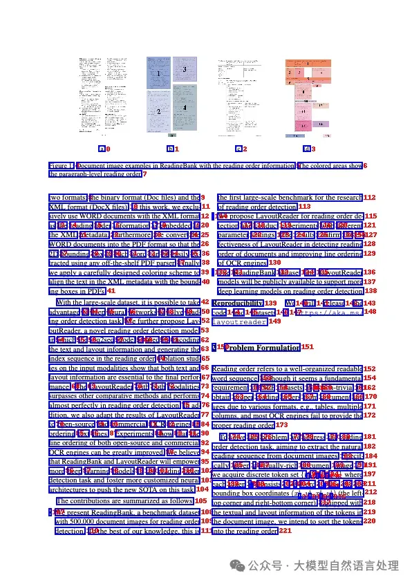

# 1. 介绍





# 2. 方案
## 2.1 语义分割



```python
from modelscope.outputs import OutputKeys
from modelscope.pipelines import pipeline
from modelscope.utils.constant import Tasks

p = pipeline(
    task=Tasks.document_segmentation,
    model='damo/nlp_bert_document-segmentation_chinese-base')

result = p(documents='移动端语音唤醒模型，检测关键词为“小云小云”。模型主体为4层FSMN结构，使用CTC训练准则，参数量750K，适用于移动端设备运行。模型输入为Fbank特征，输出为基于char建模的中文全集token预测，测试工具根据每一帧的预测数据进行后处理得到输入音频的实时检测结果。模型训练采用“basetrain + finetune”的模式，basetrain过程使用大量内部移动端数据，在此基础上，使用1万条设备端录制安静场景“小云小云”数据进行微调，得到最终面向业务的模型。后续用户可在basetrain模型基础上，使用其他关键词数据进行微调，得到新的语音唤醒模型，但暂时未开放模型finetune功能。')

print(result[OutputKeys.TEXT])
# 输出
'''
   移动端语音唤醒模型，检测关键词为“小云小云”。模型主体为4层FSMN结构，使用CTC训练准则，参数量750K，适用于移动端设备运行。模型输入为Fbank特征，输出为基于char建模的中文全集token预测，测试工具根据每一帧的预测数据进行后处理得到输入音频的实时检测结果。
   模型训练采用“basetrain + finetune”的模式，basetrain过程使用大量内部移动端数据，在此基础上，使用1万条设备端录制安静场景“小云小云”数据进行微调，得到最终面向业务的模型。后续用户可在basetrain模型基础上，使用其他关键词数据进行微调，得到新的语音唤醒模型，但暂时未开放模型finetune功能。
'''
```

## 2.2 版面分析

版面分析指的是对图片形式的文档（扫描件）进行区域划分，通过bounding box定位其中的关键区域，如：文字、标题、表格、图片等，通常采用一些CV目标检测模型进行版式分析，如：参数量大的有：DINO等基于transformer的目标检测模型；参数量小的有MaskRCNN、YOLO系列等。

版式分析的优势，通过大量标注的数据，准确的划分出文档关键区域，如下：

- 文本区域：页眉、页脚、标题、段落、页码、脚注、图片标题、表格标题等
- 表格
- 公式
- 图片

## 2.3 文本识别

对于经由版式分析划分出来的文本区域，通常采用OCR进行相应区域的文字识别，常见的开源OCR识别工具有读光OCR、PaddleOCR等，以下是PaddleOCR的使用例子：

```python
import cv2
from paddleocr import PaddleOCR
paddleocr = PaddleOCR(lang='ch', show_log=False, enable_mkldnn=True) 
img = cv2.imread('1.jpg')  
result = paddleocr.ocr(img)
for i in range(len(result[0])):
    print(result[0][i][1][0])   # 输出识别结果
```

然而，像paddleOCR等开源ocr方式，在实际应用中还是存在很多的问题，如：

漏识别：开源的一些ocr模型通常有检测和识别两阶段构成，如果检测模型检测不准，将会错误累积，ocr识别时也不准确。

识别文字错误：开源模型毕竟免费，没有在特定的领域场景上进行特定的训练，因此在识别时难免出现错误。

## 2.4 表格提取

对于经由版式分析划分出来的表格区域，通常采用表格解析模型进行解析，并转化为特定的格式，如：csv、html、markdown格式等。常见的开源模型有ppstructure等，如下：

```python
import os
import cv2
from paddleocr import PPStructure,save_structure_res
table_engine = PPStructure(layout=False, show_log=True) 
save_folder = './output'
img_path = 'table.jpg'
img = cv2.imread(img_path)
result = table_engine(img)
save_structure_res(result, save_folder, os.path.basename(img_path).split('.')[0])
for line in result:
    line.pop('img')
    print(line)
```

在实际使用过程中，常见的开源方法经常遇到的问题就是，无法准确的对表格进行解析，这种问题常见与复杂表格，尤其是表格合并单元格时，容易解析错误，行列不对齐等。

## 2.5 公式解析



对于经由版式分析划分出来的公式区域，通常采用公式解析模型进行解析，并转化为特定的格式，如：tex等。

下面是一个使用LatexOCR进行公式解析的例子：

```python
from PIL import Image
from pix2tex.cli import LatexOCR

model = LatexOCR()
img = Image.open('1.jpg')
print(model(img))
```

## 2.6 阅读顺序

经上述解析后，需要根据boungding box进行排序，以便恢复文档的格式信息。下面将介绍一种基于规则的方法和一种基于Layoutreader模型的方法。



xy-cut

```python
import numpy as np

def xy_cut(bboxes, direction="x"):
    result = []
    K = len(bboxes)
    indexes = range(K)
    if len(bboxes) <= 0:
        return result
    if direction == "x":
        # x first
        sorted_ids = sorted(indexes, key=lambda k: (bboxes[k][0], bboxes[k][1]))
        sorted_boxes = sorted(bboxes, key=lambda x: (x[0], x[1]))
        next_dir = "y"
    else:
        sorted_ids = sorted(indexes, key=lambda k: (bboxes[k][1], bboxes[k][0]))
        sorted_boxes = sorted(bboxes, key=lambda x: (x[1], x[0]))
        next_dir = "x"

    curr = 0
    np_bboxes = np.array(sorted_boxes)
    for idx in range(len(sorted_boxes)):
        if direction == "x":
            # a new seg path
            if idx != K - 1 and sorted_boxes[idx][2] < sorted_boxes[idx + 1][0]:
                rel_res = xy_cut(sorted_boxes[curr:idx + 1], next_dir)
                result += [sorted_ids[i + curr] for i in rel_res]
                curr = idx + 1
        else:
            # a new seg path
            if idx != K - 1 and sorted_boxes[idx][3] < sorted_boxes[idx + 1][1]:
                rel_res = xy_cut(sorted_boxes[curr:idx + 1], next_dir)
                result += [sorted_ids[i + curr] for i in rel_res]
                curr = idx + 1

    result += sorted_ids[curr:idx + 1]
    return result


def augment_xy_cut(bboxes,
                   direction="x",
                   lambda_x=0.5,
                   lambda_y=0.5,
                   theta=5,
                   aug=False):
    if aug is True:
        for idx in range(len(bboxes)):
            vx = np.random.normal(loc=0, scale=1)
            vy = np.random.normal(loc=0, scale=1)
            if np.abs(vx) >= lambda_x:
                bboxes[idx][0] += round(theta * vx)
                bboxes[idx][2] += round(theta * vx)
            if np.abs(vy) >= lambda_y:
                bboxes[idx][1] += round(theta * vy)
                bboxes[idx][3] += round(theta * vy)
            bboxes[idx] = [max(0, i) for i in bboxes[idx]]
    res_idx = xy_cut(bboxes, direction=direction)
    res_bboxes = [bboxes[idx] for idx in res_idx]
    return res_idx, res_bboxes


bboxes = [[58.54924774169922, 1379.6373291015625, 1112.8863525390625, 1640.0870361328125],
          [60.1091423034668, 483.88677978515625, 1117.4927978515625, 586.197021484375],
          [57.687435150146484, 1098.1053466796875, 387.9796142578125, 1216.916015625],
          [63.158992767333984, 311.2080993652344, 1116.2508544921875, 365.2145080566406],
          [138.85513305664062, 144.44039916992188, 845.18017578125, 198.04937744140625],
          [996.1032104492188, 1053.6279296875, 1126.1046142578125, 1071.3463134765625],
          [58.743492126464844, 634.3077392578125, 898.405029296875, 700.9544677734375],
          [61.35755920410156, 750.6771240234375, 1051.1060791015625, 850.3980712890625],
          [426.77691650390625, 70.69780731201172, 556.0884399414062, 109.58145141601562],
          [997.040283203125, 903.5933227539062, 1129.2984619140625, 921.10595703125],
          [59.40523910522461, 1335.1563720703125, 329.7382507324219, 1357.46533203125],
          [568.9025268554688, 14.365530967712402, 1087.898193359375, 32.60292434692383],
          [998.1250610351562, 752.936279296875, 1128.435546875, 770.4116821289062],
          [59.6968879699707, 947.9129638671875, 601.4513549804688, 999.4548950195312],
          [58.91489028930664, 1049.8773193359375, 487.3372497558594, 1072.2935791015625],
          [60.49456024169922, 902.8802490234375, 600.7571411132812, 1000.3502197265625],
          [60.188941955566406, 247.99755859375, 155.72970581054688, 272.1385192871094],
          [996.873291015625, 637.3861694335938, 1128.3558349609375, 655.1572875976562],
          [59.74936294555664, 1272.98828125, 154.8768310546875, 1295.870361328125],
          [58.835716247558594, 1050.5926513671875, 481.59027099609375, 1071.966796875],
          [60.60163116455078, 750.1132202148438, 376.1781921386719, 771.8764038085938],
          [57.982513427734375, 419.16058349609375, 155.35882568359375, 444.25115966796875],
          [1017.0194091796875, 1336.21826171875, 1128.002197265625, 1355.67724609375],
          [1019.8740844726562, 486.90814208984375, 1127.482421875, 504.61767578125]]

res_idx, res_bboxes = augment_xy_cut(bboxes, direction="y")
print(res_idx)
# res_idx, res_bboxes = augment_xy_cut(bboxes, direction="x")
# print(res_idx)

new_boxs = []
for i in res_idx:
    # print(i)

    new_boxs.append(bboxes[i])

print(new_boxs)
```

## 2.7 Layoutreader

该模型及其介绍可以查阅往期文章

```python
import torch
from model import LayoutLMv3ForBboxClassification
from collections import defaultdict

CLS_TOKEN_ID = 0
UNK_TOKEN_ID = 3
EOS_TOKEN_ID = 2


def BboxesMasks(boxes):
    bbox = [[0, 0, 0, 0]] + boxes + [[0, 0, 0, 0]]
    input_ids = [CLS_TOKEN_ID] + [UNK_TOKEN_ID] * len(boxes) + [EOS_TOKEN_ID]
    attention_mask = [1] + [1] * len(boxes) + [1]
    return {
        "bbox": torch.tensor([bbox]),
        "attention_mask": torch.tensor([attention_mask]),
        "input_ids": torch.tensor([input_ids]),
    }


def decode(logits, length):
    logits = logits[1: length + 1, :length]
    orders = logits.argsort(descending=False).tolist()
    ret = [o.pop() for o in orders]
    while True:
        order_to_idxes = defaultdict(list)
        for idx, order in enumerate(ret):
            order_to_idxes[order].append(idx)
        order_to_idxes = {k: v for k, v in order_to_idxes.items() if len(v) > 1}
        if not order_to_idxes:
            break
        for order, idxes in order_to_idxes.items():
            idxes_to_logit = {}
            for idx in idxes:
                idxes_to_logit[idx] = logits[idx, order]
            idxes_to_logit = sorted(
                idxes_to_logit.items(), key=lambda x: x[1], reverse=True
            )
            for idx, _ in idxes_to_logit[1:]:
                ret[idx] = orders[idx].pop()
    return ret


def layoutreader(bboxes):
    inputs = BboxesMasks(bboxes)
    logits = model(**inputs).logits.cpu().squeeze(0)
    orders = decode(logits, len(bboxes))
    return orders


if __name__ == '__main__':
    bboxes = [[584, 0, 595, 1], [35, 120, 89, 133],
              [35, 140, 75, 152]]
    model_path = ""
    model = LayoutLMv3ForBboxClassification.from_pretrained()

    print(layoutreader(bboxes))
# [1, 2, 0]
```

# 3. 总结

本文详细介绍了可编辑pdf和不可编辑pdf（扫描件）的一些开源技术方案和路线，整个技术链路是一个pipline的路线，每一个步骤都需要精细的优化。在RAG中，准确的划分chunks，需要依赖文档的版式分析的精准性。因此，尤其是在对文档进行版面分析时，目标检测的粒度及标签需要对落地场景进行特定的分析，不要妄想着存在一个通用的版式分析模型解决一切文档版式分析问题。


# 参考

[1] 【文档智能 & RAG】RAG增强之路：增强PDF解析并结构化技术路线方案及思路, https://mp.weixin.qq.com/s?__biz=Mzg4NjI0NDg0Ng==&mid=2247484887&idx=1&sn=209fd9850f2f3028d1b8f6d0b27e0425&chksm=cf9dd156f8ea58400d6c2b1a216960e57c2b1d4590c6b44125c968f5e227df13cc16b1331cd3&scene=21#wechat_redirect
[2] LaTeX-OCR：https://github.com/lukas-blecher/LaTeX-OCR
[3] PaddleOCR：https://github.com/PaddlePaddle/PaddleOCR
[4] 语义分段模型，https://modelscope.cn/models/iic/nlp_bert_document-segmentation_chinese-base/summary