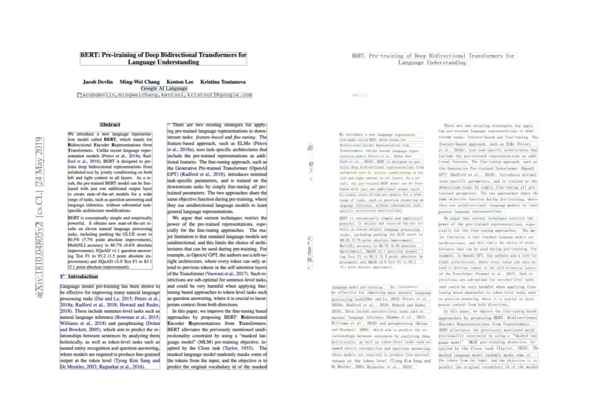

# 1. 文本的提取

能够进行文本提取的 Python 库包括：pdfminer.six、PyMuPDF、PyPDF2 和 pdfplumber，效果最好的是 PyMuPDF，PyMuPDF 在进行文本提取时能够最大限度地保留 PDF 的阅读顺序，这对于双栏 PDF 文件的抽取非常有用。下面就以难度比较大的双栏 PDF 为例，来介绍使用 PyMuPDF 库进行文字抽取的效果。

```python
import pymupdf

pages = pymupdf.open("bert.pdf")
text = pages[0].get_text()

print(text)
```

提取出的文字遵循了原 PDF 文件的阅读顺序，也就是先读左边栏的文字，再读右边栏的文字，(为了节省版面，对部分文字进行了省略)，这样提取出的文本也就保持了原 PDF  的语义。

除了上面的这种提取方式之外，我们还可以将文本提取为文本块的列表。代码如下：

```python
import pymupdf

pages = pymupdf.open("bert.pdf")
text = pages[0].get_text("blocks")

print(text)
```

每个文本块包含了文本块的坐标、文本块的内容以及文本块的序号（为了节省版面，对部分文本块进行了省略）。有了每个文本块的上述信息，我们便可以知道文本块的阅读顺序；如果需要的话，还可以使用每个文本块的坐标信息对版面进行恢复。

# 2. 表格的提取
## 2.1 有线表

表格提取效果比较好的库有 camelot 和 tabula ，表格又可以分为有线表和少线表。下面就分别以有线表和少线表为例来介绍 camelot 和 tabula 的使用。

```python
import camelot

tables = camelot.read_pdf('data.pdf')
print(tables[0].df)
```

```python
import tabula

dfs = tabula.read_pdf("data.pdf")
print(dfs[0])
```

从结果可以看出，在提取有线表时，不管是 camelot 还是 tabula 都能很好地进行提取，而且不需要过多的参数设置。

## 2.2 少线表

使用 camelot 进行少线表格提取的代码如下：

```python
import camelot

tables = camelot.read_pdf('bert-6.pdf', flavor='stream')
tables[0].df
```

在使用 camelot 进行少线表格的提取时，需要将参数 flavor 设置成 stream 

使用 tabula 进行少线表格提取的代码如下：

```python
import tabula

dfs = tabula.read_pdf("bert-6.pdf", stream=True)
dfs[0]
```

在使用 tabula 进行少线表格的提取时，需要将参数 stream 设置成 True

# 3. 扫描 PDF 的解析

## 3.1 文本提取

在从扫描的 PDF 文件中提取文本时，使用开源的 PaddleOCR，并且用 PPStructure 做版面的分析。我们还是以下面的 PDF 文件为例，不过这是的 PDF 文件是扫描 PDF。

```python
import os
import cv2
from paddleocr import PPStructure, draw_structure_result, save_structure_res
from PIL import Image

img_path = "./bert-1.png"

table_engine = PPStructure(show_log=True)
save_folder = './output'
img = cv2.imread(img_path)
result = table_engine(img)
save_structure_res(result, save_folder, os.path.basename(img_path).split('.')[0])

font_path = './fonts/simfang.ttf'
image = Image.open(img_path).convert('RGB')
im_show = draw_structure_result(image, result, font_path=font_path)
im_show = Image.fromarray(im_show)
im_show.save('result.jpg')
```



图中的左边是根据给出的版面分析结果画出来的，可以看出对双栏 PDF  做了正确的解析。右边是根据识别出来的文本以及文本的坐标画出来的，可以看出基本上和左边的版面以及内容是一致的。

## 3.2 表格的提取

```python
import os
import cv2
from paddleocr import PPStructure,draw_structure_result,save_structure_res
from PIL import Image
 
table_engine = PPStructure(show_log=True)
save_folder = './output'
img_path = './bert-6.png'
img = cv2.imread(img_path)
result = table_engine(img)
save_structure_res(result, save_folder,os.path.basename(img_path).split('.')[0])

for line in result:
    line.pop('img')
    print(line)
```


# 参考

[1] https://mp.weixin.qq.com/s?__biz=Mzk0NzExODgxMQ==&mid=2247484626&idx=1&sn=e7c423c3e82741e766627888c625f0d5&chksm=c27afcd4220bc193c2585943ee8d4ce072e8769a92f49b6dbdf774966c645651eb2b2c193571&scene=132&exptype=timeline_recommend_article_extendread_extendread_interest&show_related_article=1&subscene=21&scene=132#wechat_redirect
