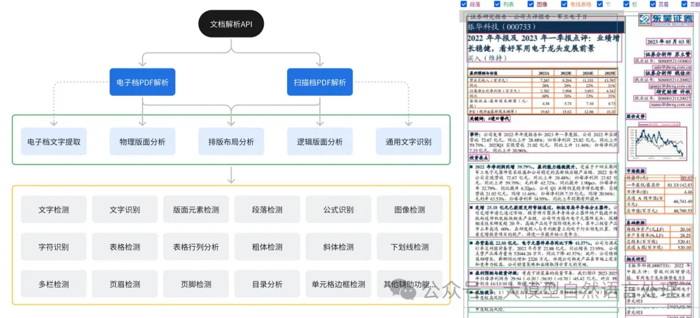
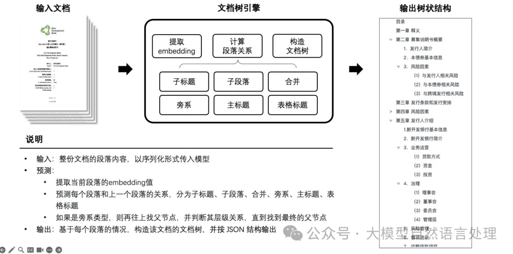
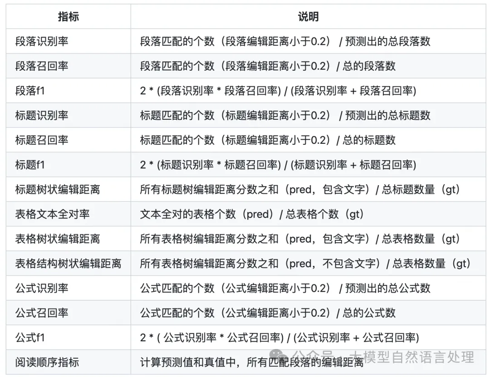
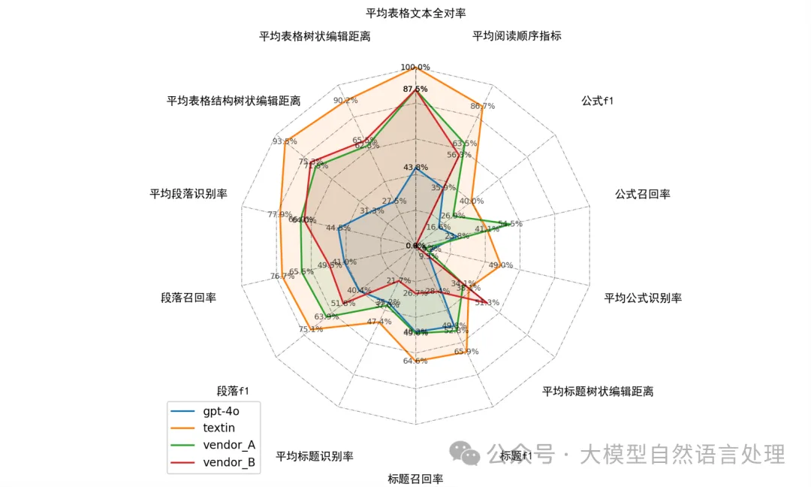

# 1. 简介

TextIn文档解析产品目前正火热进行内测阶段，并向用户提供海量免费额度体验。

海量额度：特别为每位用户准备了每周高达7000页的免费解析额度。此外，针对RAG和Agent用户，参与内测将每周额外提供的2万页（价值1000元）的免费额度。

Markdown Tester：https://github.com/intsig/markdown_tester

TextIn：https://www.textin.com/experience/pdf_to_markdown?from=acg-github

# 2. TextIn

解析流程





```python
import requests
import json

def get_file_content(filePath):
    with open(filePath, 'rb') as fp:
        return fp.read()

class TextinOcr(object):
    def __init__(self, app_id, app_secret):
        self._app_id = app_id
        self._app_secret = app_secret
        self.host = 'https://api.textin.com'

    def recognize_pdf2md(self, image, options):
        """
        pdf to markdown
        :param options: request params
        :param image: file bytes
        :return: response

        options = {
            'pdf_pwd': None,
            'dpi': 72,
            'page_start': 0,
            'page_count': 24,
            'apply_document_tree': 0,
            'markdown_details': 0,
            'table_flavor': 'md',
            'get_image': 'none',
            'parse_mode': 'auto',
        }
        """


        url = self.host + '/ai/service/v1/pdf_to_markdown'
        headers = {
            'x-ti-app-id': self._app_id,
            'x-ti-secret-code': self._app_secret
        }

        return requests.post(url, data=image, headers=headers, params=options)

def write_file(markdown_result, filepath = 'test.md'):
    f = open(filepath, 'w')
    f.write(markdown_result)
    f.close()

if __name__ == "__main__":
    textin = TextinOcr('app-id', 'app-secret')
    image = get_file_content('test.pdf')
    resp = textin.recognize_pdf2md(image, {
        'page_start': 0,
        'page_count': 14,
        'table_flavor': 'html',
        'parse_mode': 'auto',
        'apply_document_tree': 1,
        'markdown_details': 1,
        # 'get_image': 1,
    })
    print("request time: ", resp.elapsed.total_seconds())
    json_data = json.loads(resp.text)
    write_file(json_data['result']['markdown'], 'test2.md')
```

# 3. 文档解析评测工具-Markdown Tester
在文档解析中，有了解析工具后，对于开发者，针对文档解析的解析效果，需要一款比较好用的评价工具来客观对解析效果进行评价；对于购买解析服务的c端客户，同样也需要评价文档解析服务的效果，在自建数据集上先评测一下，然后有针对性的进行解析服务选购。因此，下面介绍一下 Markdown Tester：

该评测工具用于评价markdown文档相似性，从段落、标题、表格和公式四个维度进行评价，相关评价指标的定义如下表：



对于RAG中文档解析，必须强调为什么使用markdown进行表示：Markdown格式因其简洁性和易于解析的特点，‌被广泛认为是LLM（‌大型语言模型）‌友好的文档格式。‌Markdown通过明确的标记语法，‌帮助模型更好地理解文档结构和内容，‌从而提高信息提取的准确性和效率。‌特别在存在大量公式、‌表格的学术论文场景下，‌Markdown可能是更合适的格式选择。‌这种格式选择的原因主要包括：‌

结构化信息的保留：‌Markdown能够很好地保留结构化信息（非常适合需要保留标题层级、‌公式和表格等结构信息的场景），‌这对于需要精确提取和分析文本内容的场景尤为重要。‌

易于解析：‌Markdown的简洁性和明确的标记语法使得它易于被计算机程序解析和处理，‌这对于自动化文档处理和数据分析任务非常有利。‌

支持场景多：‌Markdown作为一种轻量级标记语言，‌被广泛用于编写文档、‌笔记、‌博客文章、‌技术文档等场景。

## 3.1 使用

```bash
git clone https://github.com/intsig/markdown_tester.git
cd markdown_tester
./install.sh 
```

Markdown Tester的仓库中给出了一些22份文档的grounding truth用于评测各种解析工具效果。待测评样本按照下述方式放置：

```text
dataset/
├── pred/
│   ├── gpt-4o/
│   ├── vendor_A/
│   ├── vendor_B/
│   ├── ...
├── gt/
```

```bash
python run_test.py --pred_path path_to_pred_md  --gt_path path_to_gt_md
```



# 参考

[1] 【文档智能 & RAG】RAG新基建-RAG性能增强关键技术点及通用文档解析工具-TextIn，https://mp.weixin.qq.com/s/mQxsM5Xymb-9pn4NrL4qiw