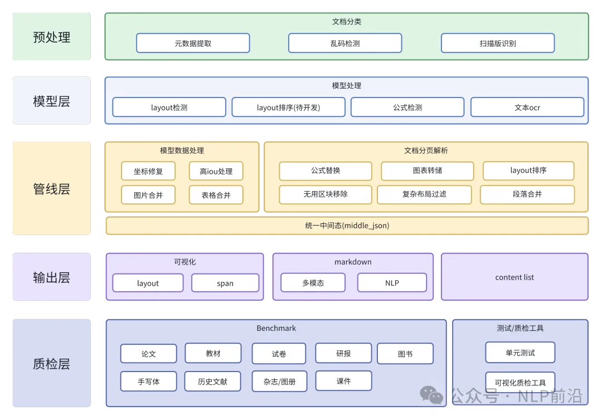
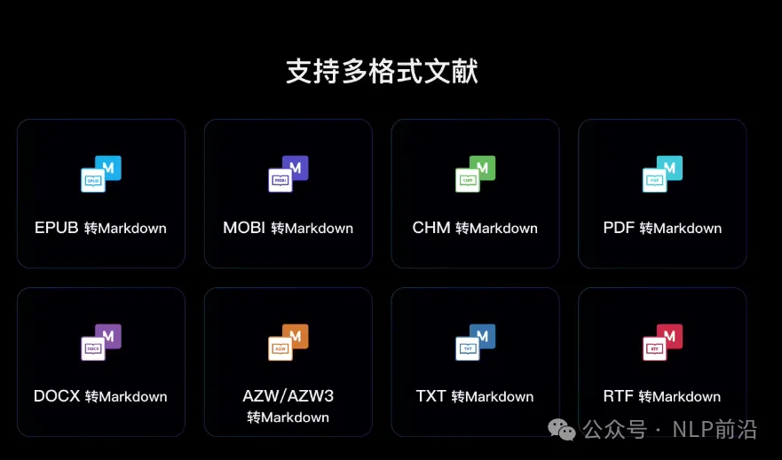

# 1. 资源

Github (214 stars): https://github.com/opendatalab/MinerU

# 2. 简介

今天分享一个开源框架，之前分享过类似的工具，但是这个做的更深入，可以将各种格式如pdf中的文本、图片、表格、公式转成markdown。

MinerU 是一款一站式、开源、高质量的数据提取工具，包含Magic-PDF、Magic-Doc 2大组件，分别用于 PDF文档提取、网页与电子书提取。

主要功能包含

- 支持多种前端模型输入
- 删除页眉、页脚、脚注、页码等元素
- 符合人类阅读顺序的排版格式
- 保留原文档的结构和格式，包括标题、段落、列表等
- 提取图像和表格并在markdown中展示
- 将公式转换成latex
- 乱码PDF自动识别并转换
- 支持cpu和gpu环境
- 支持windows/linux/mac平台

架构图：

支持多格式文献：

支持176种语言准确识别

# 参考

[1] pdf转markdown，一个高质量的开源项目！，https://mp.weixin.qq.com/s/DVZ3Wcgtyk0spir9gZqppQ