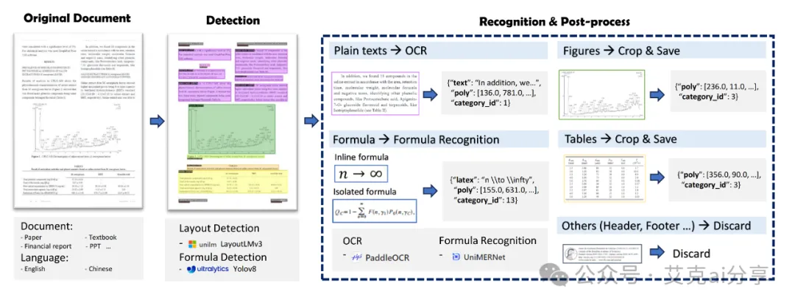
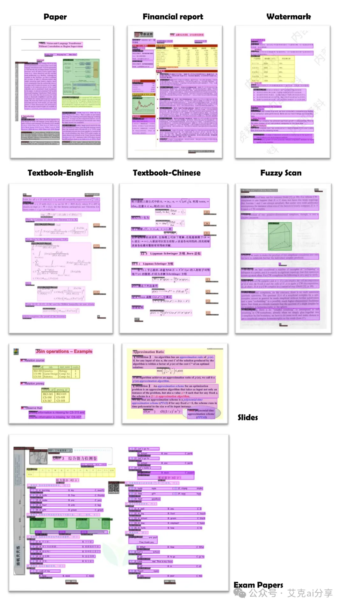
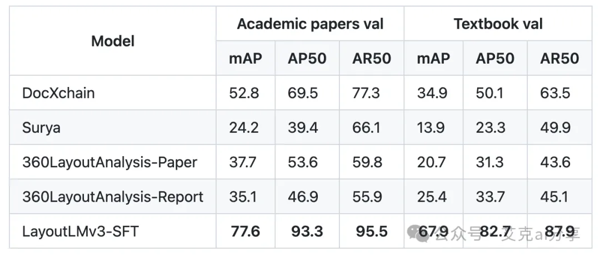

# 1. 简介

项目提供了详细的安装和使用教程,支持Linux、Windows和macOS。就算你不是技术大牛,按照教程也能轻松上手! 

教程参考：https://github.com/opendatalab/PDF-Extract-Kit

PDF-Extract-Kit 是一个专注于从各种类型PDF文档中提取高质量内容的开源工具箱。无论是论文、教材、研报还是财报,它都能轻松应对！

# 2. 功能

布局检测:使用LayoutLMv3模型，精准识别图片、表格、标题和正文等区域。

公式检测:采用YOLOv8模型，轻松找出行内公式和行间公式。

公式识别:UniMERNet模型让公式识别质量媲美商业软件！

文字识别:PaddleOCR加持，中英文识别都不在话下。

最厉害的是，它在多样性PDF文档上表现出色。就算遇到扫描模糊或带水印的文档,也能从容应对！

跟其他工具比怎么样？

那必须杠杠的!在布局检测方面，它完爆了DocXchain、Surya等知名开源模型。公式检测更是甩Pix2Text-MFD好几条街。大家可以放心使用!

# 3. 需要注意什么？

PDF-Extract-Kit主要专注于内容提取,不包含将提取内容重新组合成新文档的功能。但是，有了高质量的提取结果,后续处理就简单多了!

总的来说，PDF-Extract-Kit是一个非常强大的开源工具，如果你经常需要处理PDF文档，一定要试试看!相信它会成为你的得力助手，让PDF内容提取不再是噩梦~

# 参考

[1] 解锁 PDF 内容提取新姿势！这款神器让你效率起飞，https://mp.weixin.qq.com/s/kEW9VEgiHmooXziFw30OZQ
