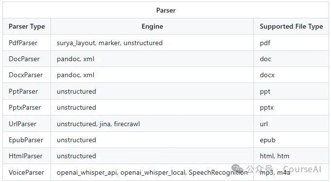
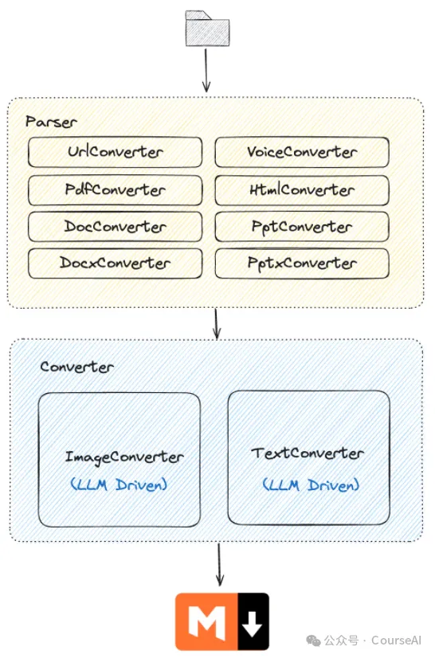

E2M的特点

https://github.com/wisupai/e2m/tree/main

E2M 是一个能够把多种文件类型解析并转换成 Markdown 格式的 Python 库，

通过解析器+转换器的架构，实现对 doc, docx, epub, html, htm, url, pdf, ppt, pptx, mp3, m4a 等多种文件格式的转换。

为了 RAG 和模型训练、微调，提供高质量的数据

# 参考

[1] 一键转Markdown，支持11种文件格式,https://mp.weixin.qq.com/s/fZBXHzh67zB_KiL8E5TU4w