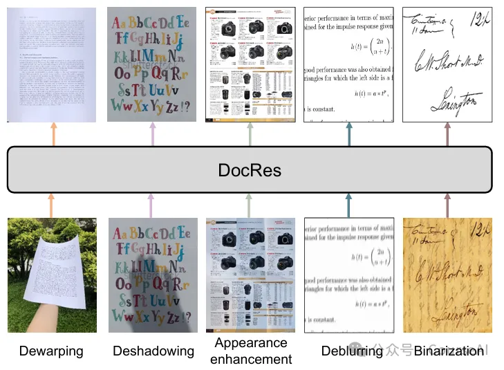
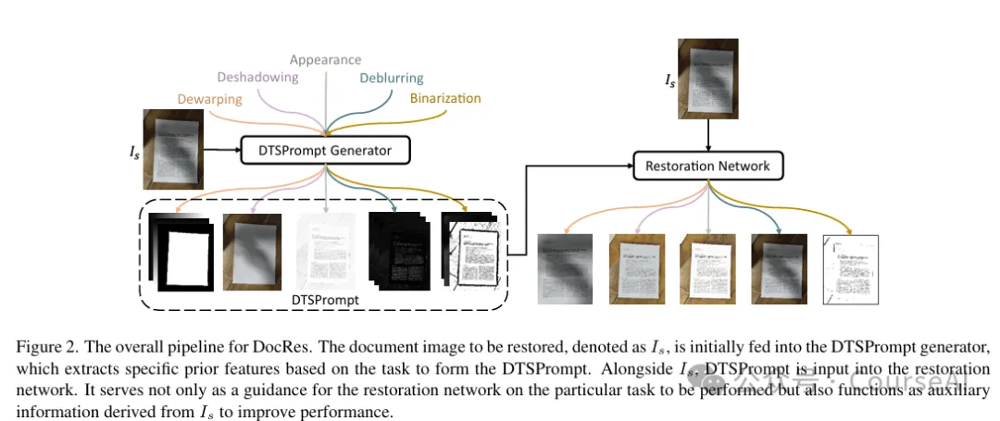
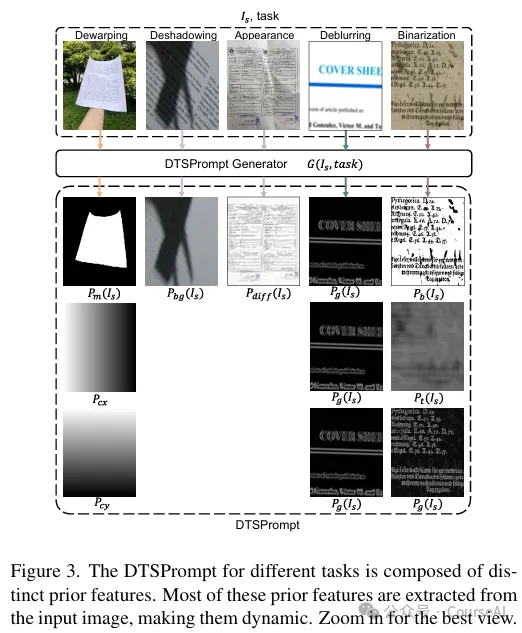
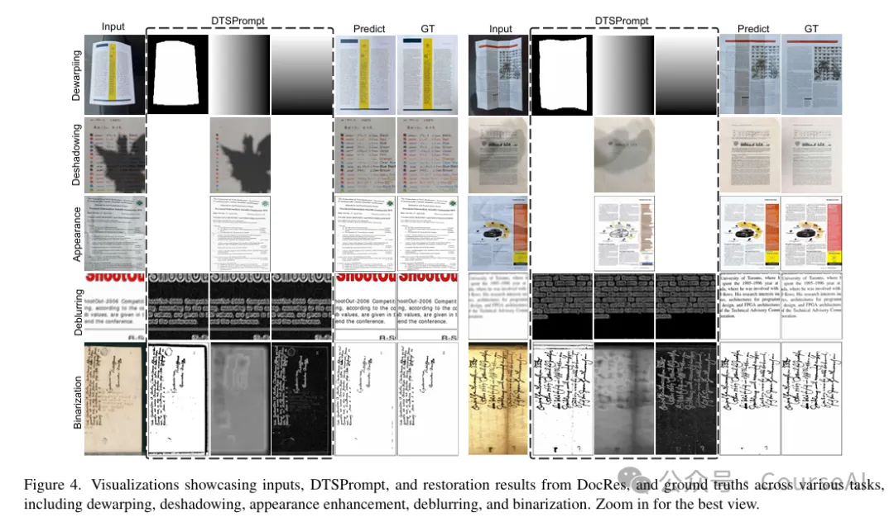
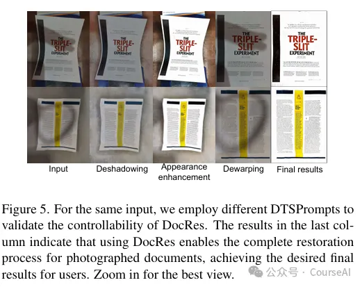
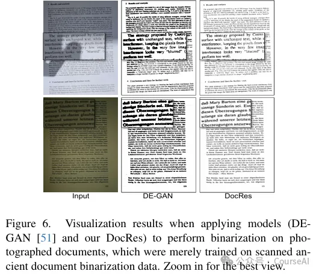
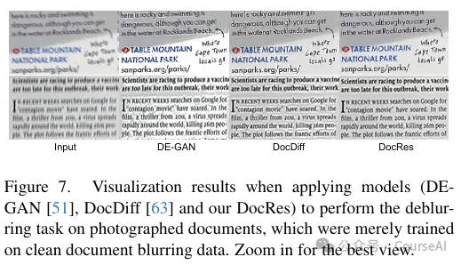
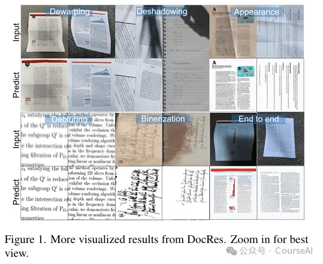

# 1. 资源

https://github.com/ZZZHANG-jx/DocRes/tree/master

https://arxiv.org/pdf/2405.04408

# 2. 扫描文档复原的目的

最近笔者做文档解析任务时，碰到了大量页面扭曲，阴影、透印、污渍、印章遮盖原文，文字模糊不清的扫描件PDF文档。

这些常见的问题，会严重影响文档的视觉吸引力和可读性。导致PDF文档解析时，出现大量的文字错误、遗漏的问题。

因此，我们需要将这类质量非常差的文档，进行复原，以提升文档解析的准确率。

# 3. 常见的处理方法
# 3.1 单任务文档恢复方法

文档恢复的方法通常有5种：

去扭曲（dewarping）

消除文档图像中的几何扭曲，如曲线和褶皱等。这对于提高光学字符识别（OCR）引擎的性能和文档可读性至关重要。

以往方法常利用文本行或文本块掩码辅助模型，同时借助文档掩码增强模型对边界的理解，降低学习难度。

例如，一些方法通过提取文本区域的掩码，使模型在处理扭曲时更关注有意义的内容区域，从而提高去扭曲的准确性。

去阴影（deshadowing）

主要针对拍摄文档图像中常见的阴影问题，通过去除阴影生成无阴影的文档。

通常会将文档背景作为先验特征来提升性能

常见的做法是采用复杂的背景估计和阴影去除算法，以提高阴影去除的效果和效率。

外观增强（appearance enhancement）

也称为光照校正，致力于恢复文档的干净外观，类似于数字原生 PDF。

基于内在图像的概念，常采用背景光、阴影图或白平衡核等作为先验特征，但获取这些特征往往需要额外的模型进行训练和预测，增加了方法的复杂性。

去模糊（deblurring）

消除图像模糊，恢复清晰图像。

传统的基于优化的方法常利用梯度分布作为先验特征来约束优化函数的解空间，

在深度学习方法中，也有研究尝试将梯度信息融入模型，以提高去模糊的效果。

二值化（binarization）

将文档图像中的前景文本从背景中分割出来，对于以文本内容为主要关注点的应用非常关键。

通常会整合先验特征来增强性能，如采用 Sauvola 二值化算法生成的初始二值化结果和阈值图作为先验特征，同时结合梯度信息进一步提高二值化的准确性。

上述每个任务都需要专门设计模型，虽然这种方式在各自任务上能取得一定效果，但导致系统复杂，且无法利用多任务学习的潜在协同作用。

例如，在一个包含多种退化类型的文档处理流程中，可能需要依次使用多个不同的模型，这不仅增加了计算资源的消耗和处理时间，还可能因为模型之间的不兼容性导致信息丢失或错误累积。

## 3.2 多任务文档图像恢复方法

在自然场景图像恢复领域，涵盖天气效果去除、低光图像增强、去噪和去模糊等任务。这些多任务通用模型根据在推理过程中是否明确指定任务可分为两类：

任务无关型

不需要用户指定任务类型，但灵活性较差，通常局限于特定领域，如仅能处理天气效果去除等任务。

因为不同任务虽可能有相似输入但输出不同，导致学习过程中存在模糊性，不适合用于文档图像恢复任务，因为文档图像恢复任务间输入相似但输出差异明显。

任务导向型

为实现任务导向的通用模型，需引入明确的任务信息。

例如：将连续视觉输出离散化，使用离散标记作为任务提示，并利用 Transformer 解码器进行自回归预测，但这种方法更适用于视觉理解任务，对于涉及高分辨率输出的低级任务不太适用。

还有以视觉为中心的提示（视觉提示）用于统一任务，如使用特定任务的输入 / 输出样本作为提示，但在推理时需要额外的样本对，效率较低且受图像分辨率限制。

例如：ProRes 采用与输入图像形状相同的可学习参数矩阵作为视觉提示，但训练过程复杂，每个任务的提示需在特定任务模型上预训练初始化，并且这些方法大多依赖 ViT 框架，受限于 ViT 对输入图像分辨率的要求和内存限制，难以适应文档图像恢复任务中常见的高分辨率和可变分辨率输入。

# 4. DocRes

## 4.1 DocRes的特点
DocRes模型，统一上述五种文档图像恢复任务

引入动态任务特定提示（Dynamic Task-Specific Prompt，DTSPrompt），基于从输入图像中提取的不同先验特征构建视觉提示

既能引导模型执行特定任务，又能提供额外信息增强恢复性能。

与现有的视觉通用模型提示方法相比，DTSPrompt 具有独特优势，它不依赖特定框架，可应用于多种分辨率的输入图像，更适合文档图像恢复任务的特点。

## 4.2 DocRes的方法论
第一步：利用DTSPrompt，根据指定任务从输入图像中提取先验特征。

去扭曲任务

通过现有文档分割模型，获取文档掩码作为先验特征。

同时，考虑到去扭曲任务与坐标位置相关，引入像素的 x 和 y 坐标作为额外先验特征。

将这些特征沿通道维度拼接得到去扭曲任务的 DTSPrompt。

例如：在处理一份弯曲的文档图像时，文档掩码可以帮助模型识别文档的主体区域，坐标信息则有助于模型准确地恢复图像的几何形状，使扭曲的文本行和段落恢复到正常位置。

去阴影任

采用带有阴影的文档背景作为先验特征。

通过对文档图像进行膨胀操作去除文本内容，再使用中值滤波器平滑处理后得到。

例如：对于一张有阴影覆盖部分文字的文档图像，该背景特征可以为模型提供阴影的分布和强度信息，引导模型去除阴影，使文字更加清晰可读。

外观增强任务

利用原始图像与文档背景的差异作为先验特征。

通过计算两者的差值，为模型提供初始的增强指导，帮助模型调整图像的光照和颜色分布，使文档外观更接近原始无退化的状态。

去模糊任务

使用输入图像的梯度图作为先验特征。

将其重复三次沿通道维度拼接。

梯度图包含了图像中边缘和纹理的信息，模型可以通过学习这些信息来恢复模糊区域的细节，提高图像的清晰度。

二值化任务

采用 Sauvola 二值化算法得到的初始二值化结果和阈值图以及梯度信息作为先验特征。
这些特征可以为模型提供文本区域的初步分割信息和边缘信息，帮助模型更准确地将文本从背景中分离出来，特别是在处理复杂背景或低对比度文本时效果显著。
第二步：融合先验特征，复原文档

将 DTSPrompt 和输入图像沿通道维度拼接，构建新的输入送入恢复网络。

在复原网络选择上，由于 DTSPrompt 的简单性和灵活性，选择了现成的 Restormer 网络而无需修改。

Restormer 网络支持高达 1600×1600 的输入分辨率，并且能够适应可变分辨率的输入，这使得 DocRes 模型在处理不同分辨率的文档图像时具有很大的优势。

# 5. 训练过程
## 5.1 数据集

去扭曲
使用 Doc3D 数据集进行训练，该数据集包含 100K 个样本，具有几何扭曲的文档图像及对应的反向映射。
测试则采用 DIR300 基准数据集，其中包含 300 个几何扭曲图像及对应的平面真实值。这些数据集为评估模型在去扭曲任务上的性能提供了丰富的样本和标准的参考。
去阴
训练集由 FSDSRD 的 14,200 个合成图像和 RDD 训练集的 4,371 个真实图像组成
测试集包括 Jung 数据集（87 个图像）、Kligler 数据集（300 个图像）和 OSR（237 个图像）。
通过不同来源和类型的图像组合，能够全面测试模型在去阴影任务上的泛化能力和对真实场景的适应性。
外观增强
训练集包含 Doc3DShade 数据集的 90K 个合成图像和 RealDAE 训练集的 450 个真实世界图像
评估使用 RealDAE 测试集的 150 个图像和 DocUNet 的 130 个图像。
在使用 DocUNet 图像评估时，需按照特定方法将其退化图像与平面真实值对齐，确保评估的准确性和可靠性。
去模糊
从 Text Deblur Dataset（TDD）的 66K 个训练样本中随机选取 40K 个训练模型，TDD 的 1.6K 个测试样本构成测试集。
该数据集的规模和多样性能够有效训练和测试模型在处理文本模糊问题上的能力。
二值化
以 DIBCO’18 为测试集，训练数据则来自于（H）-DIBCO 数据集的其余年份以及 Noisy Office 数据集、Synchromedia Multispectral 数据集、Persian Heritage Image Binarization 数据集和 Bickley Diary 数据集等。
这种多数据集的组合为模型提供了丰富的二值化样本，有助于提高模型在不同类型文档图像二值化任务上的性能。

## 5.2 评估指标
去阴影、外观增强和去模糊任务
采用常用的峰值信噪比（PSNR）和结构相似性指数（SSIM）作为评估指标。
PSNR 用于衡量图像的峰值信号与噪声的比值，值越高表示图像质量越好；
SSIM 则从亮度、对比度和结构三个方面综合评估图像与参考图像的相似程度，其值越接近 1 表示图像质量越接近原始图像。
去扭曲任务
结合了多尺度结构相似性（MS-SSIM）、局部失真（LD）和对齐失真（AD）。
MS-SSIM 通过考虑多个尺度来更全面地评估图像的结构相似性；
LD 利用去扭曲结果与平面真实值之间的偏移量来衡量性能；
AD 则在 LD 的基础上进一步排除低纹理区域的偏移噪声并减轻全局变换的影响，从而更精确地评估去扭曲效果。
二值化任务
采用 PSNR、F - 测度（FM）和伪 F - 测度（pFM）作为评估指标。
F - 测度综合考虑了准确率和召回率，能够更准确地评估二值化结果与真实文本区域的匹配程度；
伪 F - 测度则在一定程度上对二值化结果的质量进行补充评估，与 F - 测度和 PSNR 一起全面反映模型在二值化任务上的性能。

## 5.3 实施细节

在 8 个 NVIDIA A6000 GPU 上进行训练，共训练 100,000 步

全局批处理大小为 80。

采用 AdamW 优化器，权重衰减设置为 5×10⁻⁴，并使用余弦学习率调度器，最大学习率为 2×10⁻⁴。

统一训练前，先对模型在去扭曲任务上进行 50,000 步的预训练，以初始化模型。

因为去扭曲任务与其他任务在性质上有较大差异，其涉及坐标回归，而其他任务主要是图像内容的回归，预训练有助于模型在后续的统一训练中更快收敛和稳定。

统一训练过程中，去扭曲、去阴影、外观增强、去模糊和二值化任务的采样权重均设置为 0.2。

除二值化任务采用标准交叉熵损失对输出进行监督外，其他任务均使用 L1 损失进行监督。

在数据处理方面，去阴影、外观增强、去模糊和二值化任务的图像随机裁剪为 256×256 的补丁进行训练

去扭曲任务的图像在训练时调整为 256×256 的大小。

# 参考

[1] 修复低质扫描件PDF：不怕页面扭曲、字体模糊, https://mp.weixin.qq.com/s?__biz=MzkzNjgwNzMwNQ==&mid=2247484779&idx=1&sn=02772c211f328a19c1785d364d03f291&scene=21#wechat_redirect