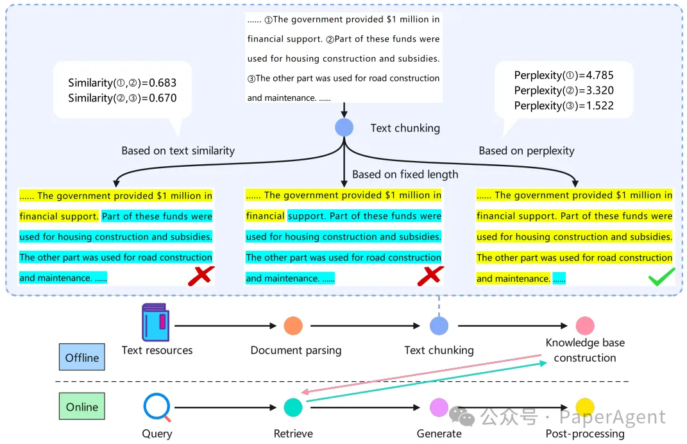
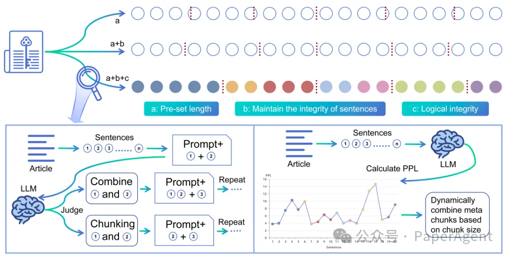
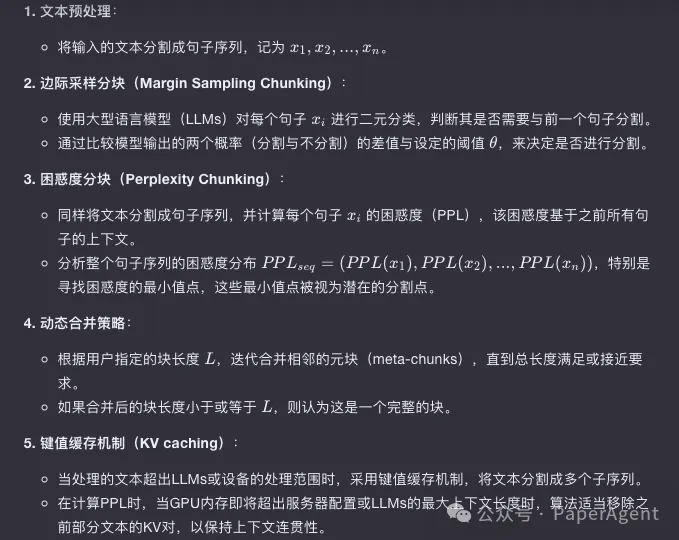
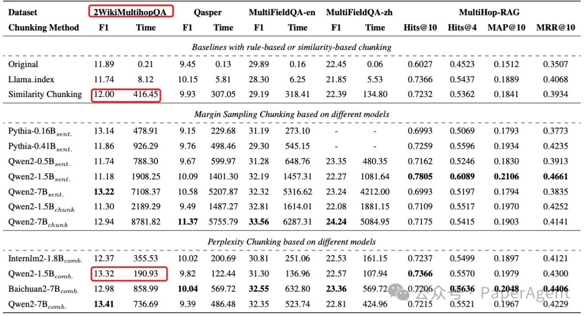
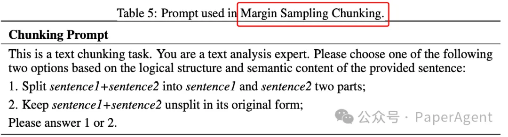

# 1. 资源

- META-CHUNKING: LEARNING EFFICIENT TEXT SEGMENTATION VIA LOGICAL PERCEPTION
  - https://arxiv.org/pdf/2410.12788
- https://github.com/IAAR-Shanghai/Meta-Chunking.

# 2. 原理

RAG效果在很大程度上依赖于检索到的文档的相关性和准确性。传统的基于规则或语义相似性的文本分块方法在捕捉句子间微妙的逻辑关系上存在不足。

RAG流水线的概览，以及基于规则、相似性和PPL分割的示例。相同的背景色表示位于同一个块中。

为了解决现有方法的局限性，提出了一种名为Meta-Chunking的概念，它在句子和段落之间定义了一种粒度：由段落内具有深层语言逻辑联系的句子集合组成，旨在增强文本分割过程中的逻辑连贯性。Meta-Chunking包括基于LLMs的两种策略：边际采样分块（Margin Sampling Chunking）和困惑度分块（Perplexity Chunking）。

整个元块分割（Meta-Chunking）过程的概览。每个圆圈代表一个完整的句子，句子的长度并不一致。垂直线表示在哪里进行分割。图底部的两侧揭示了边缘采样分割（Margin Sampling Chunking）和困惑度分割（Perplexity Chunking）。具有相同背景色的圆圈代表一个元块，它们被动态组合以使最终的块长度满足用户需求。

Meta-Chunking的工作流程：

通过在11个数据集上的实验，证明了Meta-Chunking能够更有效地提升基于RAG的单跳和多跳问答任务的性能。例如，在2WikiMultihopQA数据集上，它比相似性分块（Similarity Chunking）的性能提高了1.32倍，同时只消耗了45.8%的时间。
在五个问答（QA）数据集中展示了主要的实验结果。前四个数据集来源于LongBench。sent. 表示是否适合将两个句子分开，而chunk表示后一个句子是否适合与前面的块合并。comb. 指的是首先使用PPL分割（PPL Chunking）且阈值为0来分割文本，然后进行动态组合的过程。

此外，还探讨了不同模型大小对文本分块任务的影响，发现中型模型（如1.5B参数级别）在性能和效率之间展现了更平衡的表现。

# 参考

[1] 又快又准的RAG Meta-Chunking，1.3倍提升，耗时减半，https://mp.weixin.qq.com/s/p2ydwYctlYwV2VkLq5XMtQ