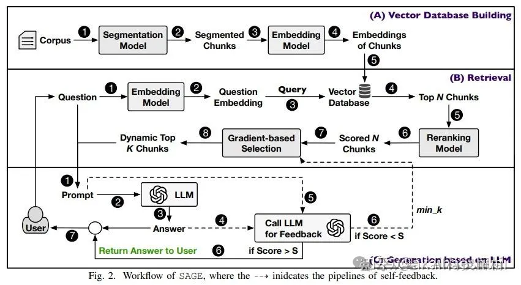

SAGE: A Framework of Precise Retrieval for RAG（训练chunk分割模型）

论文提出了一种名为SAGE的RAG框架，旨在解决现有RAG系统在问答任务中存在的语义分割不准确、检索噪声和缺失等问题。SAGE通过以下三种方法来提高RAG系统的检索精度和问答性能：

训练一个语义分割模型（相关度打分模型），将语料库分割成语义完整的片段，提高检索到的片段的语义连贯性。

设计基于梯度的片段选择算法，动态选择最相关的片段，避免检索到无关片段（其实就是thresh筛选，只是这里从score>thresh改成了 \Delta_{score}>thresh 的筛选）。

引入LLM的自我反馈机制，根据LLM的评估自动调整检索到的片段数量，进一步确保检索的精确性（LLM判断哪些能要哪些不能要）。

# 参考

[1] https://mp.weixin.qq.com/s/Lvq0vH2GpvVq_zsSCo7S9w