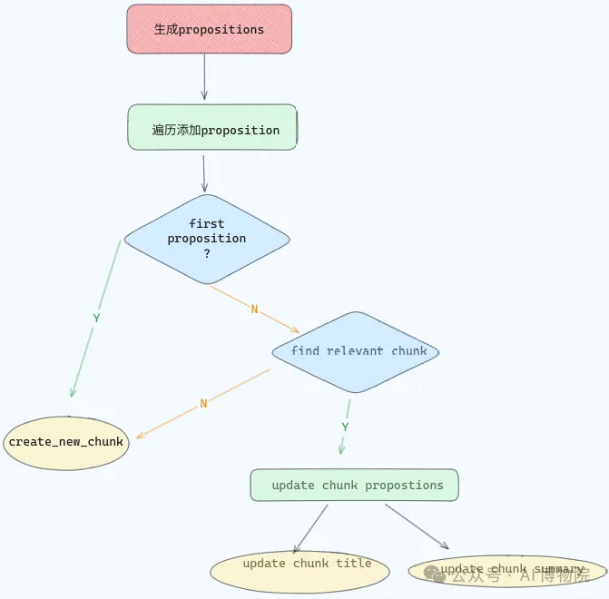

假设我们有这样一段文本：
```text
On July 20, 1969, astronaut Neil Armstrong walked on the moon. He was leading the NASA’s Apollo 11 mission. Armstrong famously said, “That’s one small step for man, one giant leap for mankind” as he stepped onto the lunar surface.
```

在 Agentic Chunking 中，LLM 会先进行 propositioning 处理，把每个句子独立化，让每个句子都有自己的主语，处理后就变成 ：

```text
On July 20, 1969, astronaut Neil Armstrong walked on the moon.
Neil Armstrong was leading the NASA’s Apollo 11 mission.
Neil Armstrong famously said, “That’s one small step for man, one giant leap for mankind” as he stepped onto the lunar surface.
```

这样，LLM 就能单独检查每个句子，再把它们分到合适的文本块。propositioning 就像是给文档里的句子做了次 “整容”，让它们都能独立完整地 “展示自己”。



# 参考

[1] Agentic Chunking：RAG 准确率飙升 40% 的秘密武器, https://mp.weixin.qq.com/s/shbZSBCynB64lQLOFeseQQ
[2] 传统分块已死？Agentic Chunking拯救语义断裂，实测RAG准确率飙升40%，LLM开发者必看！https://mp.weixin.qq.com/s/NyDnQCvq_cpCz_SwWivewQ