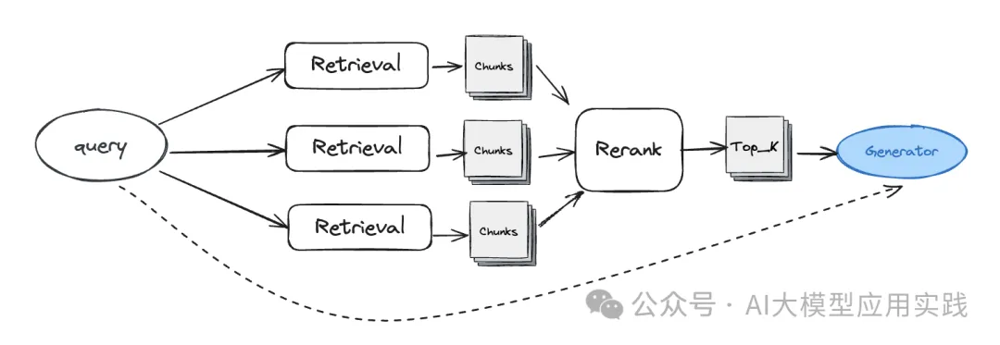
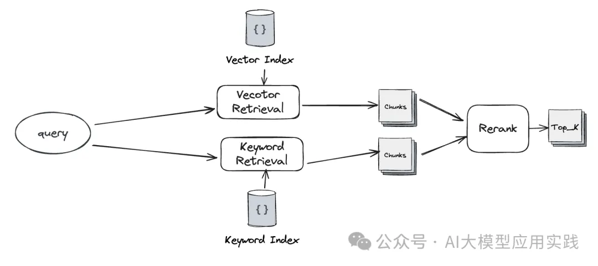
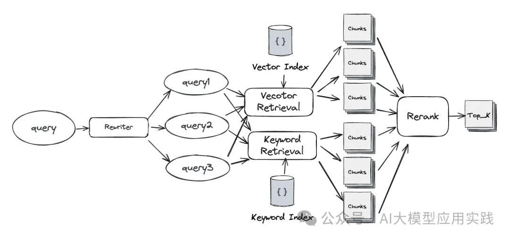

# 1. 简介

融合检索（Fusion Retrieval）是一种结合多维度检索的方法。简单的说，就是通过多个不同的检索方法进行查询检索，并对召回的结果通过排序算法（比如RRF）重新排序融合后用于后续生成。融合检索可以组合多路不同维度的检索结果，以弥补单个向量索引在检索精确性上的不足



## 1.1 基于问题重写与扩展

借助查询重写（或查询转换器）对输入问题进行扩展，生成多个不同表达形式或不同角度细化的输入问题，并对每个问题分别进行检索，然后对召回的知识块chunks通过重排（reranker）模块进行重新排序，并取最终的top_K用于后续生成环节。


通过Rewriter模块进行问题扩展

## 1.2 基于多种类型的索引

尽管基于高纬向量的索引在很多场景下的基于自然语言的语义检索可以工作的不错，但其也并非全能：比如你可能想借助知识图谱索引来更精确的获取实体之间的复杂关系；借助树状的摘要索引来更好的回答概要性的问题等。因此，你可以同时通过多路不同类型的索引（比如向量索引与关键词索引）来对输入问题进行检索，并对召回的知识块进行重排序处理后获取top_K。

（也可以是同种索引，但是采用不同的检索与评分算法）



基于向量索引与关键词索引对问题进行多路检索

## 1.3 基于复合方案的多路检索

这是对上面两种方法的组合。即同时借助于问题扩展与索引扩展来实现更多路的知识召回，再通过重新排序获得top_K。这种组合方法由于召回了更多的chunks，有利于获取更相关的知识，但同时也增加了系统性能的消耗与模型使用的成本，在实际使用时需要根据测试结果进行取舍。



# 2. 融合检索的关键技术

实现融合检索并不复杂，不管在LangChain还是LlamaIndex框架中，都有转换器(rewriter)、检索器(retriever)、排序器(reranker)的概念与组件，可以自行组合来实现融合检索。

- 查询扩展：借助LLM自行实现；或者借助已有组件，比如LlamaIndex中的QueryTransform组件
- Reranker：自行实现RRF算法函数，或者借助Cohere Reranker这样的专业排序模型实现
- 检索融合：扩展已有的Retriever组件，实现自定义融合检索器；有的框架有现成的融合检索器，比如LlamaIndex的QueryFusionRetriever。这是一个典型的融合检索器扩展：

```python
class FusionRetriever(BaseRetriever):

#基于多个检索器构造融合检索器
#参数：检索器列表与top_k
    def __init__(
        self,
        retrievers: List[BaseRetriever],
        similarity_top_k: int = 3,
    ) -> None:
        self._retrievers = retrievers
        self._similarity_top_k = similarity_top_k
        super().__init__()

#实现检索方法
    def _retrieve(self, query_bundle: QueryBundle) -> List[NodeWithScore]:
        
       #查询重写，自行实现rewrite_query
        querys = rewrite_query(query_bundle.query_str,num=3)
        
        #调用辅助方法得到全部检索结果，自行实现run_queries
        results_dict = asyncio.run(run_queries(querys, self._retrievers))

        #RRF重新排序，自行实现rerank_results
        final_results = rerank_results(results_dict,similarity_top_k=self._similarity_top_k)

        return final_results
```

# 参考

[1] 一文说清大模型RAG应用中的两种高级检索模式：你还只知道向量检索吗？，https://mp.weixin.qq.com/s/y4KI4spvPCQf2ufWyUOoNA