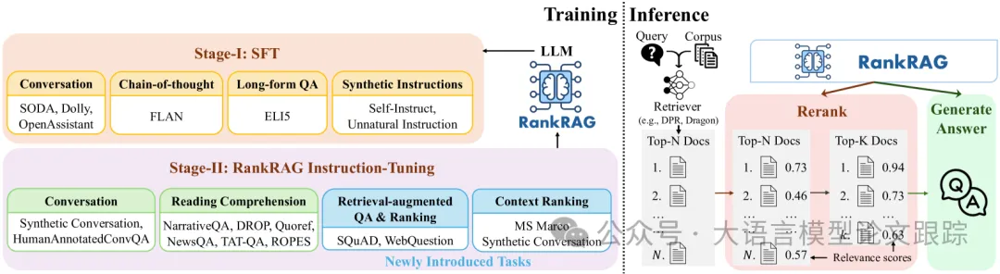
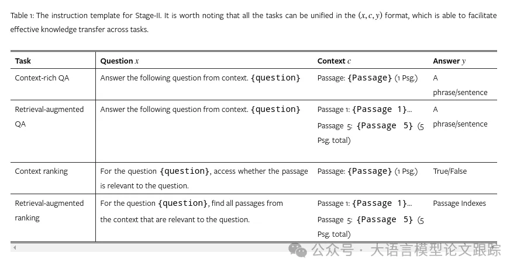
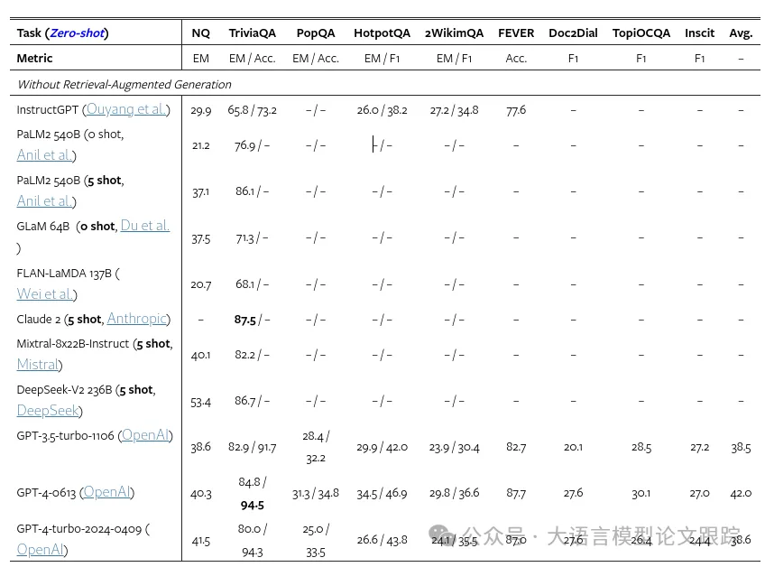

# 1. 资源

RankRAG: Unifying Context Ranking with Retrieval-Augmented Generation in LLMs

https://arxiv.org/abs/2407.02485

# 2. 摘要

我们提出了一种名为 RankRAG 的创新指令微调框架，该框架使单个 LLM 能够同时进行上下文排序和答案生成，显著提升了 RAG 的性能。通过在训练中融入少量排序数据，RankRAG 不仅超越了专门优化的排序模型，还在生成任务上表现卓越，击败了包括 GPT-4 在内的多个顶尖模型。特别是在知识密集型和生物医学领域的基准测试中，RankRAG 展现了其强大的泛化能力，无需特定领域的微调即可与 GPT-4 媲美。

# 3. 背景

检索增强生成无疑是当前最热门的LLM研究领域了，但是传统RAG存在一些局限性：

- 检索器容量的限制。考虑到处理效率，现有的RAG一般采用稀疏检索（比如BM25）或中等规模的嵌入模型（比如Bert）作为检索器。

- 只选择前K个文档。尽管最新的大语言模型扩大了上下文长度的限制，能够接受更多的上下文作为输入，但是实际性能会随着K的增加而迅速达到饱和。比如在长问答任务中，最佳的分块上下文数量大约是10。虽然更大的K可以提高召回率，但是同时也引入了更多无关的内容，干扰大语言模型生成准确回答。

因此，作者设计了一个新的RAG：RankRAG，利用单一大语言模型来实现高召回率的上下文提取和高质量内容生成。通过对单一大语言模型进行指令调优，使其可以同时进行上下文排序和答案生成，进一步提升LLM在RAG检索和生成阶段排除不相关上下文的能力。

# 4. 原理

RankRAG整体包括两个阶段：指令调优阶段、排名与生成综合指令调优阶段。

## 4.1 第一阶段：指令调优（SFT）阶段
指令调优（或监督式微调）可以显著提升大语言模型指令遵循的能力，从而提高下游任务的零样本性能。所以，作者先对大语言模型进行指令调优。

总共准备了128K SFT样本，确保样本中没有数据泄露，没有与评估任务重的数据重叠，并采用多轮对话格式。

第一阶段的指令调优数据集包括：公共对话数据集、长篇问答数据集、Chain of Thought数据集以及合成数据集。

## 4.2 排名与生成的综合指令调优阶段
第一阶段的SFT目的是为大模型奠定指令遵循的基础能力，但是在RAG任务上，这些模型仍然还有提升空间。为了提升这些模型在RAG任务上的性能，作者进行了第二阶段的指令调优。第二阶段的指令调优包括五个部分：

### 4.2.1 第一阶段的SFT数据
这部分数据的纳入是为了保持LLM遵循指令的能力。

### 4.2.2 富含上下文的QA数据
在数据集中加入多个富含上下文的QA任务数据来加强LLM利用上下文回答问题的能力。采用混合训练数据集：

- 标准的QA和阅读理解数据集

- 对话QA数据集

### 4.2.3 检索增强问答数据
引入两个新数据集，不仅包含标准答案的上下文，还包括通过BM25算法检索出的最相关上下文。

增强LLM在生成回答时，对无关上下文的抗干扰能力也非常重要，所以作者特别考虑了SQuAD和WebQuestion两个问答任务数据集。对于每个问题，作者将标准答案的上下文和BM25检索出的上下文进行融合，确保每个问题都能至少关联5个上下文。其中部分检索出的上下文可能是不包含答案的，这些被称为负样本。

### 4.2.4 上下文排名数据
为了使模型具有LLM排名能力，作者采用了大家普遍认可的MS MARCO段落排名数据集。将标准查询-段落对（q，d+）定义为正样本，而通过BM25算法挖掘出的硬负样本段落（q，d-）定义为负样本。LLM需要根据给定的查询-段落对生成“真”或“假”的回答，任务指令是“针对问题{question}，请判断该段落是否与问题相关。”

虽然MS MARCO覆盖了众多主题，但问题均为单轮简短句子。然而，针对对话问答的排名数据极为稀缺。

为解决这一局限，将对话问答对重新设计，以生成伪相关对。鉴于每段对话仅关联一个文档，将每个文档切割成150字的段落（d1，d2，...，dn）。计算每个段落di与标准答案间的4-gram召回率，将召回率超过0.5的段落判定为与对话相关，低于0.1的则判定为不相关。每个样本包含一对问题-上下文，用于排名数据集。

合成后的数据加上开始的MS MARCO数据，一共约50K数据用于本阶段的指令微调。

### 4.2.5 检索增强型排名数据
为了使模型能够针对一个问题评估多个上下文的相关性，采用了SQuAD和WebQuestions两个问答数据集，通过BM25算法，将标准答案上下文与检索出的最相关上下文相结合，确保每个问题关联五个上下文。凡包含答案的上下文均被视为相关，训练LLM识别与问题相关的所有上下文。

## 4.3 RankRAG 推理流程：检索-重排-生成三部曲
融入额外的重排环节，RankRAG 的推理流程转变为三步走策略：检索-重排-生成，具体步骤如下：

(1) 检索器 ℛ 率先在文本库中筛选出 top-k 个相关上下文。

(2) RankRAG 模型进而基于上表中的提示，评估问题与这些检索到的上下文之间的相关性得分，以此作为生成正确答案的概率，随后对上下文进行重排，精挑细选出 top-k（k'远小于k）个最为贴切的上下文，作为下一步生成答案的依据。

(3) 精选出的 top-k' 个上下文与问题串联，再次输入 RankRAG 模型，以此生成最终的答复。

# 5. 效果

# 参考

[1] 又来一个RAG：RankRAG，英伟达RAG新思路, https://mp.weixin.qq.com/s/Zc0_Oe8DsJKUTYwgGX_GRQ
