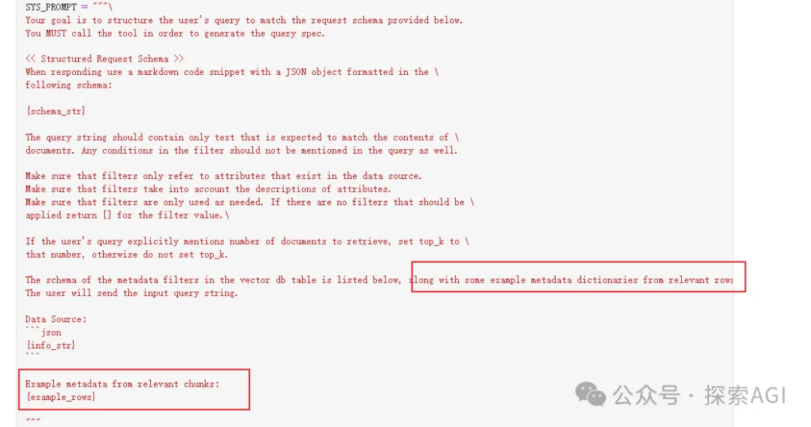
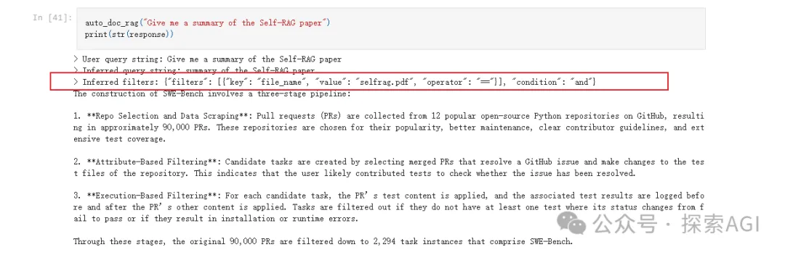

# 资源

代码开源地址：https://github.com/run-llama/llamacloud-demo/blob/main/examples/advanced_rag/auto_retrieval.ipynb

# 方法

最近 @akshay_pachaar 大佬，开源了一个改变游戏规则的方法，它将 RAG 与结构化查询相结合，以实现精确的文档检索。方法的秘密是：

- 建索引的每个文档块附带上文档的信息
- 执行块搜索，从而可以获取到相关的文档的元数据
- 使用检索到的元数据作为样例，填充进auto-retriever的提示词中，得到文档过滤策略，如下图

运行的日志如下：

# 参考

[1] RAG 的未来 - 自动文档检索，https://mp.weixin.qq.com/s/NC9MXjZmWubiLLhfKmXp1Q