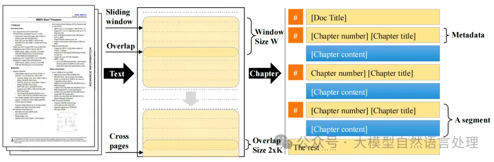
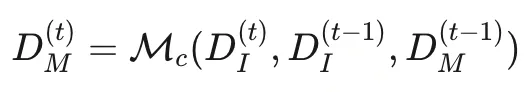
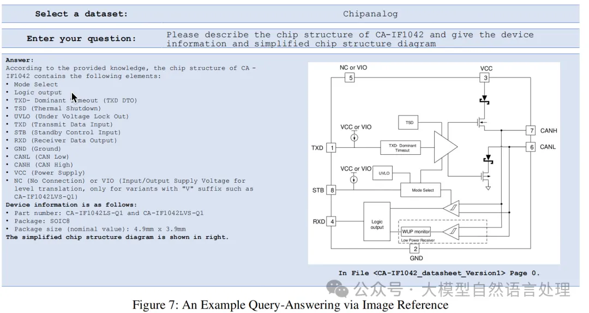
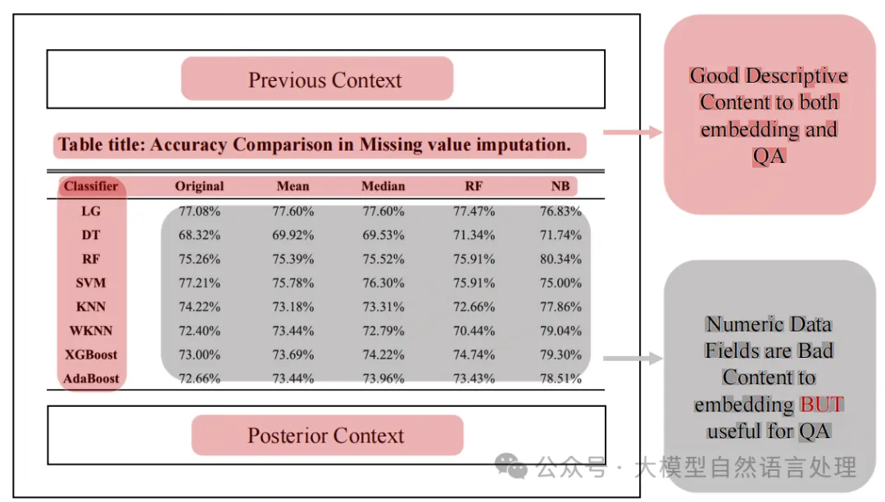
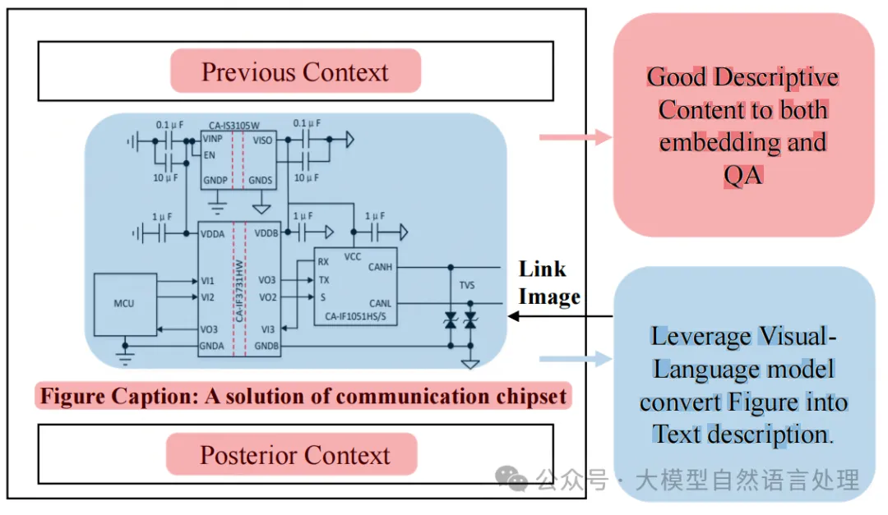
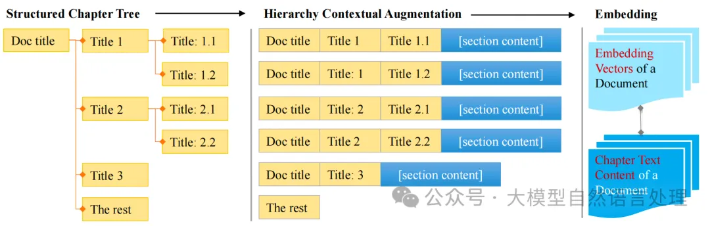
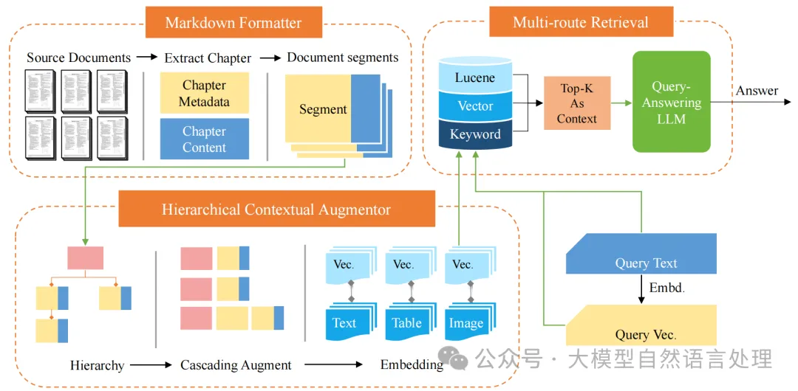
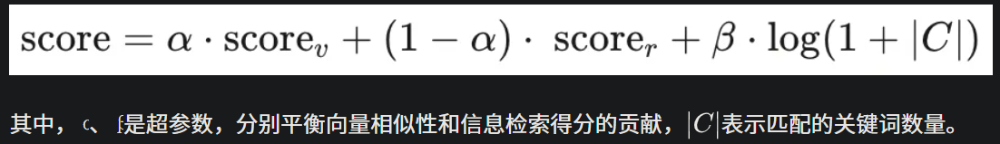
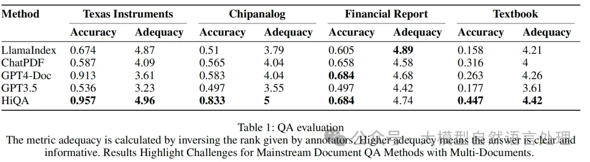
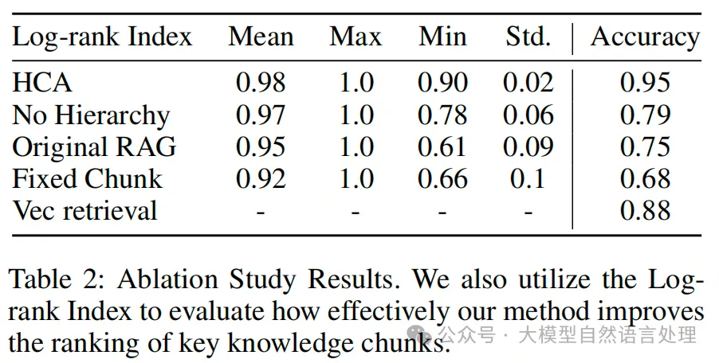

# 1. 资源

- HiQA: A Hierarchical Contextual Augmentation RAG for Multi-Documents QA，https://arxiv.org/pdf/2402.01767v2

# 2. 简介

提出了HiQA框架，用于解决多文档问答中的检索准确性问题。该框架主要由Markdown格式化器（Markdown Formatter）、分层上下文增强器（Hierarchical Contextual Augmentor, HCA）、多路径检索器（Multi-Route Retriever, MRR）三部分组成。

# 3. 原理
## 3.1 Markdown格式化器（Markdown Formatter）
该部分主要是使用大模型的方式指导文档解析生成markdown的过程，这样的比较耗费时间，可以考虑替换成一些轻量的解析方法，常见的过程可以参考以往的一些文档

下面看看这篇文章介绍的过程：

首先，使用LLM将源文档转换为Markdown格式的文档，每个章节对应一个自然段落，包含章节元数据和内容。LLM的处理过程如下：

其中，Di是输入的PDF文档，Dm是输出的Markdown文档，Mc是语言模型，Dmt是第个时间步的输出。

对于图片引用： 利用一个名为PDFImageSearcher的开源工具，用于从文档中提取位图和SVG矢量图 像，以及一个API来检索图像。它利用图像周围的文本、图像标题和一个可选的视觉语言模型，为每个图像生成一个描述性文件。

对表格增强：表格的语义值源自其定义，包括整体描述、标题和行/列标签，因此，在嵌入表格时，仅关注这些语义元素，将表格视为类似文本知识。

格嵌入。为了在嵌入过程中减少噪声，省略了数据字段。但是，如果检索到这些数据字段，它们将被保留以提供LLM的上下文

对图片增强：利用视觉语言生成模型来创建描述性标题，这些标题包含了图像的显著特征。然后对这些标题进行嵌入。

应用视觉-语言模型生成图像语义的文本描述，然后将其纳入片段中
总之，为了得到高质量的文档处理结果，使用指令进行生成markdown核心思想如下：

- 将文档中的每一章，无论其级别如何，都视为Markdown中的一级标题，并附上数字标识符。将每章视为一个知识片段，而不是固定大小的块。
- 设置正确的章节编号，后面跟着章节标题。
- 通过Markdown语法生成表格并记录表格标题。

## 3.2 分层上下文增强器（Hierarchical Contextual Augmentor, HCA）

使用级联文档结构在数据处理过程中进行文本增强：

从Markdown文件中提取层次结构元数据，并将其级联到每个章节，形成增强的段落。具体步骤包括：

- 使用深度优先搜索遍历章节树，连接和传递元数据。
- 对文本、表格和图像等不同类型的段落进行不同的处理。

## 3.3 多路径检索器（Multi-Route Retriever, MRR）
最后，采用多路径检索方法来找到最适合的段落，并将其作为上下文输入到语言模型中。具体方法包括：

- 向量相似性匹配：使用Elasticsearch和BM25。
- 关键词匹配：使用预训练的关键实体检测模型提取关键词。
- 补偿向量相似性限制：结合基于频率的检索技术和关键词排名策略。

综合以上三个组件，形成了HiQA框架。公式如下：

# 4. 实验效果

# 5. 总结

本文介绍了HiQA，这是一个专门为了解决现有RAG在多文档问答（MDQA）环境中的局限性而设计的新型框架，特别是在处理无法区分的多文档时。利用文档的结构元数据有效地进行块分割和嵌入增强，并辅以多路检索机制以提高检索效率。

# 参考

[1] 【RAG】HiQA：一种用于多文档问答的层次化上下文增强RAG, https://mp.weixin.qq.com/s/dDkB93ga4PsI-ywcwoqceQ