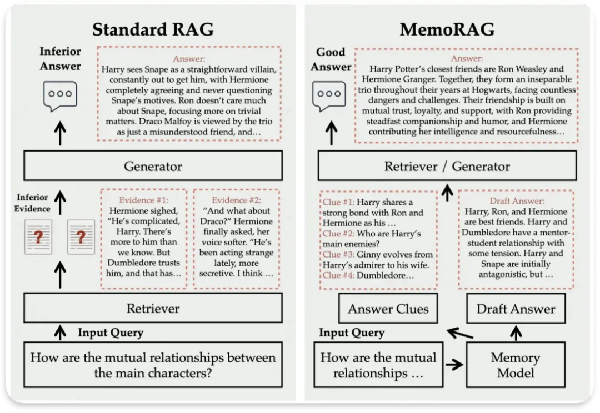

MemoRAG
对于每个呈现的任务，MemoRAG 会提示其记忆模块Memory Model生成检索线索Answer Clues。这些线索本质上是基于数据库的压缩表示（即记忆）起草的答案。尽管可能存在错误细节，但这些线索明确揭示了所呈现任务的潜在信息需求

①记忆性：记住整个数据库的全局信息

②指导性：提供有用的线索，基于这些线索可以全面检索所需的所有知识。

使用一个轻量级 LLM 作为记忆，另一个重量级 LLM 执行检索增强生成。轻量级 LLM 必须具有成本效益和长上下文能力，能够在有限的计算预算内容纳整个数据库。MemoRAG也对Memory Model进行微调，以便生成的线索能够实现优化的检索质量。

# 参考

[1] RAG进阶优化方向(2): 问题拆分, 检索线索和分步推理, https://mp.weixin.qq.com/s/RVFdiIPYchmO5GTQSbJWKQ