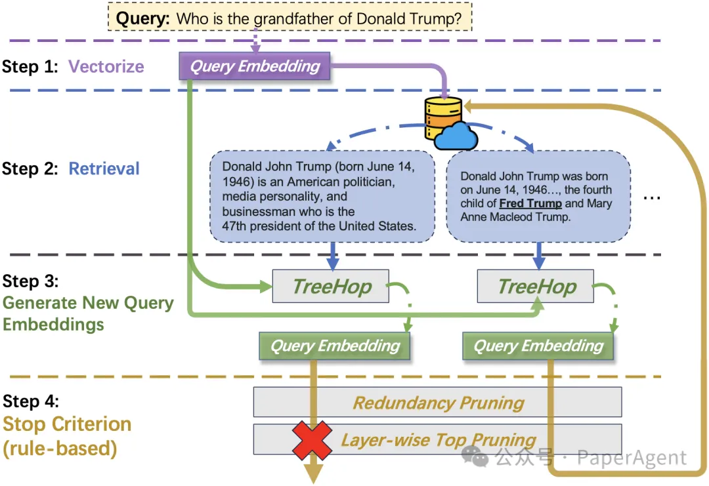
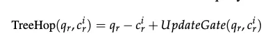
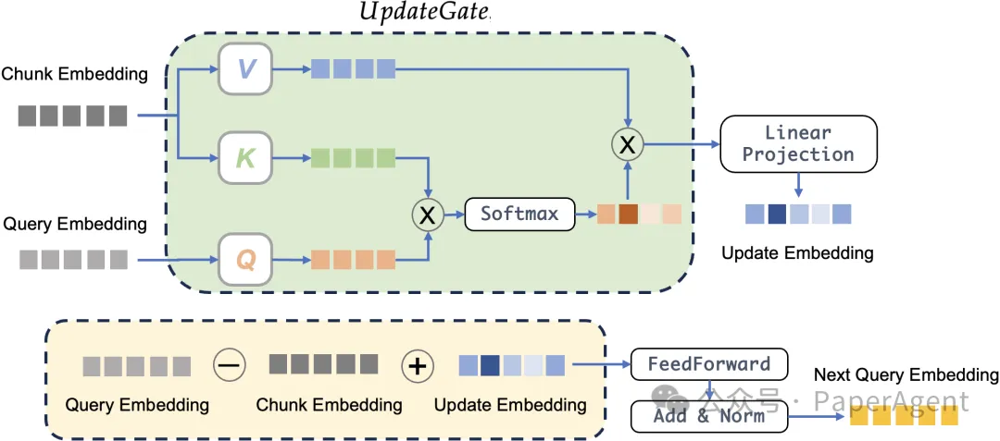
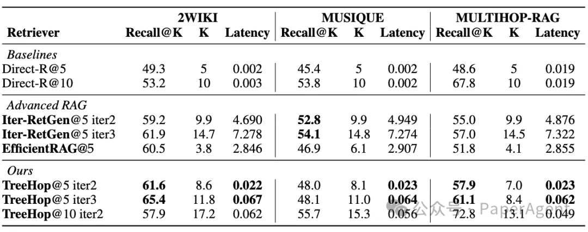

# 1. 资源

- 项目仓库：https://github.com/allen-li1231/treehop-rag
- Arxiv: https://arxiv.org/abs/2504.20114

# 2. 简介

在人工智能领域，多跳问答（Multi-hop Question Answering, MHQA）一直是一项极具挑战性的任务。这类任务要求系统通过多步推理，从不同文档片段中综合信息才能得出答案。例如，回答“特朗普的祖父是谁？”这样的问题，往往需要先检索“特朗普的父亲是弗雷德·特朗普”，再进一步查询“弗雷德·特朗普的父亲是谁”。然而，现有方法依赖大型语言模型（LLM）反复重写查询，导致计算成本高昂、延迟显著。近期，一项名为TreeHop的研究提出了一种全新的解决方案，通过嵌入空间的动态更新，实现了99%的延迟降低与5%-0.4%的模型参数量，为高效多跳推理开辟了新路径。

# 3. 问题

传统方法的瓶颈：LLM依赖与效率困境

现有的检索增强生成（RAG）系统通常采用“检索-重写-向量化-再检索”的循环流程。例如，系统需用LLM根据首次检索得到的文本生成新查询，再重新编码并检索。这一过程虽能提升召回，但每次迭代均需调用LLM对原问题进行重写（query rewrite），再使用sentence embedding模型映射到向量空间，导致计算资源消耗巨大，延迟过高，难以在工业场景中高效部署。

# 4. 方法

TreeHop的核心突破：嵌入空间的动态演化

TreeHop的创新在于完全摒弃LLM，直接在嵌入空间中完成多跳推理。其核心机制包括：

**1. 动态嵌入更新的双模块协同**

TreeHop通过query embedding与文档块嵌入的动态交互生成下一步查询，其公式为：

其中：

- ( q_r - c_r )：通过减法抑制当前query与文档块的语义重叠，避免冗余检索。例如，若当前文档已确认“弗雷德是特朗普的父亲”，从更高维的角度来理解，该操作会剔除query中与“弗雷德”相关的信息，确保下一跳聚焦于未解决的语义（如“弗雷德的父亲”）。
- UpdateGate：基于跨注意力机制（cross-attention），从文档块中提取query中没有的新信息并融合到query中。例如，当检索到“弗雷德是特朗普的父亲”时，UpdateGate会捕捉“弗雷德”这一新事实，并将其补充到query embedding中，形成下一跳的查询方向。

两者的结合实现了**“去冗余”与“信息增强”的协同**：减法操作防止重复检索，而加法操作引入新线索。

**2. 双重剪枝策略**

- 冗余剪枝：若某文档片段已在先前步骤中被检索，则终止该路径。
- 层级Top-K剪枝：每层仅保留相似度最高的K个候选，将检索复杂度从指数级（如5³=125）降至线性增长（如5*3=15）。

实验表明，TreeHop在3个主流MHQA数据集（2WikiMultiHop、MuSiQue、MultiHop RAG）上，仅用0.06秒即可完成3跳检索，召回率与LLM方案相当，部分场景甚至提升4.1%。

**工业应用：低成本部署与实时响应**

TreeHop的技术突破为工业界提供了极具吸引力的解决方案：

1. 成本效益：参数量仅为传统方案的0.4%-5%，可于单块Nvidia V100 GPU中训练，显著降低硬件投入。
2. 实时性：99%的延迟缩减使其适用于客服系统、金融信息检索等对多跳场景刚需，同时对响应速度敏感的领域。
3. 多语言支持：TreeHop基于BGE-m3模型的embedding训练，可快速适配全球化业务需求，如跨境法律咨询或跨地区医疗知识库。

# 参考

[1] TreeHop：无需大语言模型的高效多跳问答新范式