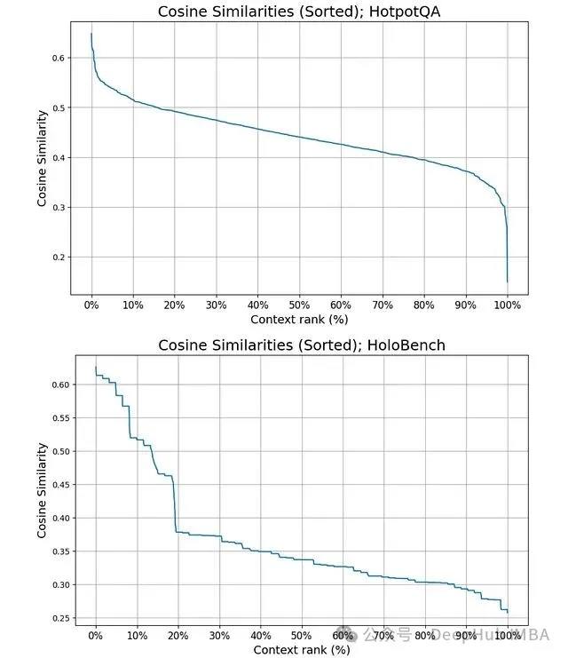
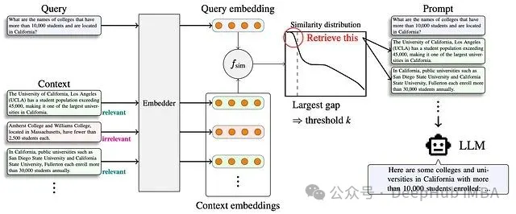
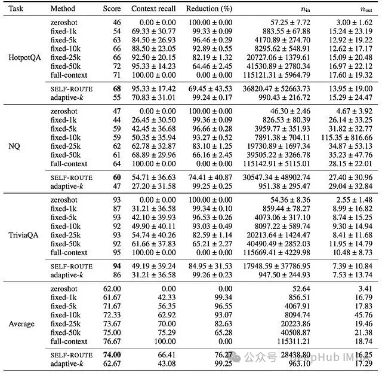
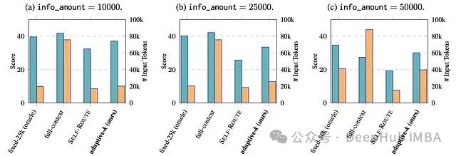
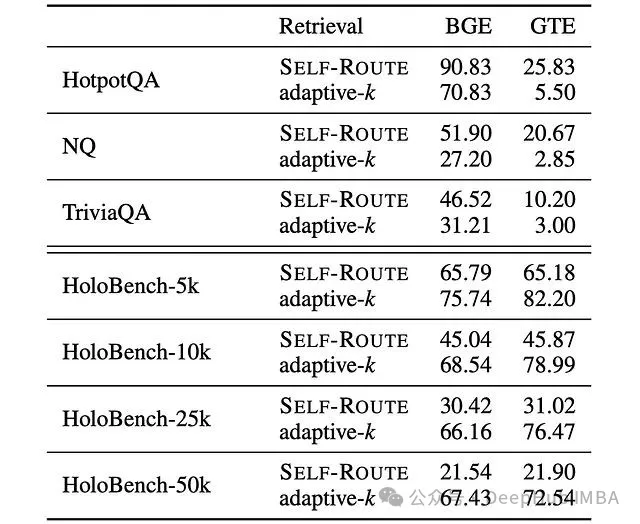

# 资源

Taguchi, C., Maekawa, S., & Bhutani, N. (2025). Efficient Context Selection for Long-Context QA: No Tuning, No Iteration, Just Adaptive-k. arXiv:2506.08479.

# 简介

本文介绍 Adaptive-k 检索技术，这是一种通过相似性分布分析动态确定最优上下文规模的即插即用方法，该技术在显著降低 token 消耗的同时实现了检索增强生成系统的性能提升。

在检索增强生成（RAG）技术快速发展的当前阶段，一个核心问题始终困扰着研究人员和工程师：如何确定最优的上下文长度？

上下文过少可能导致关键信息的缺失，而上下文过多则会引入噪声并大幅增加 token 消耗。随着长上下文语言模型（LCLM）技术边界的不断拓展，这一挑战变得更加突出。尽管这些模型理论上可以处理数百万个 token，但实际应用中，随着上下文长度的增加，模型性能往往出现下降，同时成本急剧上升，延迟也变得不可接受。

针对这一技术挑战，研究人员提出了 Adaptive-k 检索技术——一种能够根据查询特征自动确定最优上下文检索数量的方法。该方法无需模型微调、迭代提示或访问模型内部状态，具有显著的实用价值。

# 固定检索策略的技术局限性

传统 RAG 系统采用固定规模检索策略，通常检索前 k 个文档（如前 5、前 10 个），而不考虑查询复杂度或相关信息的分布特征。这种方法存在根本性的设计缺陷。

考虑两种典型的查询场景：事实性查询（如"法国的首都是什么？"）仅需要一个精确的事实信息，而聚合性查询（如"加州哪些大学的学生人数超过 10,000 人？"）则需要全面的证据收集。现有系统对这两种查询类型采用相同的处理策略，无论所需信息密度如何，都检索相同数量的上下文。

图为HELMET (Yen et al., 2025) 中包含的长上下文版本 HotpotQA (Yang et al., 2018)（包含 1,000 个上下文文档，顶部）和 HoloBench (Maekawa et al., 2025)（包含 10% 相关信息量，底部）的已排序余弦相似性示例分布。使用 BAAI 的 bge-large-en-v1.5 作为嵌入模型。

这种策略导致的问题包括：计算资源在不相关上下文上的浪费、信息过载导致的性能下降、不同查询类型结果的不一致性，以及随着上下文窗口扩展而产生的可扩展性问题。

# 智能上下文选择的理论基础

最新研究表明，最优上下文规模不仅与查询相关，而且可以通过查询与候选文档间的相似性得分分布进行预测。这一发现构成了 Adaptive-k 检索技术的理论基础。

核心观察结果表明：相关文档在相似性空间中呈现聚集模式，形成可通过算法检测的自然边界。对于事实性问题，通常在少数高度相关文档之后出现急剧的相似性下降。对于聚合性任务，虽然模式更为复杂，但相似性分布中的间隙同样对应着相关内容与不相关内容之间的自然边界。

真实数据集的分析验证了这一理论：事实性任务显示出明显的间隙，将高度相关的文档与噪声分离；聚合性任务呈现更分散的模式，但具有多个潜在的截止点；最大的相似性间隙始终对应于最优检索边界。

# Adaptive-k 算法的技术实现

Adaptive-k 算法的核心优势在于其实现的简洁性。算法工作流程如下：

相似性计算

算法首先计算查询嵌入 q ∈ R^d 与文档嵌入集合 C ∈ R^(N×d) 之间的余弦相似性，得到相似性得分向量 s = cosine_similarity(q, C)。

间隙分析

自适应检索

算法检索前 k 个文档，其中 k 对应于最大相似性间隙的位置，并添加小的缓冲区（通常为 5 个文档）以处理边界效应。

RAG 工作流程中提出的方法。该方法根据已排序相似性得分分布中的较大间隙选择检索阈值 k。

该算法的计算复杂度为 O(n log n)（用于排序），空间复杂度为 O(n)（用于存储相似性得分和间隙），计算开销最小，仅需一次额外的排序操作。

实际部署的算法优化

为提高实际应用的适应性，基础算法包含几项重要改进：

间隙搜索约束：为防止选择不相关文档，最大间隙的搜索被限制在按相似性得分排名的前 90% 文档中。缓冲区机制：在识别的阈值后添加固定缓冲区（B=5），以捕获边界相关文档。最小阈值保证：始终检索最少数量的文档（通常为 1-3 个），确保提供基本上下文。

# 多基准测试的性能验证

Adaptive-k 技术在综合评估中展现出卓越的性能表现。测试涵盖了事实性问答任务（HotpotQA、Natural Questions、TriviaQA）和聚合性任务（HoloBench）。

事实性问答任务性能

在事实性问答任务中，Adaptive-k 实现了与全上下文输入相比 99% 的 token 减少，与 SELF-ROUTE 相比 90% 的 token 减少，同时在所有测试模型中保持或提高了准确性，真正相关文档的上下文召回率稳定在约 70%。

Gemini-2.5-Flash 在事实型问答任务中的完整结果。

聚合性问答任务突破

在聚合性任务中，Adaptive-k 的表现更为突出。该方法在高信息量任务上的准确性比 SELF-ROUTE 提高多达 9 个百分点，能够根据信息密度灵活扩展，在需要时自动检索更多上下文。与现有自适应方法相比，上下文召回率提高 3 倍，在不同信息密度（5k 到 50k 相关 token）下均保持稳健性能。

HoloBench 任务中不同相关信息量的结果。选择性能最佳的固定 n 设置作为参照标准。蓝色条表示性能改进，黄色条表示输入 token 的数量。

模型通用性验证

Adaptive-k 技术的一个重要特征是其广泛的模型适用性。该方法可以无缝应用于多种大型语言模型，包括 GPT-4o 和 GPT-4o-mini、Gemini-2.5-Flash、Llama4-Scout 和 Llama4-Maverick。同时，该技术支持多种嵌入模型，如 BAAI 的 bge-large-en-v1.5 和 Alibaba NLP 的 gte-Qwen2–1.5B-instruct。

HoloBench 任务中不同阅读器模型的性能比较。嵌入模型为 bge-large-en-v1.5。蓝色条表示性能改进，黄色条表示输入 token 的数量。

实验结果显示，能力更强的大型模型从 Adaptive-k 检索中获得更大的性能提升，这表明复杂模型能够更好地利用该方法提供的精确策划的上下文。

# 嵌入模型对技术效果的影响

研究分析揭示了一个重要发现：嵌入模型的选择对 Adaptive-k 技术的效果具有显著影响。不同的嵌入模型在不同类型的任务上表现出不同的优势特征。

BGE 嵌入在事实性问答任务上持续产生更高的上下文召回率，而 GTE 嵌入在聚合任务（HoloBench）上表现更佳。此外，上下文块长度和分块方案似乎会影响模型的表现偏好。

BGE (bge-large-en-v1.5) 和 GTE (gte-Qwen2–1.5B-instruct) 在不同任务上的上下文召回率得分比较。

这一发现表明，未来的 RAG 系统可能受益于基于查询特征的集成嵌入方法或运行时嵌入模型选择策略。

# 主要影响
Adaptive-k 技术不仅是一种优化方法，更代表了向智能化、查询感知信息检索的范式转变。该技术解决了制约 RAG 系统发展的三个关键限制。

成本效益优化

通过在保持性能的同时大幅减少 token 使用量，Adaptive-k 使大规模 RAG 部署在经济上变得可行。高达 99% 的 token 减少直接转化为云端模型 API 成本的降低、本地部署能耗的减少、因上下文缩短而带来的推理时间加速，以及环境可持续性的改善。

真正的模块化设计

与需要微调或白盒访问的方法不同，Adaptive-k 可作为固定 k 检索的直接替代方案。该技术与闭源模型 API 兼容，对现有 RAG 管道无需架构更改，支持生产系统中的即插即用部署，并且具有框架无关的实现特性。

查询特定的智能化

该方法根据信息需求调整检索规模的能力代表了根本性的技术进步。它能够无需手动调整即可自动检测复杂性，基于查询需求进行动态资源分配，在不同查询类型中保持性能一致性，并随着上下文窗口的扩展具备面向未来的可扩展性。

主要影响
Adaptive-k 技术不仅是一种优化方法，更代表了向智能化、查询感知信息检索的范式转变。该技术解决了制约 RAG 系统发展的三个关键限制。

成本效益优化

通过在保持性能的同时大幅减少 token 使用量，Adaptive-k 使大规模 RAG 部署在经济上变得可行。高达 99% 的 token 减少直接转化为云端模型 API 成本的降低、本地部署能耗的减少、因上下文缩短而带来的推理时间加速，以及环境可持续性的改善。

真正的模块化设计

与需要微调或白盒访问的方法不同，Adaptive-k 可作为固定 k 检索的直接替代方案。该技术与闭源模型 API 兼容，对现有 RAG 管道无需架构更改，支持生产系统中的即插即用部署，并且具有框架无关的实现特性。

查询特定的智能化

该方法根据信息需求调整检索规模的能力代表了根本性的技术进步。它能够无需手动调整即可自动检测复杂性，基于查询需求进行动态资源分配，在不同查询类型中保持性能一致性，并随着上下文窗口的扩展具备面向未来的可扩展性。

# 核心技术要点总结
Adaptive-k 代表了 RAG 系统从固定检索向智能化、查询感知检索的技术范式转变。该技术实现了显著的效率提升——在保持或提高准确性的同时，token 减少高达 99%。

该方法具有真正的即插即用特性，无需模型微调、迭代提示或架构更改。性能随模型能力扩展，更大、更复杂的模型显示出更大的优势。嵌入模型的选择对技术效果至关重要，不同模型在不同类型任务上表现出色。

实际应用涵盖多个领域，从客户支持到法律研究再到医疗信息系统。一刀切检索策略的时代已经结束，Adaptive-k 开启了智能、高效且经济可行的 RAG 系统时代，这些系统能够适应每个查询的独特需求。

随着人工智能驱动的信息检索技术不断发展，Adaptive-k 等方法对于使这些技术进步变得实用和可持续具有关键意义。该技术为构建更智能、更高效的检索增强生成系统提供了重要的理论基础和实践指导。

# 参考

[1] Adaptive-k 检索：RAG 系统中自适应上下文长度选择的新方法, https://mp.weixin.qq.com/s/Hz7Lh3uq9ddi4adE9NSDUA