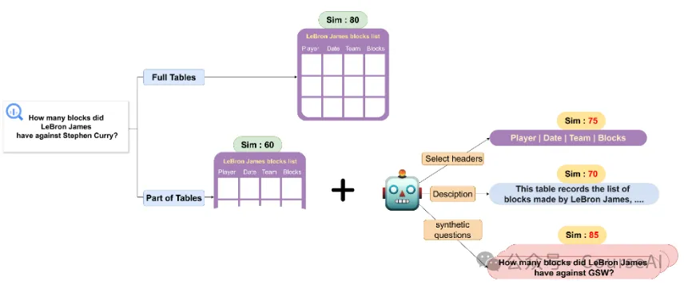
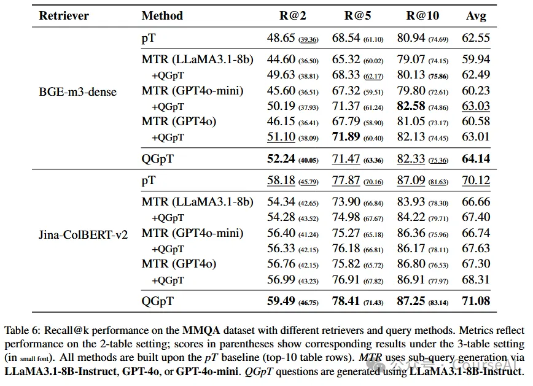
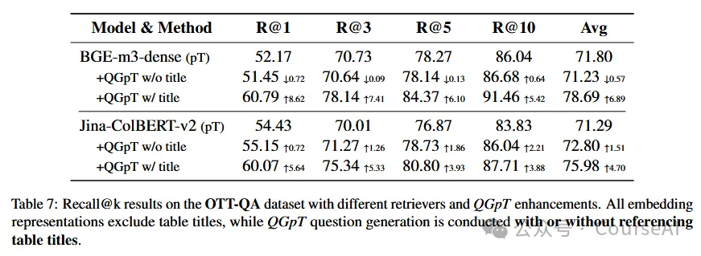

# 1. 资源

https://arxiv.org/pdf/2508.06168

https://github.com/cc3374twa/QGpT

# 2. 问题

表格检索，在RAG中是一个非常小众的问题，主要基于Retriever-Reader架构的表格问答（Table-QA）系统中，Retriever组件负责从大规模表格语料库中检索出与问题相关的候选表格，而Reader组件则在检索到的表格上进行具体的问答推理。 这里有个一个非常关键的点是：如何将表格的语义与用户的问题语义进行对齐。

# 3. 原理

（一）离线阶段
表格预处理：将每个表格转换为Markdown格式，并提取其名称和前10行，构建一个新的部分表格语料库。这一过程的目的是减少计算成本，同时保留表格的核心语义信息。
模拟问题生成：利用大型语言模型根据部分表格生成模拟问题。生成的问题需要满足一定条件，如涉及1到3个不同的表头字段，以捕捉表格中数据之间的交互关系。这一过程的目的是通过生成模拟问题来丰富表格的语义表示。
联合嵌入：将生成的模拟问题与部分表格联合嵌入到同一向量空间中。通过这种方式，可以增强表格与用户查询之间的语义对齐，从而提高检索性能。
（二）在线阶段

用户查询嵌入：给定一个用户查询，计算其嵌入表示。这一过程的目的是将用户查询转换为与表格表示相同的向量空间，以便进行相似度计算。
相似度计算：将用户查询的嵌入表示与所有表格表示进行余弦相似度计算。这一过程的目的是找到与用户查询最相似的表格。
检索与排序：根据相似度计算结果，检索出与用户查询最相似的前k个表格。这一过程的目的是为用户提供最相关的表格。
（三）训练过程
数据准备：准备一个包含多个表格的数据集，并对其进行预处理，提取每个表格的前10行作为部分表格。
模型训练：利用大型语言模型对部分表格进行模拟问题生成，并将生成的问题与部分表格联合嵌入到同一向量空间中。这一过程的目的是训练一个能够生成高质量模拟问题并进行联合嵌入的模型。

增加QGpT的检索方式，都增加了检索收益，而且融入表格的标题，收益还能进一步提升。

# 参考

[1] 华人团队让AI把表格“翻译”成问题，检索速度×5, https://mp.weixin.qq.com/s/JMgXN05Opwxbt0nQk9vibA