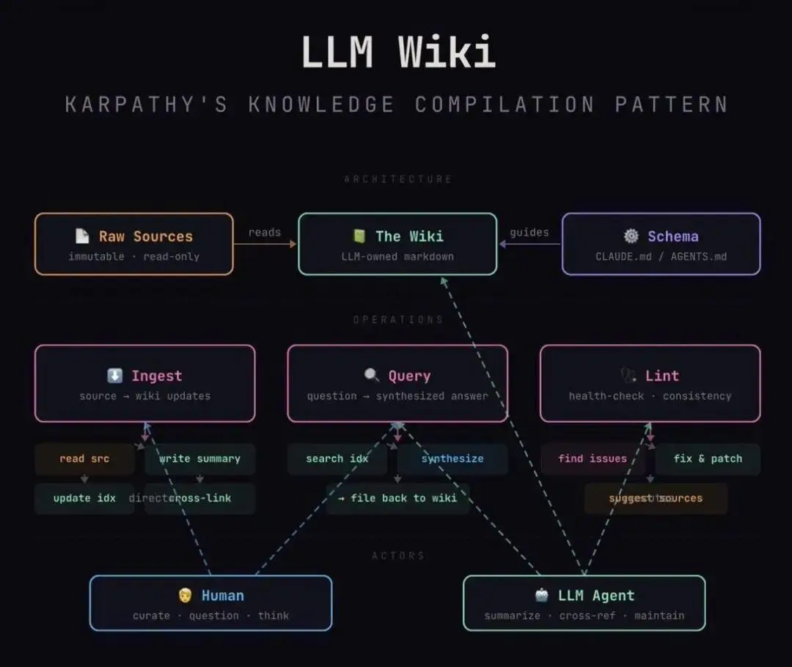
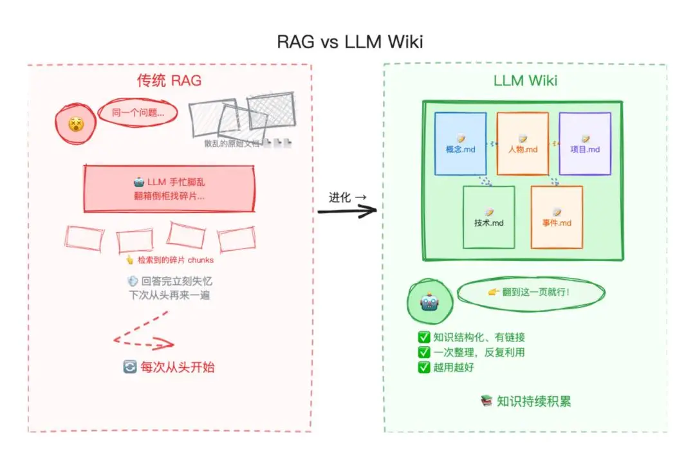

- Github (287 stars): https://github.com/Astro-Han/karpathy-llm-wiki

二、架构
分为三层：

原始资料源（Raw Sources）——你精心筛选的源文档集合。文章、论文、图片、数据文件。这些是只读的——LLM 从中读取但绝不修改，原始资料永远保持原样。这是你的权威来源（source of truth，当信息冲突时以此为准）。

Wiki——一个由 LLM 生成的 Markdown 文件目录。摘要、实体页面、概念页面、对比分析、概览、综合判断。这一层完全由 LLM 拥有。它创建页面、在新资料到达时更新页面、维护交叉引用、保持一切一致。你负责阅读，LLM 负责写。

Schema（模式定义）——一份配置文档（例如 Claude Code 的 CLAUDE.md 或 OpenAI Codex 的 AGENTS.md——这些是各家 AI 编程工具的项目配置文件，告诉 AI 该遵循什么规则），定义 wiki 的结构是怎样的、约定是什么、在摄入资料、回答问题或维护 wiki 时应遵循什么工作流。这是关键配置文件——它让 LLM 成为一个有纪律的 wiki 维护者，而非一个通用聊天机器人。随着你对自己领域的理解加深，你和 LLM 会一起迭代这份文档，让它越来越好用。

三、操作
摄入（Ingest）。你把新资料放进原始资料集，然后让 LLM 处理它。一个典型流程：LLM 阅读资料，与你讨论关键要点，在 wiki 中写一个摘要页面，更新索引，更新 wiki 中相关的实体和概念页面，并在日志中追加一条记录。一个资料源可能触及 10-15 个 wiki 页面。我个人偏好逐条摄入资料并全程参与——我读摘要、检查更新、引导 LLM 强调什么。但你也可以批量摄入大量资料，减少监督。怎么做取决于你自己，找到适合你的工作流后，记在 Schema 里，下次开新会话时 LLM 就能沿用。

查询（Query）。你针对 wiki 提问。LLM 搜索相关页面、阅读它们、综合出带引用的答案。答案可以根据问题采取不同形式——一个 Markdown 页面、一个对比表格、一套幻灯片（Marp，一种把 Markdown 转成演示文稿的工具）、一张图表（matplotlib，Python 制图库）、一个画布。重要洞察：好的答案可以作为新页面归档回 wiki。你请求的一次对比分析、一个分析结论、你发现的一个关联，这些都值得留下来，不应该消失在聊天历史中。这样，你的探索就像摄入的资料源一样，在知识库中实现复利增长。

检查（Lint——借用编程术语，原指代码静态检查工具，这里指对知识库做系统性的健康检查）。定期让 LLM 对 wiki 做健康检查。寻找：页面之间的矛盾、已被更新资料取代的过时论断、没有任何入站链接的孤儿页面（orphan pages，即没有其他页面链接到它的"孤岛"页面）、被提及但缺少独立页面的重要概念、缺失的交叉引用、可以通过网络搜索填补的数据缺口。LLM 擅长建议新的调查问题和新的资料来源。这让 wiki 在增长过程中保持健康。

四、索引与日志
两个特殊文件帮助 LLM（和你）在 wiki 增长时进行导航。它们的用途不同：

index.md面向内容。它是 wiki 中所有内容的目录——每个页面列出链接、一行摘要，以及可选的元数据（如日期或资料源计数）。按类别组织（实体、概念、资料源等）。LLM 在每次摄入时更新它。回答查询时，LLM 先读索引找到相关页面，再深入查看。这在中等规模（约 100 个资料源、数百个页面）下效果出奇地好，避免了基于 embedding（嵌入向量，一种把文本转成数字向量以便计算相似度的技术）的 RAG 基础设施的需求。

log.md面向时间线。它是一个只追加的记录（append-only，只增不改不删），记录发生了什么以及何时发生——摄入、查询、检查。一个实用技巧：如果每条记录以统一的前缀开头（例如## [2026-04-02] ingest | Article Title），日志就可以用简单的 Unix 命令行工具解析——grep "^## \[" log.md | tail -5就能给你最后 5 条记录。日志给你 wiki 演进的时间线，帮助 LLM 了解最近做了什么。

