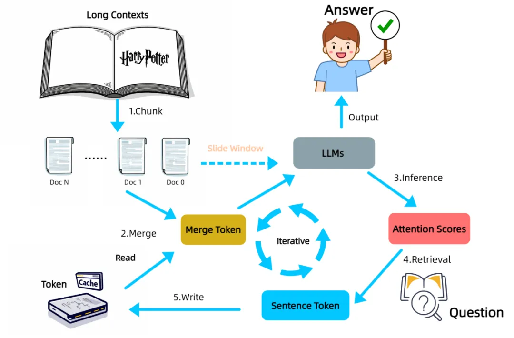
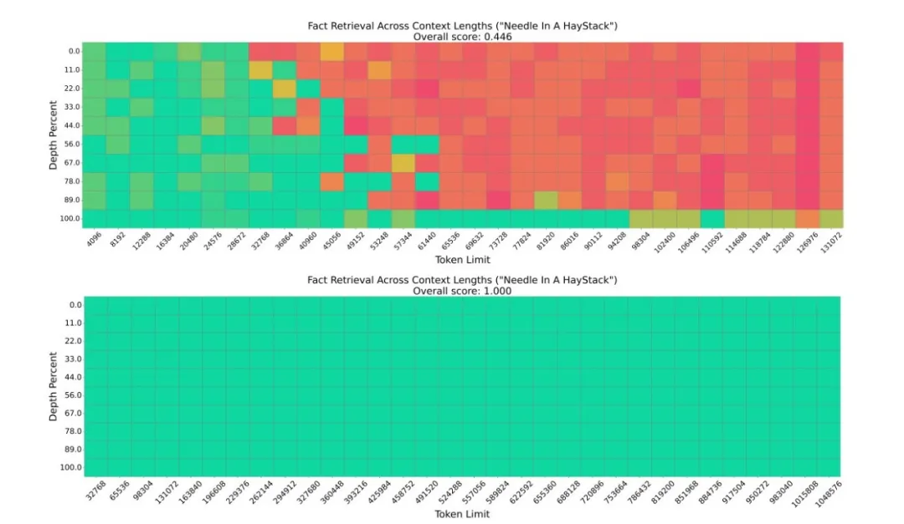
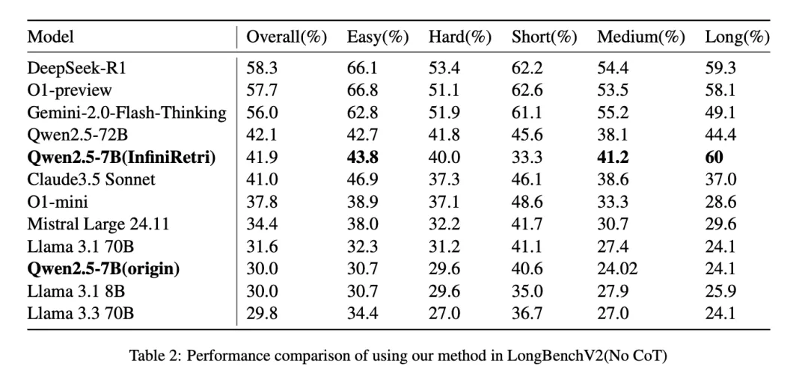

# 1. 资源

Infinite Retrieval: https://arxiv.org/pdf/2502.12962

# 2. 问题

处理超出上下文窗口限制的长文本一直是大模型面临的关键挑战之一。传统方法是要么训练支持更长上下文的模型或是通过RAG的方式变通实现，效果和效率往往难以兼顾。近期，北师大研究团队发表了一篇论文《Infinite Retrieval: Attention Enhanced LLMs in Long-Context Processing》，提出了一种名为 Infinite Retrieval 的新方法，该方法无需额外训练，即可赋能现有模型理论上就可以处理无限长度的文本。

InfiniRetri 的核心在于一个关键发现：LLMs 在执行推理任务时展现出的注意力分配模式，与信息检索的过程存在内在的一致性，因此也叫“注意力即检索”。 形象地说，就像人类在阅读长篇书籍时，大脑会对关键信息给予更高的关注。研究发现，在 LLMs 的深层网络中，注意力机制能够更精准地聚焦于与当前任务相关的上下文片段。

# 3. 原理

基于这一洞察，InfiniRetri 采用了一种无需额外训练的迭代式处理流程。面对超长文本，它将其划分为若干连续的片段，并逐一输入 LLM 进行处理。关键的创新在于，InfiniRetri 在处理每个文本片段后，会利用 LLM 最后一层的注意力分布信息，识别并保留那些被模型认为最相关的句子。 这些被“重点关注”的句子被存储在一个外部缓存中，如同大脑在阅读过程中记住的关键情节。

在处理后续的文本片段时，InfiniRetri 会将缓存中保留的相关句子与当前片段进行合并，共同作为 LLM 的输入。这种机制使得 LLM 在处理局部文本时，能够“回忆”起先前被认为重要的上下文信息，从而在整体上理解和处理更长的文本。与直接缓存模型内部状态不同，InfiniRetri 仅缓存关键的句子文本，这更类似于人类记忆语义信息而非底层的神经元激活。

在模拟“大海捞针”式信息检索的 NIH 任务中，该方法使一个轻量级的模型（0.5B 参数的 Qwen2.5-0.5B）在 100 万 tokens 的超长文本中实现了 100% 的检索准确率，显著超越了现有技术。在更贴近实际应用的 LongBench 基准测试中，InfiniRetri 同样在多个主流 LLMs 上取得了显著的性能提升，尤其在多文档问答等需要整合多来源信息的任务中表现突出，Qwen2-7B-Instruct 在 HotpotQA 上的提升高达 288%。此外，通过选择性地缓存和处理关键信息，有效降低了推理延迟和计算资源消耗。

# 4. 小结

InfiniRetri 的核心创新在于发掘并利用了 LLMs 固有的注意力机制进行信息检索，为长文本处理提供了一种全新的、高效且无需额外训练的解决方案。它表明，提升 LLMs 在长上下文场景下的能力，并非仅依赖于扩大模型窗口，增强模型在有限窗口内的“内在理解”能力同样至关重要。

同时，InfiniRetri 并非全能， 虽然它在长文本检索和问答方面表现出色，但由于依赖局部注意力信息迭代地“回忆”关键信息，对于需要全面理解整个长文本才能完成的任务，例如长文档摘要，它无法一次性获取所有必要信息，从而导致性能提升相对有限。

# 参考

[1] Infinite Retrieval：不用RAG也无需长上下文模型就能实现无限上下文检索的新方法！https://mp.weixin.qq.com/s/244zbU48eYVwiPiMAkgSBw