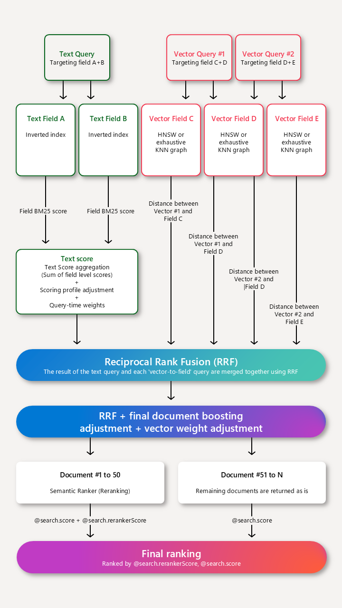

hybrid.py：代码来源：https://github.com/IAAR-Shanghai/CRUD_RAG.git

注意：如下方案来自GPT-4o解释，核验应该问题不大。

---

处理流程

--- 

RRF（**Reciprocal Rank Fusion**，倒数排名融合）是一种简单但有效的融合算法，用来将多个不同排序结果（如 embedding 召回和 BM25 检索）融合成一个更优的排序结果。

### 通俗解释 RRF 的原理：
1. **每个方法提供一份排序清单**：假设有两种检索方法，embedding 和 BM25，它们各自返回了一份按相关性排序的文档列表，比如：
   - **Embedding 排序**：`D1, D3, D5, D2, ...`
   - **BM25 排序**：`D2, D4, D3, D1, ...`

2. **为每个文档分配一个分数**：
   - 每个文档的分数是它在该方法中排名的倒数，具体公式为：  
     \[
     \text{Score}_i = \frac{1}{k + \text{Rank}_i}
     \]
     其中，**Rank\_i** 是文档在该方法中的排名，**k** 是一个平滑参数，通常取 60 或类似的值，用于避免分数过大。

   - 例如，在 embedding 排序中，`D1` 是第 1 名，`D3` 是第 2 名，那么它们的分数是：
     - \( \text{Score}_{D1} = \frac{1}{60 + 1} \)
     - \( \text{Score}_{D3} = \frac{1}{60 + 2} \)

   - 对 BM25 排序也进行类似处理。

3. **融合多个分数**：  
   - 对每个文档，计算它在所有方法中的分数总和。如果某个方法没有包含该文档，可以认为它的排名非常低（分数接近零）。
   - 例如：
     - `D1` 的总分 = (embedding 分数) + (BM25 分数)
     - `D2` 的总分 = (embedding 分数) + (BM25 分数)

4. **重新排序**：  
   - 根据总分对所有文档进行排序，分数越高，排名越靠前。

---

### 为什么分母中有60？

这是一个平滑参数，用于避免分数过大。如果不加平滑，排名第一的文档分数将是1，而排名第二的文档分数将是0.5，这样的分数差异过大，不利于融合。因此，我们使用倒数来平滑分数，使得排名靠前的文档分数更接近，提高融合效果。

---

### RRF 在 RAG 系统中的应用可以分为几个步骤：

1. 用户输入查询，系统开始处理。

2. 查询被发送到多个检索器，这些检索器可以是不同的检索模型，例如密集型、稀疏型或者混合型。

3. 每个检索器生成自己的相关文档排名。

4. 使用 RRF 公式将所有检索器的排名结合起来，计算每个文档的总得分。

5. 根据 RRF 得分生成最终的统一排名。

6. 最后，生成模型使用排名靠前的文档来生成最终的答案。

7. 通过这样的流程，RRF 能有效地综合多个检索器的结果，提高 RAG 系统的整体性能和准确性。

---

### RRF 的特点：
- **简单高效**：RRF 不需要复杂的参数优化或模型训练，只需按排名计算倒数分数。
- **兼容性强**：RRF 可以轻松结合不同来源或不同模型生成的排序结果。
- **稳健性**：即使某个方法的排序质量不高，也不会显著影响最终结果。

### 举个例子：
假设我们有以下文档排名和融合过程：
| 文档 | Embedding Rank | BM25 Rank | Embedding Score | BM25 Score | RRF 总分 |
|------|----------------|-----------|-----------------|------------|----------|
| D1   | 1              | 4         | \( \frac{1}{61} \) | \( \frac{1}{64} \) | \( 0.0328 + 0.0156 = 0.0484 \) |
| D2   | 4              | 1         | \( \frac{1}{64} \) | \( \frac{1}{61} \) | \( 0.0156 + 0.0328 = 0.0484 \) |
| D3   | 2              | 3         | \( \frac{1}{62} \) | \( \frac{1}{63} \) | \( 0.0161 + 0.0159 = 0.0320 \) |

最终，`D1` 和 `D2` 得分最高，并列第一，`D3` 次之。

通过 RRF，你可以将不同检索方法的优点结合起来，生成更准确的结果排序！

# 参考

[1] 字节面试官：什么是RRF，你能解释一下吗？https://blog.csdn.net/dsxaigc/article/details/141199802
[2] 在混合搜索中使用倒数排名融合 (RRF) 的相关性评分，https://learn.microsoft.com/zh-cn/azure/search/hybrid-search-ranking