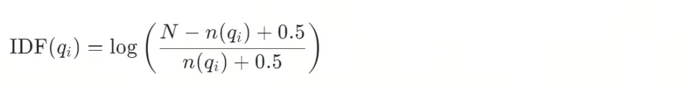
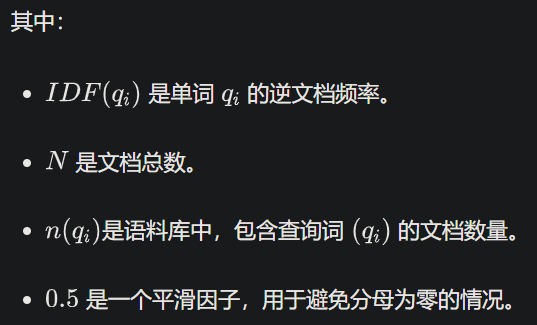
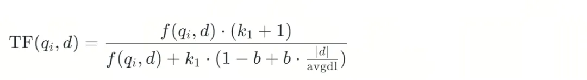
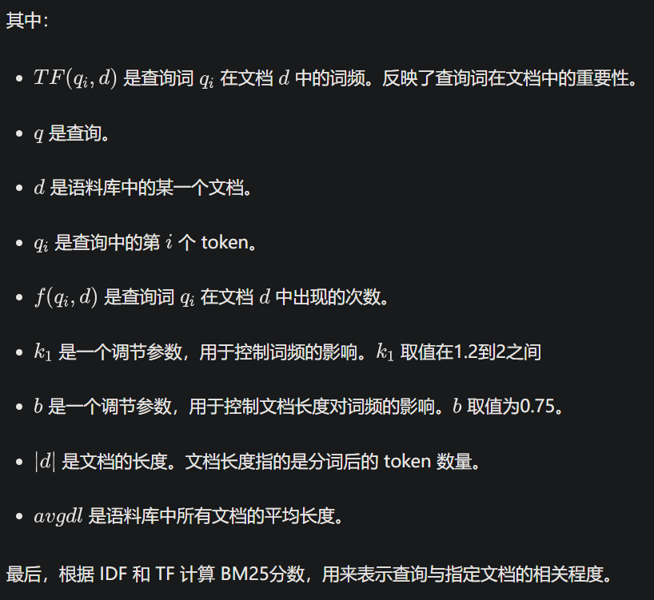
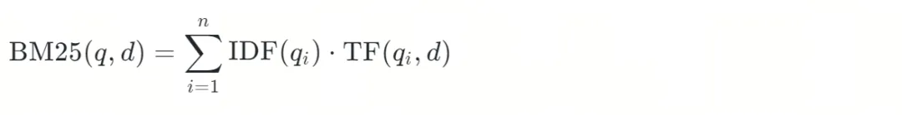

# 1. 原理介绍

稀疏向量分成统计得到的稀疏向量和学习得到的稀疏向量两种，我们先聊聊第一种，代表就是 BM25。

BM25 是一位聪明的门外汉，你问他领域外的知识，他虽然不理解，但是他会找到问题中的关键词，比如“人工智能”和“汽车”，然后去查文档，把文档中和关键词最相关的信息告诉你。

那么，这位门外汉具体是怎么做的呢？

首先，他会搜索成百上千篇相关文档，并且快速地翻一遍，了解这些文档中有哪些专业术语。什么样的词是专业术语呢？作为一个聪明的门外汉，他决定通过单词出现的频率判断。像“的”、“是”、“了”等常见词肯定不是专业术语，反而是那些出现频率比较低的词，更可能是专业术语。

这就好比你有两个微信群，一个是工作群，平时消息不多，但是一旦有消息，不是领导布置任务，就是同事反馈进度，都很重要，你把这个群置顶了。

另一个是吃喝玩乐群，一群朋友在群里聊天吹水，一整天消息不断，但是没那么重要，错过就错过了，忙的时候你还会设置成“信息免打扰”。

对你来说，不同的群权重不同，门外汉也会为不同的词设置不同的权重。他会为文档中出现的词建立一个词汇表，并且根据单词出现的频率赋予权重，出现的频率越低，权重越大，越可能是专业术语。

然后，他要判断哪些文档和“人工智能”以及“汽车”这两个专业术语更相关。他会对照词汇表，数一数每篇文档中这两个术语出现的频率，频率越高，相关性越大。

以上是 BM25 的极简版解释，实际算法要复杂很多。公式越多，读者越少，所以下面我就简单介绍下 BM25 算法的工作原理。

首先，BM25对文档集合做分词处理，得到一张词汇表。词汇表的单词（准确来说是 token）的数量，就是稀疏向量的维度。

然后，对查询也做分词处理，比如，如果查询是“人工智能如何影响汽车行业？”，分词得到“人工智能“”、“影响”和“汽车行业”这三个词。

接下来，计算文档集合中的每个词的逆文档频率 IDF，以及查询中的某个词在指定文档中的词频 TF。

逆文档频率 IDF（Inverse Document Frequency），很绕口的一个名字。简单来说，它用来计算某个词在文档集合中出现的次数。出现次数越少，数值越大。门外汉用它给出现频率低的专业术语，赋予更大的权重。





词频TF（Term Frequency）表示查询中的某个词，在指定文档中出现的频率，频率越大数值越大，也就意味着查询和该文档的相关性更高。







# 2. Milvus实战

BM25 代码实践

好啦，纸上谈兵到此结束，下面我们用代码实际操练一番吧。先做点准备工作：

Milvus 版本：>=2.4.0

安装依赖：

```bash
!pip install pymilvus==2.4.7 "pymilvus[modle]" torch
```

假如下面的字符串列表就是我们的文档集合，每个字符串是一个文档：

```python
docs = [
    "机器学习正在改变我们的生活方式。",
    "深度学习在图像识别中表现出色。",
    "自然语言处理是计算机科学的重要领域。",
    "自动驾驶依赖于先进的算法。",
    "AI可以帮助医生诊断疾病。",
    "金融领域广泛应用数据分析技术。",
    "生产效率可以通过自动化技术提高。",
    "机器智能的未来充满潜力。",
    "大数据支持是机器智能发展的关键。",
    "量子隧穿效应使得电子能够穿过经典力学认为无法穿过的势垒，这在半导体器件中有着重要的应用。"
]
```

使用BM25对第一个文档“机器学习正在改变我们的生活方式。”做分词处理：

```python
from pymilvus.model.sparse.bm25.tokenizers import build_default_analyzer
from pymilvus.model.sparse import BM25EmbeddingFunction

# 使用支持中文的分析器
analyzer = build_default_analyzer(language="zh")

# 分析器对文本做分词处理
tokens1 = analyzer(docs[0])
print(tokens1)
```

分词结果如下：

```bash
['机器', '学习', '改变', '生活', '方式']
```

接下来对整个文档集合做分词处理，并且计算文档集合的 IDF 等参数：

```python
# 创建BM25EmbeddingFunction实例，传入分词器，以及其他参数
bm25_ef = BM25EmbeddingFunction(analyzer)

# 计算文档集合的参数
bm25_ef.fit(docs)

# 保存训练好的参数到磁盘以加快后续处理
bm25_ef.save("bm25_params.json")
```

我们看下参数有哪些内容：

```python
import json

file_path = "bm25_params.json"
with open(file_path, 'r', encoding='utf-8') as file:
    bm25_params = json.load(file)
    print(bm25_params)
```

corpus_size 是文档数量，avgdl、idf_value 等参数都在前面的公式中出现过。

```json
{'version': 'v1', 'corpus_size': 10, 'avgdl': 5.4, 'idf_word': ['机器', '学习', '改变', '生活', '方式', '深度', '图像识别', '中', '表现出色', '自然语言', '计算机科学', '领域', '自动', '驾驶', '依赖于', '先进', '算法', 'AI', '医生', '诊断', '疾病', '金融', '广泛应用', '数据分析', '技术', '生产', '效率', '自动化', '提高', '智能', '未来', '充满', '潜力', '大', '数据', '支持', '发展', '关键', '量子', '隧穿', '效应', '电子', '穿过', '经典力学', '势垒', '半导体器件'], 'idf_value': [0.7621400520468966, 1.2237754316221157, 1.845826690498331, 1.845826690498331, 1.845826690498331, 1.845826690498331, 1.845826690498331, 1.2237754316221157, 1.845826690498331, 1.845826690498331, 1.845826690498331, 1.2237754316221157, 1.845826690498331, 1.845826690498331, 1.845826690498331, 1.845826690498331, 1.845826690498331, 1.845826690498331, 1.845826690498331, 1.845826690498331, 1.845826690498331, 1.845826690498331, 1.845826690498331, 1.845826690498331, 1.2237754316221157, 1.845826690498331, 1.845826690498331, 1.845826690498331, 1.845826690498331, 1.2237754316221157, 1.845826690498331, 1.845826690498331, 1.845826690498331, 1.845826690498331, 1.845826690498331, 1.845826690498331, 1.845826690498331, 1.845826690498331, 1.845826690498331, 1.845826690498331, 1.845826690498331, 1.845826690498331, 1.845826690498331, 1.845826690498331, 1.845826690498331, 1.845826690498331], 'k1': 1.5, 'b': 0.75, 'epsilon': 0.25}
```

idf_word 是 BM25对文档集合的分词结果，也就是前面提到的词汇表。词汇表中单词的数量，也是稀疏向量的维度。

```python
# BM25词汇表中的单词数量
print(f"BM25词汇表中的单词数量：{len(bm25_params['idf_word'])}")

# BM25稀疏向量的维度
print(f"BM25稀疏向量维度：{bm25_ef.dim}")
```

返回的结果：

```bash
BM25词汇表中的单词数量：46
BM25稀疏向量维度：46
```

需要的参数计算好了，接下来就可以生成文档集合的稀疏向量了。文档集合中有10篇文档，也就是10个字符串，而稀疏向量的维度是46，所以文档集合的稀疏向量是一个10行46列的矩阵。每一行表示一个文档的稀疏向量。

```python
# 生成文档集合的稀疏向量
sparse_vectors_bm25 = bm25_ef.encode_documents(docs)

# 打印文档集合的稀疏向量
print(sparse_vectors_bm25)
```

输出结果：

```bash
 (0, 0)        1.0344827586206897
  (0, 1)        1.0344827586206897
  (0, 2)        1.0344827586206897
  (0, 3)        1.0344827586206897
  (0, 4)        1.0344827586206897
  :        :
  (9, 7)        0.7228915662650603
  (9, 38)        0.7228915662650603
  (9, 39)        0.7228915662650603
  (9, 40)        0.7228915662650603
  (9, 41)        0.7228915662650603
  (9, 42)        1.1214953271028039
  (9, 43)        0.7228915662650603
  (9, 44)        0.7228915662650603
  (9, 45)        0.7228915662650603
```

我们来看下第一个文档“机器学习正在改变我们的生活方式。”的稀疏向量：

```python
# 第一个文档的稀疏向量
print(list(sparse_vectors_bm25)[0])
```

结果为：

```bash
 (0, 0)        1.0344827586206897
  (0, 1)        1.0344827586206897
  (0, 2)        1.0344827586206897
  (0, 3)        1.0344827586206897
  (0, 4)        1.0344827586206897
```

你发现了吧，第一个文档的稀疏向量只有5个非零元素，因为它的分词结果是5个单词，对应上了。而且，每个元素的值都相同，说明它们的逆文档频率 IDF 和词频 TF 都是一样的。

第一个文档的分词结果：

```text
['机器', '学习', '改变', '生活', '方式']
```

文档集合处理好了，我们再给出一个查询的句子，就可以执行搜索了。

```python
query = ["自动驾驶如何影响汽车行业？"]

# 把查询文本向量化
query_sparse_vectors_bm25 = bm25_ef.encode_queries(query)

# 打印稀疏向量
print(query_sparse_vectors_bm25)

# 查询的分词结果
print(analyzer(query[0]))
```

查看查询的稀疏向量，以及它的分词结果。

```text
  (0, 12)        1.845826690498331
  (0, 13)        1.845826690498331
['自动', '驾驶', '影响', '汽车行业']
```

你可能会有疑问，为什么查询分词后得到4个单词，但是它的稀疏向量只有2维？因为这4个单词中，词汇表中只有“自动”和“驾驶”，没有“影响”和“汽车行业”，后两个词的 BM25 分数为0。

哎，毕竟是门外汉啊。


# 参考

[1] 外行如何速成专家？Embedding之BM25、splade稀疏向量解读, https://mp.weixin.qq.com/s?__biz=MzUzMDI5OTA5NQ==&mid=2247507105&idx=1&sn=16a1192b62a45249be96e4204704ca46&scene=21#wechat_redirect