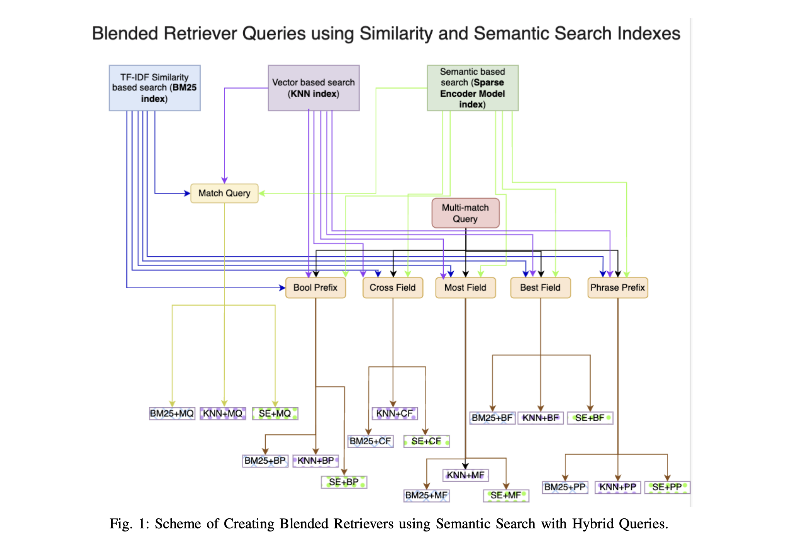

# 1. 资源

论文：
- Blended RAG: Improving RAG (Retriever-Augmented Generation) Accuracy with Semantic Search and Hybrid Query-Based Retrievers
- https://arxiv.org/abs/2404.07220

Github (star 21): https://github.com/ibm-ecosystem-engineering/Blended-RAG

# 2. 问题

当前的RAG系统中，检索器主要依赖关键词和相似性搜索，这限制了系统的整体准确性。因此，本文提出了一种新的方法，通过结合语义搜索和混合查询策略，来提升检索器的准确性。

当前方法存在的问题：

- 检索器的准确性挑战：随着文档语料库的增长，检索器在提取相关文档的准确性上面临挑战。
- 关键词和相似性搜索的局限性：现有RAG系统大多依赖于关键词匹配和相似性搜索，这限制了系统理解用户查询的深度语义的能力。
- 缺乏标准数据集：目前没有统一的数据集来同时评估检索器（R）和RAG系统的性能。
- 元数据的作用：对于没有元数据的数据集，如CoQA，混合检索器的性能提升不明显，凸显了元数据在提升检索效果中的重要性。
- 评估指标的适用性：常用的评估指标如NDCG@10和F1、EM分数可能不是衡量生成性问答系统与人类对齐的最佳代理。

# 3. 方法

针对上述问题，作者提出了以下解决思路和方法：

- Blended RAG方法：通过结合语义搜索技术和混合查询策略来提升检索器的准确性。
- 利用不同索引类型：结合BM25索引、密集向量索引和稀疏编码器索引，以利用各自的优势。
- 混合查询策略：设计了多种混合查询，如跨字段查询、最佳字段查询等，以更好地理解用户意图并提高检索的相关性。
- 零样本学习：Blended RAG在没有特定数据集微调的情况下进行评估，展示了其在零样本学习下的优势。
- 评估指标的探索：论文指出了评估指标选择的重要性，并建议未来工作应该寻找更好的评估RAG系统的指标。

方法步骤

- BM25索引：使用BM25算法进行基于关键词的全文搜索，利用模糊匹配技术增强查询操作。
- 密集向量索引：构建由句子转换器支持的密集向量索引，通过计算文档和查询内容派生的向量表示的接近度来识别。
- 稀疏编码器索引：利用稀疏编码器索引，结合语义理解和基于相似度的检索，捕捉术语之间细微的关系，更真实地表示用户意图和文档相关性。

查询策略

- 基础匹配查询：在BM25索引中开始基本的匹配查询。
- 混合查询：结合不同的搜索技术，通过多字段匹配查询，针对不确定查询文本在文档语料库中位置的情况，确保全面匹配检索。

实施细节

- 构建RAG系统：选择展示最佳检索效果的六种混合查询进行进一步审查，并将这些查询用于生成性问答系统。
- 评估：在包括NQ、TREC-COVID、SqUAD和HotPotQA在内的基准数据集上评估混合查询的性能。

# 4. 评估结论

实验使用了top-10检索准确率来筛选每种基准数据集上最佳的六种混合检索器（索引+混合查询）。实验结果表明，利用稀疏编码器和最佳字段的混合查询方法在NQ数据集上达到了88.77%的检索准确率，为该数据集内的检索任务设立了新的基准。

通过上述方法，Blended RAG在多个数据集上取得了显著的性能提升。特别是在NQ数据集上，Blended RAG实现了88.77%的top-10检索准确率，超越了现有方法。此外，在TREC-COVID数据集上，Blended RAG也展现了其在不同相关性评分下的有效性。在SqUAD数据集上，Blended RAG在没有经过特定数据集微调的情况下，仍然表现出了较高的检索准确率。

# 5. 结论

Blended RAG（Blended Retrieval-Augmented Generation）是一种结合了语义搜索技术如密集向量索引和稀疏编码的方法，它通过混合策略提高了RAG系统的检索效率和精确度。这种方法的提出者通过对IR（Information Retrieval）数据集如NQ和TREC-COVID数据集的研究，实现了更好的检索结果，并为IR设置了新的基准。他们还将这种混合检索器扩展到RAG系统中，在生成式问答数据集如SQUAD上取得了优越的结果，甚至超过了微调性能。

Blended RAG的优势在于它能够更好地处理大量的文档，快速筛选出最相关的信息，以支持语言模型的输出。在没有检索器的情况下，RAG系统就像一个只会说漂亮话但提供不相关信息的个体。通过检索器，RAG系统能够更有效地提供背景信息，帮助语言模型生成更全面的回答。

在未来的信息检索系统中，Blended RAG的应用可能会带来更高的精度和效率。通过利用先进的嵌入模型和微调技术，以及直接监督微调过程，Blended RAG模型在处理复杂的自然语言任务时会更加高效和准确。这些技术的应用有助于提高RAG模型的整体性能，使其能够在面对多样化的查询时提供更可靠的信息检索服务。

Blended RAG方法通过结合多种索引类型和查询策略，有效地提升了RAG系统的检索准确性。尽管存在一些挑战，如对元数据的依赖和评估指标的选择，但该方法已经证明了其在多个数据集上的潜力。未来的工作可以在此基础上进一步探索，以解决现有问题，并推动生成性问答系统的进一步发展。
                        
# 参考

[1] 语义搜索与混合查询：Blended RAG如何提升检索准确性，https://blog.csdn.net/wwlsm_zql/article/details/137958565