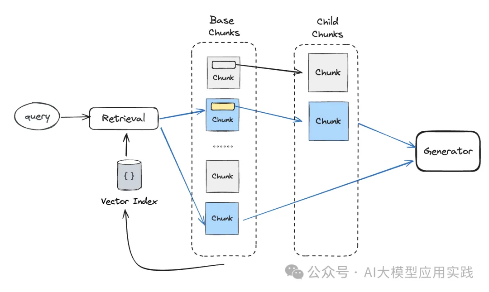
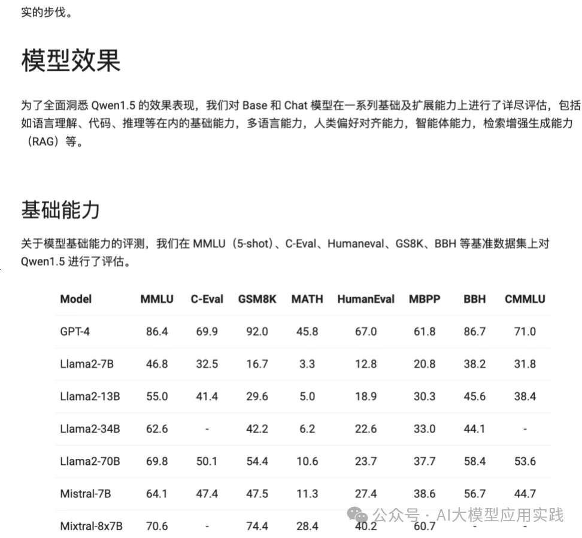
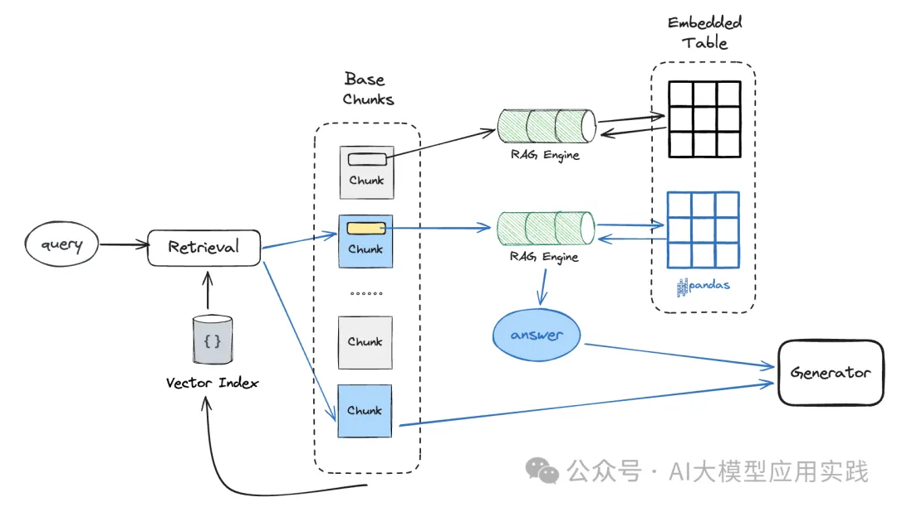

# 1. 简介

相对于易于理解的融合检索，另外一种较复杂的检索方法是递归检索。想象一下，如果你想在一大堆书中找到你所关注的一段文字，最快的方法不是简单粗暴的逐本翻阅，你可能会这么做：

- 做一些基本过滤，比如出版社（如果事先知道）
- 查看书籍的简介，定位需要查看的少量几本书
- 在最后的几本书中，借助目录与翻阅，找到所关注的文字内容

这本质上就是一种递归检索：在不同层次上构建chunks节点与检索器（比如摘要层与内容层、主要内容层与嵌入内容层），并建立层次之间的链接关系，使得能够在每次检索时自动的实现向下递归探索，直至达到结束条件。我们画一张图简单表示其原理：

# 2. 方案

从图里可以看出，递归检索的技术基础是能够从一级索引检索出来的chunks链接到二级的chunks或者其他具备检索功能的装置（比如检索器、Chain、RAG引擎或者Agent）等。实现这种链接的方式通常是在一级的chunk对象中（比如LangChain中的Document对象或者LlamaIndex中的Node对象）保存二级对象的引用。

从一级的chunks链接到的二级对象引用可以是下面几种：

- 一个可以直接读取内容的二级chunk块
- 一个可以检索出多个二级chunk块的检索器
- 一个可以查询后输出答案的RAG引擎
- 一个可以规划与完成问答的Agent智能体

下面对这几种不同的链接形态及其应用场景、递归流程做简单阐述。

## 2.1 从chunk链接到chunk

这种递归检索本质是上一个chunk关联查找的过程：通过检索出来的一级chunk找到对应的二级chunk返回即可。在RAG上这么做的主要意义通常是来自于一个老生常谈的问题，即chunk的语义精确性与丰富性往往是矛盾的，所以有时候需要针对这两种需求做分离设计。

常见的应用场景有：

- 在一个小的chunk中保存对应的大的chunk引用（父子块），用于在更精准的语义搜索基础上，提供更丰富的上下文
- 在一个摘要chunk中保存对应的详细内容chunk的引用，用于增强回答偏概要性或笼统性的提问方式的能力
- 在一个假设性问题的chunk中保存对应的内容chunk的引用，通过假设性问题来兼容更多的提问形式，提高召回精确性

下图表示了这种方式下的检索流程（注意并非所有的一级chunk都一定要有二级chunk的链接），蓝色部分表示实际检索过程：

## 2.2 从chunk链接到检索器

这种情况下通过检索出来的一级chunk找到对应的二级检索器（注意不是chunk），并递归调用这个检索器再次检索，并将二次检索出来的chunks用于后续生成。

这种方式的一个典型的场景是在多文档问答的场景中，通过生成摘要文档来实现分层过滤，以帮助降低单一层次检索下的精度不足、知识干扰等问题：

- 在摘要与原始文档层面分别做嵌入与索引，并链接
- 在摘要级别做检索，获得相关的摘要知识块
- 根据摘要块的关联信息，可以关联到原始文档块的检索器
- 递归检索原始文档的知识块，找到top-k用于生成

下图表示了这种方式下的检索流程：

## 2.3 从chunk链接到RAG引擎

这种方式与上一种的区别在于：一级的chunk链接到的对象不再是输出检索结果的检索器（retriever），而是一个RAG引擎，其输出的答案将作为后续生成的上下文。所以，上一种方式场景中的检索器也可以改用RAG引擎，能达到类似的效果。

除此之外，还有一种典型的场景是用于对文档中嵌入的复杂内容进行深度查询。比如我们现在有这样的一个网页：

在这个HTML页面（也可以是其他的PDF文档）中，除了正常的文字内容以外，还有一个或者多个嵌入的结构化表格，很多时候我们需要对这种嵌入式的表格做更复杂的自然语言提问（比如需要借助sql或者pandas）。那么就可以借助递归检索：

- 对解析出来的表格元素创建独立RAG引擎，这可以基于强大的Pandas组件甚至SQL数据库，以满足对这个嵌入表格的复杂查询
- 对结构化的表格生成一个摘要内容chunk，并链接到表格的独立RAG引擎
- 这些表格的摘要chunk与文档的其他chunk一起创建向量索引，并构建RAG引擎提供对外查询

下图表示了这种方式下的检索流程：

## 2.4 从chunk链接到Agent

最后一种方式是从chunk节点链接到Agent：在检索出基础chunk后，根据其中保存的Agent引用继续探索，调用Agent获取答案作为后续生成的上下文。这种模式本质上与”chunk+RAG引擎“类似，区别就是后端Agent与RAG引擎的区别：由于Agent具备更强大的查询与工具能力，因此可以在后端提供更丰富的二次输出能力。

仍然以多文档的RAG应用为例，我们做如下的设计以支持更复杂的问答场景：

- 对每个文档创建一个Agent，每个Agent有两个可以使用的工具：一个是用来回答事实性问题的工具；一个是用来回答高层总结与分析类问题的工具
- 对每个文档创建摘要文档与chunks，并将其链接到对应的后端Agent
- 对摘要文档的chunks创建一级向量索引与RAG引擎，提供对外查询

【此场景也可以使用两级的RAG Agent实现，参考文章：https://mp.weixin.qq.com/s?__biz=Mzk0MjUwMzY1MA==&mid=2247509889&idx=1&sn=e2f477ed055eddd7362c202619e5db86&chksm=c2c0c40cf5b74d1a95d6b7764a042cd678320cb0df64fa76a98e059ac9b57e8556de50310e54&scene=21#wechat_redirect

下图表示了这种方式下的检索流程：

# 3. 结语

检索在复杂RAG应用中的重要性不言而喻，基于单一的向量语义检索很难满足实际企业生产环境下的复杂应用需求，以原型去应对生产的需求会导致举步维艰。所以，了解与学习不同的检索策略、算法、场景与范式对于提高RAG应用的“生产就绪”能力必不可少。

本文对RAG应用中较为复杂也最强大的融合检索与递归检索进行了详细剖析，而实际上在目前的主流开发框架中（LangChain或LlamaIndex）都有着更丰富的检索索引、算法与组件的支持，包括但不限于：

基于知识图谱索引的检索

基于关键词表的检索

基于向量的BM25检索算法

带语义路由的多路检索器

自动元数据过滤的检索

多chunk size下的自动合并检索

......

后续我们将择机进行更多的探讨与分享！

# 参考

[1] 一文说清大模型RAG应用中的两种高级检索模式：你还只知道向量检索吗？，https://mp.weixin.qq.com/s/y4KI4spvPCQf2ufWyUOoNA
