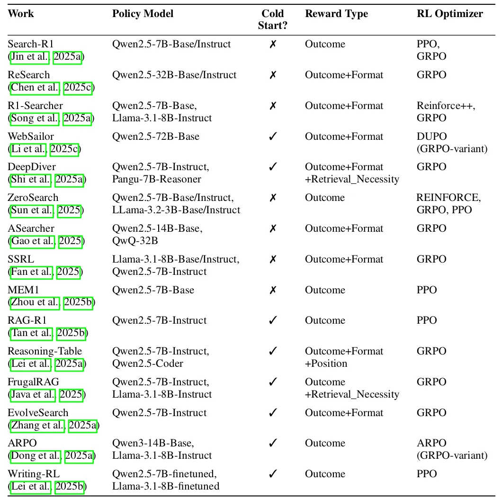

# 1. 资源

- 论文：Reinforcement Learning Foundations for Deep Research Systems: A Survey
- 链接：https://arxiv.org/pdf/2509.06733

# 2. 原理

近年来，人工智能领域涌现出一类被称为“深度研究系统”（Deep Research Systems）的新型AI代理。它们不再是简单地回答简单问题，而是能够像人类研究员一样，自主规划研究路径、在开放互联网和本地文件中进行多步搜索、阅读、推理，并最终生成结构化的报告或精准的答案。例如，OpenAI、Google和Perplexity等公司近期推出的“深度研究”功能，正是这一趋势的体现。

然而，训练这样的系统面临巨大挑战。传统的监督微调（SFT）方法虽然能教会模型如何使用工具、遵循格式，但它本质上是在“模仿人类演示”，存在“模仿偏差”和“曝光偏差”，无法从环境反馈中学习，也无法处理动态、不确定的真实网络环境。另一种常用的方法——直接偏好优化（DPO），虽然能通过人类偏好来优化模型输出，但它通常是离线的、基于文本对比的，难以进行长周期、多步骤的信用分配，也无法让代理主动探索和恢复。

正是在这样的背景下，强化学习（RL） 显示出其独特优势。RL让AI代理在闭环环境中通过试错进行学习，能直接优化整个研究轨迹的回报，支持探索、恢复行为，并进行 principled 的信用分配。这篇由华为技术团队发布的综述论文首次系统性地梳理了如何利用RL训练强大的深度研究代理。它不仅解释了为什么RL是更优的路径，还详细总结了在数据构建、算法设计、系统框架、架构协调和评估基准等方面的最新进展，为研究者和工程师提供了一份全面的“路线图”。接下来，我们将深入解读这篇论文的核心内容。

**研究动机：为什么是强化学习（RL）？**

论文开篇就直指核心：尽管SFT和DPO在初始化模型和对齐人类偏好方面非常有效，但它们存在根本性的局限，无法支撑真正自主、鲁棒的深度研究系统。

SFT（监督微调） 就像教学生临摹字帖：它能很好地学习笔画、结构和格式（即“协议保真度”），但无法教会学生自己创作一篇优秀的论文。具体来说，SFT依赖专家提供的高质量轨迹数据进行模仿学习。这导致：

- 模仿偏差（Imitation Bias）：模型只会复制训练数据中特定的问题分解方式，缺乏灵活性。
- 曝光偏差（Exposure Bias）：训练时每一步都由正确的上一步引导（Teacher Forcing），但在实际推理时，模型需要自回归生成，早期的错误会不断累积，导致后续步骤崩盘。
- 忽视环境反馈：SFT无法从工具调用失败、随机性的搜索结果或非稳态环境（如价格变化）中学习。

DPO（直接偏好优化） 则像是让学生比较两篇作文哪篇更好。它通过比较选择来学习偏好，但同样存在问题：

- 信用分配短视：DPO在每一步判断文本片段的优劣，但无法将最终的成功或失败归因于早期检索或工具使用的决策。
- 依赖人工先验：需要人工设计流程分解并生成偏好对比，这引入了噪声，并且在面对未知任务时可能很脆弱。
- 离线与离线策略：DPO不进行闭环探索，因此无法学习恢复行为（如查询无结果时该怎么办）或适应非稳态环境。

相比之下，RL的优势在于：

- 闭环交互与优化：RL将整个系统视为一个在状态-动作空间中的策略，通过与环境（搜索引擎、浏览器、代码执行器等）交互，直接根据环境反馈（奖励）进行端到端的优化。
- 支持探索与恢复：RL代理可以尝试不同的搜索策略，并从失败中学习如何恢复，这是SFT/DPO无法做到的。

principled 的信用分配：RL算法（如PPO, GRPO）能够将最终的成败奖励合理地分配（Credit Assignment）到轨迹中的每一个关键决策步骤上。

减少对人类先验的依赖：RL更侧重于从可验证的环境奖励中学习，而非完全依赖人类标注的分解或偏好。

因此，论文论证了RL是训练能够进行长周期、工具交互式研究的AI代理的必由之路。

**数据合成与整理：构建RL训练的基础**

高质量的RL训练始于高质量的数据和环境。论文强调，RL的“数据”并非简单的输入-输出对，而是一个由环境（Environment）、任务（Tasks）和奖励（Reward） 组成的完整生态系统。

RL vs. SFT/DPO 数据的关键区别：
- 目的：SFT优化模仿，DPO优化偏好，RL优化环境中的目标达成。
- 格式：
  - 
  - 要求：RL需要能抵抗参数化记忆召回的任务、廉价/稳定/客观的奖励函数、以及用于信用分配的标准化的步骤标签和工具预算。

构建复杂查询（Construction）

为了迫使模型进行多步推理，必须构建真正复杂的查询。论文总结了三大策略：

- 跨文档组合（常需时效性）：例如从最新新闻和论文中整合证据，确保答案无法从模型静态知识中获得。
- 结构驱动的路径增长：通过超链接图遍历或集合操作来增加解决方案的长度和复杂度，模拟人类浏览行为。
- 通过转换/滚动的难度分级：通过迭代重写种子问题或捆绑多个问题，创建从易到难的课程。

整理数据（Curation）

构建出大量候选任务后，需要通过过滤和调度形成高质量的训练集：

- 污染/新颖性门控：过滤掉仅凭模型内部知识或单个文档就能回答的问题。
- 结果验证选择：只保留那些在滚动中成功或足够难的任务。
- 过程质量过滤：验证每一步而不仅仅是最终答案的质量。
- 难度感知课程：按照难度等级调度训练顺序，逐步提升挑战。

查询复杂度分类
论文提出了一个非常实用的四级分类法，用于评估QA任务的复杂性：

- Level 1: 低不确定性，可直接用内部知识或单次搜索回答。（如：TriviaQA）
- Level 2: 多跳问题，但有清晰、预定义的推理路径。（如：HotpotQA）
- Level 3: 高不确定性和高难度，推理路径复杂且 emergent，但仅需文本搜索。（如：SailorFog-QA）
- Level 4: 在Level 3基础上，还需多模态理解和多工具协调。（如：WebWatcher）

论文建议将其用作实践课程：在1-2级上热身学习接口和基本规划，进阶到3级训练探索和交叉验证技能，最后加入4级进行多模态协调。这为系统化训练提供了清晰的路线图。

**RL方法核心：如何训练研究型代理？**

这是论文的技术核心，分为训练机制、奖励设计和多模态集成三部分。

训练机制与优化结构

标准代理RL流程（DeepSeek-R1风格）

一个被广泛采用的基线流程是：

- 可选冷启动（Cold Start）：先用SFT/RSFT数据训练模型，使其掌握工具调用格式、推理骨架和回答规范，稳定早期滚动。
- 模版化滚动（Templated Rollouts）：模型使用类似ReAct的格式与环境交互，标签如<think>, <search>, <answer>等使得轨迹可解析。
- 奖励计算：至少包含结果奖励（如最终答案的精确匹配EM），通常还会加入格式奖励。
- 策略更新：使用PPO或GRPO等算法进行更新，关键技巧是屏蔽（Masking） 工具返回的token（如搜索到的网页文本），只对模型自身生成的token（推理、工具调用、答案）计算梯度和KL散度，极大稳定了训练。

冷启动与课程学习

约一半的研究跳过冷启动，但另一半证明了其价值：它能加速收敛，防止早期奖励崩溃。课程学习（Curriculum Learning） 进一步强化了这一过程，例如先鼓励广泛探索（Discovery），再转向精准查询（Refinement），或根据学习潜力（Margin-aware）选择样本。

优化器选择
- GRPO：日益流行，机制简单，收敛所需的更新次数更少。
- PPO：在噪声大、长周期的回报下通常提供更好的稳定性。
- 其他变体：如REINFORCE++（更高数据效率）、DUPO（动态采样，提速2-3倍）。

上下文控制与成本感知

长回合的交互会导致上下文窗口爆炸。解决方案包括：
- 状态重写：用紧凑的内部状态替换累积的历史（MEM1）。
- 证据蒸馏：将长文档压缩成简短的“提炼笔记”（AutoRefine）。
- 学习搜索必要性：训练模型学会何时应该搜索，何时可以依赖内部知识（IKEA, FrugalRAG），从而减少不必要的、昂贵的检索调用。
- 模拟器训练：用LLM模拟搜索引擎（ZeroSearch），大幅降低API成本，且不损失效果。

奖励设计与信用分配

奖励信号决定了代理学习什么样的行为。

结果级奖励（Outcome-Level Rewards）

这是锚点，通常评估最终答案的正确性（如EM/F1）和格式。新颖之处在于出现了更多针对搜索效率和证据质量的奖励设计：

**增益超越RAG (GBR)**：奖励代理检索的上下文比简单的top-k RAG基线带来的准确度提升。
- 证据效用：要求一个冻结的LLM仅根据代理整理的证据包就能答对问题（R-Search）。
- 组相对效率：在同一组正确的滚动中，奖励使用外部调用最少的轨迹（R1-Searcher++）。
- 查询多样性：在预算控制下鼓励生成不重复的查询（O²-Searcher）。

步骤级奖励（Step-Level Rewards）

仅为最终结果奖励会导致信用分配模糊。步骤级奖励提供更细粒度的监督：

- 工具/执行检查：奖励格式良好的工具调用和成功的执行（MT-GRPO）。
- 信息增益 vs. 冗余：奖励每一步带来新的有用信息，惩罚重复信息（StepSearch）。
- 查询意图对齐：奖励生成的搜索查询与当前子任务的关键词重叠度高，保持搜索不偏离方向。

信用分配（Credit Assignment）

关键在于如何将最终的成败合理地归因到早期的关键决策上。

- 轨迹级估计器：标准方法（如PPO/GAE），为整个序列分配一个优势值，简单但传播慢。
- 回合级估计器：混合当前回合的奖励和最终结果的优势（MT-GRPO），能进行更精细的归因。
- Token/回合放置与屏蔽：将奖励精准地附加在每个搜索回合结束或工具调用边界处，并持续屏蔽观察token，避免梯度通过无关的检索文本。

多模态研究代理

让代理能“看”会“想”，直接理解和处理图像、图表等视觉信息。

- 感知即动作：代理发出的动作不再只是文本搜索，还包括区域裁剪、缩放、高亮、图像代码处理等视觉操作，然后根据操作结果重新推理，形成可控的证据更新循环。
- 观察工程：直接处理原始像素裁剪（而非缩略图）以捕捉细节；对网页进行“阅读器->摘要”转换以去除噪音。
- 学习证据必要性：统一的动作空间让代理学习何时看图、何时搜文、何时停止，通过轻量的模态感知效率信号（如图像检索排名NDCG、搜索惩罚）来优化。

多模态代理的进步主要源于精巧的环境和动作设计，而非优化器本身的创新。

系统与框架：支持代理RL训练的工程实践

训练研究代理是一个系统工程问题。长回合、重工具使用的交互对计算基础设施提出了严峻挑战。

瓶颈与挑战：

- 滚动吞吐量与延迟：长回合阻塞GPU，经验收集成本高。
- 策略陈旧与信用分配不稳定：异步训练中策略更新滞后，稀疏奖励方差大。
- 大规模编排：在训练和生成模式间高效切换、管理大规模并行和零冗余张量移动。
- 异构代理运行时：现有生产代理（如LangChain）与工具紧密耦合，难以无缝接入RL。
- 纯结果监督的弱点：不足以塑造复杂的长周期推理行为。

开源框架的贡献：

论文综述了2025年出现的多个开源框架，它们通过以下方式应对挑战：
- 提升吞吐量：采用完全异步的Actor-Learner设计（AREaL），或分布式经验编排（AWorld）。
- 桥接异构运行时：提供训练器-代理解耦和统一接口（Agent Lightning），允许包装现有代码。
- 稳定信用分配：引入分层/步骤式GRPO变体（rLLM）或过程奖励模型（PRM）（OpenR）提供步骤级信号。
- 系统协同设计：实现零冗余的训练⇄生成切换（verl），或集成高效serving后端（SGLang, vLLM）进行采样（SLIME）。

如何选择框架（实践指南）：

论文给出了 pragmatic 的建议：

- 需要稳健的训练引擎？ -> verl
- 原始滚动吞吐量是瓶颈？ -> AREaL 或 SLIME
- 需要集群级经验收集？ -> AWorld
- 已有生产代理不想重构？ -> Agent Lightning
- 需要过程感知奖励？ -> OpenR 或 Verifiers
- 需要前沿并行或MoE？ -> verl 或 ROLL/SLIME
- 许多团队选择混合路径：用verl作训练主干，SGLang采样，Verifiers提供奖励。

代理架构与协调：从训练到部署

由于端到端训练整个层次化栈仍不现实，当前部署主要将预训练（通常经RL增强）的模型组合成层次化或多代理系统。

开源架构模式： 论文分析了四个流行的开源框架（Aomni, DeerFlow, LangChain, MiroFlow），它们在规划与角色、工具接口、人工监督和评估上各有侧重。

- Aomni：单代理递归循环，简单灵活，适合作为基线。
- DeerFlow：显式的“规划器-协调器-执行器-报告器”分离，支持人工审查，企业级就绪度高。
- LangChain：提供可配置的图（单代理、计划执行、多研究员），便于在统一环境下比较不同拓扑。
- MiroFlow： orchestrator 管理具有专用工具集的子代理，内置UI和日志，注重生产环境下的健壮性。

- 学术架构与协调： 学术界的系统（如OWL, CoA, PaSa, WebThinker, HiRA, DeepResearcher）探索了不同的协调模式：
- 层次化编排：规划器（通过协调器）委托给专业执行器，并汇总提炼后的结果（非原始工具输出），保持规划器状态的清晰（HiRA）。
- 内存引导的迭代检索：跨回合维护暂存器/知识缓存，指导后续证据选择。
- 结构化工具接口：使用紧凑的JSON/代码原语，使批处理、重试和复现成为可能。
- 超越SFT的优化：对规划器或完整循环进行DPO/RL优化，显著提升工具使用和最终质量。
- RL用于多代理协调： 当系统中有多个可训练决策组件时，就进入了多代理强化学习（MARL）的领域。

- MHGPO：一种无评论家的MARL方法，使用组相对优势，联合优化所有角色（共享一个LLM主干）。
- MMOA-RAG：使用MAPPO算法和集中式评论家，在CTDE范式下联合训练查询改写器、文档选择器和答案生成器。
- Optimas：非联合MARL，而是为每个组件学习一个与全局指标对齐的局部奖励函数，然后进行坐标式优化，是联合训练的一种实用替代方案。

核心设计模式是：分离规划与执行，使用结构化工具接口，提供人工监督与可观测性。一个更强的、经过RL训练的规划器可以无缝插入这些架构中，提升全局能力，而无需全部推倒重来。

评估与基准：如何衡量深度研究系统的性能？

评估这些系统是困难的，因为它们输出多样（精确答案或长篇报告）且过程复杂（多步工具使用）。

QA与VQA基准：
- 文本QA：从静态语料库中的多跳推理（HotpotQA, MuSiQue）发展到开放网络环境下的评估，如BrowseComp（寻找难以发现的信息）、InfoDeepSeek（处理错误前提问题）、Webwalker（网站导航）。
- 多模态VQA：基准正在快速成熟，要求结合视觉理解和网络搜索（MMDocIR, MRAMG-Bench, M²RAG）。OmniBench进一步扩展到音频、视频和结构化数据。

长文本生成基准：

评估连贯性、事实性、相关性和结构等主观维度。

HelloBench, ProxyQA, WritingBench：通用的长文本生成评估。

DeepResearch Bench：第一个专为深度研究系统设计的基准，包含100个博士级任务，要求生成引文翔实的报告。它提供了RACE（基于参考的多维评分）和FACT（事实丰度与引文可信度）两种自动化评估框架。

领域特定基准：

在更真实的工作流中评估系统实用性。

- Xbench：评估招聘和营销等真实世界生产力。
- τ²-Bench：在电信双控环境中评估对话代理（用户和代理都能使用工具）。
- Finance Agent Benchmark / FinGAIA：金融领域研究任务。
- OdysseyBench：跨Word, Excel, PDF等应用的办公室生产力长周期工作流。

评估的发展路径清晰地显示出从孤立技能测试转向整体系统级能力评估的趋势，越来越贴近真实世界的复杂任务。

**结论**

这篇题为《Reinforcement Learning Foundations for Deep Research Systems》的综述论文，首次系统性地建立了以强化学习（RL）为核心的深度研究代理训练范式。它的核心贡献与价值体现在：

- 确立了RL的必要性与优势：清晰论证了相较于SFT和DPO，RL在实现闭环交互、探索恢复、长周期信用分配和多目标优化方面的不可替代性，为领域发展指明了方向。
- 提供了系统化的分类与路线图：从数据构建（复杂度分级、构建与整理策略）、到算法设计（训练机制、奖励信用、多模态集成）、再到系统框架（工程瓶颈、开源工具）和架构协调（部署模式），为研究者和工程师提供了全方位的技术地图和实用指南。
- 强调了工程与系统的关键作用：明确指出训练此类代理是一个系统工程问题，并综述了最新的基础设施解决方案，推动了研究的可复现性和可扩展性。
- consolidates 了评估生态：全面总结了从传统QA到开放网络、从文本到多模态、从答案准确到长报告质量和领域特定工作流的评估基准，为公平衡量进展奠定了基础。

未来展望论文也指出了丰富的开放问题：

- 算法与优化：如何自动化课程与冷启动调度？如何为工具交互环境设计更 principled 的优化器？如何训练真正多目标（精度、成本、延迟）的策略？
- 奖励设计：如何组合抗博弈的多目标奖励？如何构建低成本、高鲁棒性的过程验证器？
- 系统与框架：如何保证在线滚动的安全性与鲁棒性？如何实现大规模编排的弹性与容错？如何建立可复现性和可观测性标准？
- 协调与架构：如何训练协调本身（通信协议、角色发现）？如何实现自适应的拓扑与调度？如何建立可移植的行动和轨迹标准？
- 评估：如何降低高保真评估的成本？如何评估长期、交互式、自适应代理？如何评估鲁棒性、安全性和真正的跨模态合成能力？

这篇综述不仅是过去进展的总结，更是未来研究的催化剂。它为实现更强大、可靠、实用的自主AI研究代理描绘了清晰的蓝图，标志着我们向能真正理解并探索复杂信息世界的AI伙伴迈出了坚实的一步。

# 参考

[1] 华为发布如何利用RL训练强大的Deep Research Agent综述！https://mp.weixin.qq.com/s/NPFZCRtc_Zshb2hvXyrGig