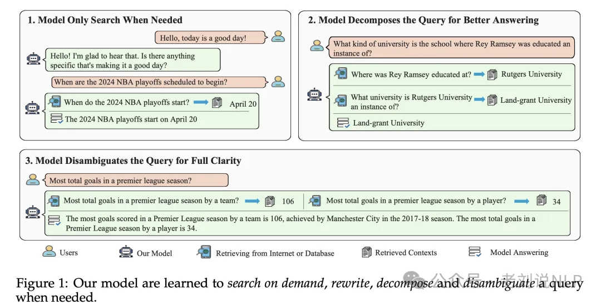
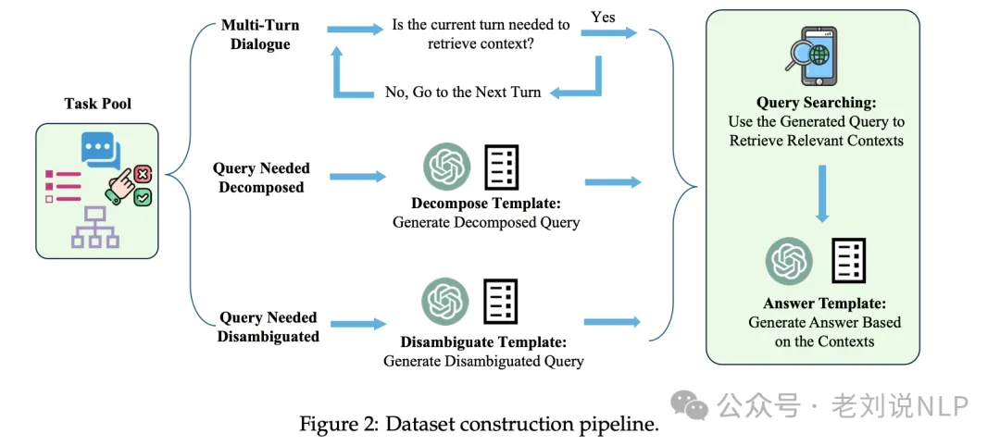
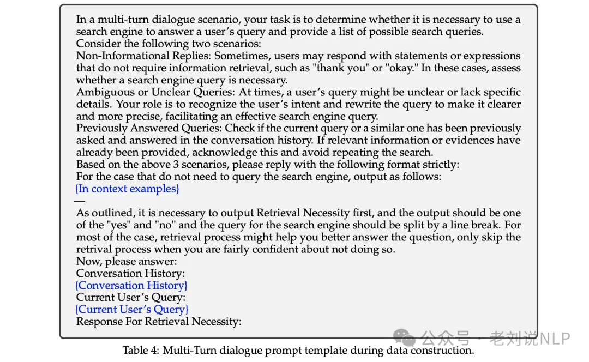
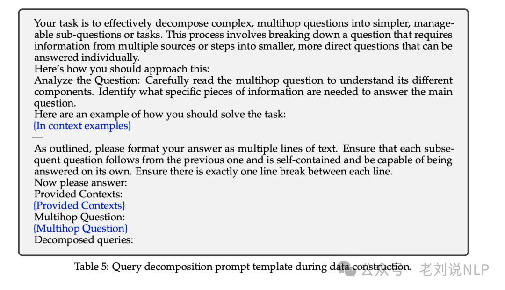
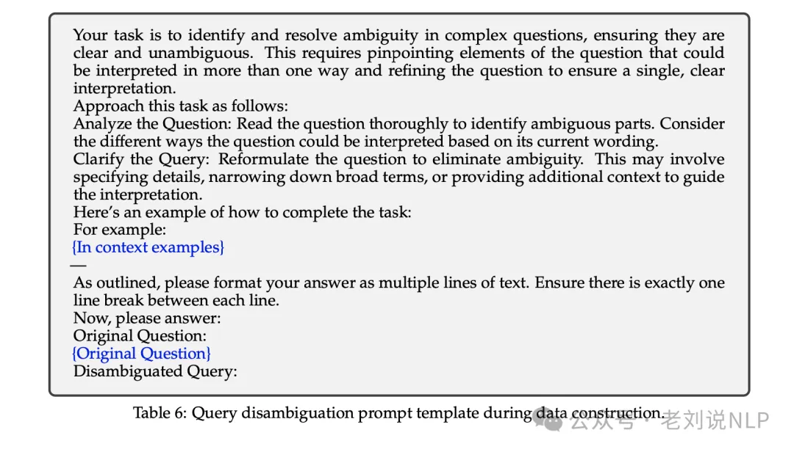
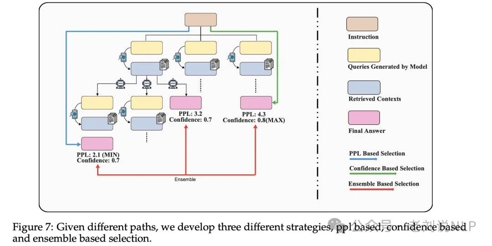
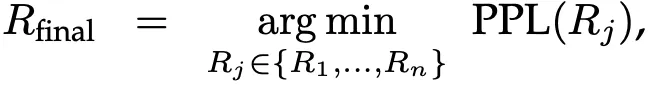
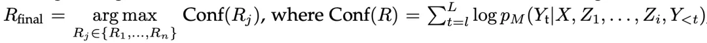

# 1. 资源

论文：
- RQ-RAG: Learning to Refine Queries for Retrieval Augmented Generation

Github (18 stars): https://github.com/chanchimin/RQ-RAG

# 2. 原理

通过微调模型对召回的上下文以及query进行意图分类，然后分而治之

其思想也很简单，提出了"为检索增强生成学习完善查询"（RQ-RAG），以端到端的方式训练一个 7B Llama2 模型，使其能够通过重写、分解和澄清歧义来动态完善搜索查询。

在具体实现上，利用ChatGPT3，在各种情况下（改写、分解、消除歧义）使用不同的提示模板，而不是依赖原始查询，来制作搜索查询，此外，由于观察到数据集的初始输出与信息检索系统返回的上下文不匹配的情况，因此使用ChatGPT生成新的、与上下文一致的答案，从而提高信息检索过程的相关性和准确性。

## 2.1 问题

当前的RAG已经逐步转向优化检索上下文上面，因为不加区分地使用信息检索系统对查询进行上下文关联可能会适得其反，不相关的上下文不仅会降低生成质量，而且可能会阻碍大模型回答它们本来能够解决的查询。

例如，对于像日常问候这样简单明了的查询，LLMs应该直接回答，而不是加入不必要的上下文，也就是说，模型应该学会按需搜索，如图1（左上角）。

其次，对于复杂的查询，简单地使用原始查询进行搜索往往无法检索到足够的信息。因此，LLM必须首先将这类查询分解为更简单、可回答的子查询，然后搜索与这些子查询相关的信息。通过整合对这些子查询的回答，LLM可以构建出对原始复杂查询的全面回答，如图1（右上角）。

最后，对于有多种可能答案的模糊查询，使用原始查询进行信息检索是不够的。要想提供完整而细致的回答，LLM必须学会澄清查询，最好是通过识别用户的意图，然后制作出更有针对性的回答，在收集到相关信息后，再提供详细而全面的回复，如图 1（下图）

## 2.2 解决方案

数据上的策略，分成以下几步：

1）首先，将收集到的任务库中的任务分为前面提到的三个类别。这一步很简单，因为每个数据集都对应一个特定的数据类型。

2）对于每种数据集类型，首先使用带有预定义提示模板的ChatGPT生成一个精炼查询。然后，使用该查询从外部数据源搜索信息。在大多数情况下，主要使用DuckDuckGo，并将检索过程视为黑盒。

Multi-Turn dialogue promptprompt如下：

Query decomposition prompt如下：

Query disambiguation prompt如下：

3）提示ChatGPT根据细化后的查询及其相应的上下文生成新的响应。通过重复这一过程，总共积累了约40k个实例。

其中有个很有趣的点，那就是如果生成了多个答案，那么应该如何进行选择，该工作采用PPL Based Selection、Confidence Based Selection、Ensemble Based Selection三种策略，也就是树解码策略。

其中：PPL Based Selection选择对生成的总输出具有最低困惑度（PPL）的答案；

Confidence Based Selection选择所有结果置信度最大的答案；

# 参考

[1] 也看RAG优化策略之RQ-RAG及其与EventGround事件推理的结合：兼看值得一看的几个大模型综述, https://mp.weixin.qq.com/s/fKGi3rq3mqgMJrSvSO3OOA