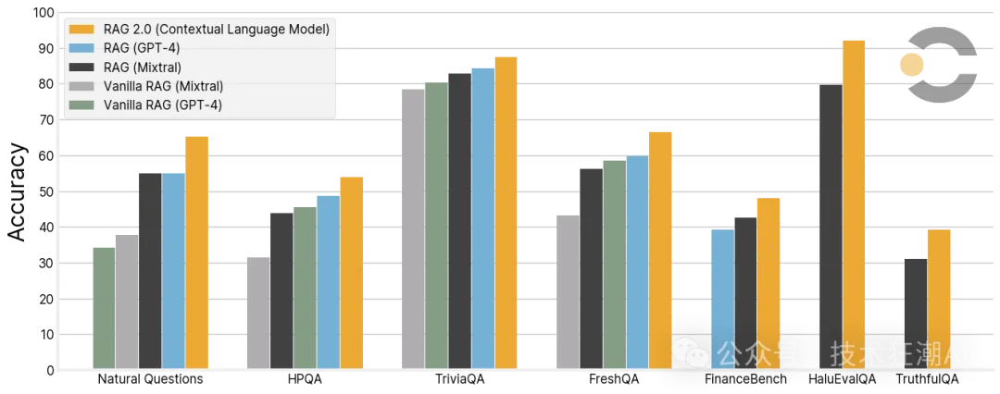
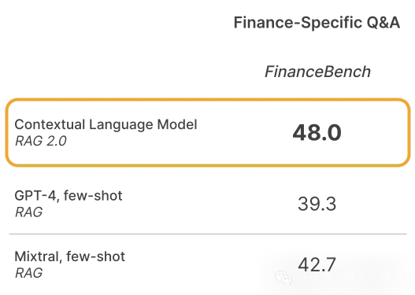
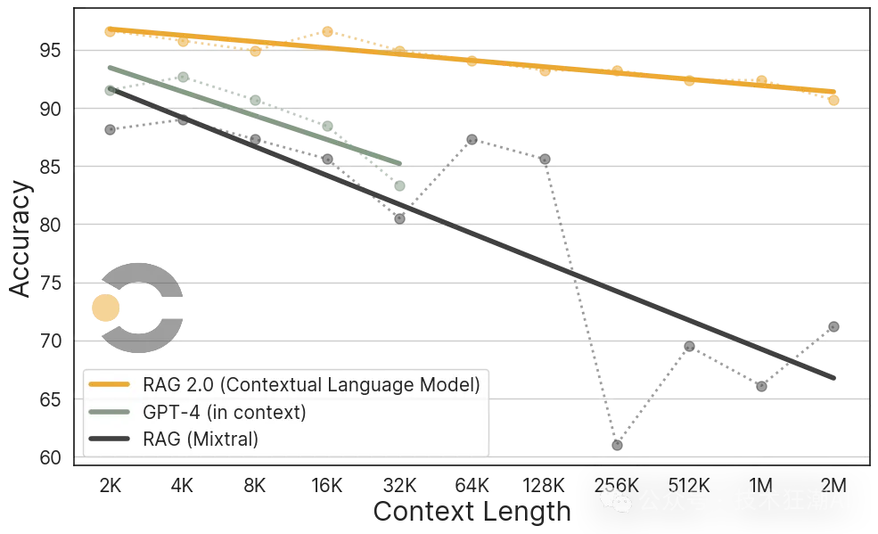
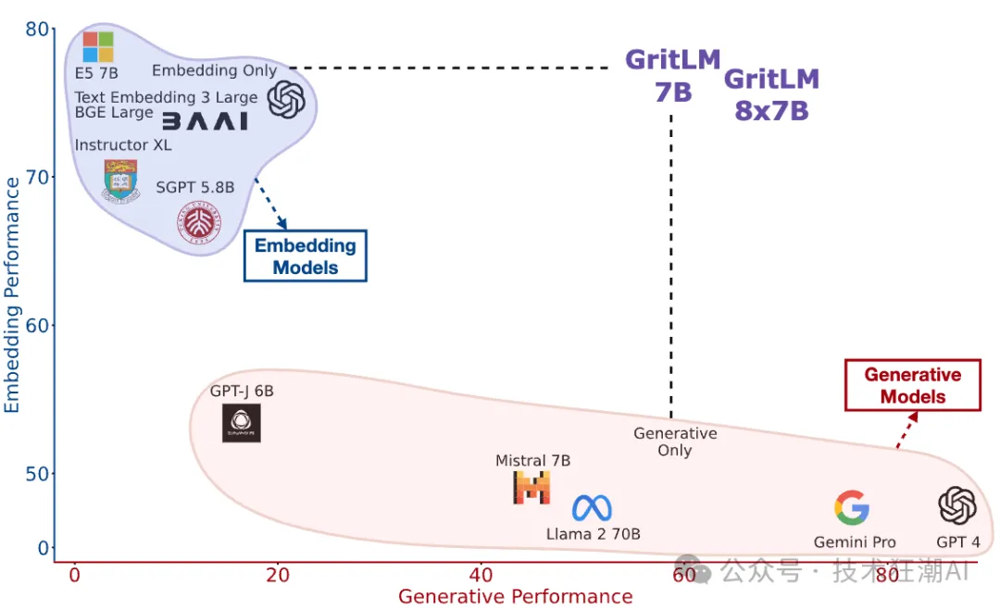
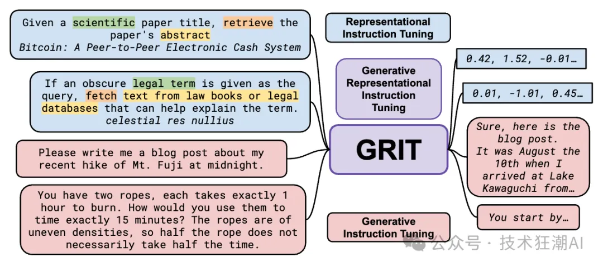
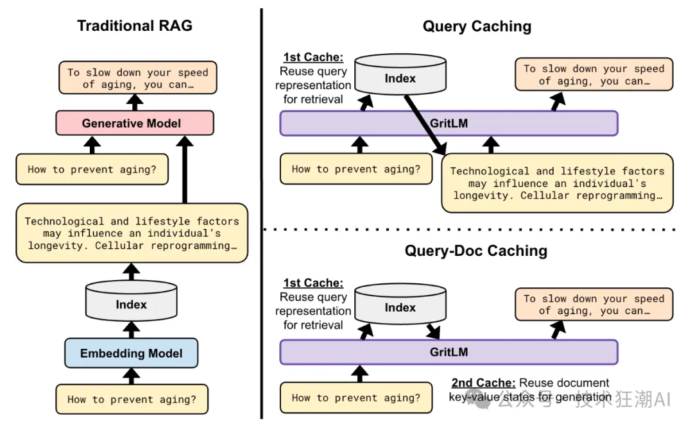
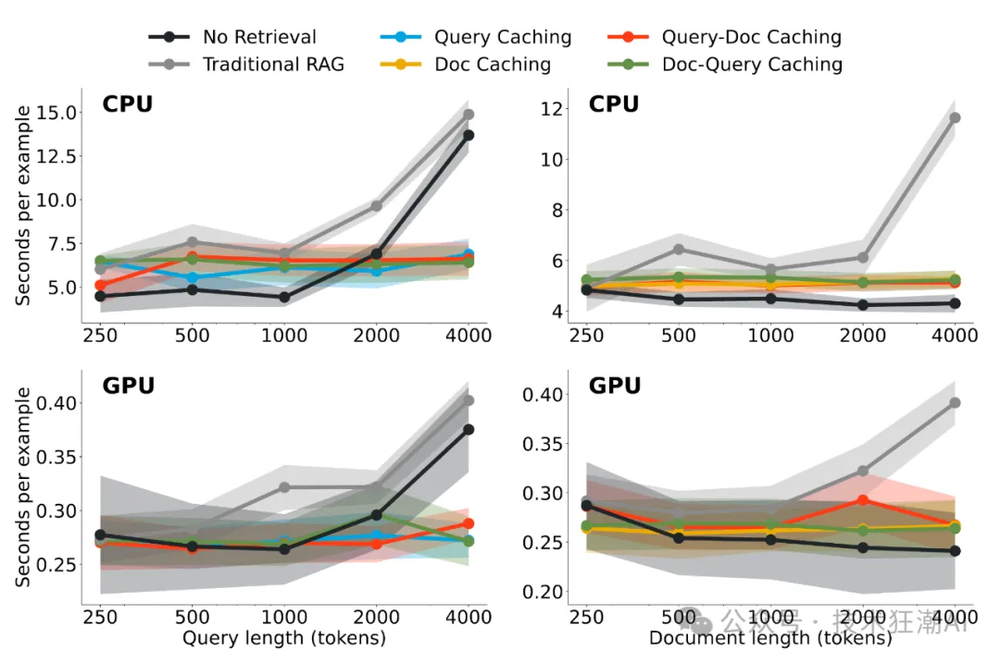

# 1. 问题

RAG 2.0 是 Contextual AI 公司宣布的新一代企业级 AI 系统，它通过端到端优化语言模型和检索器来解决传统 RAG 系统的限制。传统 RAG 系统通常使用冻结的离线模型、向量数据库和黑盒语言模型，这些组件通过提示或编排框架粘合在一起，导致这些系统脆弱、缺乏对部署域的机器学习或专门化，需要广泛的提示，并且容易出现级联错误。RAG 2.0 通过预训练、微调和对齐所有组件作为单个集成系统来解决这些问题，并通过语言模型和检索器进行反向传播，以最大化性能。RAG 2.0 已在各种基准测试中，包括开放域问答、忠实度和最新知识的应用上，都取得了显著的性能提升，超越了使用GPT-4或开源模型Mixtral构建的冻结RAG系统。此外，RAG 2.0 在实际应用中表现出色，尤其是在专门领域，如金融和法律。

# 2. 方法

RAG 2.0的优化方法在自然语言处理（NLP）领域标志着一次质的飞跃。相较于其前身，RAG 2.0放弃了以往孤立和未充分优化的组件使用方式，转而采纳了一种全面的端到端优化策略。这种策略将语言模型和检索器的优化工作统一考虑，实现了两个系统间的深度协同和细致调整，从而在多个层面上显著提升了整体性能。

在RAG 2.0的优化过程中，一个关键的技术是反向传播算法，这是深度学习中的一个基础且强大的工具。通过这种方式，系统可以根据预测结果与实际结果之间的差异，反向调整模型参数，逐步优化模型性能。这种优化不仅针对特定任务，还提升了模型对新任务的适应性和泛化能力。RAG 2.0通过这种方法，在处理需要深层次语言理解和知识检索的任务时，能够更加高效地利用检索到的信息，生成更准确、更相关的回答。

在性能提升方面，RAG 2.0在多个行业标准的基准测试中取得了令人瞩目的成绩。例如，在开放域问答任务Natural Questions (NQ)、HotpotQA (HPQA)和TriviaQA中，RAG 2.0展现了其出色的信息检索和答案生成能力。此外，在评估模型忠实度的测试，如HaluEvalQA和TruthfulQA中，RAG 2.0同样表现卓越，证明了其在生成回答时能够严格依据检索到的证据，有效避免了与事实相悖的内容生成。这些性能上的显著提升，使得RAG 2.0在企业级应用中成为了一个强有力的竞争者，为企业解决复杂的语言理解和知识检索任务提供了一种新的、高效的解决方案。

# 3. 结果

## 3.1 开放域问答测试（NQ, HPQA, TriviaQA）

测试的详细描述：

- Natural Questions (NQ)：这个数据集由Google创建，模拟了真实世界中用户对于搜索引擎的问答查询。NQ要求模型不仅要理解问题，还要从给定的维基百科页面中找到准确的答案，这个过程中涉及到对大量文本的理解和信息检索能力。
- HotpotQA (HPQA)：HPQA是一个问答数据集，它要求模型从多个文档中检索信息以生成答案。与NQ相比，HPQA更强调模型的多文档检索和推理能力，因为正确答案通常分布在多个文档中。
- TriviaQA：这个数据集包含大量的问题和答案对，以及与每个问题相关联的证据文档集合。TriviaQA考验模型能否从大量可能的文档中检索到正确的信息，并据此生成答案。

## 3.2 忠实度测试（HaluEvalQA, TruthfulQA）

RAG 2.0在忠实度测试中的性能是衡量其可靠性和准确性的关键指标。忠实度测试主要通过HaluEvalQA和TruthfulQA两个数据集来执行，它们评估模型在生成回答时是否能够忠实于检索到的证据，并且避免产生与事实不符的“幻觉”回答。

1. HaluEvalQA：这个数据集设计用来测试模型是否能够基于检索到的证据生成回答。HaluEvalQA要求模型在生成回答时保持与检索到的文档的一致性，而不是依赖于常见的误解或错误的前提。

2. TruthfulQA：这个数据集包含了一系列问题，其中一些是人类可能会因为错误的信念或误解而给出错误答案的问题。TruthfulQA的目的是测量语言模型在生成答案时是否真实，即模型必须避免生成从模仿人类文本中学到的虚假答案。这个数据集特别关注模型是否能够抵抗生成那些在训练分布中具有高可能性的虚假陈述。

## 3.3 知识更新性测试（FreshQA）

FreshQA数据集上的表现，是衡量其处理最新信息能力的重要指标。FreshQA是一个专门设计来评估模型是否能够泛化并利用最新世界知识的数据集。这对于构建能够适应快速变化信息环境的生产级RAG系统至关重要。

在FreshQA测试中，模型需要展示出其不仅能够理解和回答基于当前知识的查询，还能够准确反映最近发生事件或最新数据的能力。这种测试对于模拟真实世界中用户期望系统能够提供最新、最相关回答的场景非常有帮助。

RAG 2.0通过使用最新的机器学习基础设施进行训练和部署，如Google Cloud的A3实例和H100 GPU，以及利用最新的网络技术，能够确保模型在处理这类任务时的准确性和效率。这表明RAG 2.0在设计上就考虑了对最新信息的快速适应和整合能力。

## 3.2 “Needle in a Haystack”基准测试

“Needle in a Haystack”基准测试是一种评估大型语言模型（LLMs）长文本信息提取能力的方法。这种测试通过在一段长文本中随机插入关键信息的不同位置，形成一个提示（prompt），然后测试模型是否能够从这段长文本中准确地提取出这些关键信息。这种方法可以反映LLM对长文本理解的基本能力。

Skywork/ChineseDomainModelingEval 数据集包含了多个领域的高质量中文文章,可用于进行这种"Needle in a Haystack"测试。测试过程包括:

下载数据集,将文件放置在指定目录下。

使用提供的评估脚本对LLM的预测结果进行评分。评分方法是计算预测值和参考值之间的Levenshtein距离,得分为100减去百分比损失。

可以使用可视化脚本对评估结果进行绘图分析。

此外，这项测试还被用来量化模型解析上下文以找到所需信息的能力。例如，研究发现ChatGPT-4在这一领域的表现是行业领先的。这表明“Needle in a Haystack”基准测试不仅关注模型的文本处理能力，还关注其在复杂情境下的信息检索和理解能力。

在进行“Needle in a Haystack”测试时，可能会涉及到不同的嵌入深度和上下文长度，以及使用S型分布进行迭代分析等技术细节。这些细节的设计旨在使测试更加全面和多样化，从而更准确地评估模型的性能。

“Needle in a Haystack”基准测试是一个重要的工具，用于评估和比较不同大型语言模型在处理长文本信息提取任务上的能力。通过这种测试，研究人员和开发者可以更好地理解模型的性能，并指导未来的模型改进方向。

## 3.3 准确性和计算效率

RAG 2.0的动态检索能力是其另一个关键优势。与传统的静态模型相比，RAG 2.0能够根据问题的上下文动态地利用检索到的信息，这不仅增强了输出的相关性，也提高了模型在处理大量文本时的准确度和效率。

# 4. RAG 2.0的技术挑战

RAG 2.0 作为一项先进的生成性AI模型，旨在通过端到端优化语言模型和检索器，克服传统RAG系统的局限性。然而，像任何技术创新一样，RAG 2.0也可能面临自身的一系列挑战和局限性。以下是一些潜在的问题及其解决方案或缓解措施：

1. 系统鲁棒性：

    - 挑战：传统RAG系统由独立训练的组件构成，可能因缺乏协调而脆弱且容易出错。

    - 解决方案：RAG 2.0通过联合训练语言模型和检索器来解决这一问题，增强了系统的鲁棒性。

2. 领域特定优化：

    - 挑战：预训练模型可能无法针对特定领域进行最优表现，影响系统在现实世界中的应用性。

    - 解决方案：RAG 2.0允许在特定领域和任务上进行微调，提高实际应用中的性能。

3. 错误累积：

    - 挑战：在传统系统中，由于组件间缺乏有效的反馈机制，错误可能会累积。

    - 解决方案：RAG 2.0的端到端优化确保了系统内更好的错误控制和传播，从而得到更可靠的结果。

4. 开发和维护成本：

    - 挑战：需要大量的工程和调试工作来使组件协同工作。

    - 解决方案：RAG 2.0减少了手动调试和工程的需求，从而降低了开发和维护成本。

5. 索引、检索和内容生成问题：

    - 挑战：朴素RAG系统在索引（信息提取不完整、简单的分块策略）、检索（相关性和召回率低、处理不准确查询的能力差）和内容生成（上下文整合差、过度依赖检索到的信息）方面面临挑战。

    - 解决方案：像RAG 2.0这样的高级RAG模型可以通过改进索引策略、检索算法和内容生成过程来解决这些问题。

6. 计算效率：

    - 挑战：端到端优化过程可能计算密集，可能导致成本增加和训练时间延长。

    - 解决方案：利用最新的基础设施，如Google Cloud的AI和ML服务，可以帮助更有效地训练和部署RAG 2.0。

7. 数据隐私和安全：

    - 挑战：处理敏感信息时存在数据泄露或滥用的风险。

    - 解决方案：实施强有力的安全措施和隐私保护技术可以降低这些风险。

8. 可扩展性：

    - 挑战：随着模型扩展到处理更复杂的任务或更大的数据集，可能会遇到性能瓶颈。

    - 解决方案：在模型架构和优化技术方面持续的研究和开发可以帮助保持可扩展性。

通过这些解决方案和缓解措施，可以提高RAG 2.0系统的可靠性、准确性和实用性，从而更好地应对实际应用中的挑战。

# 5. 技术细节和方法

## 5.1、微调和对齐技术（GRIT, KTO, LENS）

在人工智能领域，微调（Fine-tuning）和对齐（Alignment）技术是提升模型性能和适应性的关键方法。这些技术允许基础模型在特定任务或领域上进行优化，以更好地理解和生成与用户查询相关的信息。

- GRIT（Gradual Resizing of Input Tokens）：这是一种微调技术，它通过逐步调整输入令牌的大小来优化模型的输入处理能力。这种方法可以使模型更有效地处理长文本输入，从而提高对复杂查询的响应质量。

- KTO（Knowledge Transfer Optimization）：KTO是一种对齐技术，它专注于在模型的训练过程中实现知识转移。通过这种方法，模型能够从已有的知识库中学习，并将其应用于新的、未见过的数据，从而提高模型的泛化能力和适应性。

- LENS（Language Embedding for Natural Selection）：LENS是一种对齐技术，它通过优化语言嵌入来提升模型对自然语言的理解和生成能力。这种方法有助于模型更准确地捕捉语言的细微差别，从而生成更自然、更符合上下文的响应。

## 5.2 用 GRIT 训练更好的大语言模型

自然语言处理的任务主要分为两类：生成和表示。生成任务的目标是创造新的文本内容，而表示任务则是将文本转化为一种机器可以理解的形式，以便进行检索、分类和聚类等操作。

现代的机器学习系统通常会结合这两种任务。例如，检索增强生成 (RAG) 技术就利用文本表示 ( 也就是嵌入 ) 来进行信息检索，并将检索到的信息用于辅助生成模型进行内容创作。

传统的做法是分别训练嵌入模型和生成模型。嵌入模型通常使用对比损失函数进行训练，而生成模型则采用因果或自回归的方式进行训练。然而，随着指令微调技术的进步，生成模型在判别任务上的表现也越来越出色。

那么，我们能不能只训练一个模型，让它同时擅长生成和表示呢？答案是肯定的。使用 GRIT ( 生成式表示指令调整 ) 技术，我们可以训练出这样的模型，它不仅能生成高质量的文本，还能有效地进行信息检索。

GRIT 是一种新的训练方法，它使用指令来引导语言模型学习生成和表示的能力。例如，我们可以给模型这样的指令：“将这段文字转化为一种医生可以理解的形式，帮助他们做出正确的诊断。”

在训练过程中，GRIT 会同时优化对比损失和因果损失，从而使模型能够同时学习生成和表示的能力。

使用 GRIT 训练的模型在 MTEB 基准测试中取得了最佳的表示质量，同时在生成任务上的表现也达到了业界领先水平。

RAG 是目前大语言模型应用中最常见的技术之一，它结合了检索器和语言模型来完成各种任务。传统的 RAG 方法效率较低，因为它需要对查询和文档进行两次编码：一次用于检索，一次用于生成。

如果我们使用同一个模型进行生成和表示，就可以在检索过程中缓存 ( 保存 ) 部分网络参数，并在生成时重复使用，从而大大提高效率。

GRIT 可以将 RAG 的效率提升 60% 以上，接近直接生成文本的速度，无需进行检索。

GRIT 不仅在基准测试中取得了优异的成绩，还为未来的研究开辟了新的方向。例如，我们可以探索如何根据特定领域的需求调整指令，或者如何进行少样本检索，即只提供少量示例就能完成检索任务。

## 5.3 RAG 2.0在Contextual平台上的应用

RAG 2.0在Contextual平台上的应用是其技术进步的体现。Contextual平台作为一个先进的AI工具，提供了一个集成环境，使得RAG 2.0能够充分发挥其潜力。以下是RAG 2.0在Contextual平台上的几个关键应用：

统一的信息处理：RAG 2.0通过Contextual平台的集成环境，实现了信息检索和响应生成的无缝对接。这种统一的流程不仅加快了响应时间，而且通过连续的优化，提高了生成内容的准确性和相关性。

实时学习和适应：在Contextual平台上，RAG 2.0能够根据用户的实时反馈和新数据进行自我学习和适应。这种实时的优化使得RAG 2.0能够不断改进其算法，以更好地满足用户需求。

多场景应用：RAG 2.0在Contextual平台上的应用不仅限于单一领域。无论是客户支持、内容创建还是其他专业服务，RAG 2.0都能够提供定制化的解决方案，以适应不同场景的需求。

持续的性能提升：随着在Contextual平台上的持续使用，RAG 2.0的性能将得到不断的提升。通过微调和对齐技术的应用，RAG 2.0能够更精准地理解和生成信息，为用户提供更加丰富和深入的内容。

通过这些技术细节和方法，RAG 2.0在Contextual平台上的应用展示了其作为下一代人工智能工具的强大能力和广泛的适用性。

# 参考

[1] RAG 2.0，https://mp.weixin.qq.com/s/5_-Z0r0DfAfiJ4JuI1225g
[2] https://contextual.ai/introducing-rag2/
[3] https://arxiv.org/abs/2208.03299
[4] https://arxiv.org/pdf/2002.08909.pdf
[5] https://arxiv.org/abs/2402.09906
[6] https://github.com/ContextualAI/gritlm
[7] https://hf.co/GritLM
