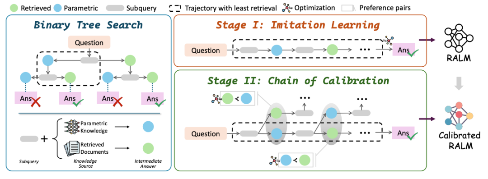
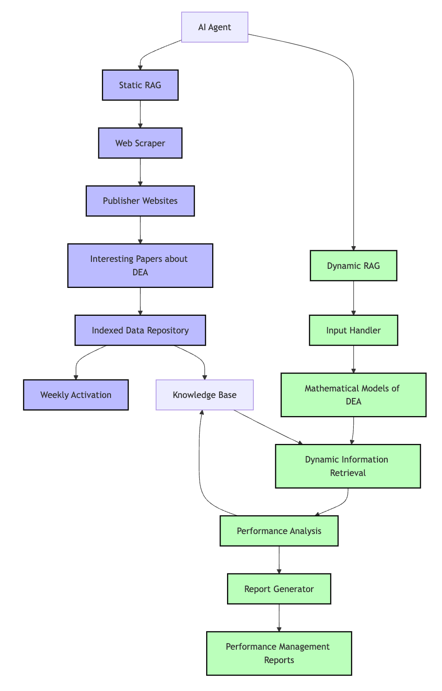
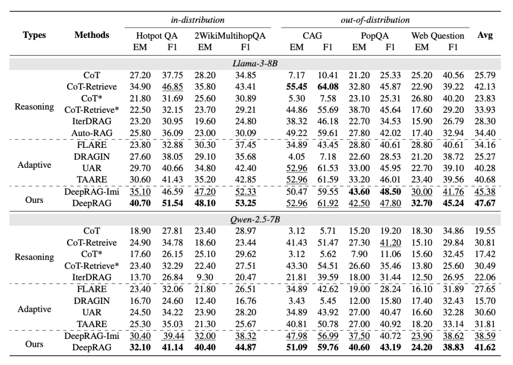

# 1. 资源

**个人点评**
优点：
- 整体思路很好，和deep research以及R1/O1的部分训练策略如出一辙

缺点：
- 实验验证不够完整，缺少和先进的modular_rag/graph_rag等方案对比，但从实验结果上看比hippo-rag2差距较大
- 实验仅用了BM25作为检索器，未使用更先进的检索器进行验证
- 数据的构造分支尝试判定是否用模型内部知识，还是知识库，这个界定不清晰，且容易让模型陷入训练数据的局部最优，换了别的垂直领域数据集可能造成选择失效

# 2. 摘要

LLMs 在推理过程中存在的事实幻觉问题，尤其是在时间性、准确性和参数知识的覆盖范围方面。此外，将推理与 RAG 结合仍然具有挑战性，主要由于任务分解不有效和冗余检索，这可能会引入噪声并降低响应质量。本文提出了 DeepRAG，这是一个将检索增强型推理建模为马尔可夫决策过程（Markov Decision Process, MDP）的框架，能够实现策略性和适应性的检索。通过迭代地分解查询，DeepRAG 动态地决定在每一步是检索外部知识还是依赖于参数化推理。实验表明，DeepRAG 在提高检索效率的同时，将回答的准确性提高了21.99%，证明了其在优化检索增强型推理方面的有效性。

# 3. 原理

**DeepRAG 核心方法**

DeepRAG，用于解决LLMs在推理过程中存在的事实幻觉问题，并提出了一种新的框架来增强检索增强生成中的推理能力。将检索增强推理建模为马尔可夫决策过程（MDP），通过迭代分解查询，动态决定在每一步是检索外部知识还是依赖参数化推理。

马尔可夫决策过程（MDP）建模：首先，将问题分解、原子决策和最终答案生成过程形式化为一个MDP，定义如下：(S, A, P, R)，表示状态集合，表示动作集合，表示转移动态，表示奖励函数。状态表示原始问题的部分解，动作包括终止决策和原子决策。

DeepRAG 框架：包括三个步骤:(1)二叉树搜索，(2)模仿学习，(3)校准链。给定一个数据集，我们首先使用二叉树搜索来合成用于模仿学习的数据，使模型能够学习检索模式。随后，我们使用二叉树搜索来构建偏好数据，以进一步校准大型语言模型对其知识边界的认知。

1. 二叉树搜索：为了构建推理路径，实现了一个二叉树搜索方法，探索了基于参数知识或外部知识库的不同回答策略。每个子查询都生成两个回答策略：直接利用参数知识或检索外部文档。

2. 模仿学习：通过二叉树搜索合成数据，提取最小检索成本的推理过程进行模仿学习。具体算法如下：
   - 从中取出具有最低检索次数的轨迹。
   - 生成子查询。
   - 如果应该回答或长度超过最大历史长度，则生成最终答案。
   - 否则，生成下一个子查询，并将其加入优先队列。
   - 如果检索文档，则生成中间答案，并将其加入优先队列。
   - 初始化优先队列。
   - 当不为空时，执行以下步骤：
   
3. 校准链：通过校准每个原子决策，优化LLM的内部知识。具体步骤包括：

    - 其中，是逻辑函数，是调节偏离基准模型的惩罚超参数，和分别表示直接答案和检索答案的生成片段。
    - 合成偏好数据以确定何时需要检索。
    - 使用校准链目标对LLM进行微调，公式如下

# 4. 实验
数据集：使用五个开放域问答数据集进行实验，训练数据集来自HotpotQA和2WikiMultihopQA，测试数据集包括HotpotQA、2WikiMultihopQA、CAG、PopQA和WebQuestions。

基线方法：使用CoT、CoT_、CoT-Retrieve、CoT-Retrieve_、IterDRAG、UAR、FLARE、DRAGIN、TAARE和AutoRAG作为基线方法进行比较。

实现细节：采用BM25作为检索模型，外部知识库为Wikipedia，分割成100个token的段落。选择Llama-3-8B-Instruct和Qwen-2.5-7B作为基础模型。

# 5. 结果与分析
整体结果：DeepRAG在所有测试场景中均表现出优于现有方法的性能。与基于推理和自适应RAG的基线方法相比，DeepRAG在所有数据集上均实现了改进。

检索效率：DeepRAG在保持较高准确性的同时，检索成本相对较低。置信度方法在不同数据集上的鲁棒性有限，迭代检索方法需要大量检索操作。

与参数知识的相关性：DeepRAG在F1、平衡准确率和MCC指标上表现出色，成功识别了检索的必要性。FLARE、DRAGIN和TAARE虽然准确性高，但在避免不必要检索方面表现不佳。

不同推理策略：仅依赖内部知识效果较差，完全依赖外部知识准确性较高但检索成本高。DeepRAG通过自适应选择内部和外部知识源，表现优于仅依赖检索的方法。

问题分解效果：大多数问题需要3～5步分解，检索尝试主要集中在0～2轮。DeepRAG有效地分解问题，同时最小化冗余检索。

消融研究：模仿学习阶段，DeepRAG-Imi在CAG上表现较差，但平均性能较高。校准链阶段，DeepRAG在保持较低检索成本的同时，平均性能较高。

**DeepRAG 与现有 RAG 的区别**
1. 动态和策略性检索：
   DeepRAG将检索过程建模为一个马尔可夫决策过程（MDP），通过动态和策略性的方式决定何时进行检索。它通过迭代分解查询，动态决定每一步是否需要检索外部知识或仅依赖内部参数化知识。

2. 二叉树搜索：
   DeepRAG使用二叉树搜索来探索不同的检索策略路径。这种方法允许模型生成子查询并根据已检索的信息动态调整检索策略，从而更有效地利用外部知识。

3. 知识边界校准：
   DeepRAG通过链式校准方法来优化模型的知识边界感知能力。它通过合成数据和偏好数据来训练模型，使其能够更准确地判断何时需要检索外部信息，从而减少不必要的检索操作。

4. 减少冗余检索：
   DeepRAG通过动态决定检索需求，减少了不必要的检索操作，从而提高了检索效率并降低了生成质量下降的风险。

5. 端到端训练：
   DeepRAG采用端到端的训练方法，能够在不依赖额外参数或不可靠的不确定性度量的情况下，利用大语言模型的生成能力来探索知识边界。

6. 多步推理：
   DeepRAG通过分解复杂查询为多个子查询，并在每一步中动态决定使用参数化知识还是外部知识，从而实现多步推理过程。这种方法有助于处理需要多步推理的任务。

这些特点使得DeepRAG在提高检索效率和答案准确性方面表现出色，特别是在处理需要多步推理和时间敏感的问答任务时。

# 6. 总结
本文提出了DeepRAG，通过自校准增强了LLMs对检索需求的认识。DeepRAG将查询分解为子查询，并使用二叉树搜索进行数据合成，帮助模型更好地理解其知识边界。实验结果表明，DeepRAG显著提高了检索增强生成的准确性和效率。

不足与反思
1. 局限性：尽管DeepRAG在大多数情况下表现出色，但在某些数据集上仍存在不足，特别是在时间敏感的CAG数据集上，DeepRAG的表现不如某些自适应检索方法。
2. 下一步工作：未来的研究可以进一步优化DeepRAG的检索策略，特别是在处理时间敏感和多跳事实问答任务时，进一步提高模型的鲁棒性和准确性。

# 7. 问答
**问题1：DeepRAG是如何通过二叉树搜索方法构建推理路径的？**

DeepRAG通过二叉树搜索方法构建推理路径，具体步骤如下：

1. 子查询生成：对于给定的问题，模型首先生成第一个子查询，并探索两种回答策略：直接利用参数知识或检索外部文档。
2. 路径探索：模型根据当前状态生成子查询，并根据预先设定的阈值或策略选择执行直接回答或检索外部文档。
3. 递归分解：对于每个生成的子查询，模型继续递归地进行相同的操作，直到达到终止条件（如生成最终答案或达到最大迭代次数）。
4. 数据合成：通过这种方式，DeepRAG不仅将问题分解为一系列前向依赖的子查询，还彻底检查了检索选择在最终答案中的影响。这种方法不仅提高了推理的连贯性，还确保了检索的有效性。

**问题2：DeepRAG的模仿学习阶段是如何利用二叉树搜索合成数据的？**
1. 在模仿学习阶段，DeepRAG利用二叉树搜索合成数据的具体步骤如下：
2. 优先队列初始化：使用优先队列来高效探索潜在的推理轨迹，优先队列中的元素按照检索成本进行排序。
3. 路径构建与评估：模型从优先队列中取出当前路径，生成下一个子查询，并根据预先设定的阈值或策略选择执行直接回答或检索外部文档。然后，将新生成的路径和检索结果加入优先队列。
4. 数据收集：重复上述过程，直到优先队列为空或找到一条生成正确答案的路径。最终收集到的路径包含了最小检索成本的推理过程。
5. 模型微调：使用收集到的合成数据进行模型微调，优化模型的终止决策和原子决策，使其能够在实际生成过程中更有效地进行检索和推理。

# 参考

[1] DeepRAG：智能检索+MDP，精准秒杀事实幻觉，准确率飙升21.99%！https://blog.csdn.net/Python_cocola/article/details/145713544
[2] DeepRAG：LLM时代的智能检索革命（实测提升准确率21.99%）,https://mp.weixin.qq.com/s/uQ6JSB5NWAOiVC4uTCnvGw