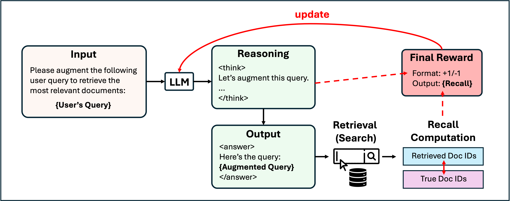

# 1. 资源

- 论文地址：
  - DeepRetrieval: Powerful Query Generation for Information Retrieval with Reinforcement Learning
  - https://arxiv.org/pdf/2503.00223
  - 2025.02.28，UIUCCS个人发布
- Github (56 stars): https://github.com/pat-jj/DeepRetrieval

# 2. 原理

把RL的思路用到搜索上，让LLM对query改写，用改写的query去搜索知识库，比较检索到的doc与真实doc的相似度，并赋予Reward。

Reward Design (in `code/verl/utils/reward_score/literature.py`):

| Recall      | ≥ 0.7 | ≥ 0.5 | ≥ 0.4 | ≥ 0.3 | ≥ 0.1 | ≥ 0.05 | < 0.05 |
|-------------|-------|-------|-------|-------|-------|--------|--------|
| **Reward**  | +5.0  | +4.0  | +3.0  | +1.0  | +0.5  | +0.1   | -3.5   |

# 3. 实验

训练使用的模型：Run 3B model (Qwen/Qwen2.5-3B-Instruct)

**Result (checkpoint date: Feb 16)**

| Model | Method | Recall (Publication) | Recall (Trial) |
|-------|--------|----------------------|----------------|
| **GPT-4o** | Zero-shot | 5.79 | 6.74 |
| | Few-shot | 7.67 | 4.69 |
| | ICL | 19.72 | 14.26 |
| | ICL+Few-shot | 11.95 | 7.98 |
| **GPT-3.5** | Zero-shot | 4.01 | 3.37 |
| | Few-shot | 4.15 | 3.34 |
| | ICL | 18.68 | 13.94 |
| | ICL+Few-shot | 7.06 | 5.54 |
| **Haiku-3** | Zero-shot | 10.98 | 11.59 |
| | Few-shot | 14.71 | 7.47 |
| | ICL | 20.92 | 24.68 |
| | ICL+Few-shot | 19.11 | 9.27 |
| **Mistral-7B** | Zero-shot | 7.18 | 8.08 |
| **LEADS**$^{*}$ | Zero-shot | 24.68 | 32.11 |
| **DeepRetrieval** | Zero-shot | **60.82** | **70.84** |

*Table: Comparison of different models and methods on publication search and trial search tasks. Bold numbers indicate the best performance.*

$^{*}$ *LEADS: a state-of-the-art literature mining LLM trained on 20K reviews and 400K publications [https://arxiv.org/pdf/2501.16255]*

# 4. 评价

相当于使用DeepRetrieval的核心还是用RL来训练LLM去改写Query，并通过搜索的相似性来优化模型的训练。为什么不直接优化embedding？

# 参考

[1] 搜索 + RL = DeepRetrieval， 开源！https://mp.weixin.qq.com/s/add7VmCWcHEVkcshBIhEKw