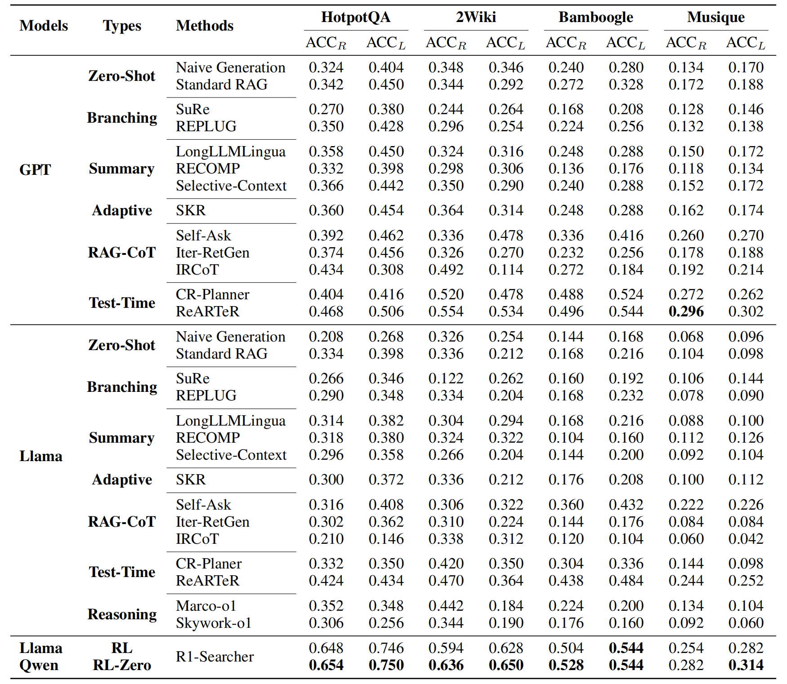
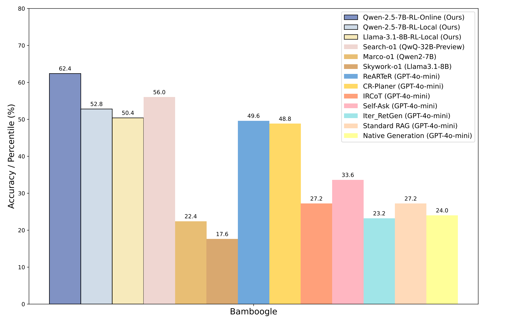
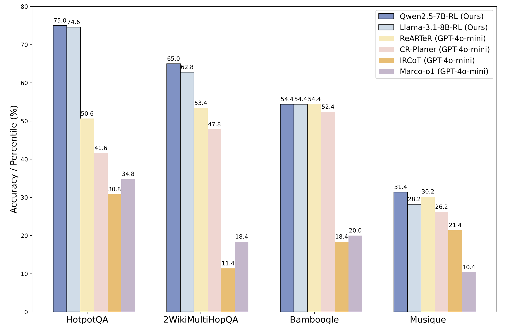

# 1. 资源

- Github (244 stars): https://github.com/SsmallSong/R1-Searcher
  - 包含完整的数据准备、训练、评估代码
- 数据 (从hotpotQA挑选训练数据)：https://huggingface.co/datasets/XXsongLALA/RAG-RL-Hotpotqa-with-2wiki
- 论文：
  - R1-searcher:  Stimulating the Search Capability of LLM from Zero via Reinforcement Learning
  - https://arxiv.org/abs/2503.05592#:~:text=To%20address%20this%2C%20we%20propose%20extbf%20%7BR1-Searcher%7D%2C%20a,designed%20to%20enhance%20the%20search%20capabilities%20of%20LLMs.
  - 2025.3.7，人民大学
- 模型：一个是基座用的是qwen2.5-7B–Base跟llama3.1-8B-instruct
  - 开源两个模型，Qwen-2.5-7b-base-rag-rl: 
    - https://huggingface.co/XXsongLALA/Qwen-2.5-7B-base-RAG-RL，Llama-3.1-8b-instruction-rag-rl
    - https://huggingface.co/XXsongLALA/Llama-3.1-8B-instruct-RAG-RL

# 2. 特点

- 通过仅依靠结果监督式强化学习，我们可以仅使用查询-答案对来激活模型的内在搜索功能，无论我们处理的是 Base LLM 还是 Chat LLM。
- 最近的强化学习算法，如 GRPO 和 Reinforce++，都可以有效地激活 LLM 的内部搜索功能。
- 在培训期间，不需要复杂的快速工程或过程监督。
- Base LLM 的功能在很大程度上影响模型是否可以直接从 Zero 开始训练。
- RL 之后的 LongCoT 推理是一种比现有的基于树搜索的方法（例如蒙特卡洛树搜索）更有效、更高效的测试时间缩放方法。
- 通过使用本地检索进行 RL 训练，该模型可以很好地泛化到其他数据集和在线搜索场景。
- 与现有的复杂方法甚至接近源的 LLM（例如 GPT-4o-mini）相比，最终的 7B 参数 LLM 实现了显着的性能改进。

# 3. 方法

**整体**

没SFT，核心是奖励函数设计

我们采用两阶段奖励引导式 RL 训练方法：

- 第 1 阶段：学习仅使用格式奖励调用 search。
- 第 2 阶段：学习使用 format-reward 和 answer-reward 调用搜索来解决问题。

**算法**

我们只使用结果监督式强化学习进行训练，因此我们需要考虑两个主要方面：（1） 强化学习算法，以及 （2） 奖励的设计。

- RL 算法：我们使用 Reinforce++ 作为 RL 算法。对于每个问题，我们平均 n 个样本的奖励，这稳定了训练过程。对于解决方案格式，我们使用 tag 进行思考，使用 xxx 进行搜索和回答，用于调用搜索工具和返回的检索文档。<think>...</think><answer>...</answer><begin_of_search>...<end_of_search><begin_of_documents>...<end_of_documents>
- 奖励设计：在 Stage-1 中，我们使用 retrieve-reward：如果模型执行 retrieval 并且解决方案满足格式要求，则答案奖励增加 0.5 分。在第 2 阶段，检索要求被取消，我们利用基于 F1 的答案奖励。如果解决方案不符合格式要求，则从答案奖励中扣除 2 分的惩罚。详细的实现，包括超参数，可以在我们的代码中找到。

**数据**

我们从 HotpotQA 和 2WikiMultiHopQA 中选择一部分训练集作为我们的训练数据。我们使用 Qwen-2.5-7B-Instruct 对训练数据集执行转出。

根据正确回答问题所需的部署次数，我们将数据分为三类：简单（<10 次部署）、中等（10 < 次部署和< 20 次部署）和困难（>20 次部署）。然后，这些类别以特定比例混合以形成我们的训练数据。我们所有的训练数据都可以在这里找到：https://huggingface.co/datasets/XXsongLALA/RAG-RL-Hotpotqa-with-2wiki。

# 4. 评估

遵循 ReARTeR（https://arxiv.org/pdf/2501.07861），我们选择了四个具有代表性的基准测试：HotpotQA、2WikiMultiHopQA、Musique 和 Bamboogle。

HotpotQA 和 2WikiMultiHopQA 在我们使用它们的训练集时被视为域内，而 Musique 和 Bamboogle 被归类为域外，使我们能够评估模型的泛化能力。我们从 HotpotQA、2WikiMultiHopQA 和 Musique 的开发集中随机抽取了 500 个示例作为我们的测试集。对于 Bamboogle，我们使用所有测试集（125 个样本）作为我们的测试集。

维基百科段落用作所有数据集的检索语料库，特别是使用 KILT 于 2019 年 8 月发布的维基百科语料库。此外，由于 Bamboogle 中包含的知识是最新的，我们结合了在线网络搜索测试来进行进一步评估，从而检查我们的模型与在线搜索能力的一致性。

对于评估指标，我们使用ACC_R （Cover-Exect-Match） 和 ACC_L （LLM-as-Judge）。

正如我们所看到的，当使用相同的 LLaMA-3.1-8B-Instruct 基础模型时，我们的方法与现有方法相比取得了显着的改进，甚至超过了 GPT-4o-mini 等闭源模型。此外，当切换到更强大的基础模型 Qwen-2.5-7B-Base 时，我们直接从零开始进行强化学习。最终，我们可以在所有域内和域外数据集上获得更好的结果并获得最佳性能，这证明了我们模型卓越的泛化能力。

对于 Bamboogle，我们还使用 Google 进行在线搜索。正如我们所看到的，与仅仅依赖本地知识库相比，在线搜索的整合产生了卓越的结果，这表明将在线搜索功能无缝集成到我们的模型中是可行的。

# 参考

[1] Deepseek-v3/R1全量微调及Seg-Zero、R1-Searcher领域强化适配思路, https://mp.weixin.qq.com/s/YtmJTgQwZGPT16C9ZNgT2g
