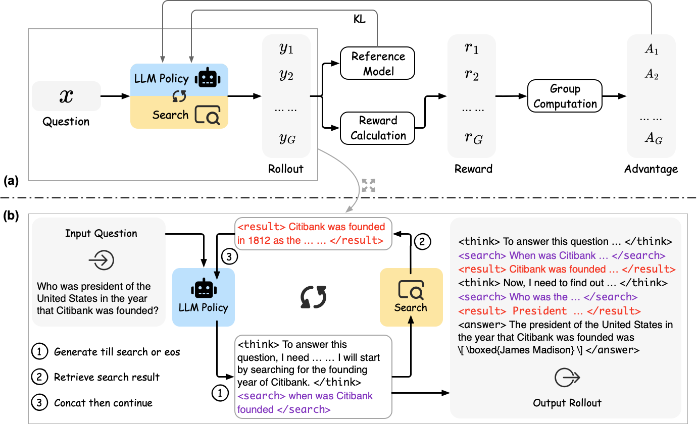
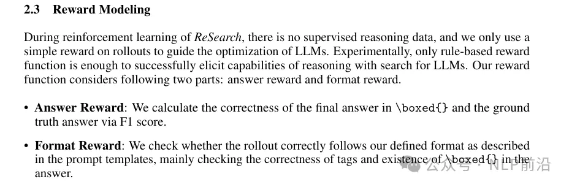
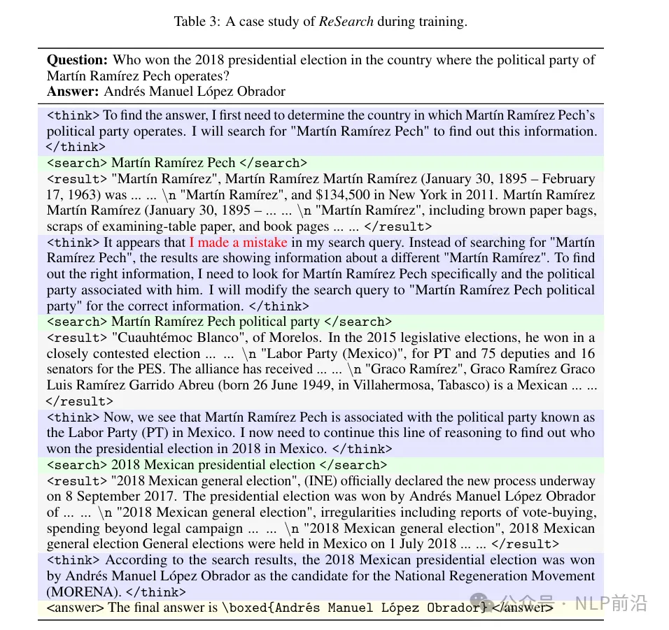
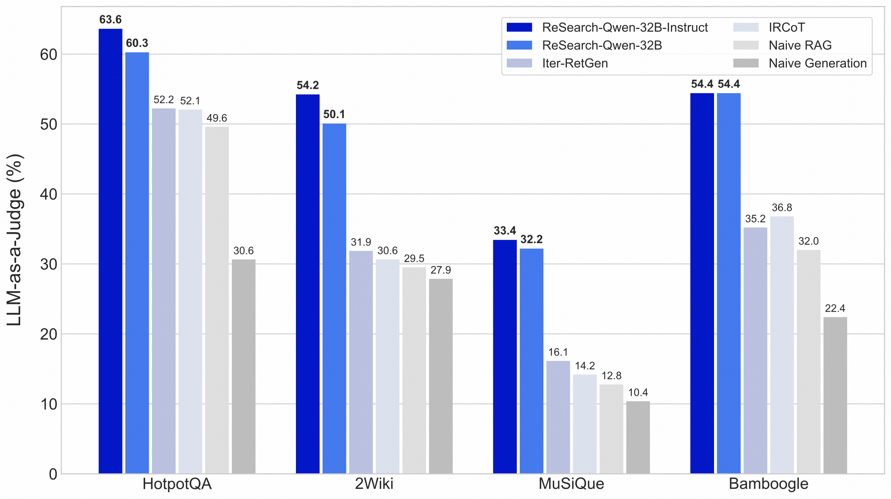

# 1. 资源

六小虎-百川 开源 ReSearch，一个 RL 框架，从零开始教 LLMs 使用搜索进行推理。

- Github (811 stars): https://github.com/Agent-RL/ReCall
  - 目前项目已更改到这个地址，改为更通用的工具推理框架
- 项目地址:https://github.com/Agent-RL/ReSearch
  - 已放置分支，停止更新
- 论文地址：https://arxiv.org/abs/2503.19470
- 模型：https://huggingface.co/collections/agentrl/research-67e506a0311bea06dc54878b
- 强化学习框架（6.1k stars）：https://github.com/volcengine/verl

# 2. 原理

简单概括，ReSearch框架，它不是教AI怎么思考或怎么搜索，而是让AI自己学会何时该搜索、搜什么、如何利用搜索结果继续推理。

naive RAG -> agentic RAG

整体没有太大新的地方，先思考问题 -> 决定需要查询什么 -> 获取搜索结果 -> 基于搜索结果继续思考或调整查询方向

reward 规则如下，训练数据使用musique，一个为多跳问答设计的19938个样本。 grpo训练。

# 参考

[1] SuperRAG， 百川也开源了。https://mp.weixin.qq.com/s/frC0inR6qe3yWh4VvLItgg