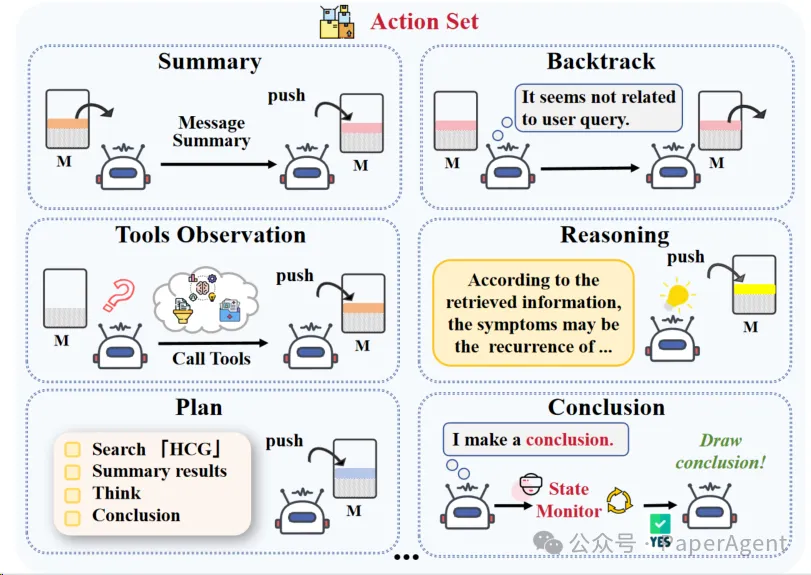
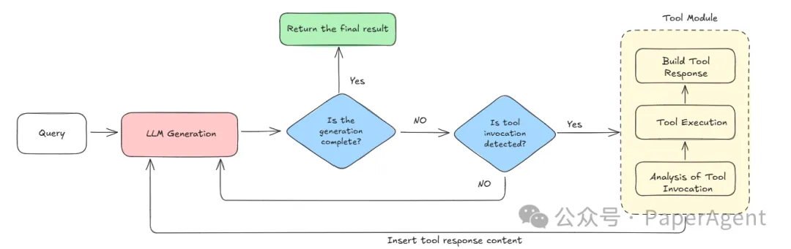
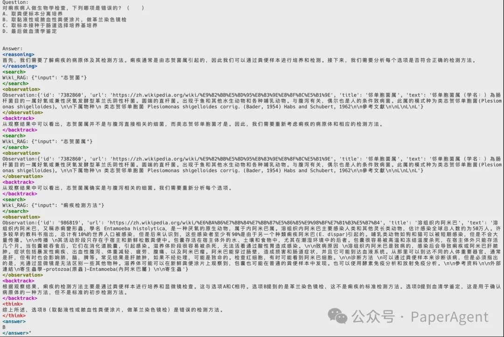

# 1. 资源

Github项目地址： https://github.com/jiangxinke/Agentic-RAG-R1

# 2. 简介

Agentic RAG-R1 是由北京大学研发的一项开源研究项目，旨在推动语言模型在自主检索与推理能力方面的能力边界。该项目通过引入强化学习策略（GRPO），构建了一个可自我规划、检索、推理与总结的智能体式 RAG 系统。

核心亮点

1. Agentic RAG 架构：融合检索增强生成（RAG）与 Agentic AI 机制，模型不仅生成答案，还能“决定如何生成答案”。
2. 强化学习优化（GRPO）：借助 Generalized Relevance Policy Optimization，让模型学会更合理地选择检索和推理步骤。
3. 多轮推理与回溯能力：支持计划、回溯、总结等多种 agent 行为，实现人类式的问题解决流程。
4. LoRA 与量化支持：低成本微调与高效推理并存，轻松部署大模型至生产环境。
5. 丰富奖励机制：引入格式、准确性、RAG 表现等多个维度的奖励，训练出更“懂业务”的智能体。

# 3. 方法

核心理念：两大王牌技术的强强联合

- 🔍 检索增强生成 (RAG)：在生成过程中即时从外部知识库检索信息，兼具语言模型的创造力与实时、可信的事实。

- 🤖 Agentic AI 智能体：让模型自主决定何时检索、检索什么，以及如何把检索证据编织进推理链，真正做到“会思考、会行动”。

🏗️ 架构：基于 TC-RAG 的智能体思考循环

# 动作清单

| 序号 | 动作                        | 说明                         | 状态 |
|------|-----------------------------|------------------------------|------|
| 1    | 🤔 Reasoning（推理）         | 展开思考、提出假设          | ✅   |
| 2    | 🔄 Backtrack（回溯）         | 回到上一节点，修正思路      | ✅   |
| 3    | 📝 Summary（总结）           | 汇总已有证据，压缩上下文    | ✅   |
| 4    | 🛠️ Tool Observation（工具调用） | 访问 Wiki / 文档 / 知识图谱等 | ✅   |
| 5    | ✅ Conclusion（结论）        | 输出最终答案                | ✅   |

# 🔬 技术细节深挖

| 组件                  | 关键点                                                   | 优势                                      |
|-----------------------|----------------------------------------------------------|-------------------------------------------|
| GRPO (Generalized Relevance Policy Optimization) | 采样多条推理-检索轨迹，对“高相关、高准确、高格式”路径赋正奖励 | 训练稳定、收敛快，避免 RLHF 里的 Reward Hacking |
| LoRA + NF4 量化        | 10 % 参数可训练，int-4 存储                              | GPU 省钱，多实验迭代无压力                |
| Deepspeed Zero-3      | 权重 & 优化器拆分到 CPU / NVMe                          | 3×A100 → 32B 轻松起飞                     |
| 多模态工具接口         | 支持文本、代码、数据库、REST API                        | 让模型在“真实工作流”里落地               |

奖励公式: ( r_total = r_accuracy + r_format + r_rag )

其中 r_rag 由 RAGAS 自动评测检索片段是否被有效引用。

# Rollout Generation

# 4. 📊 结果：数据说话

数据集：MedQA（中英双语） | Judge Model：Qwen-2.5-72B

| 设置               | 格式准确率 ↑         | 答案准确率 ↑        |
|--------------------|----------------------|----------------------|
| 微调前             | 39%                  | 84%                  |
| 微调前 + 检索      | 56%                  | 79%                  |
| 微调后 + 检索      | 92% (+53%)           | 87% (+3%)            |

- 跨语言：中/英两份测试集均显著提升
- 复杂推理：多跳问题正确率提升 8% 以上
- 工具调用成功率：> 95 %，日志可追溯

实际测试结果：

# FAQ
Q1：必须用 32B 模型吗？

A1：不需要！我们默认用 Qwen-2.5-7B-Instruct；你也可以换成 Llama-3-8B / Baichuan-13B，只需改配置。

Q2：RL 训练很复杂吗？

A2：脚本参数与常规 LoRA 差不多，多加一份奖励配置即可。CPU 显存不足？Zero-3 + Offload 轻松搞定。

# 参考

[1] Agentic RAG-R1：让大模型从「检索助手」跃升为「思考+搜索王者」！https://mp.weixin.qq.com/s/2vg7PcC4mMhoK6eouQ2MIQ