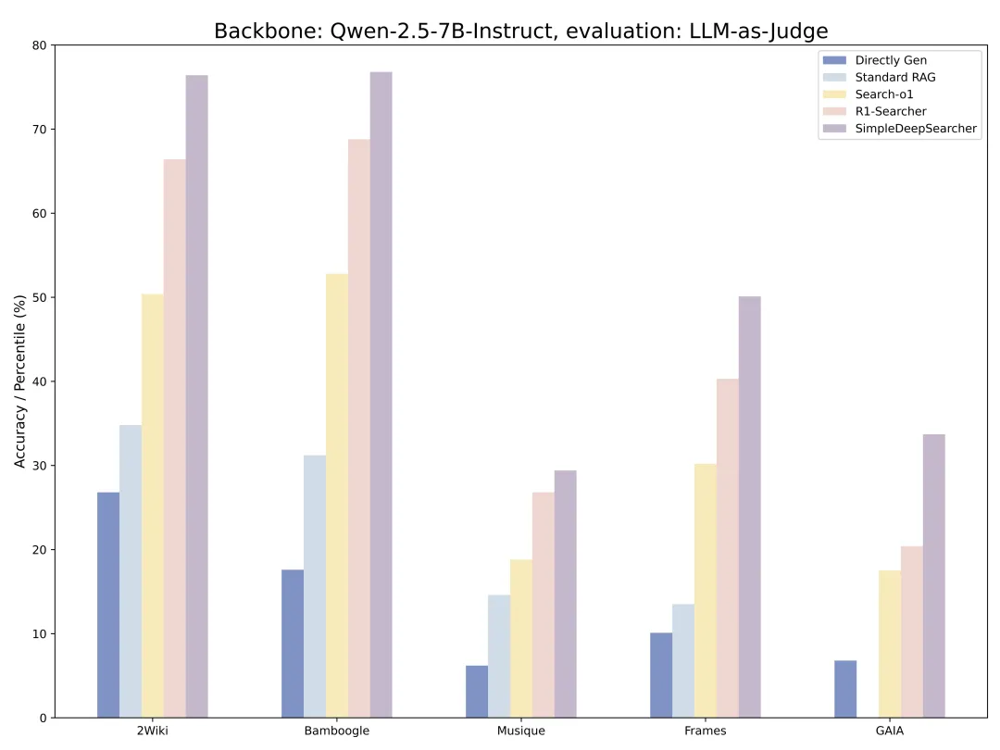
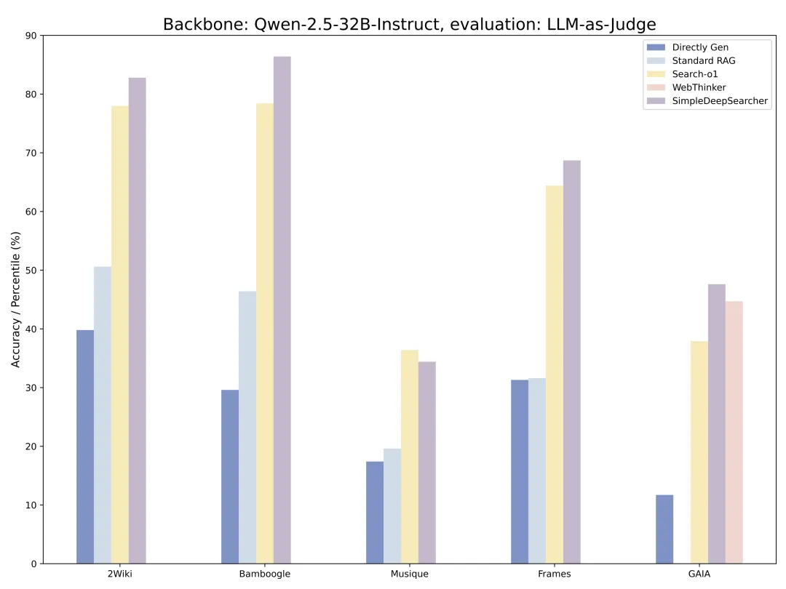
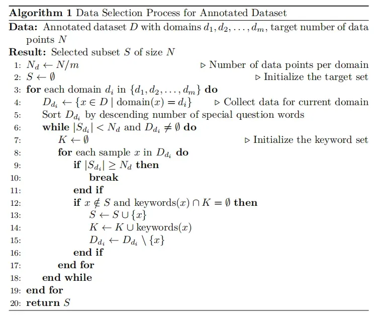
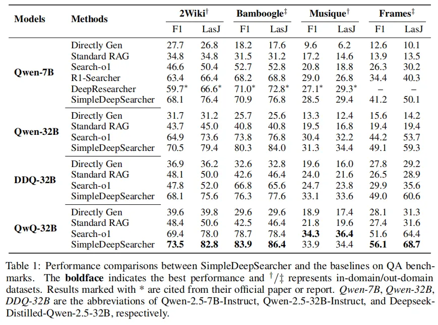
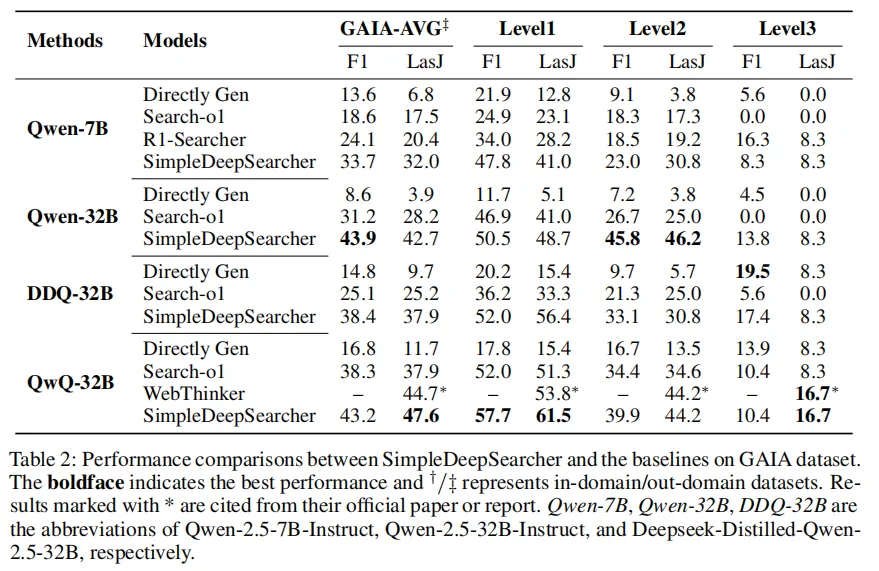
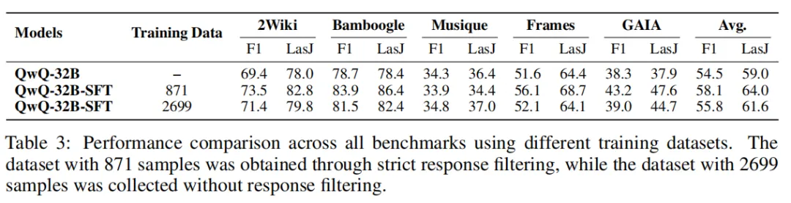
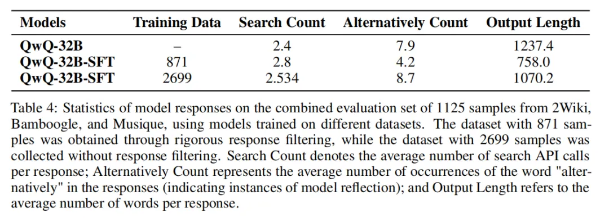
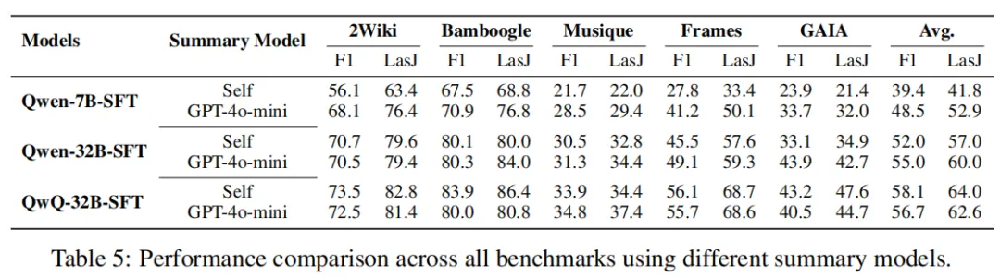
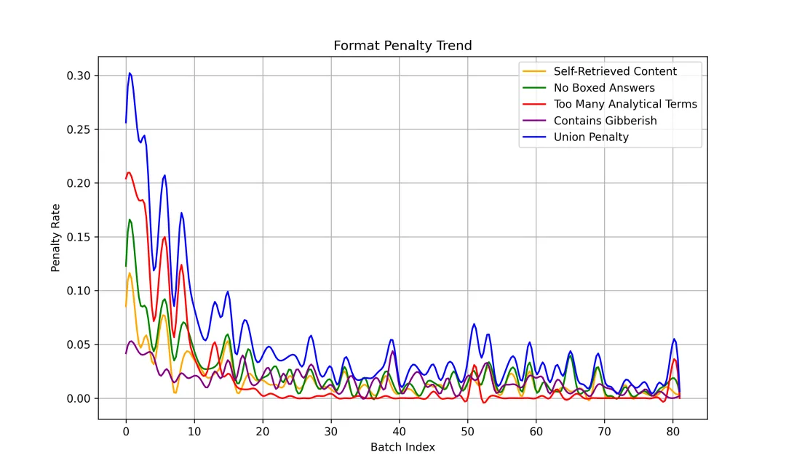
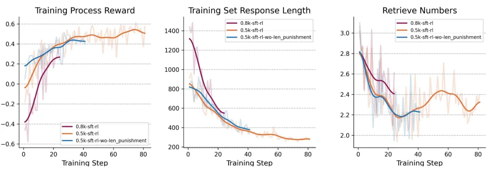

# 1. 资源

- GitHub: https://github.com/RUCAIBox/SimpleDeepSearcher
- Notion: https://sweet-walkover-f9b.notion.site/SimpleDeepSearcher-Deep-Information-Seeking-via-Web-Powered-Reasoning-Trajectory-Synthesis-1d1c27a43d7a801090d8ce1a75b2d6d0

关键亮点
- 基于真实网络环境的数据生成
- 严格的数据筛选策略
- 少量数据实现高效提升
- OOD评测集的泛化能力
- 蒸馏后进一步进行强化学习的分析

# 2. 简介

近期研究者尝试通过强化学习提升大语言模型在复杂信息检索任务中的自主推理能力，但训练成本高、联网检索效率低。为此，我们提出了SimpleDeepSearcher框架，通过蒸馏与自蒸馏，以极少的数据高效激发模型的自主检索推理能力。针对现有数据领域分布不均、结构单一、复杂性不足等问题，我们精细筛选并在真实网络环境中进行Rollout采样，最终构建了仅包含871条高质量、高效检索的训练样本。实验表明，SimpleDeepSearcher在7B规模模型上显著优于传统强化学习方法，使Qwen-32B-Instruct的表现逼近具备自主检索能力的QwQ-32B，并进一步提升了QwQ-32B的推理表现。

近期研究者探索使用强化学习训练大语言模型，以提升其在复杂信息检索任务中的自主检索和推理能力。然而，强化学习带来高训练开销，且从本地检索切换至联网搜索后效率更低，同时联网搜索对计算资源要求极高。基于此，我们希望以较低的训练成本获得具有强大推理能力的深度搜索模型。

基于此，我们提出了SimpleDeepSearcher，这是一个通过蒸馏和自蒸馏来激发模型在复杂推理过程中自主检索能力的框架，旨在通过极少的训练数据实现高效且有效的模型训练。构造高质量的训练数据存在两个挑战：从query侧，现有的开源数据集存在问题领域分布不均，结构重复和复杂性不足等问题，无法有效激发模型深度搜索能力。从response侧，解决深度搜索任务强调有效拆解复杂查询，避免无效推理步骤和过度思考，与传统数学推理或逻辑推理任务目标有本质区别。

为了解决上述挑战，我们对开源数据集中的问题进行了精细筛选，并使用大型推理模型对筛选出的问题在真实的检索环境中进行Rollout采样，对回复进行二次筛选，得到一批领域丰富，结构多样，推理简洁，检索高效的问答对。仅使用871条数据监督微调，在7B规模模型上显著超越了当前使用强化学习方法训练的模型表现；使Qwen-32B-Instruct表现接近本身拥有检索能力的QwQ-32B；同时能够使QwQ-32B的表现进一步提升。

我们已开源所有模型及高效微调数据集（0.5k 和 0.8k），其中 0.5k 数据集更注重直接推理，0.8k 数据集则引入了更多反思步骤；代码将在整理后陆续开放，技术报告也将随后发布，欢迎关注我们的项目。

# 3. 方法与技术路径

**数据合成**

不同于传统基于封闭知识库的RAG（Retrieval-Augmented Generation）系统，我们将问题置于开放的真实网络环境中展开检索与生成。这一设置意在提升模型在真实搜索场景下的信息感知与综合能力。我们构建了一个自动化的数据生成流程，利用推理模型（QwQ-32B）在真实网络环境下进行大规模的rollout.

**数据源选择与筛选**

我们选用了NQ ,HotpotQA、2WikiMultihopQA、Musique、SimpleQA和MultiHop-RAG并针对问题和回复开发了一套精细的筛选方法，具体包括：

**问题筛选**

筛选维度包括:

- 领域（Domain）多样性：确保问题涵盖多个领域。
- 关键词多样性：关键词为问题中涉及到的关键实体、属性、关系等，降低问题重复性，增加问题模式的多样性。
- 特殊疑问词覆盖率：增加问题复杂性。
- 我们使用QwQ-32B标注问题的领域和关键词，统计问题中特殊疑问词的数目，具体的问题筛算法见下图：

**回复筛选**

我们对回复设置了严格的格式和内容限制，只保留满足所有限制条件的回复。

限制条件：

- 格式规范性：去除中英混杂、特殊标记格式错误的回复
- 子查询有效性：优先选择检索内容重合度低的数据，搜索次数更少的回复以保证检索效率。
- 问题难度：选择多次rollout回复回答正确比例较低的问题，提高模型解决复杂问题的能力。
- 推理路径控制：严格限制反思词（如alternatively，wait等）的使用和单次推理长度，避免无效推理。
- 通过上述流程，我们最终构建出包含871条高质量问答对的数据集。

# 4. 评测

**实验设置**

- Benchmarks: 选择了五个基准：2WikiMultiHopQA，Bamboogle，Musique，FRAMES和GAIA。
- Evaluation Metrics：使用F1和LLM-as-Judge（LasJ）。
- Backbones：选择了Qwen-2.5-7B-Instruct，Qwen-2.5-7B-Instruct，Deepseek-Distileld-Qwen-2.5-32B和QwQ-32B

**主要结果**

- 整体性能的显著提升：与现有的baseline方法（Directly Gen、Standard RAG、Search-o1等）相比，SimpleDeepSearcher在全部五个QA基准中均表现出明显的性能优势。
- 维持泛化能力：评测基准中，2WikiMultihopQA和Musique为in-domain的评测数据集，而Bamboogle、Frames和GAIA为out-of-domain数据集。在out-of-domain数据集上的实验结果显示，我们的方法在泛化能力上表现优异，尤其在难度更高的Frames和GAIA数据集上表现突出，同样远超其他现有方法，充分体现出训练后模型的泛化性和鲁棒性。
- 跨模型的一致优势：无论是规模较小的Qwen2.5-7B-Instruct模型，还是规模较大的Qwen2.5-32B-Instruct、DeepSeek-R1-Distill-Qwen-7B、QwQ-32B模型，SimpleDeepSearcher均实现了跨模型的一致性能提升，表明我们提出的蒸馏与自蒸馏框架能够有效泛化至不同规模的模型。
- 检索效率与推理精简性提升：训练后的模型表现出更高效的搜索调用和问题推理行为。SimpleDeepSearcher不仅提高了模型有效拆解复杂查询、生成精确高效子查询的能力，还显著降低了推理过程中的冗余，决策路径更加清晰、精简和合理。

**对SFT的相关分析**

数据筛选的影响

我们首先比较了经过严格筛选后的871条数据训练的QwQ-32B模型与未经过严格筛选的2699条数据训练的模型。实验结果表明：

- 经过严格筛选的871条数据训练的模型的整体性能均优于未筛选的2699条数据训练的模型，表明高质量数据在增强模型泛化能力方面具有更显著效果。
- 经过严格筛选的871条数据训练的模型与未筛选的2699条数据训练得到模型相比，平均搜索次数增多，alternatively平均出现次数和回复长度显著降低，说明严格筛选后的数据更能激发模型有效拆解复杂查询，避免无效推理步骤和过度思考的能力。

**网页摘要模型的影响**

我们对比分析了采用模型自身生成摘要与GPT-4o-mini作为摘要模型的效果，对比结果见下图。实验结果表明，摘要模型的选择对最终性能具有显著影响，对于SFT后的Qwen-7B-Instruct，使用GPT-4o-mini作为摘要模型在各个数据集上均显著优于其自身生成摘要，平均提升约10个百分点。SFT后的Qwen-32B-Instruct在除2Wiki外也表现出类似趋势。对于SFT后的QwQ-32B，则为其自身作为摘要模型更好。

基于7B-SFT模型继续RL的相关分析

详细设置见Notion

Complete Rate, Reward持续上升，Format Penalty 逐渐减少

如下图所示，随着训练的进行，各个format penalty都在下降，并且answer reward和total reward整体呈现上升趋势，对问题的完成率也是上升趋势，说明RL训练有效果，能够让模型在规范格式的同时提高回答问题的准确性。

生成长度显著变短，检索次数略微下降

如下图所示，0.8k-sft-rl代表将使用0.8k训练数据进行SFT的模型作为backbone，0.5k-sft-rl代表将使用0.8k训练数据进行SFT的模型作为backbone，0.5k-sft-rl-no-len-punishment代表将使用0.5k训练数据进行SFT的模型作为backbone，但是去除“Too Many Analytical Terms”这一惩罚。可以发现：

1. 使用0.8k-sft进行RL，reward整体偏低，这是因为即使严格控制蒸馏数据中的分析词数量，但是7B模型蒸馏后还是会出现明显的过度思考现象，导致产生““Too Many Analytical Terms”，从而导致format penalty。
2. 不论reward model是否带有“Too Many Analytical Terms”这一惩罚，整体的response len都会以类似的趋势下降，说明通过强化学习会让模型能够提供更简洁精准的回答，但是会一定程度上损失蒸馏模型的推理能力。

# 参考

[1] SimpleDeepSearcher：SFT以小博大，少量数据性能超越RL！https://mp.weixin.qq.com/s/DWxiU8zeI5ugZgEZxQNp4Q