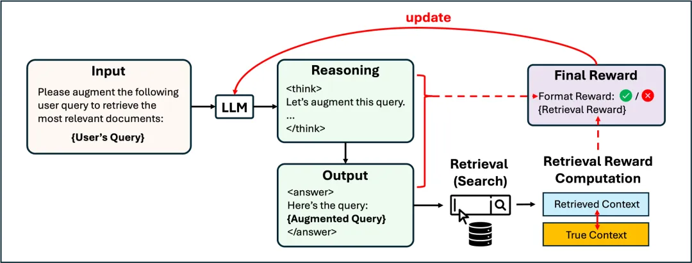

# 1. 资源

[1] 论文地址：https://arxiv.org/pdf/2503.00223
[2] 开源代码：https://github.com/pat-jj/DeepRetrieval
[3] 开源模型：https://huggingface.co/DeepRetrieval

DeepRetrieval 是一个基于强化学习（RL）的 query 优化系统，训练 LLM 在不同检索任务中优化原始查询，以最大化真实系统的检索效果。它不是训练一个新的 retriever，也不是让模型直接回答问题，而是：在不改变现有搜索系统的前提下，通过优化原始 query，让「提问方式」变得更聪明，从而获取更好的结果。

# 参考

[1] DeepRetrieval让模型端到端地学会搜索,https://mp.weixin.qq.com/s/TnnqutZALUDOC0UT3E5bfA