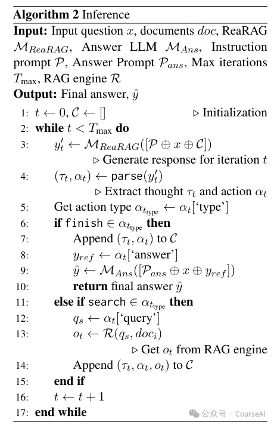

# 1. 资源

- Github (13 stars): https://github.com/llmsresearch/rearag/tree/main
  - 未给出训练代码
- 论文：ReaRAG: Knowledge-guided Reasoning Enhances Factuality of Large Reasoning Models with Iterative Retrieval Augmented Generation

# 2. 原理

ReaRAG通过限制推理链的最大长度来提高检索的鲁棒性，并减少过度思考，在推理过程中会不断地反思其推理轨迹，检测错误，并重新调整其推理方向，从而提高在 QA 任务中的表现。

ReaRAG 的整体结构包括以下几个关键部分：

- 推理链构建模块：
  - 该模块负责根据输入问题生成知识引导的推理链。
  - 它通过迭代执行搜索行动，从 RAG 引擎中检索相关信息，并根据检索结果更新推理思考，直到选择完成行动。

- 反思模块：
  - 在推理过程中，反思模块会不断检查之前的推理步骤，检测潜在的错误或不准确之处。
  - 一旦发现错误，它会引导模型重新调整推理方向，以确保推理链的正确性。

- 答案生成模块：
  - 在推理链构建完成后，答案生成模块会根据推理链中的信息生成最终答案。
  - 它通过一个专门的答案模型（MAns）来生成简洁的答案，以提高答案的可读性和准确性。

工作原理如下
问题输入与初始化：

模型接收输入问题后，初始化推理链为空，并设置迭代计数器 t 为 0。
迭代推理过程：

模型根据当前的推理链和问题生成一个推理思考（τt），并从预定义的行动空间中选择一个行动（αt），行动空间包括“搜索”和“完成”两种行动。

如果选择的是“搜索”行动，模型会提取搜索查询（qs），并在 RAG 引擎中执行该查询，获取观察结果（ot）。然后，将推理思考、行动和观察结果添加到推理链中，并将迭代计数器 t 加 1。

如果选择的是“完成”行动，模型会将推理思考和行动添加到推理链中，并结束迭代过程。

反思与调整：

在每次迭代中，反思模块会检查推理链中的推理思考和观察结果，评估推理的准确性和逻辑性。

如果发现错误或不准确之处，模型会重新调整推理方向，修改后续的推理思考和行动，以纠正错误。

答案生成：

迭代过程结束后，模型根据推理链中的信息，通过答案生成模块生成最终答案。

答案生成模块会提取推理链中的关键信息，并使用答案模型（MAns）生成简洁、准确的答案。

# 3. 样例

问题是：

“Who is the spouse of the screenwriter of The Actress?”

ReaRAG 的推理过程如下：

推理思考 1：

模型首先需要找出《The Actress》的编剧是谁。

因此，它生成了一个搜索行动，查询“Who is the screenwriter of The Actress?”。

观察结果 1：

从 RAG 引擎中检索到的信息显示，《The Actress》的编剧是 Ruth Gordon。
推理思考 2：

模型根据检索到的信息，进一步思考需要找出 Ruth Gordon 的配偶。

于是，它生成了第二个搜索行动，查询“Who was Ruth Gordon married to?”。

观察结果 2：

检索结果显示 Ruth Gordon 的配偶是 Garson Kanin。
推理思考 3：

模型继续思考是否需要进一步验证，例如 Ruth Gordon 是否有多次婚姻等信息。

它生成了第三个搜索行动，查询“Was Ruth Gordon married more than once?”。

观察结果 3：

检索结果表明，根据给定的上下文，没有提供关于 Ruth Gordon 婚姻的更多信息。
完成行动：

模型根据之前的检索结果，得出结论：Garson Kanin 是《The Actress》编剧的配偶。

因此，它执行了完成行动，生成最终答案“Garson Kanin”。

# 参考

[1] 清华ReaRAG，严防Deepseek过度思考「自省式推理」登顶多跳问答榜, https://mp.weixin.qq.com/s/i3wIlLYTbgMxdPEQ5lHmSA