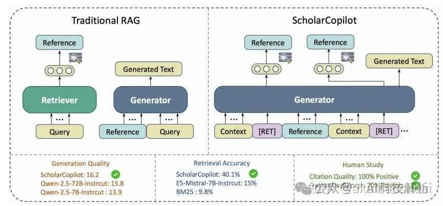
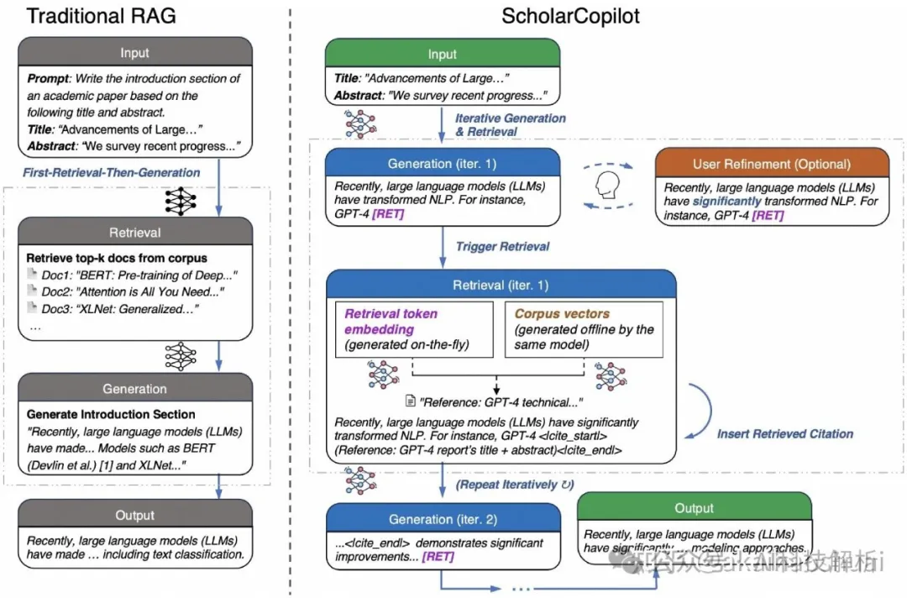
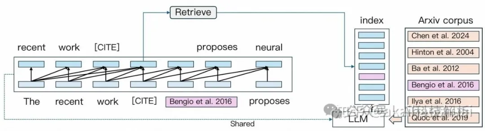
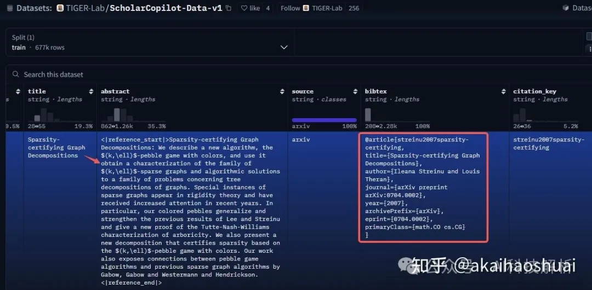

# 1. 资源
- 数据集（英文）：https://huggingface.co/datasets/TIGER-Lab/ScholarCopilot-Data-v1

亮点：7B小模型写好学术论文，新框架告别AI引用幻觉，实测100%学生认可引用质量

# 2. 原理

数据集构建：
- 论文收集：从arXiv收集了670K篇计算机科学论文，其中570K篇成功获取了LaTeX源代码。
- 结构解析：提取标题、摘要、引言、相关工作部分和参考文献等结构化组件。经过过滤后，保留了501K篇结构化文档（500K用于训练，1K用于评估）。
- 参考文献提取：使用Qwen2.5-3B-Instruct模型从参考文献条目中提取论文标题，得到19M个独特的参考文献。
- 参考文献匹配：将提取的参考文献标题与数据库进行匹配，成功匹配了16.8M个参考文献。
- 数据集整合：将解析后的论文结构与其匹配的引用整合，创建了ScholarCopilot数据集。训练数据集包含500K篇论文，每篇论文平均有38个引用，其中33个（87%）成功匹配到学术数据库中的条目。

最后用得到的数据进行微调，微调学习的就是通过当前内容，智能补全参考内容和参考文献的索引。

