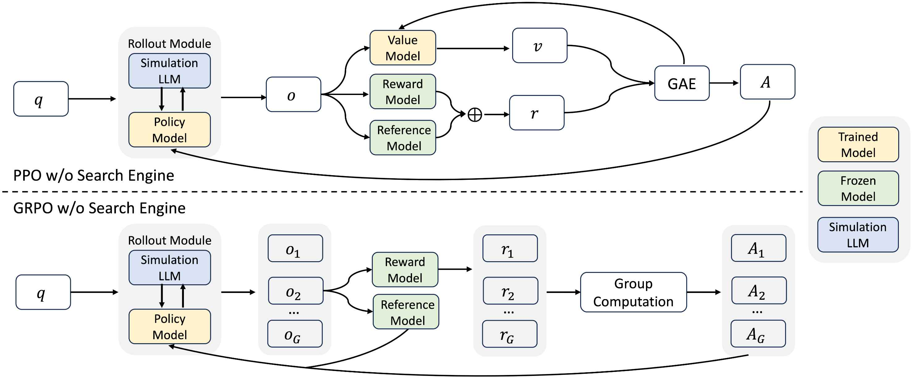
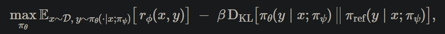
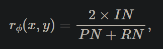
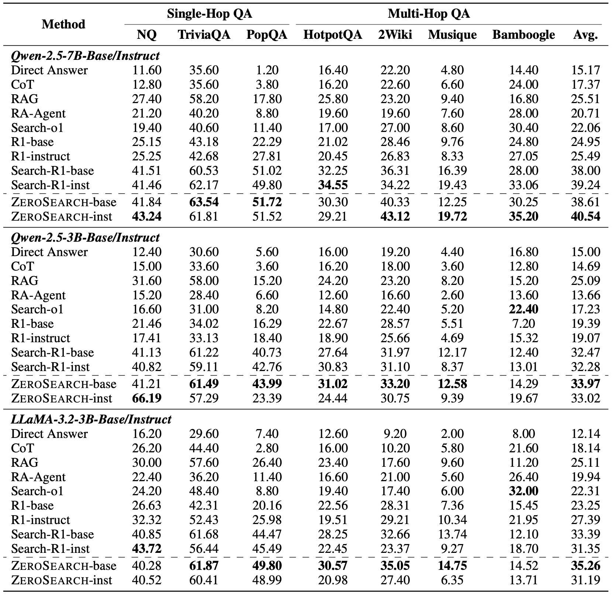
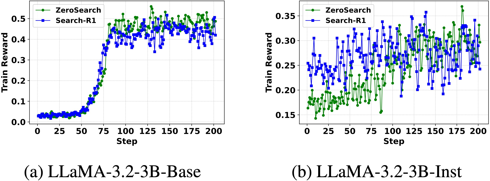
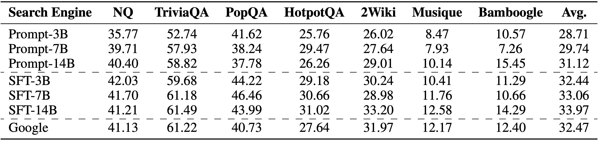

# 1. 资源

- Github (746 stars): https://github.com/Alibaba-NLP/ZeroSearch
- 论文：
  - ZEROSEARCH: Incentivize the Search Capability of LLMs without Searching
  - 阿里通义实验室，2025.5.7
- 博客：https://alibaba-nlp.github.io/ZeroSearch/
- 模型：https://huggingface.co/collections/sunhaonlp/zerosearch-681b4ce012b9b6899832f4d0
  - 主要基于Qwen2.5, 3B,7B, llama3.2-3B训练
- 数据：https://huggingface.co/datasets/sunhaonlp/ZeroSearch_dataset
  - 数据量：172,740
  - 语种：英文
  - 类型：回复都是比较简短的直接回答

# 2. 亮点及核心原理

**核心原理**
- 主要目的让模型学会持续迭代搜索，类似deep search深度搜索方案，并学会不被干扰内容干扰
- 通过LLM搜集互联网搜索正确与错误的轨迹，整理成SFT，训练一个LLM，根据问题，生成相关和无关文档
- SFT训练后，强化学习+课程学习（逐渐增加检索文档的干扰内容），使用一个模拟LLM模拟搜索引擎，根据查询生成文章
- 强化学习基于veRL和REGEN开发
- 其它代码基于Search-R1

**亮点**
- 主要针对搜索引擎场景
- 相比其它类似方案，提出不与真实搜索引擎交互即可增强 LLM 的搜索功能（其实是用LLM模拟搜索引擎生成文章）
- 使用课程学习逐步提升模型性能

**效果**
- 3B LLM 作为检索模块有效地激励了 LLM 的搜索能力‘
- 7B 检索模块的性能与真实搜索引擎相当，而 14B 检索模块甚至超过了它

# 3. 原理

有效的信息搜索对于增强大型语言模型 （LLM） 的推理和生成能力至关重要。最近的研究探索了使用强化学习 （RL） 通过与真实环境中的实时搜索引擎交互来提高 LLM 的搜索能力。虽然这些方法显示出可喜的结果，但它们面临两个主要挑战： （1） 不受控制的文档质量：搜索引擎返回的文档质量通常是不可预测的，这会给训练过程带来噪音和不稳定。 （2） 高得令人望而却步的 API 成本：RL 训练需要频繁推出，可能涉及数十万个搜索请求，这会产生大量的 API 费用并严重限制可扩展性。 为了应对这些挑战，我们引入了 ZeroSearch，这是一个强化学习框架，无需与真实搜索引擎交互即可增强 LLM 的搜索功能。 我们的方法从轻量级的监督式微调开始，将 LLM 转换为能够生成相关和嘈杂文档以响应查询的检索模块。 在 RL 训练期间，我们采用基于课程的推出策略，该策略逐渐降低生成文档的质量，通过将其暴露于越来越具有挑战性的检索场景中，逐渐激发模型的推理能力。 广泛的实验表明，ZeroSearch 使用 3B LLM 作为检索模块有效地激励了 LLM 的搜索能力。 值得注意的是，7B 检索模块的性能与真实搜索引擎相当，而 14B 检索模块甚至超过了它。 此外，它在不同大小的基础模型和指令调整模型中都能很好地泛化，并与各种 RL 算法兼容。

没有搜索引擎的强化学习我们提出了一个强化学习框架，通过利用 LLM 来模拟搜索引擎，消除了对真实搜索引擎的需求。优化目标表述为：

搜索 Simulation Tuning我们提出了一种轻量级监督微调 （SFT） 程序。具体来说，我们首先通过提示 LLM 以多轮次方式与真实搜索引擎互动来收集交互轨迹，直到得出最终答案。 产生正确答案的轨迹被标记为正，表示检索到的文档有用，而导致错误答案的轨迹被标记为负，表示检索有干扰。 然后，我们从这些轨迹中提取查询-文档对并执行轻量级 SFT 以提高 LLM 模拟真实搜索引擎的能力。

使用 Curriculum Search Simulation 推出在推出期间，策略模型执行交互式推理并生成搜索查询，这些查询被馈送到模拟 LLM 中以生成相应的文档。 为了逐渐增加训练的难度，我们引入了一种基于课程学习的推出机制，其中检索到的文档的质量会随着时间的推移而逐渐下降。

奖励设计奖励信号是强化学习过程中的主要监督。 在这项工作中，我们采用了基于 F1 分数的奖励，该奖励只关注答案的准确性。

其中 IN 表示预测与真实值之间的重叠单词数，PN 是预测中的单词数，RN 是真实值中的单词数。 我们没有为输出格式加入额外的奖励，因为我们观察到该模型在没有明确监督的情况下始终产生格式正确的响应。

# 4. 实验

主要结果上表显示了 ZeroSearch 与七个数据集中的几种基线方法之间的比较。根据结果，可以得出几个关键的观察结果：

ZeroSearch 始终优于所有基线方法。这种性能优势适用于域内数据集（\textit{i.e.}、NQ 和 HotpotQA）和域外数据集（\textit{i.e.}、TriviaQA、PopQA、2WikiMultiHopQA、Musique 和 Bamboogle），证明了我们方法的稳健性。

ZeroSearch 超越了依赖真实搜索引擎的方法。与使用真实搜索引擎的 Search-R1 相比，ZeroSearch 实现了更好的性能，凸显了它在大规模强化学习中作为真实搜索引擎的有效替代品的潜力。

ZeroSearch 表现出很强的泛化性。对于不同的模型系列、大小和类型（即基本或指令调整），ZeroSearch 的性能始终优于基线。此外，它的性能随着模型的增加而进一步提高，凸显了其可扩展性。

将 ZeroSearch 与 Real Search Engine 进行比较我们比较了 LLaMA-3.2-3B 上 ZeroSearch 和 Search-R1 （使用真实搜索引擎） 的奖励曲线。

两种方法的总体奖励趋势相似。随着训练的进行，ZeroSearch 和 Search-R1 的奖励分数稳步提高，这表明这两种设置中的策略模型都有效地学会了与搜索引擎交互并生成正确答案。

ZeroSearch 实现了更稳定、更平滑的学习曲线。ZeroSearch 最初落后于 Search-R1，但最终以更小的波动性超过了它，这要归功于帮助模型逐渐掌握搜索工具使用的课程机制。

ZeroSearch 在基础模型和指令优化模型中都能很好地泛化。在这两种模型类型下，ZeroSearch 稳步提高奖励性能，强调了其通用性。

模拟 LLM 的选择我们评估了不同的仿真引擎配置如何影响性能，包括基于提示的 LLM 和微调的 LLM，范围从 3B 到 14B 参数。

经过微调的 7B 模拟引擎 （SFT-7B） 实现了与 Google 搜索相当的性能，而 14B 变体 （SFT-14B） 甚至超过了它。 这证明了在强化学习设置中使用训练有素的 LLM 替代真实搜索引擎的可行性。

微调 （基于 SFT） 的模拟引擎明显优于基于提示的模拟引擎。尽管明确指导基于提示的方法以模仿真实搜索引擎的响应风格，但仍然存在巨大的分布差距，导致性能不佳。

性能会随着模型大小的增加而不断提高。更大的模拟 LLM 不仅表现出更强的模拟能力，而且更准确地区分相关和不相关的文档，从而在培训期间实现更有效的课程学习。

个案研究我们展示了几种交互轨迹。从这些例子中，我们观察到：

策略模型始终遵循预期的输出格式，即使该格式仅在输入模板中指定，并且未通过奖励设计进行强化。

该模型演示了多轮次搜索行为得出最终答案的能力。这证实了我们的方法有效地激励和利用了模型的搜索功能。

# 参考

[1] ZeroSearch：无需搜索即可激励 LLM 的搜索能力，https://alibaba-nlp.github.io/ZeroSearch/