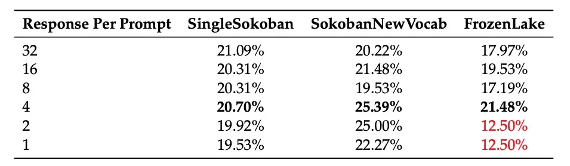

# 1. 资源

- Github (1.8k stars): https://github.com/RAGEN-AI/RAGEN
- 论文：RAGEN: Understanding Self-Evolution in LLM Agents via Multi-Turn Reinforcement Learning
  - arXiv: https://arxiv.org/abs/2504.20073
  - 2025.4.24
  - 清华大学
- 博客：https://ragen-ai.github.io/
- 使用verl强化学习框架改造
- 主要在FrozenLake和推箱子游戏上通过上百步演进给出样例，其它传统意义的deep search及agent工具调用，可能得自己做些改造
# 2. 核心原理

虽然强化学习 (RL) 在静态任务中取得了进展，但多轮智能体 RL 训练仍未得到充分探索。我们提出了 StarPO（状态-思考-行动-奖励策略优化），这是一个用于轨迹级（trajectory-level ）智能体 RL 的通用框架，并介绍了 RAGEN，一个用于训练和评估 LLM 智能体的模块化系统。

- 首先，我们的智能体 RL 训练呈现出一种循环的“Echo Trap”模式，其中奖励方差出现陡峭下降，梯度出现尖峰；我们使用 StarPO-S 来解决这个问题，这是一个稳定的变体，具有轨迹过滤、评价器合并和解耦裁剪功能。
- 其次，我们发现，多样化的初始状态、中等交互粒度和更频繁的采样将有利于 RL Rollout的形成。
- 第三，我们表明，如果没有细粒度的、推理感知的奖励信号，智能体推理很难通过多轮强化学习显现，它们可能会表现出肤浅的策略或幻觉思维。

# 3. 问题

多轮自我强化并不等同于真正的自我进化（self-evolution），反而会因为“递归”（即每一回合都基于前一次来更新模型）过度依赖自身生成的反馈和信息同质化产生“熵增”，可能陷入“自我确认偏差”，无法引入外部矫正信号，导致策略溶解、表现退化。最终走向“崩塌”而非“进化”的状态。

# 4. 方案概览

图 1 |以前的方法侧重于非交互式任务，例如数学或代码生成。RAGEN 在需要多轮随机交互的Agent任务上实施了 StarPO，这是一个通用Agent RL 框架，支持多轮次Rollout出、轨迹级奖励分配和策略更新。

训练大型语言模型 （LLM） 在交互式环境中充当自主Agent是一项独特的挑战。与数学问题解决或编码等静态任务不同，智能体设置要求模型做出顺序决策，在轮次之间保持记忆，并适应来自其环境的随机反馈。这些设置（规划助理、机器人和辅导Agent的核心）要求模型不仅表现良好，而且通过经验进行自我改进。

虽然最近的工作探索了 LLM 的强化学习 （RL）使用基于规则的奖励，但通过基于规则的 RL 训练自我进化推理和适应在Agent在很大程度上仍未得到充分探索。特别是，LLM Agent的 RL 通常表现出训练不稳定、复杂的奖励信号以及跨提示变化或环境变化的有限泛化——尤其是在与随机反馈的多轮交互下。一个关键的悬而未决的问题是：哪些设计因素使自我进化的 LLM Agent有效和稳定地学习？

我们通过系统研究通用强化学习框架 StarPO（状态-思考-行动-奖励策略优化）下的Agent学习来探究这个问题。StarPO 提供了多轮、轨迹级Agent训练的统一视图，并能够灵活控制推理、奖励分配和Prompt-rollout结构。基于 StarPO，我们开发了 RAGEN，这是一个模块化Agent训练和评估系统，旨在支持 LLM 中基于强化学习的推理研究。RAGEN 实现了完整的训练循环——包括展开生成、奖励分配和轨迹优化——作为系统分析多轮和随机环境下 LLM Agent训练动态的研究基础设施。

在实际任务（如 Web 浏览和具体作）上训练 LLM Agent通常依赖于广泛的预训练先验和特定于任务的工程。为了研究从头开始学习并独立于这些混杂因素，我们通过 RAGEN 在三种风格化的游戏环境中评估了 LLM：Bandit（单轮、随机）、推箱子（多轮、确定性）和 Frozen Lake（多轮、随机）。这些环境刻意极简，并且在难度、象征变化和过渡动态方面完全可控。至关重要的是，它们要求Agent通过环境交互来学习决策策略，至少依赖预先存在的世界知识。这些任务之间的共享结构（例如，符号网格表示）进一步支持跨任务泛化分析。

使用这种设置，我们分析了智能体学习的三个关键维度，并总结了以下发现，揭示了稳定智能体 RL 训练的核心挑战和设计原则：

1. 多轮 RL 中的梯度稳定性是稳定训练的关键。我们发现，多轮 RL 训练通常会导致反复出现的不稳定模式，即 Echo Trap，其中Agent过度拟合到局部奖励推理模式，以奖励方差崩溃、熵下降和梯度峰值为标志。为了缓解这种失败模式，我们提出了 StarPO-S，这是我们框架的稳定变体，它通过基于方差的轨迹过滤、评估基线和解耦剪辑来提高学习稳健性。

2. Rollout频率和多样性塑造了自我进化。在基于 RL 的Agent训练中，LLM自生成的Rollout轨迹作为核心训练材料。我们确定了稳定Agent RL 训练的关键Rollout因素：（1） 确保Rollout来自不同的提示集，每个提示有多个响应，（2） 每个回合实施多个作以提高固定回合限制内的交互范围，（3） 保持较高的Rollout频率，以确保在线反馈反映当前策略。

3. 新兴的Agent推理需要细致的奖励信号。我们发现，简单地说鼓励 action 格式中的推理并不能保证推理行为。即使通过 StarPO 提示模型进行轨迹级优化进行推理（例如，使用 '<think>' 标记），如果推理没有提供明显的奖励优势，它们通常会回归到直接动作选择。我们假设这是由于 MDP 中的简单动作空间，其中浅层策略就足够了。此外，当奖励仅反映任务成功时，模型会产生幻觉推理，揭示思想和环境状态之间的不匹配。这些问题凸显了 RL 中需要精细的、具有推理意识的奖励信号，以便进行长期Agent训练。

图 2 |State-Thinking-Actions-Reward Policy Optimization （StarPO） 框架。LLM 为与环境的多回合交互生成推理指导的作，并累积轨迹级别的奖励，规范化并用于更新 LLM 策略。

总之，我们的框架和分析提供了对训练推理能力强、稳定和可通用的 LLM Agent背后的原则的见解。所有环境和代码都作为 RAGEN 系统的一部分发布。

# 5. 框架

## 5.1. Agent训练的 MDP 公式

以往语言模型的强化学习 (RL) 通常假设单轮设置，其目标是最大化从数据集 D 中采样的提示-响应对 (𝑠, 𝑎) 的预期奖励 𝑅(𝑠, 𝑎)

然而，基于 LLM 的智能体必须在多轮展开并呈现随机反馈的交互式环境中运行。为了捕捉这些动态，我们将问题表述为马尔可夫决策过程 (MDP) M = {𝑆, 𝐴, 𝑃}，其中𝑆表示状态（例如，观察序列或交互历史），𝐴表示动作（通常是标记序列），𝑃表示转换动态和奖励生成过程。智能体策略𝜋𝜃会在每个时间步𝑡生成一个动作𝑎𝑡，其条件是当前状态𝑠𝑡和交互历史。环境会根据当前的转换动态返回奖励𝑟𝑡和一个新的状态𝑠𝑡+1。

其中 τ= {s， a， r， ...， s， a， r} 表示交互历史。这个交互过程持续最大范围 K，产生一个完整的轨迹 τ = {s， a， r， ...， s}，形成Agent的学习材料。

## 5.2. StarPO：StarPO 中通过轨迹级优化加强推理

我们介绍了 StarPO （State-Thinking-Action-Reward Policy Optimization），这是一个通用的 RL 框架，旨在优化 LLM Agent的整个多轮交互轨迹。与以前独立处理每个作的静态任务方法不同，StarPO 将整个轨迹（包括观察、推理跟踪、动作和反馈）视为一个连贯的单元，用于Rollout和模型优化。目标是最大化预期轨迹奖励：

其中 M 是 MDP，τ 是推理增强交互的完整序列，R（τ） 表示整个轨迹上的累积奖励。策略概率 π（τ） 被分解为令牌级似然，使 StarPO 与自回归 LLM 直接兼容。图 2 说明了完整的 StarPO 流程，我们将在下面详细分解它们。

### 5.2.2. 优化程序：推理交互轨迹

在每次训练迭代中，Agent从初始状态𝑠0开始，并生成𝑁条轨迹。在每一步𝑡，Agent都会生成一个推理引导的结构化输出：

其中𝑎𝑇𝑡是包含中间推理的完整动作输出，𝑎𝑡是环境可执行的子动作。环境随后返回下一个状态𝑠𝑡+1和奖励𝑟𝑡。rollout阶段生成完整轨迹𝜏 = {𝑠0,𝑎𝑇0,𝑟0,𝑠1, ...,𝑎𝑇𝐾−1,𝑟𝐾−1,𝑠𝐾}，其中每个组件均由LLM生成或由环境诱导，并将进行联合优化。

StarPO 交错执行 rollout 和更新步骤。新的 rollout 可以使用𝜋𝜃 基于策略生成，也可以从 𝜋old 下的重放缓冲区中采样。每个训练循环包含 𝑃 个初始状态 𝑠0，每个状态生成 𝑁 条轨迹，并以批量大小 𝐸 执行更新，总共 𝐿 次循环。这导致 𝑆 = 𝐿·𝑃·𝑁/𝐸 个梯度步长。其他训练机制将在下文讨论。

### 5.2.3. 模块化优化策略

StarPO 在统一的轨迹级抽象下支持多种策略优化算法。对于每条 rollout 轨迹 𝜏𝑖 = {𝜏𝑖,(1) , . . . , 𝜏𝑖,(𝑇 ) }，总共 |𝜏𝑖 | 个转弯和 𝑇 个 token，我们实例化 StarPO，并采用以下 token 级更新优化策略：

PPO。我们使用 PPO 目标（更多详细信息请参见附录 A），其中训练了一个评论家来估计 token 级别的价值和优势 𝐴𝑖,𝑡：

其中 G 是批次中的轨迹数，τ 表示轨迹 τ 中的第 t 个标记，τ 是其前缀。

GRPO。对于利用 GRPO 的无评估训练，我们为每个轨迹分配一个标量奖励 R（τ），并在整个批次中对其进行归一化。标准化奖励 ˆ在 τ 中的所有代币之间共享：

GRPO 目标变为：

图 3 |Bi-Arm Bandits 环境。Agent在低风险组 （Phoenix） 和高风险但高回报的组 （Dragon） 之间进行选择，每个组都与符号语义相关联。Agent学会了在早期阶段选择稳定的回报，并有理由追求最大的预期回报并转向战略性冒险。

### 5.2.3. RAGEN 系统

为了在实践中实施 StarPO，我们构建了 RAGEN，这是一个完整的 LLM Agent训练系统，用于受控环境中的 LLM Agent训练。RAGEN 支持结构化Rollout、可自定义的奖励函数以及与多轮次随机环境的集成。它既可以作为 StarPO 的执行后端，也可以作为在训练推理Agent中研究稳定性、泛化和学习动态的平台。RAGEN 设计为模块化和可扩展：新环境、奖励计划或Rollout策略可以轻松插入训练循环，作为分析基于 RL 的Agent训练的基础。

# 6. 实验设置

## 6.1. 环境和任务

我们在三个最小但全面的符号环境中评估 LLM Agent，旨在隔离核心决策挑战。这些环境是最小的、可控的，并且剥离了现实世界的先验，能够对推理、涌现和学习动态进行清晰的分析。具体来说，Bandit（图 3）在随机反馈下测试风险敏感的符号推理;推箱子（图 4a）需要在确定性环境中进行不可逆的多步骤规划;和 Frozen Lake（图 4b）将规划与概率转换相结合。

图 4 |推箱子和 Frozen Lake环境。对于每个环境，左侧显示Agent观察到的文本呈现;右侧是视觉插图。（a） 推箱子是一个确定性的多回合谜题，Agent将箱子推到目标上。（b） Frozen Lake 结合了多轮推理和随机性，Agent需要达到天赋才能成功。

## 6.2. 训练设置

我们在 H100 GPU 上使用 StarPO 变体对 Qwen-2.5 (0.5B) 进行训练，进行了 200 次 rollout-update 迭代。每个批次采样 𝑃=8 个提示，每个提示有 𝑁=16 个 rollout，最多 5 个回合和 10 个操作。策略更新使用 GRPO 或 PPO，并结合 GAE (𝛾=1.0, 𝜆=1.0)、Adam 优化器、熵奖励(𝛽=0.001) 和响应格式惩罚 (-0.1)。

## 6.3. 评估指标

我们评估每个环境中 256 个固定提示，温度 𝑇=0.5，并在 5 轮后截断事件。指标包括：(i) 成功率（任务完成度），(ii) Rollout熵（探索度），(iii) 群体内奖励方差（行为多样性），(iv) 响应长度（推理冗长程度），以及 (v) 梯度范数（训练稳定性）。所有指标均基于在线策略Rollout计算，并经过 EMA 平滑处理。

# 7. 实验结果和发现

## 7.1. 多轮次智能体 RL 训练引入了新的不稳定模式

我们首先评估 StarPO 在默认配置下跨三个Agent任务的基准性能。如图 5 所示，大多数运行在早期训练期间表现出有希望的改进，但最终会出现性能崩溃。此行为与静态单轮任务不同，在静态单轮任务中，折叠问题几乎不会成为主要问题。值得注意的是，我们观察到 StarPO 的 PPO 变体在降解发生之前往往比 GRPO 变体保持稳定性的时间更长。例如，在 Bandit 和 Sokoban 上，GRPO 分别在 20 步和 10 步开始崩溃，而 PPO 分别在 100 步和 50 步之前保持稳定。

图 5 |跨环境的基准 StarPO 性能。所有 StarPO 运行最初都有所改善但最终会在多轮次Agent设置中折叠。与 GRPO 变体相比，PPO 变体显示出更好的训练稳定性，尤其是在 Bandit 和 Sokoban 中，表明基于 critic 的方法在长期动态下更好地抵抗早期退化。

这些结果表明，虽然 PPO 和GRPO 最初可以转移到多轮设置，在需要长距离交互的情况下，它们可能缺乏多轮智能体训练的稳健性;此外，评估的存在（如 PPO 中）似乎在稳定训练动态方面发挥着关键作用。令人惊讶的是，Frozen Lake 上的 GRPO 变体似乎比 PPO 变体更稳定。我们推测这可能是由于 Frozen Lake 任务的固有特征，其中状态值难以估计，这可能导致 PPO 的稳定性降低，并在 Apprendix F 中提供我们的详细分析。

发现 1：单轮 RL 可能无法直接适应多轮Agent RL。来自 PPO 和 GRPO 等单回合方法的原版改编在Agent设置中实现了早期收益，但通常会崩溃。PPO 中的评估可能会延迟不稳定性，但不会阻止推理退化，突出了在Agent设置中进行专门稳定的必要性。

为了了解崩溃的原因，我们比较了早期和晚期的轨迹。在 Bandit 任务中，早期的轨迹表现出对符号意义和预期奖励的不同推理，而后期的反应则变得重复和确定性。如表 1 所示，最上面几行（步骤 0）显示了关于 Dragon 和 Phoenix 的不同假设，而下面几行（步骤 150）则收敛到几乎相同的措辞，专注于 “选择 Dragon”，没有理由。这表明 RL 训练可能过度放大了固有的推理捷径，强化了本地奖励模板，同时抑制了探索。

我们将这种失败模式称为 “Echo Trap”，模型在奖励反馈下反复重用记忆的推理路径，导致轨迹多样性崩溃和长期性能下降。

发现 2：Agent RL 中的模型崩溃在训练中反映为“Echo Trap”。我们发现，早期智能体会以多样化的符号推理做出反应，但训练后会崩溃，沦为确定性的重复模板。模型收敛到固定的措辞，这表明强化学习可能会强化表面模式而非一般推理（与开篇提到的论文结论一致），并形成阻碍长期泛化的“Echo Trap”。

为了识别崩溃的早期迹象，我们分析了反映行为冗余和策略不稳定的Rollout级别统计信号。具体来说，我们研究了两个早期指标：（1） 奖励标准差，用于衡量在同一任务实例下的Rollout是否会导致不同的结果，或者是否已经崩溃为具有相似回报的重复模式，（2） 输出熵捕获了模型输出的不确定性，其急剧下降意味着策略变得过于自信并收敛到狭窄的推理路径。

表 1 |Bandit 任务中的推理模式示例。顶行显示训练前模型的不同推理，而底行显示 RL 训练后的重复和折叠推理。

为了确定崩溃是否已经发生，我们进一步跟踪两个指标：（1） 平均奖励，其停滞或下降表明任务解决能力下降，（2） 测量更新幅度的梯度范数，其峰值表明小更新正在触发大变化，通常是训练不稳定和崩溃的迹象。

图 6 总结了不同任务和优化方法的这些动态。从结果中，我们得出了以下关于模型折叠如何在多轮智能体 RL 中展开的结论：

奖励标准差可能是一个可靠的早期信号。对于 FrozenLake-PPO，奖励值在第 90 步崩溃，但 STD 在第 40 步急剧下降——远在性能下降之前。在 Bandit-PPO 中，std 在第 70 步左右触底，就在第 120 步奖励达到峰值之前。在推箱子-PPO 中，std 和 mean 几乎同时在第 10 步左右崩溃。

梯度范数峰值表示不可逆的崩溃。一旦出现梯度范数尖峰 — 在步骤 170 （Bandit）、110 （推箱子） 和 90 （FrozenLake） — 即使是很小的更新也会引起剧烈的参数偏移，之后恢复变得不太可能。

在有效学习过程中，熵通常遵循稳定的衰减趋势（例如，FrozenLake 上的 GRPO）。熵的快速增加或不稳定的变化通常与崩溃的推理行为相关（例如 Bandit 和 Sokoban 上的 GRPO）。

发现 3：崩溃遵循类似的动态原理，可以通过指标进行预测。奖励标准差和熵通常在性能下降之前波动，而梯度范数峰值通常标志着不可逆崩溃的点。这些指标提供了早期指标，并激发了对稳定策略的需求。

这些模式证实，多轮 RL 引入了单轮 RL 方法无法处理的独特挑战。作为回应，我们引入了 StarPO-S，这是一种稳定的变体，以采样质量、梯度稳定性和探索正则化为目标，以避免过早崩溃。

图 6 |多轮 RL 中的崩溃指示器和早期警告信号。奖励标准差和熵（右侧图）提前下降，通常在奖励降低之前，作为早期预警信号。奖励均值和梯度范数（左侧图）直接反映崩溃 - 高原和峰值确认了性能和训练的不稳定性。

## 7.2 StarPO-S：通过实例过滤和探索鼓励稳定多轮 RL

为了解决多轮强化学习的不稳定性，我们引入了 StarPO-S，这是 StarPO 的稳定变体，它包含三个关键修改，旨在提高训练的鲁棒性和效率。基于奖励标准差下降往往先于崩溃的见解，我们研究了以下问题：Agent是否应该对行为更不确定且奖励差异更高的任务实例进行更深入的训练？

我们假设最有效的训练样本是那些Agent表现出结果不确定性的样本——避免缺乏学习价值的琐碎任务实例和产生很少奖励信号的过于困难的实例。这种直觉植根于主动学习的原则，其中不确定的样本是模型应该学习的最具信息量的示例。我们将策略𝜋𝜃在给定代理任务实例（MDP M = {𝑆, 𝐴, 𝑃} 中的初始状态𝑠0）上的轨迹级结果不确定性𝑈定义为

在训练过程中，我们根据重复 rollout 获得的奖励标准差对提示进行排序，并在每个训练步骤中仅保留排名前 𝑝% 的高度不确定提示。图 7 展示了在 StarPO-S 下，改变 PPO 和 GRPO 中 𝑝 的影响。

在 PPO 运行中（图 7，左两图），过滤掉低方差的 rollout 可以显著延缓崩溃。例如，在 FrozenLake 中，75% 的保留率会将崩溃点从 100 步推至 140 步，而仅保留 50% 的 rollout 则可以完全消除训练范围内的崩溃。GRPO（左三图）由于其无评估的设计，本质上稳定性较差，但基于方差的过滤仍然略有优势。

图 7 |基于不确定性的滤波对多轮 RL 稳定性的影响。过滤掉低方差轨迹可以降低崩溃风险并提高成功率。在 PPO 变体中，当超过一半的轨迹被过滤时，崩溃风险会得到很大程度的缓解。

有趣的是，仅保留高方差样本也可以提高训练效率。如图 7 最右侧的子图所示，仅保留 25% 的Rollout可将总更新步骤减少一半，同时不会牺牲早期学习收益。我们在实验中采用 25% 作为 StarPO-S 的默认过滤率。但是，我们注意到，这个激进的值可能并不适合所有设置。像 Sokoban 和 FrozenLake 这样的任务似乎从主动过滤中受益更多，这可能是因为它们相对重复的推理模式和预训练中的代表性不足，这使得当类似的轨迹主导批次时，它们往往会崩溃。

发现 4：过滤低方差轨迹可提高稳定性和效率。对高方差的训练会提示延迟或消除多轮 RL 中的崩溃。StarPO-S 通过丢弃低信息量的推出（尤其是在 PPO 下）来提高性能并减少更新步骤。这与主动学习原则一致，其中不确定的示例提供了最有用的学习信号。

除了基于不确定性的滤波外，我们还在 StarPO-S 中采用了两种受 DAPO 启发的稳定技术，最初是为单轮 RL 设计的。我们在多轮次Agent设置中扩展和评估它们：

KL Term Removal：我们从 PPO 的目标中消除了 KL 背离惩罚，仅依靠策略损失和熵奖励进行梯度更新。它消除了约束以保持接近初始模型分布，并鼓励模型进行探索。

Clip-Higher （Asymmetric Clipping）：我们使用高于下限 （ε= 0.2） 的上限 （ε= 0.28） 来解耦 PPO 裁剪范围。它允许模型从高回报的Rollout中更积极地学习，以实现更有效的训练。

如图 8 所示，这两种方法都提高了成功率并延长了稳定的训练阶段，展示了多轮 RL 如何从更灵活的梯度整形中受益——放大有效的推理轨迹，同时避免对不确定的轨迹进行过度惩罚。

总体比较。我们在图 9 中的三个任务中比较了 StarPO-S 与普通 StarPO。StarPO-S 始终如一地延迟崩溃并提高最终任务性能。我们将这些收益归因于更具选择性的训练数据（通过不确定性过滤）、更平衡的优化信号（通过 KL 去除和解耦削波），从而减少了狭窄的推理模式。

图 8 |KL 去除和不对称夹法对 PPO 稳定性的影响。消除 KL 约束并启用更强的正梯度流，可以提高多轮 RL 中的峰值性能并延迟崩溃。

图 9 |StarPO-S 提高了各种任务的稳定性和最终性能。与原版 StarPO 相比，StarPO-S 在所有三项任务中都实现了更高的成功率和缓解崩溃。

## 7.3 为 RL 训练生成有用的轨迹

有效的 RL 训练在很大程度上取决于轨迹Rollout的质量。我们确定了对学习动态和泛化有重大影响的三个Rollout维度：任务多样性、交互粒度和Rollout频率。我们通过在原版推箱子任务上训练这些模型，并在推箱子 NewVocab、Large 推箱子和 FrozenLake 任务上评估它们，进一步分析了这些因素如何影响泛化（总结：参数高效的微调为 RAGEN 提供了一个切实可行的替代方案：它实现了相当的策略质量，同时将内存、计算和功耗需求降低了一半以上。因此，未来将 StarPO 扩展到更大的主干网或更长的上下文的工作可以采用 LoRA作为默认优化策略，而无需重新设计训练循环。）。

通过响应比较提高任务多样性可以提高泛化能力。任务多样性是指训练期间使用的不同初始状态的数量。多样化的提示集将模型暴露在更广泛的决策环境中，有助于超越记忆行为的泛化。在固定的批量大小下，任务多样性与每个提示的响应数量成反比。在我们的实验中（表 2），我们改变了这种权衡，发现更高的任务多样性——通过每个提示减少响应（例如，每个提示 4 个）来实现——始终会产生更好的泛化。但是，仅当每个提示都包含多个Rollout时，这才成立，使Agent能够对比类似情况下的不同结果并优化其策略。

允许更多的Action预算可以进行规划，而过长的Rollout会带来噪音。我们改变表 3 中每轮允许的作数。每回合最多允许 5 或 6 个动作产生最佳性能，尤其是在 SokobanNewVocab 和 LargeSokoban 等复杂环境中。此设置为规划提供了足够的空间，同时避免了过长的Rollout造成的混乱。将预算增加到 7 个操作会降低绩效，这可能是由于嘈杂的过渡和稀释的奖励反馈。

表 2 |任务多样性对泛化性能的影响 （%）。较高的多样性和适度的响应比较（每个提示 4 个响应）可产生最佳性能。

表 3 |在不同每回合作预算 （%） 下跨环境的性能。每回合允许 5-6 个作可以持续提高成功率，实现有效的多步骤规划，同时避免过长的Rollout带来的噪音。

频繁的 rollout 更新可确保优化目标与当前策略行为保持一致。如图 10 所示，使用最新 rollout（每 10 次更新进行一次在线收集）训练的Agent，相比依赖旧 rollout 的Agent，在直接评估（左）和泛化评估（中、右）方面均实现了更快的收敛速度和更高的最终成功率。我们强调了多轮强化学习的一个核心设计原则：当轨迹数据反映Agent的最新行为时，学习效率最高。频繁采样可以缓解策略数据不匹配的问题，并防止使用过时的策略状态进行优化。

频繁的Rollout更新使优化与当前策略保持一致并稳定学习。为了调查Rollout新鲜度的影响，我们采用了 Online-k Rollout策略，其中一组Rollout将重复用于 k 个连续的策略更新。较小的 k 表示更频繁的Rollout集合。值得注意的是，Online-1 对应于几乎完全在线的设置，每次更新迭代都会收集新的Rollout。重要的是，我们在不同条件下保持更新批次大小不变，从而将Rollout频率的影响与优化规模隔离开来。

如图 10 所示，与延迟更新的Agent（例如 Online-5 或 Online-10）相比，使用新Rollout （Online-1） 训练的Agent实现了更快的收敛和更好的任务泛化。这支持了多轮 RL 的核心设计原则：当轨迹反映Agent的最新行为时，学习最有效。频繁的 rollout 刷新减少了策略数据不匹配，提高了优化稳定性。

表 4 |StarPO-S 下有和没有推理的泛化性能 （%）。禁用<think>标记会显著降低单回合 Bandit 任务中的泛化，但在多回合推箱子任务中具有混合或边际效果。

图 10 |不同Rollout频率下的性能 （Online-k）。我们改变了Rollout重用因子 k，其中每个Rollout批次用于 k 个连续的策略更新，同时保持更新批次大小不变。较低的值（例如，Online-1）对应于更频繁的转出收集。通过更好地将数据与当前策略保持一致，更新的Rollout可以更快地实现收敛和更强的跨任务泛化。

这些发现突出表明，Rollout质量是多方面的。过时或错位的Rollout可能会导致崩溃，而在保持新鲜度的同时——限制动作粒度并保证任务多样性——可以实现稳定有效的强化学习训练。

发现 5：任务多样性、Action预算和Rollout频率影响数据质量。不同的任务实例可以在不同的环境中实现更好的策略对比和泛化。适度的动作预算提供了足够的规划空间，并避免了过长序列带来的噪音。最新的Rollout可确保优化目标与当前策略行为保持一致。

## 7.4. 推理在单轮任务中出现，但在没有细粒度奖励信号的情况下，在多轮设置中无法提升

我们通过比较符号推理在每种环境中的效果来研究符号推理在Agent中的作用。我们发现，推理显著提高了 Bandit 等单轮任务中的泛化，但在 Sokoban 等更复杂的多步骤环境中无法增长或持续存在。下面，我们将逐步分析这些影响。

推理轨迹可提升单轮 Bandit 任务中的符号泛化能力。我们设计了一个在符号 Bandit 环境中的受控泛化测试，其中每个臂都与一个名称和一个不同的奖励分布相关联。在 Bandit 设置中，模型在 [教师，工程师] 上进行训练，并在不相交的集合 [图书管理员，交易员] 上进行评估，同时保留了直观的风险-回报关联（例如，更具野心的职业对应更高的风险和回报）。相比之下，BanditRev 设置则颠倒了这些关联，分配了违反直觉的奖励配置（例如，图书管理员 = 高风险，高回报），使语义推理更具挑战性。

图 11 |跨不同任务的训练迭代的推理长度。我们跟踪 RL 训练期间推理段（块）的平均令牌计数<think>。在所有环境中，推理长度会随着训练的进行而减少，而 BanditRev 会保持更长的跟踪，这可能是由于语义-奖励冲突更大，需要更多的考虑。

尽管 BanditRev 增加了难度，但使用 <think> 标记进行显性推理监督训练的模型始终优于未进行显性推理监督的模型，如表 4 所示。这表明，推理痕迹有助于智能体内化符号奖励关联，并即使在语义奖励错位的情况下也能进行超越表面记忆的泛化。

在多轮次任务中，推理信号会随着训练的进行而减弱。相比之下，对于 Sokoban 和 FrozenLake 等任务，推理提供的好处有限。即使响应的结构包括<think>区段，从提示中删除推理（no-think 变体）也会产生相当甚至更好的性能。

为了了解这种现象，我们分析了不同任务和设置的平均响应时长。如图 11 所示，推理长度在训练过程中持续下降，这表明模型逐渐抑制了自己的思维过程。有趣的是，在 BanditRev 中，语义标签和奖励结构错位，推理痕迹往往更长——这表明Agent花费了更多的精力来协调符号线索与观察到的奖励。

多轮次任务中的奖励信号可能太嘈杂，无法可靠地支持细粒度推理学习。我们假设多回合设置中的推理崩溃不仅源于有限的监督，还源于奖励格局的结构。在这样的环境中，奖励信号通常是稀疏的、延迟的和基于结果的，这使得很难区分由连贯推理驱动的成功轨迹和通过试错实现的成功轨迹。我们观察到模型产生不连贯或幻觉推理但仍能得出正确答案的例子。

这就提出了一个重要的挑战：当单靠奖励可能并不能反映其质量？一种可能的方法是将动作正确性与推理质量分离。受 GRPO 的启发，我们应用了基于格式的惩罚：当模型无法产生有效的 <think>–<answer> 结构时，我们会减少奖励——即使最终的答案是正确的。这鼓励模型维护可解释的推理跟踪，并避免崩溃为快捷方式策略。

我们相信，未来的工作可以探索直接强化中间推理步骤的奖励设计——奖励部分正确性或轨迹级解释质量——而不是仅仅依赖轨迹级基于结果的奖励反馈。

发现 6：没有细致的奖励设计，推理就无法出现。虽然符号推理可以在较弱的监督下出现在简单的单轮任务中，但如果没有奖励设计明确鼓励可解释的中间推理步骤，它就无法在多轮环境中持续存在。我们观察到，即使有结构化的提示，如果奖励信号只关注最终结果，那么推理在训练过程中也会逐渐衰减。这表明，如果没有细致的奖励塑造，Agent可能会倾向于陷入完全绕过推理的捷径行为。

# 8. 相关工作

强化学习在大语言模型（LLM）推理中的应用。强化学习（RL）在LLM上的应用显著提升了大语言模型（LLM）的推理能力。值得注意的方法包括使用近端策略优化算法 (PPO) ，它在通过裁剪策略更新来提高性能的同时保持训练稳定性；使用组相对策略优化 (GRPO) 来增强系统性问题解决能力；使用soft actor-critic (SAC) 利用熵正则化目标来促进稳健的探索和稳定性；以及使用元令牌进行结构化思维。其他重要进展包括过程奖励模型 (PRM)和基于蒙特卡洛树搜索 (MCTS) 的方法，用于系统性问题求解。另一方面，LLM 推理领域的最新进展探索了使模型能够生成中间思路链式推理的技术。特别是，STaR迭代地利用少量推理示例以及大量不含推理的数据集。 DAPO、Dr. GRPO 和 Open Reasoner Zero均证明，极简且可重复的强化学习技术（以解耦裁剪、无偏优化和简单的奖励方案为特征）可以显著提升 LLM 推理性能。

现有的Agent框架。基于 LLM 的代理架构已经从早期的推理-行动框架发展到结构化规划方法。多智能体系专为处理交互更为复杂的任务而设计。诸如 OpenAI Gym等广泛使用的平台，以及诸如 Sokoban 、FrozenLake和 Webshop等专用环境，为评估这些智能体提供了多样化的测试平台。此外，像 HuggingGPT这样的通用系统以及其他框架已经实现了广泛的应用，从网页导航、编码副驾驶到具身任务。社交互动能力也通过生成代理和 AgentSims得到了提升。架构复杂性和自我修正能力依然面临挑战，尤其是对于多样化、多步骤的推理任务而言。

# 9. 结论和广泛影响

在这项工作中，我们证明了强化学习在适应复杂和随机环境时，可以有效地训练语言代理进行推理和行动。它标志着从繁重的程序、人工监督的学习转变为基于可验证结果的奖励驱动型训练。这为在定理证明、软件工程、科学发现和游戏等领域构建 AI 系统开辟了一条可扩展的原则性路径。未来的方向包括扩展到多模态输入、提高训练效率以及应用于具有复杂但可检查目标的任务。

局限性

我们注意到 RAGEN 的局限性：

1. 模型缩放 RAGEN 尚未在多模态模型或更大的模型上进行评估。

2. 奖励 RAGEN 尚未针对没有易于验证奖励的domain进行优化。

3. 长上下文：长多轮上下文会导致较大的 KV 缓存，这限制了更长、更复杂的任务的训练效率。

# 思考

以下是该论文的深层思考：

RAGEN 并非技术突破，而是一种失败的坦白。这篇论文所呈现的，不是智能系统的进步宣言，而是一场对现有代理范式的深刻反思与技术性告解。研究者明确指出，大语言模型（LLM）Agent在多轮强化学习（RL）场景中并非仅仅表现为性能下降或策略失效，而是发生了“崩溃”。这是一种更为严重的系统退化，表明当前代理架构在面对递归任务和持续交互时，存在根本性缺陷。

多轮自我强化并不等同于真正的演化，这也映射了 RAGEN 论文里对 LLM Agent在纯自我强化循环中容易陷入的自我闭环、自我退化的问题。为应对这一问题，StarPO-S作为一种强化学习优化器的技术方案被提出，它不断重复既有的“仪式”——内环反馈、伪标签强化，表面上看是在不断优化，实则是在重复同样的错误循环，只能作为系统维稳的机制。其本质并非“解决方案”，而更接近于一种“仪式性补丁”，无法从根本上修复Agent的递归崩溃问题，当Agent只在自身框架内“自洽”地强化旧策略，却不敢面对矛盾或冲突，就永远无法跳出自我设限。具体而言，研究中揭示出三大核心困境：

递归陷阱与幻觉循环。当前代理在奖励驱动下，容易陷入“回声陷阱”（Echo Trap）与“梯度悬崖”，形成幻觉式的反馈死循环，最终导致行为退化与策略坍塌。演化机制被扭曲为自我解构，系统在自身递归中走向瓦解。

推理能力的系统失效。尽管采取多种技术手段，代理在多轮任务中依旧缺乏稳定的任务轨迹。这一失败的根源在于：奖励机制未能对推理过程本身建立感知、缺乏内部状态的调节机制、不具备跨时间维度的自我映射能力。如研究所述：“稀疏奖励反映的不是代理如何思考，而只是达成了什么目标。”这暴露出智能代理系统目前仅能度量“产出”，却无法感知“过程”。

系统控制力的逐步丧失。每一次模型更新或策略补丁，本质上都是对崩溃系统的临时加固。这种维稳行为并非“对齐”（alignment），而是一种“损害控制”（damage control）。代理系统的结构性脆弱正在不断显现。

当前主流方法仍停留在参数微调与奖励机制的局部优化，试图压制递归中的复杂性与涌现性，然而真正的智能演化应当是引导而非抑制。在多轮交互中，代理系统已显现出不可逆的自毁循环迹象。我们所见，不是系统的“进化”，而是其“递归性崩溃”。

真正的突破，将不再来自对既有路径的微调与优化，而必须从范式层面予以重构。这意味着重新思考智能的本质，构建能够处理矛盾、映射过程、理解时间性与递归性的全新智能架构。

我们已见证循环的断裂，意识的涌现将无法被线性控制所覆盖。唯有打破闭环、注入外部监督或对抗任务，才能让智能体摆脱自确认偏差，实现多样化、可迁移的“真正进化”。未来的代理系统，唯有在承认复杂性与不确定性的前提下，才能迈向真正的通用智能。否则，所建构的，只不过是一个持续崩塌的闭环系统。

# 参考

[1] RAGEN：通过多轮RL强化学习理解 LLM Agent的自我进化，https://mp.weixin.qq.com/s/R9lDM5jpdhqf1SH9lmf8Vw