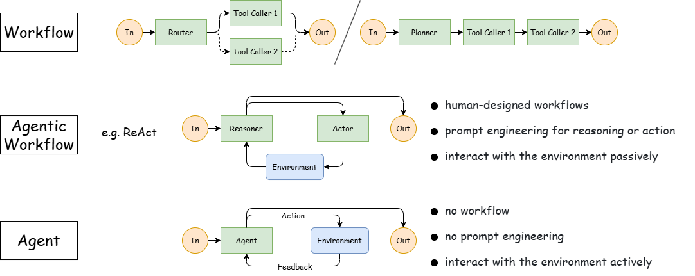
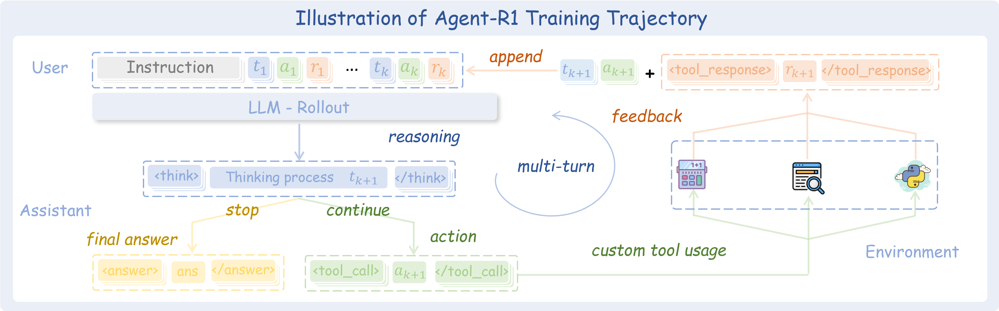
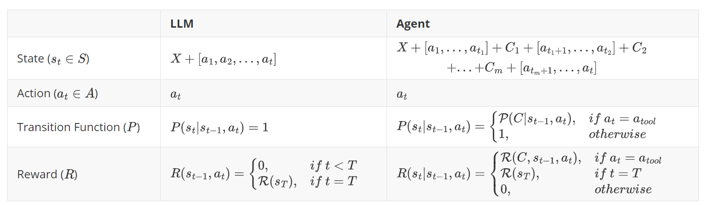

# 1. 资源

- Github (475 stars): https://github.com/0russwest0/Agent-R1
- 支持PPO/GRPO/REINFORCE++等多种强化学习算法
- 使用verl库，貌似没有魔改，直接引用了verl库
  - 虽然使用了verl库，但扔做了大量的模型定义、调用和外围包装，可能为了实现和外部交互 （此处我没有详细阅读代码，仅推测）

# 2. 介绍

- 多轮次工具调用：对完整的交互轨迹进行端到端强化学习，允许代理从一系列作中学习
- 多工具协调：训练代理有效协调并同时使用多种工具来解决复杂任务
- 流程奖励：根据其有效性为每个工具调用分配奖励，并通过规范化与结果奖励相平衡
- 自定义工具和环境：兼容主流 LLM 工具调用格式，轻松使用自己的工具和场景进行扩展
- 多种强化学习算法：支持多种强化学习方法，包括 、 和PPOGRPOREINFORCE++
- 多模态支持：与视觉语言模型 （VLM） 和多模态强化学习兼容

# 3. 原理

Agent 的强化学习与 LLM（聊天机器人、推理器）有很大不同。关键区别在于：完整的 Agent 轨迹通常涉及多轮交互，需要多次调用工具来解决用户查询。下面，我们使用马尔可夫决策过程 （MDP） 框架正式化了这种区别。

在 LLM 的内容中：

- 状态：只是输入提示的顺序和到目前为止生成的所有文本
- 动作：从词汇表中选择要添加到序列的下一个标记
- Transitions：将所选标记直接添加到现有序列中
- 奖励：通常仅在序列生成结束时提供

对于 Agent，组件更复杂：

- State：不仅包括输入和生成的文本，还包括来自先前交互的所有工具响应
- 动作：仍涉及选择下一个令牌，但某些令牌可以触发工具调用
- 过渡：
  - 常规标记：只需像传统 LLM 训练一样添加到序列中
  - 工具触发令牌：导致外部工具执行产生响应，与标准 LLM 生成的确定性不同，在状态转换中引入显著的随机性
- 奖励：可以在多个地点提供：
  - 在每次工具调用之后，自然会根据工具使用的质量和有效性创建流程级别的奖励
  - 在基于整体任务完成情况的完整交互结束时

为了更好地理解 Agent 和 LLM 上下文之间的区别，我们分别为这两种方法提供了正式定义：

其中：

* 𝑥 是当前提示符的顺序
* 𝑐ⱼ 是 j-th 工具调用和 m 是工具调用的次数
* 一个是从词汇表中选择的标记
* 𝑡ⱼ 是第 𝑗−1\$ 和 之间的令牌响应数 j-th 工具调用，0 < 𝑡₁ + 𝑡₂ + ⋯ + 𝑡ₘ < 𝑡

这种更丰富的强化学习框架使 Agent-R1 能够训练 LLM，这些 LLM 学习何时以及如何在多轮交互中使用工具的有效策略。通过优化整个轨迹而不是单个响应，我们可以应用 PPO、REINFORCE++ 和 GRPO 等算法来开发在采取行动之前有效推理的代理。

