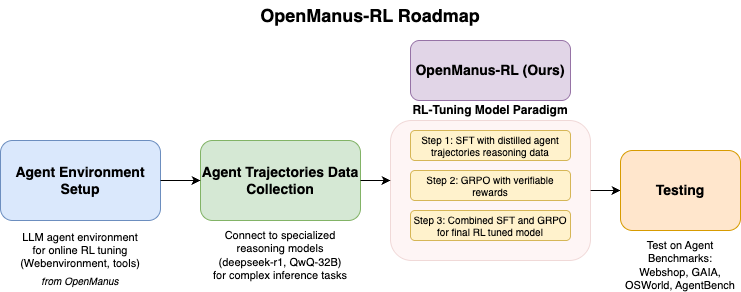

# 1. 资源

- Github (2.7k stars): https://github.com/OpenManus/OpenManus-RL

我们的方法提出了一个基于高级强化学习 （RL） 的代理调整框架，旨在显着增强大型语言模型 （LLM） 的推理和决策能力。从 RAGEN 的推理交互链优化 （RICO） 中汲取灵感，我们的方法进一步探索了新颖的算法结构、多样化的推理范式、复杂的奖励策略和广泛的基准环境。

我们尝试了各种推出策略来提高代理规划效率和推理稳健性，包括：

- Tree-of-Thoughts (ToT) ： 采用基于树的推理路径，使代理能够系统地探索分支的可能性。
- 图谱 （GoT）：利用图结构有效地表示复杂的推理依赖关系。
- DFSDT （Depth-First Search Decision Trees）：通过深度优先搜索优化作选择，增强长期规划。
- Monte Carlo Tree Search （MCTS）：概率性地探索推理和决策路径，有效地平衡探索和开发。