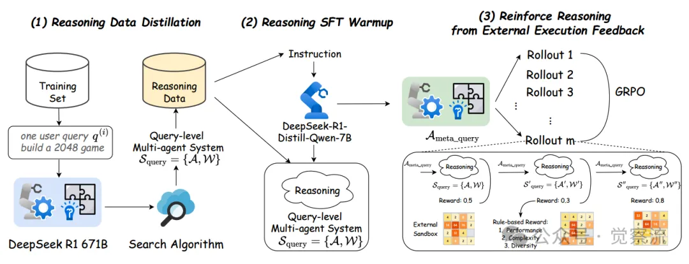
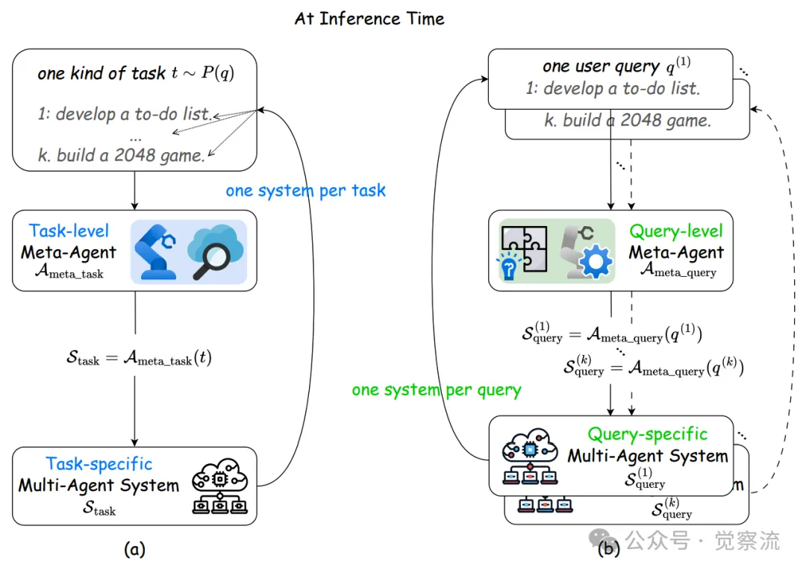

# 1. 资源

 FlowReasoner: Reinforcing Query-Level Meta-Agents
https://arxiv.org/pdf/2504.15257
• GitHub - sail-sg/FlowReasoner
https://github.com/sail-sg/FlowReasoner
• DeepSeek R1 模型
https://arxiv.org/abs/2501.12948
• BigCodeBench 数据集
https://arxiv.org/abs/2406.15877
• HumanEval 数据集
https://arxiv.org/abs/2107.03374
• MBPP 数据集
https://arxiv.org/abs/2107.03374

# 2. 原理

如上图所示，FlowReasoner 的训练过程包含三个关键阶段：

（1）推理数据提炼（Reasoning Data Distillation），利用 R1-671B 模型生成高质量推理数据；

（2）推理 SFT 预热（Reasoning SFT Warmup），通过监督微调让模型初步掌握推理能力；

（3）从外部执行反馈强化推理（Reinforce Reasoning from External Execution Feedback），采用强化学习进一步优化推理策略。

# 参考

[1] FlowReasoner：自动化查询级 Multi-Agent 系统（万字长文），https://mp.weixin.qq.com/s/IxgUc7VGcuUX1N-rJULXOw