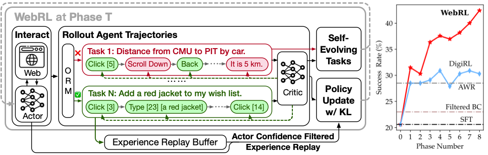
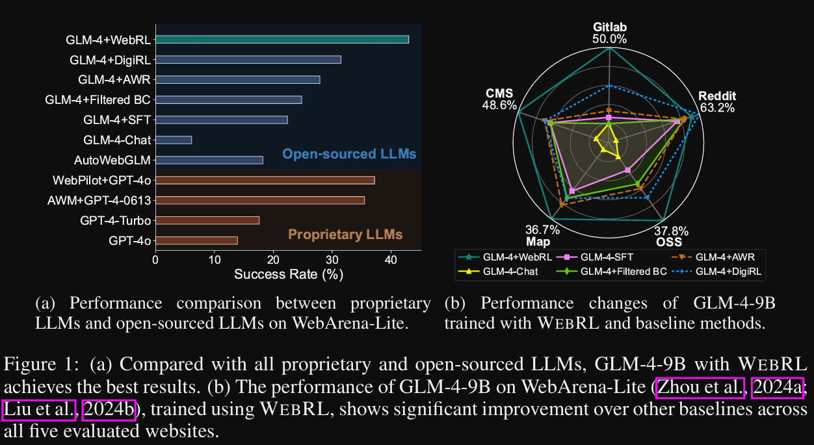

# 1. 资源

- 论文：WEBRL: TRAINING LLM WEB AGENTS VIA SELF EVOLVING ONLINE CURRICULUM REINFORCEMENT LEARNING
  - https://arxiv.org/pdf/2411.02337
  - 清华、智谱，2025/01/27
- Github (379 stars): https://github.com/THUDM/WebRL
- 基于llama factory训练，可能进行了魔改，用于和外部交互
- 开源模型：
  - https://huggingface.co/THUDM/webrl-glm-4-9b
  - https://huggingface.co/THUDM/webrl-llama-3.1-8b
  - https://huggingface.co/THUDM/webrl-llama-3.1-70b
  - https://huggingface.co/THUDM/webrl-orm-llama-3.1-8b/tree/main

# 2. 原理

