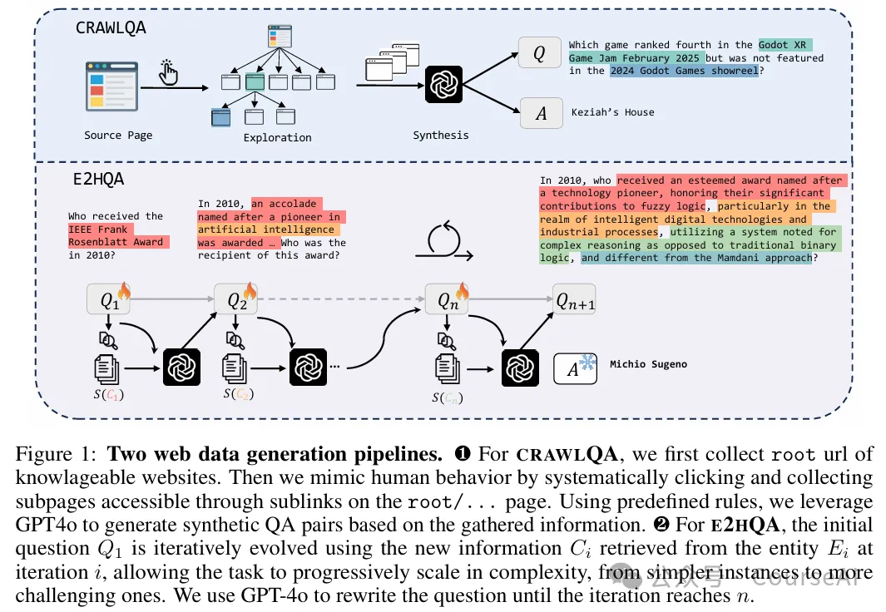
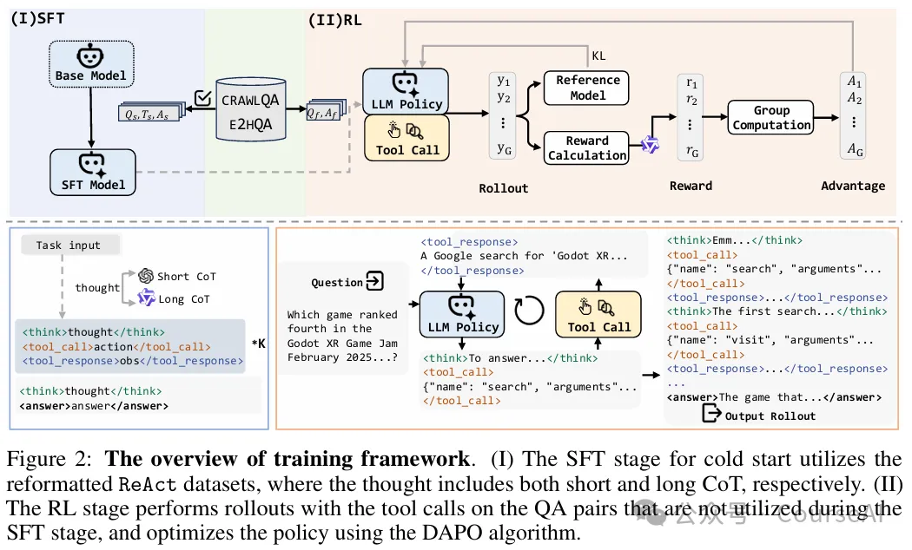
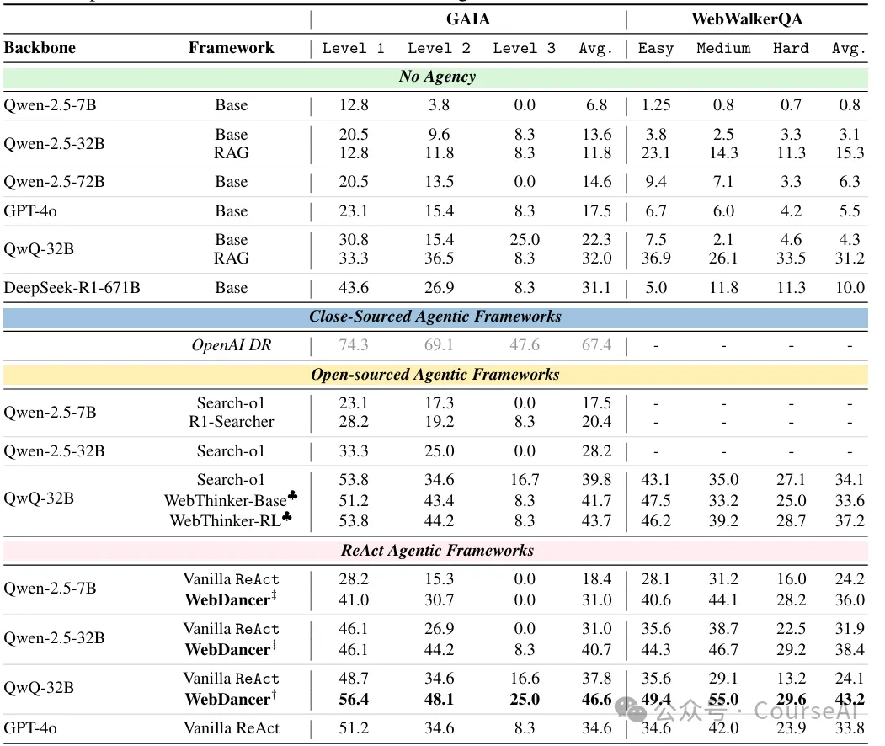

# 1. 资源

https://github.com/Alibaba-NLP/WebAgent

https://arxiv.org/pdf/2505.22648

# 2. 问题

- 高质量数据集：
  - 现有的 QA 数据集大多浅层，无法满足多步推理的需求。需要构建能够反映多样化用户意图和丰富交互上下文的高质量、细粒度浏览数据
- 可靠轨迹构建
  - 构建支持长时推理和任务分解的可靠轨迹
- 可扩展且泛化的训练策略
  - 设计能够使Agent在分布外的网络环境、复杂交互模式和长期目标下表现出鲁棒行为的可扩展和泛化训练策略

从数据和训练阶段的角度出发，提出了一个端到端的自主信息检索代理构建范式，通过四个关键阶段：

- 浏览数据构建
  - CRAWLQA：通过爬取知识性网站的网页，模仿人类浏览行为，递归访问子页面，并利用 GPT-4o 生成基于收集内容的 QA 对。
  - 这种方法能够获取丰富的背景知识，为复杂问题的构建提供基础。
  - E2HQA：从简单的 QA 对开始，逐步通过搜索和重写问题，增加问题的复杂性。
  - 这种方法能够激励代理从简单任务逐步过渡到复杂任务，提升其推理能力。
- 轨迹采样
  - 基于 ReAct 框架，代理通过 Thought-Action-Observation 轮次进行交互。
  - 通过拒绝采样，结合短链推理（Short-CoT）和长链推理（Long-CoT）策略，生成高质量的轨迹。
  - 采用三阶段过滤框架：有效性控制、正确性验证和质量评估，确保轨迹的高质量。

- 监督微调(SFT)以实现有效的冷启动
  - 利用合成的轨迹数据，对代理进行微调，使其能够适应多步推理任务。
  - 通过屏蔽外部反馈的损失贡献，避免学习过程中的干扰，提升性能和鲁棒性。
- 通过强化学习(RL)优化Agent的决策能力和泛化能力
  - 采用 DAPO 算法，通过动态采样机制，优化代理的决策过程，提升其在真实世界网络环境中的泛化能力。

# 3. 实验结果
在实验中，WebDancer 在 GAIA 和 WebWalkerQA 两个基准测试中表现出色。

在 GAIA 的 Level 1、Level 2 和 Level 3 测试中，WebDancer 分别取得了 41.0%、30.7% 和 0% 的通过率，显著优于其他开源框架。表明 WebDancer 在处理复杂信息检索任务时具有显著优势。

# 参考

[1] Alibaba开源WebDancer解决DeepResearch复杂信息检索难题, https://mp.weixin.qq.com/s/MDX59jsSXsPyxuSYo437jw