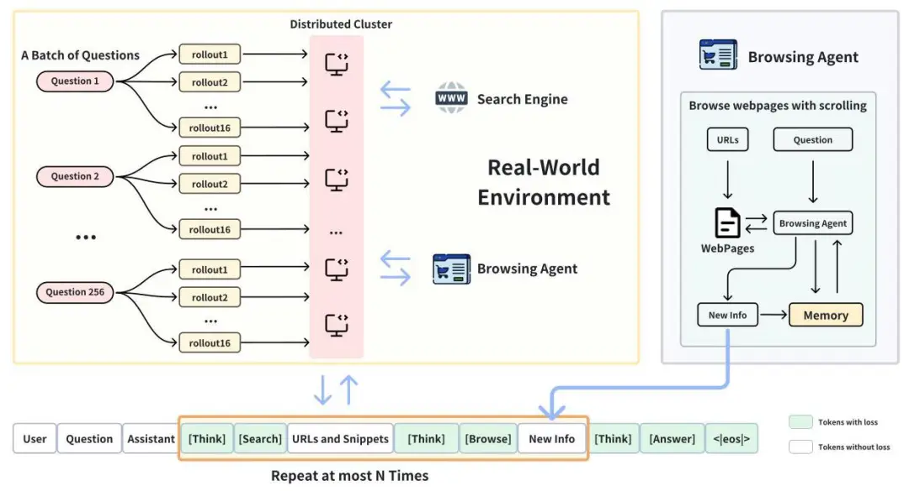

# 资源

论文题目：DeepResearcher--Scaling-Deep-Research-via-Reinforcement-Learning-in-Real-world-Environments 

论文单位：上海交通大学 2 上海人工智能研究院 3 全球人工智能与机器人峰会 

项目地址：https://github.com/GAIR-NLP/DeepResearcher 

发表时间：2025年4月

# 1. 问题

论文明确指出了当前AI研究代理存在的两大核心问题：

1. 基于“提示工程”的方法太脆弱：许多现有的AI研究工具依赖于人类工程师预先编写好的、非常详细的指令和工作流程（即“提示工程”）。这就像给机器人一个固定的操作手册，它只能严格按部就班。一旦遇到手册上没有的新情况，或者网络环境稍微有点变化（比如网页格式变了），它就很容易出错，表现得非常“脆弱”（brittle）。

2. 基于“模拟环境”的训练方法脱离现实：另一类更先进的方法使用强化学习（RL）来训练AI，但这通常是在一个受控的、干净的“实验室环境”里进行的。这个环境通常是一个固定的、内部的知识库（学术上称为RAG，检索增强生成）。这就像教一个飞行员开飞机，却只让他用飞行模拟器，而从没让他飞过真实的飞机。这种训练方式的最大问题在于，它假设所有需要的信息都整齐地存放在这个模拟的知识库里。然而，真实的互联网是嘈杂、混乱、信息不全且瞬息万变的，AI在模拟器里学到的技能，到了真实世界可能完全不管用。

因此，论文要解决的核心问题是：如何在一个真实的、开放的、充满噪音的互联网环境中，通过端到端的强化学习，训练出一个既强大又稳健的深度研究AI智能体？

# 2. 相关工作

根据论文的综述，当前利用大语言模型（LLM）进行深度研究（或信息检索）的工作主要分为两大方向：基于提示的方法（Prompt-Based）和基于训练的方法（Training-Based）。后者又可细分为监督微调（SFT）和强化学习（RL）。这些方法在不同的交互环境中运行，即本地RAG环境或真实网络搜索环境。

具体总结如下表所示：

| 研究方向                             | 子方向            | 核心思想                                          | 论文中提及的代表性工作                                                              |
| -------------------------------- | -------------- | --------------------------------------------- | ------------------------------------------------------------------------ |
| 基于提示的搜索代理 (Prompt-Based)     | —              | 依赖人工设计的提示词（Prompts）和预设工作流来指导 LLM 与外部知识源进行交互。  | OpenResearcher, AirRAG, IterDRAG, Plan\*RAG, Search-o1, Open Deep Search |
| 基于训练的搜索代理 (Training-Based)   | 监督微调 (SFT) | 在高质量的“搜索-推理-回答”轨迹数据上对模型进行微调，以模仿专家行为。          | CoRAG (使用 MCTS 生成数据)                                                     |
|                                  | 强化学习 (RL)  | 通过与环境交互和奖励信号，让模型自主学习最优的搜索和推理策略，无需人工指定行为。      | Search-R1, ReSearch, R1-Searcher, OpenAI Deep Research (方法未公开)           |
| 交互环境 (Training Environments) | 本地 RAG 环境      | 在一个固定的、预先构建好的本地知识库（如维基百科语料库）中进行信息检索。          | 主流 RAG 框架, Search-R1, ReSearch                                           |
|                                  | 真实网络搜索环境       | 直接与实时搜索引擎（如 Google, Bing）交互，访问和处理开放互联网上的动态信息。 | Search-o1 (部分设置), R1-Searcher (部分设置), 以及本文的 DeepResearcher               |

主流方法与技术路线

当前领域的主流技术路线可以根据其实现复杂性和对人工依赖程度进行划分，从完全依赖人工设计到完全自主学习。

| 技术路线                | 核心技术                                                                 | 交互环境         | 优点                                                                 | 局限性（如论文所述）                                                                 |
|-------------------------|--------------------------------------------------------------------------|------------------|----------------------------------------------------------------------|--------------------------------------------------------------------------------------|
| 提示工程 (Prompt Engineering) | 手动设计复杂的提示词和固定的多步工作流（如R eAct框架）。                 | 本地RAG或真实网络 | 实现简单，无需训练。                                                 | 行为模式僵化，适应性差，性能脆弱，依赖大量人工调试。                                 |
| 监督微调 (SFT)        | 在专家数据上进行微调，学习特定的搜索和推理模式。                         | 主要为本地RAG    | 比提示工程更稳定，能学习复杂行为。                                   | 依赖高质量的监督信号，泛化能力弱，可能存在计算开销大的问题（如MCTS）。                 |
| 基于RAG的强化学习 (RAG-based RL) | 使用RL算法（如PPO，GRPO）在本地知识库中训练代理。                        | 本地RAG          | 能够自主探索策略，超越SFT的固定模式。                               | 训练环境过于理想化和受控，无法处理真实网络的复杂性。                                   |
| 基于真实网络的强化学习 (Web-based RL) | 使用RL算法在与真实搜索引擎交互的环境中进行端到端训练。                   | 真实网络         | （此为DeepSeek researcher采用的路线） 能学习处理真实世界噪声、延迟和多样化信息源的鲁棒策略。 | 实现复杂，面临API速率限制、反爬虫、网络延迟等工程挑战。                               |

DeepResearcher明确地将自己定位为首个在真实网络环境中规模化端到端训练深度研究代理的综合性强化学习框架。

它的定位可以从两个维度理解：

在方法上：它属于基于训练的强化学习（RL）范畴，与Search-R1、ReSearch等工作在方法论上同属一类。

在环境上：它与所有基于本地RAG环境的工作（包括Search-R1等）形成鲜明对比。它直接挑战并解决了RAG环境脱离现实的核心问题，将训练场从“实验室”搬到了“真实世界”。

因此，DeepResearcher的工作可以看作是将RL agent训练从一个受控的模拟环境（Controlled Simulation）推进到了一个开放的真实环境（Real-world Environment），填补了现有开源研究中的一个重大空白。

DeepResearcher并非凭空创造，而是在前人工作的基础上进行了关键的借鉴和实质性的改进：

借鉴之处：

强化学习范式：借鉴了近年来通过RL提升LLM推理能力的成功经验（如DeepSeek-R1, OpenAI的工作），认同RL是解锁LLM自主解决问题能力的关键路径。
RL算法：直接采用了GRPO (Group Relative Policy Optimization)算法，这是从DeepSeek-R1等工作中验证过的有效算法。
问题设定：沿用了开放域问答（Open-domain QA）作为深度研究任务的代理（proxy）任务，并使用了NQ, HotpotQA等经典数据集，这使得其研究能够与前人工作在同一基准上进行比较。
改进之处：

核心改进-训练环境的革新：最大的改进是将训练环境从本地RAG迁移到真实网络搜索。这不仅仅是“实现细节”，而是根本性的范式转变，迫使模型学习应对真实世界复杂性的能力。
端到端训练于真实环境：论文强调其实现了端到端（End-to-end）训练。这意味着模型的所有行为，从生成搜索查询到浏览网页再到综合信息，都是通过RL自主学习的，而非依赖人工设计的中间步骤或流程。
解决实际工程挑战：为了在真实网络环境中进行规模化RL训练，作者团队解决了API限速、网络延迟、反爬虫机制、多样化网页解析等一系列在RAG环境中不存在的工程难题，并提出了分布式集群、缓存策略、重试机制等解决方案。
引入多智能体架构：为了更有效地从真实、冗长的网页中提取信息，设计了一个专门的“浏览代理（Browsing Agent）”，这比RAG系统中简单的“检索文本块”要复杂和智能得多。
综上所述，DeepResearcher的研究建立在现有RL for LLM的浪潮之上，但通过将训练环境推向更具挑战性的真实世界，它不仅显著提升了模型在研究任务上的性能和泛化能力，也揭示了在这种真实环境中训练所能涌现出的更高级认知行为（如规划、交叉验证、反思等）。

关键组成部分和技术要点
DeepResearcher方法由以下几个关键部分构成：

a. 深度研究轨迹（Deep Research Trajectory）这是代理解决问题的单次完整路径，由一系列的“思考-行动”对组成。

Reasoning (<think>): 在每次行动前，模型被强制生成一段“思考”文本，放在<think>标签内。这使得模型的决策过程更加透明，并鼓励其进行显式的规划和推理。
Web Search Tool: 代理通过生成一个JSON格式的请求来调用搜索引擎。这个工具返回一个结构化的搜索结果列表，包含标题、URL和摘要。
Web Browsing Agent (核心技术点): 这是一个专门的“浏览代理”。当主代理决定访问某个URL时，它不会直接接收整个网页的杂乱HTML内容。相反，这个浏览代理会：

分段读取: 像人一样，从网页的开头开始，一小段一小段地处理内容。
增量式提取: 在读取每一段后，它会判断该内容是否与当前研究的问题相关。
动态决策: 基于已读内容和问题，它会决定是继续读取下一段，还是认为该网页价值不大而停止浏览。
信息汇总: 将所有提取出的相关信息汇总后，一次性返回给主代理作为观察结果（Observation）。
Answering (<answer>): 当模型判断已收集到足够信息时，它会生成最终答案，并用<answer>标签包裹。
b. 应对真实网络环境挑战的工程解决方案在真实网络环境中进行大规模RL训练会遇到许多在RAG环境中不存在的工程难题。

高并发请求: RL训练需要大量并行探索（rollouts），会瞬间产生数千个搜索和爬取请求。论文通过构建一个包含50个节点的分布式CPU服务器集群来专门处理这些工具调用请求，解决了高并发带来的延迟问题。
反爬虫与API限制: 网站的反爬虫机制和搜索引擎的API频率限制是巨大障碍。论文通过实施鲁棒的重试机制和缓存策略（7天内相同查询使用缓存）来有效缓解这些问题，同时降低了API成本。
优化信息提取: 上文提到的Web Browsing Agent本身就是为了解决网页内容冗长、无关信息多的问题而设计的。它通过模拟人类的顺序阅读和筛选行为，高效地从嘈杂的网页中提取“黄金信息”。
c. 强化学习训练框架

GRPO算法 (Group Relative Policy Optimization): 这是驱动模型学习的核心算法。GRPO是一种先进的策略优化算法，它通过生成多组探索轨迹（rollouts），并比较这些轨迹的结果，来更新模型的策略。简单来说，它让模型进行多次“尝试”，然后奖励那些带来更好结果（更高F1分数）的“尝试路径”，惩罚那些导致错误或低效的路径。
掩码观察 (Masking Observations): 在训练时，工具返回的观察结果（如网页内容）是环境的反馈，而不是模型需要学习模仿的“正确答案”。因此，这些观察结果在计算损失时会被“掩码”（mask out），确保模型只因其自身的决策（思考和行动）而受到训练。
d. 奖励机制 (Reward Mechanism)奖励是指导模型学习方向的指挥棒。DeepResearcher使用了简单但有效的结果导向型奖励：

格式惩罚: 如果模型生成的最终输出格式不正确（例如，缺少标签），则给予-1的惩罚。
F1分数奖励: 如果格式正确，则根据生成的答案与标准答案之间的词级别F1分数来给予奖励（0到1之间）。F1分数越高，奖励越高。

# 参考

[1] DeepResearcher论文解读报告, https://mp.weixin.qq.com/s/RPOtI3HIMIhmTzKWH_5yQA